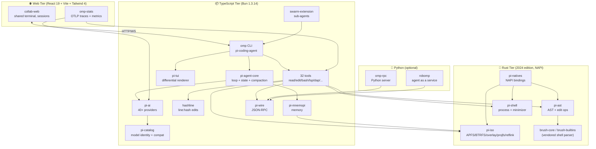
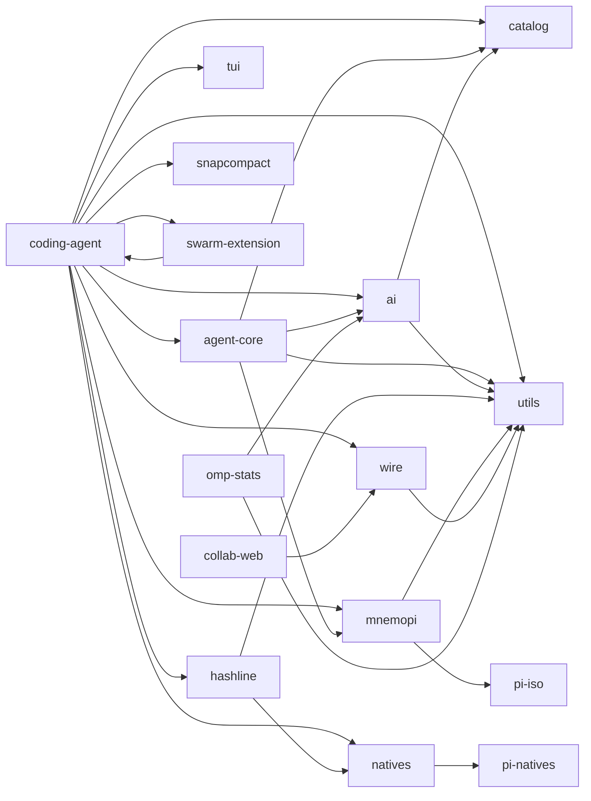
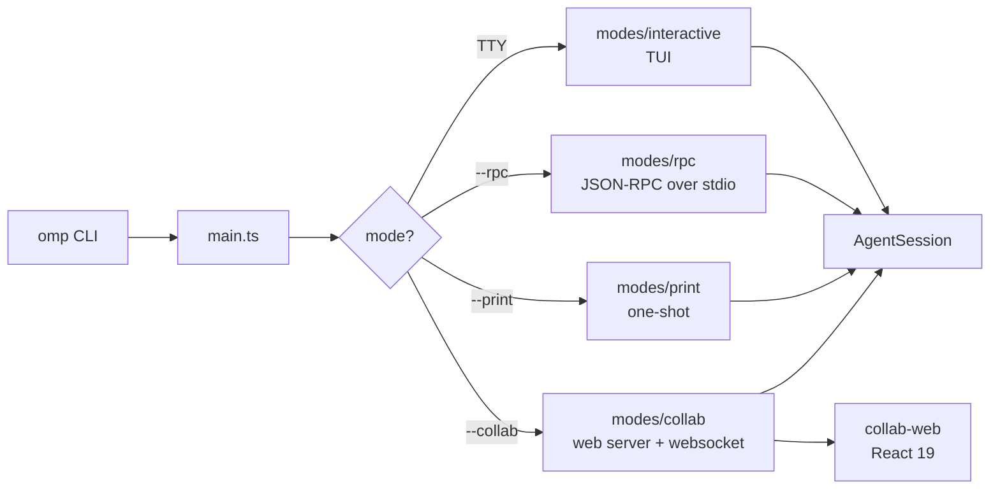
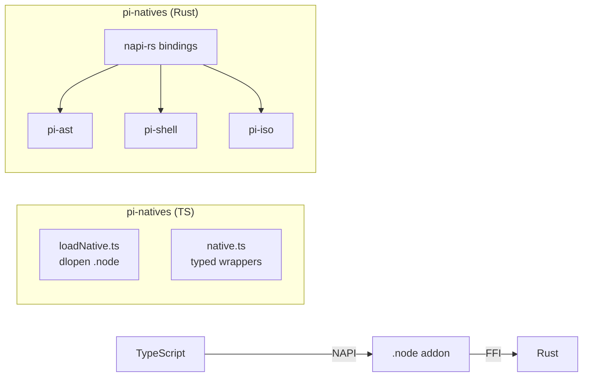
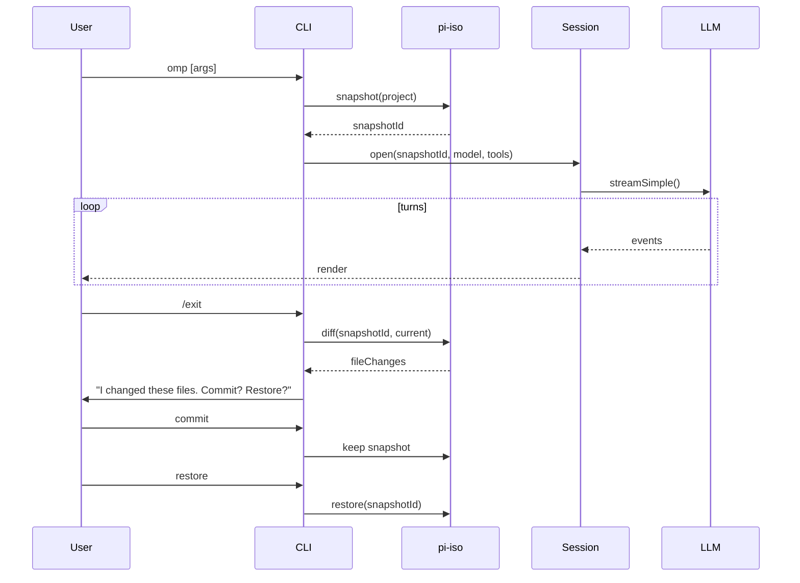
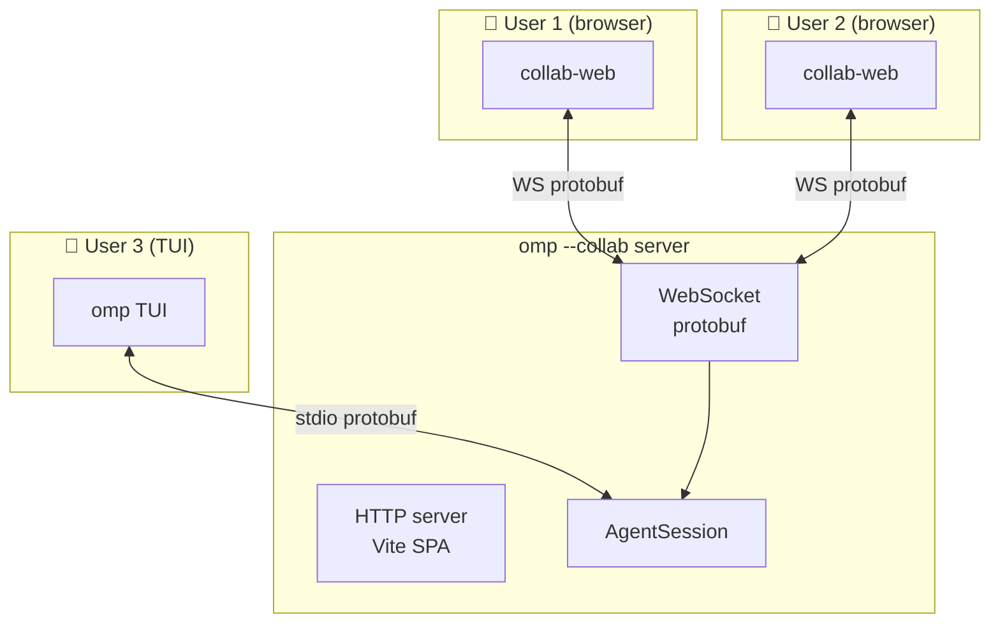

# Architecture

oh-my-pi is a **3-tier polyglot monorepo**: a Rust core for performance-critical paths, a TypeScript middle for the agent runtime and tools, and a React 19 web layer for the collaborative UI. All 5 crates + 15 TypeScript packages + 1 Python package share a single workspace with version-pinned dependencies via npm catalog.

## High-level diagram



## Workspace structure

```
oh-my-pi/
├── crates/                          # 🦀 Rust workspace
│   ├── pi-ast/                      # AST parser + edit ops (vendored brush-core)
│   ├── pi-shell/                    # Process spawn + command minimizer
│   ├── pi-iso/                      # Filesystem isolation (APFS, BTRFS, overlay, projfs, reflink)
│   ├── pi-natives/                  # NAPI bindings to Node/Bun
│   ├── brush-core-vendored/         # shell parser (git subtree)
│   └── brush-builtins-vendored/     # shell builtins (git subtree)
├── packages/                        # 📦 TypeScript workspace
│   ├── pi-ai/                       # 40+ LLM providers
│   ├── pi-agent-core/               # Agent runtime
│   ├── pi-catalog/                  # Model identity + compat
│   ├── pi-coding-agent/             # The `omp` CLI binary
│   ├── pi-tui/                      # Terminal UI
│   ├── pi-mnemopi/                  # Memory system
│   ├── pi-wire/                     # JSON-RPC + protobuf
│   ├── pi-utils/                    # Shared utilities
│   ├── pi-natives/                  # NAPI wrapper
│   ├── hashline/                    # Line:hash edit primitive
│   ├── snapcompact/                 # Snapshot+compact persistence
│   ├── omp-stats/                   # OpenTelemetry
│   ├── swarm-extension/             # Sub-agent spawning
│   ├── collab-web/                  # React 19 collaborative UI
│   └── typescript-edit-benchmark/   # Edit primitive benchmarks
├── python/                          # 🐍 Python optional
│   ├── omp-rpc/                     # Python RPC server
│   └── robomp/                      # Agent-as-a-service
├── docs/                            # User-facing docs (markdown)
├── types/                           # Cross-package type declarations
├── scripts/                         # Build + CI scripts
├── Dockerfile                       # Main agent container
├── Dockerfile.robomp                # robomp container
├── Cargo.toml                       # Rust workspace
├── package.json                     # Bun workspace + catalog
└── AGENTS.md                        # 16K LOC of dev conventions
```

## Package dependency graph



The arrows are **strict**: `pi-coding-agent` depends on `pi-agent-core` and `pi-ai`; `pi-agent-core` depends on `pi-ai`; `pi-ai` depends on `pi-catalog`; native crates are leaf nodes with no upstream TypeScript deps.

## Layered responsibilities

| Layer | Package | Responsibility |
|------|---------|----------------|
| **Native** | `pi-ast`, `pi-shell`, `pi-iso` | Performance-critical: AST parsing, process control, filesystem isolation |
| **Bindings** | `pi-natives` | NAPI bridge: exposes Rust to TypeScript via `.node` addon |
| **Identity** | `pi-catalog` | Model metadata, capability flags, cost, deprecation, compat |
| **Transport** | `pi-ai` | 40+ LLM providers behind a single `streamSimple()` |
| **Runtime** | `pi-agent-core` | Agent loop, state, hooks, compaction, sessions |
| **Wire** | `pi-wire` | JSON-RPC + protobuf for cross-process communication |
| **Memory** | `pi-mnemopi` | Long-term memory, semantic search, knowledge graph |
| **Edit** | `hashline` | Line:hash edit primitive (100% safe file mutations) |
| **Persistence** | `snapcompact` | Hybrid: JSONL for messages, snapshots for filesystem |
| **Tools** | (in `pi-coding-agent/core/tools/`) | 32 tools: file, shell, search, lsp, dap, memory, meta |
| **CLI** | `pi-coding-agent` | The `omp` binary; argv parsing + modes + UI |
| **TUI** | `pi-tui` | Differential terminal renderer + components |
| **Web** | `collab-web` | React 19 collaborative UI |
| **Telemetry** | `omp-stats` | OpenTelemetry SDK + OTLP exporter |
| **Swarm** | `swarm-extension` | Sub-agent spawning + coordination |
| **Python** | `omp-rpc` | Python RPC server + `robomp` service |

## Mode decomposition

The `omp` CLI supports the same 3 modes as pi-mono, plus a 4th: **Web** (spawning collab-web).



The 4th mode (`--collab`) starts a local HTTP server + WebSocket that `collab-web` connects to. Multiple users can attach to the same session and see the same messages, with the lead user's input being the canonical one (others can watch or propose).

## TypeBox + protobuf

Two schema systems, used for different boundaries:

- **TypeBox** — internal TypeScript schemas (agent loop, tool definitions, event protocol). Single source of truth, produces JSON Schema for LLM `response_format`.
- **protobuf** — cross-process wire format (`pi-wire` package). Used for:
  - `collab-web` ↔ CLI (protobuf-over-WebSocket)
  - `omp-rpc` (Python) ↔ CLI (protobuf-over-stdio)
  - Future: cross-host agent coordination

The protobuf definitions live in `types/` and are compiled to TypeScript + Python + Rust via `bufbuild/protoc-gen-es`.

## Rust + TypeScript boundary



The Rust crates are **separately built** (`cargo build --release`) and shipped as platform-specific `.node` files. The `pi-natives` TypeScript package:

1. Detects the platform + arch
2. Loads the right `.node` file from `bin/<platform>-<arch>/`
3. Wraps each native function in a TypeScript-typed async API
4. Falls back to a JS implementation if the native module is missing

This means `omp` **works without the native module** (slower, JS-only) but is **10-50× faster with it**.

## pi-iso: Filesystem isolation

The most novel Rust crate. `pi-iso` picks the right filesystem primitive per OS:

| OS | Primitive | Use case |
|----|-----------|----------|
| macOS | `clonefile()` (APFS) | Cheap COW clones for sandboxed agent workspace |
| Linux (BTRFS) | `ioctl(FICLONE)` reflink | Same as APFS, but BTRFS |
| Linux (overlayfs) | `mount -t overlay` | Container-friendly, in-memory upper layer |
| Linux (dev) | `cp -r` (slow) | Fallback when no COW filesystem |
| Windows | `ProjFS` | Filter driver for virtual filesystems |

The agent uses `pi-iso` to:

1. **Snapshot** the project at session start (1ms via reflink)
2. **Restore** the snapshot on session end or agent failure (1ms)
3. **Sandbox** the agent's edits in a clone (no risk to the host)
4. **Diff** two snapshots to see what the agent changed (via `pi-iso/diff`)

This is **the** missing primitive in pi-mono — and it's why oh-my-pi can do "high-risk" operations like `rm -rf` and `git reset --hard` safely.

## pi-ast: Edit primitive

`pi-ast` parses source files into ASTs (via vendored `brush-core`/tree-sitter) and exposes 4 edit operations:

1. **`findAndReplace`** — locate a unique AST node and replace it (preserving comments + formatting)
2. **`splice`** — insert a node at a specific position
3. **`delete`** — remove a node and shift the rest
4. **`transform`** — apply a function to all matching nodes

The `hashline` TypeScript package is built on `pi-ast` — every line in a file gets a content hash, and edits are specified as `L:hash|new content` lines. The agent can never lose track of the file's state because the hash verifies the line is unchanged.

## pi-shell: Process control

`pi-shell` is a Rust process wrapper that adds:

- **Command minimizer** — turns `npm install && npm test` into a minimal AST, then re-emits it (for `bash` tool safety)
- **Cancel propagation** — SIGTERM on the parent → SIGTERM on all children (no orphans)
- **Output streaming** — chunked stdout/stderr with backpressure
- **Cross-platform** — uses `process.rs` on Unix, `windows.rs` on Windows (with ConPTY for proper TTY)
- **Resource limits** — CPU time, memory, file descriptors (Linux only)

The vendored `brush-core` + `brush-builtins` packages are git-subtree'd — they're the upstream `brush` shell parser, vendored to avoid network dependency.

## Session lifecycle



The snapshot boundary makes the agent **reversible** — every session can be undone in 1ms, even if the agent made thousands of edits.

## Multi-user collab



The collab mode uses `pi-wire` (protobuf) for transport. The TUI and web clients are **peers** — both can send user messages, both can see events. The session is single-threaded; the lead user's input is canonical, others' inputs become suggestions.

## Why Rust + TypeScript

| Concern | TypeScript | Rust | Why Rust wins |
|---------|------------|------|---------------|
| LLM streaming | ✓ (WebStreams, async iter) | ✓ (tokio) | Tie — async story is comparable |
| AST parsing | tree-sitter-js (slow) | tree-sitter-rs | **10× faster**, real-time use |
| Process control | `child_process` (leaky) | `std::process` + libuv | **Safer** — no orphan processes |
| Filesystem ops | `fs` (blocking) | `tokio::fs` + reflink | **Non-blocking + COW** |
| Memory | GC pauses | Zero-cost | **Deterministic** — no GC in hot path |
| Compile time | fast | slow | Trade-off accepted for runtime wins |

The Rust crates are **not in the hot path of every turn** — they're used for:

- File editing (when `hashline` is the active tool)
- Command execution (when `bash` is called)
- Snapshot/restore (once per session)
- AST analysis (when refactoring)

Everything else (the agent loop, the LLM call, the event protocol) is still TypeScript.

## What's NOT Rust

The 4 things that stay TypeScript for ecosystem reasons:

- **LLM HTTP clients** — SDKs are npm packages; the Rust ecosystem is years behind
- **TUI** — terminal handling is OS-quirky and well-served by Node libraries
- **Web UI** — React/Vite is a JS-only stack
- **Telemetry** — OpenTelemetry SDKs are npm packages

## Why Bun 1.3.14

The team switched from Node 22 → Bun 1.3.14 for:

- **Faster startup** — 200ms vs 1.5s for `omp` cold start
- **Built-in TypeScript** — no `tsx` / `ts-node` needed
- **Built-in test runner** — `bun test` replaces vitest for some packages
- **Native fetch / WebStreams** — match the browser, simplify code

Trade-offs accepted: Bun is younger than Node, so some Node-only libs don't work. The team uses `bun install` for speed but tests on Node for compatibility.

## Next

- [Tech Stack](/tech-stack) — exact versions and per-package deps
- [Rust Core](/docs/01-rust-core) — the native layer in detail
- [pi-coding-agent · CLI](/docs/05-pi-coding-agent) — the consumer
- [LSP](/docs/06-lsp) — the IDE integration story
