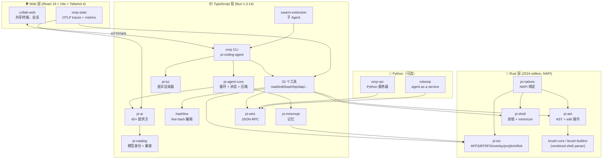
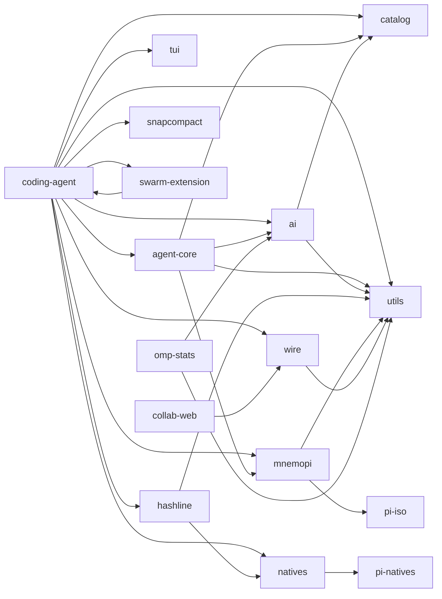
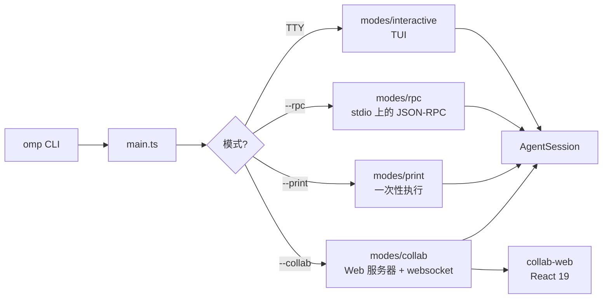
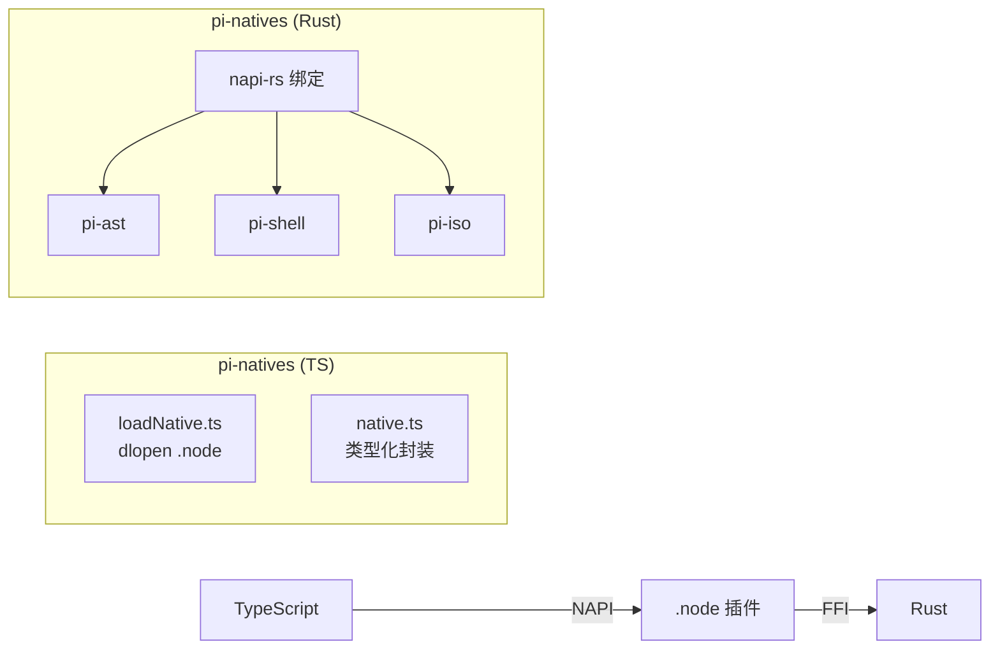
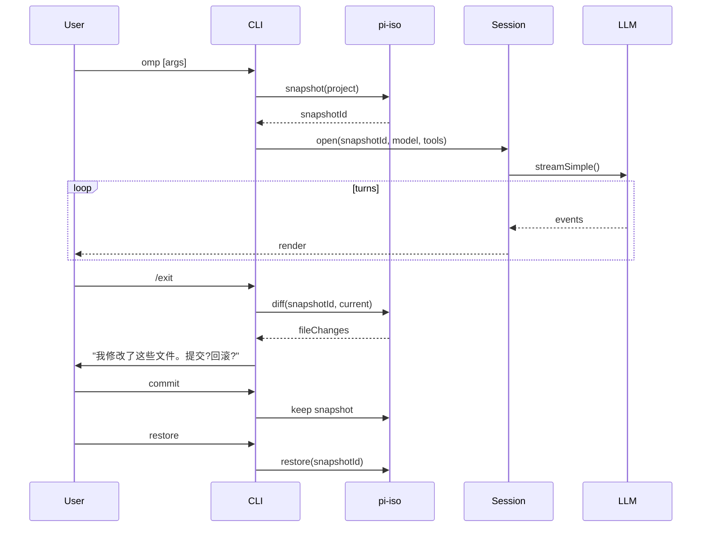
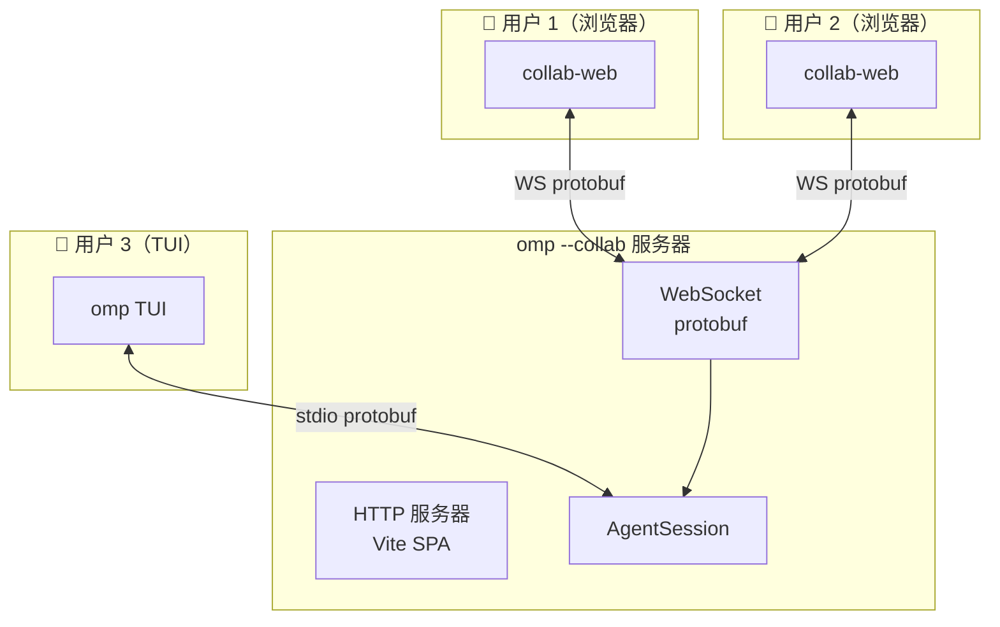

# 架构概览

oh-my-pi 是一个 **3 层多语言 monorepo**:Rust 核心负责性能关键路径,TypeScript 中间层负责 Agent 运行时和工具,React 19 Web 层负责协作 UI。全部 5 个 crate + 15 个 TypeScript 包 + 1 个 Python 包共享同一个 workspace,通过 npm catalog 锁定依赖版本。

## 高层架构图



## Workspace 结构

```
oh-my-pi/
├── crates/                          # 🦀 Rust workspace
│   ├── pi-ast/                      # AST 解析器 + edit 操作（vendored brush-core）
│   ├── pi-shell/                    # 进程派生 + 命令 minimizer
│   ├── pi-iso/                      # 文件系统隔离（APFS、BTRFS、overlay、projfs、reflink）
│   ├── pi-natives/                  # Node/Bun 的 NAPI 绑定
│   ├── brush-core-vendored/         # shell 解析器（git subtree）
│   └── brush-builtins-vendored/     # shell 内建命令（git subtree）
├── packages/                        # 📦 TypeScript workspace
│   ├── pi-ai/                       # 40+ LLM 提供方
│   ├── pi-agent-core/               # Agent 运行时
│   ├── pi-catalog/                  # 模型身份 + 兼容
│   ├── pi-coding-agent/             # `omp` CLI 二进制
│   ├── pi-tui/                      # 终端 UI
│   ├── pi-mnemopi/                  # 记忆系统
│   ├── pi-wire/                     # JSON-RPC + protobuf
│   ├── pi-utils/                    # 共享工具
│   ├── pi-natives/                  # NAPI 封装
│   ├── hashline/                    # Line:hash 编辑原语
│   ├── snapcompact/                 # 快照+压缩持久化
│   ├── omp-stats/                   # OpenTelemetry
│   ├── swarm-extension/             # 子 Agent 派生
│   ├── collab-web/                  # React 19 协作 UI
│   └── typescript-edit-benchmark/   # 编辑原语基准
├── python/                          # 🐍 Python（可选）
│   ├── omp-rpc/                     # Python RPC 服务器
│   └── robomp/                      # Agent-as-a-service
├── docs/                            # 用户文档（markdown）
├── types/                           # 跨包类型声明
├── scripts/                         # 构建 + CI 脚本
├── Dockerfile                       # 主 Agent 容器
├── Dockerfile.robomp                # robomp 容器
├── Cargo.toml                       # Rust workspace
├── package.json                     # Bun workspace + catalog
└── AGENTS.md                        # 1.6 万行开发规约
```

## 包依赖图



依赖箭头是 **严格** 的:`pi-coding-agent` 依赖 `pi-agent-core` 和 `pi-ai`;`pi-agent-core` 依赖 `pi-ai`;`pi-ai` 依赖 `pi-catalog`;原生 crate 是叶子节点,不依赖任何 TypeScript 包。

## 分层职责

| 层 | 包 | 职责 |
|------|---------|----------------|
| **原生层** | `pi-ast`、`pi-shell`、`pi-iso` | 性能关键:AST 解析、进程控制、文件系统隔离 |
| **绑定层** | `pi-natives` | NAPI 桥接:通过 `.node` 插件将 Rust 暴露给 TypeScript |
| **身份层** | `pi-catalog` | 模型元数据、能力标志、成本、废弃标记、兼容 |
| **传输层** | `pi-ai` | 在统一的 `streamSimple()` 接口背后对接 40+ LLM 提供方 |
| **运行时** | `pi-agent-core` | Agent 循环、状态、hook、压缩、会话 |
| **Wire 层** | `pi-wire` | 跨进程通信的 JSON-RPC + protobuf |
| **记忆** | `pi-mnemopi` | 长期记忆、语义搜索、知识图谱 |
| **编辑** | `hashline` | Line:hash 编辑原语（100% 安全的文件变更） |
| **持久化** | `snapcompact` | 混合方案:消息用 JSONL,文件系统用快照 |
| **工具** | （位于 `pi-coding-agent/core/tools/`） | 32 个工具:文件、shell、搜索、lsp、dap、记忆、meta |
| **CLI** | `pi-coding-agent` | `omp` 二进制;argv 解析 + 模式 + UI |
| **TUI** | `pi-tui` | 差异终端渲染器 + 组件 |
| **Web** | `collab-web` | React 19 协作 UI |
| **遥测** | `omp-stats` | OpenTelemetry SDK + OTLP 导出器 |
| **Swarm** | `swarm-extension` | 子 Agent 派生 + 协同 |
| **Python** | `omp-rpc` | Python RPC 服务器 + `robomp` 服务 |

## 模式分解

`omp` CLI 在 pi-mono 原有 3 种模式的基础上,新增了第 4 种:**Web**（启动 collab-web）。



第 4 种模式（`--collab`）启动一个本地 HTTP 服务器 + WebSocket,由 `collab-web` 接入。多个用户可以附着到同一会话,看到相同的消息,主用户的输入是规范输入,其他用户可观察或提出建议。

## TypeBox + protobuf

两套 schema 系统,用于不同的边界:

- **TypeBox** —— 内部 TypeScript schema（Agent 循环、工具定义、事件协议）。单一事实源,为 LLM `response_format` 生成 JSON Schema。
- **protobuf** —— 跨进程 wire 格式（`pi-wire` 包）。用于:
  - `collab-web` ↔ CLI（protobuf-over-WebSocket）
  - `omp-rpc`（Python）↔ CLI（protobuf-over-stdio）
  - 未来:跨主机 Agent 协同

protobuf 定义位于 `types/`,通过 `bufbuild/protoc-gen-es` 编译为 TypeScript + Python + Rust。

## Rust + TypeScript 边界



Rust crate **单独构建**（`cargo build --release`）,并以平台相关的 `.node` 文件分发。`pi-natives` TypeScript 包:

1. 检测平台 + 架构
2. 从 `bin/<platform>-<arch>/` 加载对应的 `.node` 文件
3. 将每个原生函数包装为类型化的 TypeScript 异步 API
4. 在原生模块缺失时回退到 JS 实现

这意味着 `omp` **没有原生模块也能工作**（较慢,纯 JS 模式）,但 **有原生模块时快 10-50 倍**。

## pi-iso:文件系统隔离

最具创新性的 Rust crate。`pi-iso` 针对不同操作系统选择合适的文件系统原语:

| OS | 原语 | 用途 |
|----|-----------|----------|
| macOS | `clonefile()`（APFS） | 为沙箱化 Agent 工作区提供廉价的 COW 克隆 |
| Linux（BTRFS） | `ioctl(FICLONE)` reflink | 同 APFS,但基于 BTRFS |
| Linux（overlayfs） | `mount -t overlay` | 容器友好,内存中的 upper 层 |
| Linux（开发） | `cp -r`（慢） | 无 COW 文件系统时的回退 |
| Windows | `ProjFS` | 虚拟文件系统的 filter 驱动 |

Agent 通过 `pi-iso` 实现:

1. **快照** —— 在会话开始时对项目做快照（1ms,借助 reflink）
2. **回滚** —— 在会话结束或 Agent 失败时还原快照（1ms）
3. **沙箱** —— 把 Agent 的编辑隔离在克隆中（不会影响宿主机）
4. **Diff** —— 对比两份快照,查看 Agent 修改了什么（通过 `pi-iso/diff`）

这是 pi-mono 中 **缺失的原语** —— 这正是 oh-my-pi 能够安全执行 `rm -rf`、`git reset --hard` 等"高风险"操作的原因。

## pi-ast:编辑原语

`pi-ast` 将源文件解析为 AST（通过 vendored `brush-core`/tree-sitter）,并暴露 4 种编辑操作:

1. **`findAndReplace`** —— 定位唯一的 AST 节点并替换（保留注释与格式）
2. **`splice`** —— 在指定位置插入一个节点
3. **`delete`** —— 移除一个节点并平移后续内容
4. **`transform`** —— 对所有匹配节点应用函数

TypeScript 包 `hashline` 构建于 `pi-ast` 之上 —— 文件每一行都有一个内容哈希,编辑操作以 `L:hash|new content` 的行格式表达。Agent 永远不会丢失文件状态,因为哈希会校验该行未被改动。

## pi-shell:进程控制

`pi-shell` 是一个 Rust 进程包装器,提供:

- **命令 minimizer** —— 把 `npm install && npm test` 转换为最小化 AST,然后重新输出（为 `bash` 工具提供安全保障）
- **取消传播** —— 父进程收到 SIGTERM → 所有子进程收到 SIGTERM（无孤儿进程）
- **输出流式传输** —— 带背压的 chunked stdout/stderr
- **跨平台** —— Unix 上使用 `process.rs`,Windows 上使用 `windows.rs`（使用 ConPTY 提供真正的 TTY）
- **资源限制** —— CPU 时间、内存、文件描述符（仅 Linux）

vendored 的 `brush-core` + `brush-builtins` 包通过 git subtree 引入 —— 它们是上游 `brush` shell 解析器,vendored 是为了避免网络依赖。

## 会话生命周期



快照边界让 Agent **可逆** —— 任何会话都能在 1ms 内撤销,即使 Agent 进行了数千次编辑。

## 多用户协作



collab 模式使用 `pi-wire`（protobuf）作为传输层。TUI 与 Web 客户端是 **对等节点** —— 双方都能发送用户消息,双方都能看到事件。会话是单线程的;主用户的输入是规范输入,其他人的输入则作为建议。

## 为什么要 Rust + TypeScript

| 关注点 | TypeScript | Rust | Rust 的优势 |
|---------|------------|------|---------------|
| LLM 流式输出 | ✓（WebStreams、async iter） | ✓（tokio） | 平手 —— 异步能力相当 |
| AST 解析 | tree-sitter-js（较慢） | tree-sitter-rs | **快 10 倍**,可实时使用 |
| 进程控制 | `child_process`（易泄漏） | `std::process` + libuv | **更安全** —— 不会产生孤儿进程 |
| 文件系统操作 | `fs`（阻塞） | `tokio::fs` + reflink | **非阻塞 + COW** |
| 内存 | GC 停顿 | 零开销 | **确定性** —— 热路径无 GC |
| 编译时间 | 快 | 慢 | 为运行时收益而接受的取舍 |

Rust crate **不在每轮都处于热路径** —— 它们用于:

- 文件编辑（当 `hashline` 是激活的工具时）
- 命令执行（当调用 `bash` 时）
- 快照/回滚（每个会话一次）
- AST 分析（重构时）

其他一切（Agent 循环、LLM 调用、事件协议）仍然是 TypeScript。

## 哪些不是 Rust

出于生态考虑,以下 4 件事仍保持 TypeScript:

- **LLM HTTP 客户端** —— SDK 都是 npm 包;Rust 生态落后多年
- **TUI** —— 终端处理在 OS 上有各种怪癖,Node 库已经覆盖得很好
- **Web UI** —— React/Vite 是纯 JS 技术栈
- **遥测** —— OpenTelemetry SDK 是 npm 包

## 为什么选择 Bun 1.3.14

团队从 Node 22 切换到 Bun 1.3.14,原因:

- **更快的启动** —— `omp` 冷启动 200ms vs 1.5s
- **内置 TypeScript** —— 不再需要 `tsx` / `ts-node`
- **内置测试运行器** —— `bun test` 在部分包中替代 vitest
- **原生 fetch / WebStreams** —— 与浏览器对齐,简化代码

接受的取舍:Bun 比 Node 年轻,因此一些仅支持 Node 的库无法使用。团队用 `bun install` 提速,但在 Node 上测试以保证兼容性。

## 接下来

- [技术栈](/tech-stack) —— 精确版本号与逐包依赖
- [Rust 核心](/docs/01-rust-core) —— 原生层细节
- [pi-coding-agent · CLI](/docs/05-pi-coding-agent) —— 消费者
- [LSP](/docs/06-lsp) —— IDE 集成故事
