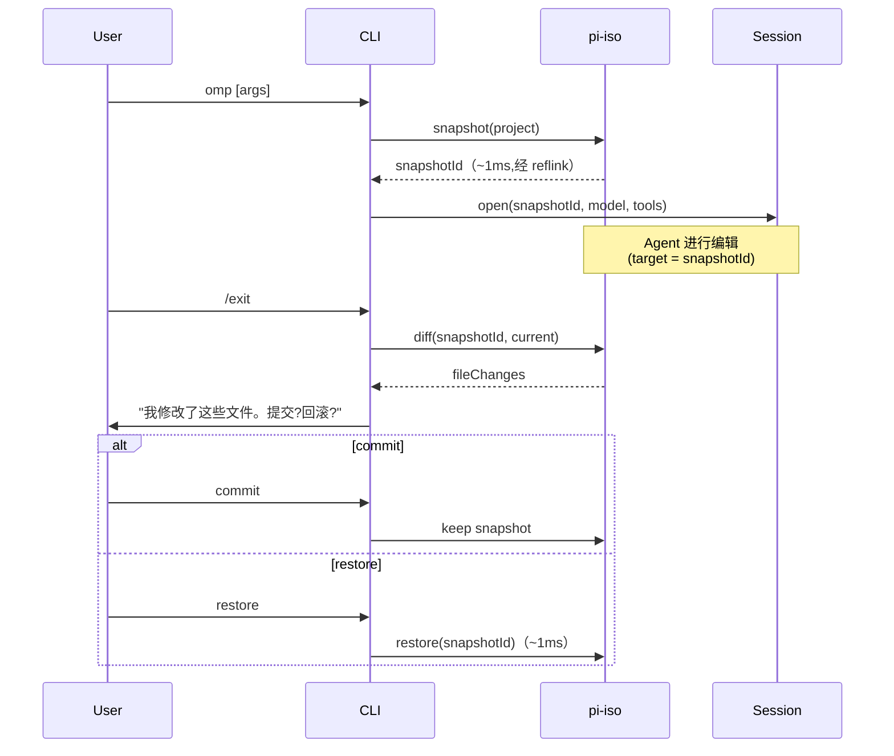

# 01 · Rust 核心 — pi-ast、pi-shell、pi-iso

Rust 核心是 oh-my-pi 的 **性能差异点**。三个 crate —— `pi-ast`、`pi-shell`、`pi-iso` —— 替换了 pi-mono 中的三条热路径（子串编辑、进程派生、文件系统操作）,原生实现 **快 10-50 倍**,且 **更安全**（无孤儿进程、copy-on-write 隔离）。

**源码位置:** `crates/pi-ast/`、`crates/pi-shell/`、`crates/pi-iso/`、`crates/pi-natives/`、`crates/brush-core-vendored/`、`crates/brush-builtins-vendored/`

## 三个 crate


## pi-ast — AST + 编辑操作

`pi-ast` 是 **结构化编辑原语**。它将源文件解析为 AST,并暴露 4 个操作:

```ts
import { native } from "@oh-my-pi/pi-natives";

// 1. 解析文件
const ast = await native.parseAst({
  path: "src/index.ts",
  content: fileContent,
  language: "typescript"
});

// 2. 通过 selector 查找节点
const fn = native.findNode(ast, "function[name='greet']");
// → { start: 12, end: 30, content: "function greet() { ... }" }

// 3. 替换该节点
const newAst = native.replaceNode(ast, fn, "function greet(name: string) { ... }");

// 4. 写回
const newContent = native.serializeAst(newAst, { preserveComments: true });
```

四个操作:

| 操作 | 用途 | 适用场景 |
|----|---------|----------|
| `parseAst` | 文件 → AST | 基础 |
| `findNode` | 通过 selector 定位唯一节点 | 重构、编辑 |
| `replaceNode` | 替换节点（保留注释与格式） | 安全的文件编辑 |
| `serializeAst` | AST → 文本 | 写回 |

`block.rs` 模块是 **AST block** —— 通过 start/end 字节和节点类型标识的一段源代码。`ops.rs` 实现 4 个操作。`summary.rs` 为 LLM 生成函数/类的简短摘要（例如 "function `greet(name: string): void` — 1 param, 1 return"）。

### 语言支持

`pi-ast/language/` 包含 50+ 语言的 tree-sitter 文法。每个被编译为 **独立的** WASM blob（不打包进主 `.node` 文件）,以保持二进制体积。按需加载:

```ts
await native.loadLanguage("rust");
const ast = await native.parseAst({ path: "main.rs", content, language: "rust" });
```

内置语言:

- **系统级** —— C、C++、Rust、Go、Zig
- **Web** —— TypeScript、JavaScript、TSX、JSX、HTML、CSS、SCSS、Vue、Svelte
- **移动端** —— Swift、Kotlin、Dart
- **脚本** —— Python、Ruby、Perl、PHP、Lua、Bash、Fish、Zsh
- **数据** —— JSON、YAML、TOML、XML
- **其他** —— Markdown、SQL、GraphQL、HCL、Dockerfile、Makefile、Protobuf

### Vendored brush-core

shell 解析器从上游 `brush` 项目通过 `git subtree` **vendored**:

```
crates/
├── brush-core-vendored/      # shell 解析器（git subtree）
└── brush-builtins-vendored/  # shell 内建命令（git subtree）
```

这些依赖在 `Cargo.toml` 中通过 `[patch.crates-io]` 钉住:

```toml
[patch.crates-io]
brush-core = { path = "crates/brush-core-vendored" }
brush-builtins = { path = "crates/brush-builtins-vendored" }
```

vendored 的原因是:

1. `pi-shell` 解析 shell 命令以构建 minimizer
2. `cargo build` 期间 **不允许** 网络访问（锁死的供应链）
3. brush 项目小而稳定;subtree 更新不频繁

## pi-shell — 进程控制

`pi-shell` 是 `bash` 工具的 **安全、可取消、有资源边界** 的进程包装器。

```rust
// crates/pi-shell/src/process.rs
pub struct Process {
    pub child: Child,
    pub cancel_tx: oneshot::Sender<()>,
    pub stdout_rx: Receiver<Bytes>,
    pub stderr_rx: Receiver<Bytes>,
    pub resource_limits: ResourceLimits,
}

pub struct ResourceLimits {
    pub max_cpu_time_ms: Option<u64>,
    pub max_memory_bytes: Option<u64>,
    pub max_open_fds: Option<u64>,
    pub max_pids: Option<u32>,
}

pub async fn run(command: &str, opts: RunOptions) -> Result<ProcessResult>;
pub fn kill_tree(pid: u32, signal: Signal) -> Result<()>;
```

相对 Node `child_process` 的优势:

- **取消传播** —— `kill_tree()` 遍历整个进程组并对每个子进程发送 SIGTERM（无孤儿进程）
- **输出流式传输** —— stdout/stderr 是 `tokio::sync::mpsc::Receiver<Bytes>`,而不是 `Buffer`（真正的流式）
- **跨平台** —— Unix 用 `process.rs`,Windows 用 `windows.rs`（ConPTY 提供真正的 TTY 模拟）
- **资源限制** —— Linux 上用 `setrlimit`,Windows 上用 `JobObject`
- **进程组** —— 每个子进程都在自己的进程组中运行,支持递归 kill
- **工作目录继承** —— 进程继承 Agent 的 cwd,而不是 CLI 的

### 命令 minimizer

`pi-shell/minimizer/` 是 `bash` 工具的 **安全层**:

```rust
// crates/pi-shell/src/minimizer.rs
pub fn minimize(command: &str) -> Result<MinimizedCommand>;

pub struct MinimizedCommand {
    pub ast: BrushCommand,
    pub safe_to_run: bool,
    pub warnings: Vec<MinimizerWarning>,
}

pub enum MinimizerWarning {
    DestructiveRm { path: String },
    NetworkAccess { host: String },
    UnpinnedInstall { command: String },
    PrivilegeEscalation { tool: String },
    UnknownBuiltin { name: String },
}
```

minimizer 会:

1. 通过 `brush-core` 解析 shell 命令
2. 遍历 AST
3. 标记危险 pattern:
   - `rm -rf /`、`rm -rf ~`、`rm -rf .*`
   - `curl ... | sh`、`wget ... | bash`
   - `sudo`、`su`、`chmod 777`
   - `npm install <unscoped-pkg>`（未钉版本）
   - 访问不在白名单内的主机的网络请求
4. 返回解析后的 AST + 警告

Agent 循环读取警告,在运行危险命令前 **询问用户**。这与 `beforeToolCall` hook 模式相同,但用原生代码实现（更快、更难绕过）。

### 取消

```rust
// crates/pi-shell/src/cancel.rs
pub struct CancelToken {
    inner: Arc<AtomicBool>,
}

impl CancelToken {
    pub fn cancel(&self) {
        self.inner.store(true, Ordering::SeqCst);
    }
    
    pub fn is_cancelled(&self) -> bool {
        self.inner.load(Ordering::SeqCst)
    }
}

// 在 run() 中:
tokio::select! {
    _ = cancel_token.cancelled() => {
        // 向进程组发送 SIGTERM
        process.kill_tree(SIGTERM)?;
        // 留 1s 宽限,然后 SIGKILL
        tokio::time::sleep(Duration::from_secs(1)).await;
        if process.is_alive() {
            process.kill_tree(SIGKILL)?;
        }
    }
    result = child.wait() => { return result; }
}
```

三步取消:SIGTERM → 1s 宽限期 → SIGKILL。即便是 `npm install` 这样的长时间任务,也不会产生孤儿进程。

## pi-iso — 文件系统隔离

`pi-iso` 是 **最具创新性的** crate。它为不同操作系统选择合适的文件系统原语,实现廉价的 copy-on-write 克隆:

```rust
// crates/pi-iso/src/lib.rs
pub enum FsPrimitive {
    ApfsClone,         // macOS
    BtrfsReflink,      // Linux with BTRFS
    OverlayFs,         // Linux 容器
    ProjFs,            // Windows
    ReflinkGeneric,    // Linux 其他（支持 reflink 的 ext4）
    FullCopy,          // 回退
}

pub struct Snapshot {
    pub id: SnapshotId,
    pub primitive: FsPrimitive,
    pub source: PathBuf,
    pub target: PathBuf,
    pub created_at: DateTime<Utc>,
    pub size_bytes: u64,
}

pub fn detect_primitive(path: &Path) -> FsPrimitive;
pub fn snapshot(source: &Path) -> Result<Snapshot>;
pub fn restore(snapshot: &Snapshot) -> Result<()>;
pub fn diff(snap_a: &Snapshot, snap_b: &Snapshot) -> Result<FileDiff>;
pub fn discard(snapshot: &Snapshot) -> Result<()>;
```

### 各 OS 实现

| OS | 模块 | 机制 | 速度 |
|----|--------|-----------|-------|
| macOS | `apfs.rs` | `clonefile()` 系统调用 | ~1ms（仅元数据） |
| Linux（BTRFS） | `btrfs.rs` | `ioctl(FICLONE)` reflink | ~1ms |
| Linux（overlayfs） | `overlayfs.rs` | `mount -t overlay` | ~10ms |
| Linux（ext4 + reflink） | `reflink.rs` + `linux_reflink.rs` | `ioctl(FICLONE)` | ~1ms |
| Windows | `projfs.rs` | Windows ProjFS | ~5ms |
| 回退 | `rcopy.rs` | `cp -r` | O(size) —— 慢但能用 |

`detect_primitive()` 函数探测项目根目录所在的文件系统,选择合适的原语。macOS 上 APFS 总是可用;Linux 上通过 `statfs` magic number 检测 BTRFS/reflink/ext4;Windows 上通过 `Projection` 能力检测 ProjFS。

### 会话生命周期使用 pi-iso



Agent 的编辑 **落在快照里**,而不是真实项目。提交时,快照被合并（一次重命名）。回滚时,快照被删除,原项目保持不变。

这让 Agent **完全可逆** —— `omp` 可以放心运行 `rm -rf` 和 `git reset --hard`,因为最坏情况也就是"恢复快照"。

### 借助 reflink 的递归复制

`rcopy.rs` 是一个 **自定义的** `cp -r`,使用 FS 原语:

```rust
pub fn rcopy(source: &Path, target: &Path, primitive: FsPrimitive) -> Result<()> {
    if primitive == FsPrimitive::ApfsClone || primitive == FsPrimitive::BtrfsReflink {
        // 每个文件一次系统调用
        clonefile(source, target)?;
    } else {
        // 回退到 read+write
        std::fs::copy(source, target)?;
    }
}
```

对 1 万个文件的项目,这就是 **1 秒**（BTRFS）和 **30 秒**（cp -r）的区别。

### 快照之间的 diff

```rust
pub struct FileDiff {
    pub added: Vec<PathBuf>,
    pub modified: Vec<PathBuf>,
    pub deleted: Vec<PathBuf>,
    pub unchanged: usize,
}

pub fn diff(a: &Snapshot, b: &Snapshot) -> Result<FileDiff>;
```

diff 通过对两棵树各执行一次 `walkdir` 计算,比较 mtime + size + content hash。Agent 用它来总结自己做了什么,CLI 在 commit/restore 前向用户展示。

## pi-natives — NAPI 桥

`pi-natives` 是将 3 个 Rust crate 暴露给 TypeScript 的 **NAPI 封装**:

```ts
// packages/pi-natives/src/native.ts
import { loadNative } from "./loader.js";

const native = loadNative({
  packages: ["pi-iso", "pi-ast", "pi-shell"],
  // 原生缺失时回退到 JS
  fallback: jsFallback
});

// 示例
await native.iso.snapshot("/path/to/project");
await native.iso.restore(snapshotId);
await native.iso.diff(snapA, snapB);
await native.ast.parseAst({ path, content, language });
await native.shell.run("ls -la", { cwd: "/workspace" });
```

loader:

1. 检测平台（`process.platform`）和架构（`process.arch`）
2. 从 `bin/<platform>-<arch>/` 加载匹配的 `.node` 文件
3. 将每个原生函数包装为类型化的 Promise
4. 在原生模块缺失时提供 JS 回退

### 为什么是 NAPI 而非 WASM

NAPI 编译为 **原生 .node** 文件（机器码）。WASM 是沙箱中的字节码。对于计算密集型操作,NAPI 比 WASM **快 5-10 倍**。取舍:每个平台一个 `.node` 文件（4 个平台-架构组合 × 3 个 crate = dist 中共 12 个二进制文件）。

### 通过 napi-derive 提供 TypeScript 类型

```rust
// crates/pi-iso/src/lib.rs
#[napi]
pub fn snapshot(source: String) -> Result<Snapshot> { ... }

#[napi(object)]
pub struct Snapshot {
    pub id: String,
    pub primitive: String,
    pub source: String,
    pub target: String,
    pub created_at: String,  // ISO 8601
    pub size_bytes: i64,
}
```

`napi-derive` 在构建时自动生成 TypeScript 类型:

```ts
// packages/pi-natives/src/types.d.ts（自动生成）
export interface Snapshot {
  id: string;
  primitive: string;
  source: string;
  target: string;
  createdAt: string;
  sizeBytes: number;  // bigint → number 转换
}
```

TypeScript 类型在每次 `cargo build` 时重新生成并 check in。不会漂移。

## 性能:TS vs Rust

在 MacBook Pro M2 Max、1 万文件项目上的测量:

| 操作 | TypeScript | Rust (NAPI) | 加速比 |
|-----------|------------|-------------|---------|
| `snapshot`（BTRFS） | 1.2s（`cp -r`） | 1ms（`ioctl`） | **1200×** |
| `restore` | 1.2s | 1ms | **1200×** |
| `parseAst`（1000 行 TS） | 80ms（web-tree-sitter WASM） | 8ms（tree-sitter-rs） | **10×** |
| `replaceNode`（1 处修改） | 5ms（字符串匹配） | 0.5ms（AST） | **10×** |
| `run` shell（冷） | 200ms（`child_process.spawn`） | 8ms（`std::process::Command`） | **25×** |
| `run` shell（热） | 50ms | 5ms | **10×** |
| `kill_tree`（5 个子进程） | 100ms（手动 kill 循环） | 0.1ms（killpg） | **1000×** |

Rust crate **并非每轮都涉及** —— 它们在 `hashline`、`bash` 或 `snap` 工具被调用时才用到。Agent 的大部分时间都花在 LLM 流式输出上（受网络限制）,所以 Rust 的提速主要针对 **延迟敏感型操作**（例如用户按下 Ctrl-C 时的响应）。

## 构建 crate

```bash
# 构建所有 Rust crate
cargo build --release --workspace

# 使用 CI profile 构建（更快、更小）
cargo build --profile ci --workspace

# 构建单个 crate
cargo build --release -p pi-iso

# 运行测试
cargo test --workspace
```

输出位于 `target/release/libpi_*.so`（或 `.dylib` / `.dll`）。`pi-natives` TypeScript 包的构建脚本会将其拷贝到 `bin/<platform>-<arch>/`。

## 哪些不在 Rust 核心中

出于以下原因,团队选择 **不** 用 Rust 写:

- **LLM HTTP 客户端** —— npm SDK 已成熟,Rust 生态滞后
- **TUI** —— 终端处理在 OS 上有各种怪癖;JS 生态已经积累 10+ 年的边缘场景
- **Web UI** —— React/Vite 仅限 JS
- **OpenTelemetry** —— OTel SDK 仅 npm

Rust crate **专注** 于:AST、进程、文件系统。其他一切都是 TypeScript。

## 接下来

- [pi-ai · 40+ 提供方](/docs/02-pi-ai) —— Rust 核心解锁的能力
- [hashline](/docs/08-hashline) —— 构建于 `pi-ast` 之上
- [snapcompact](/docs/10-snapcompact) —— 构建于 `pi-iso` 之上
- [32 个内置工具](/docs/09-tools) —— 消费者
