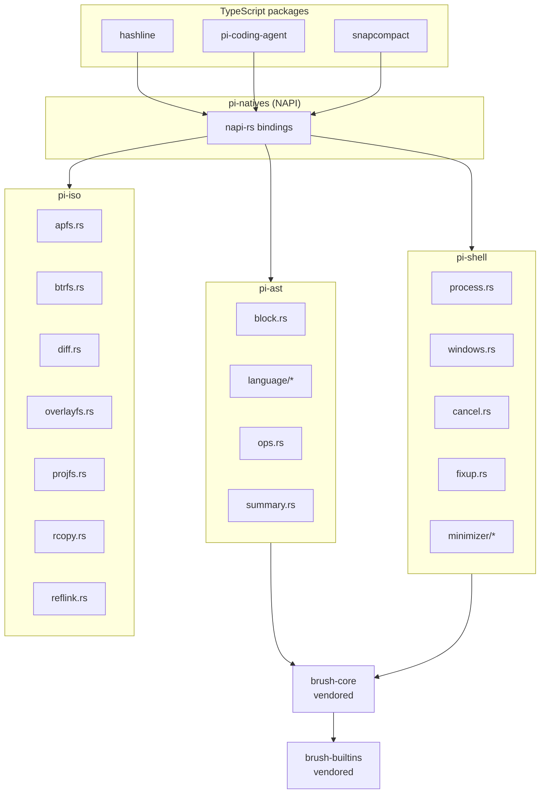
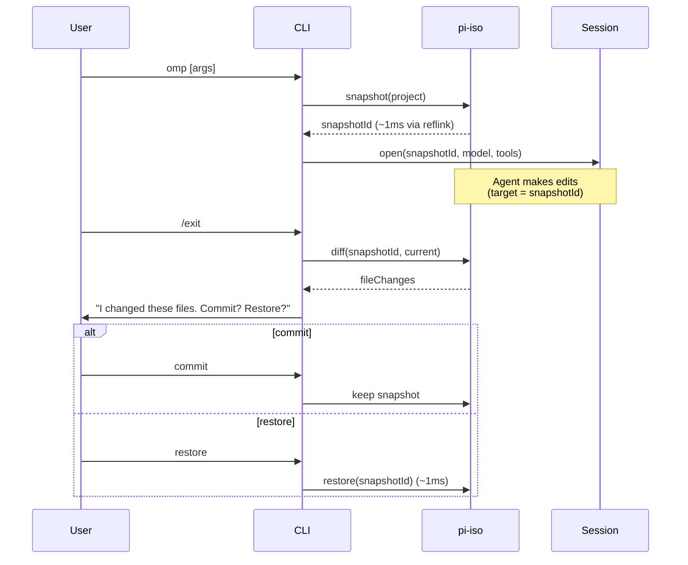

# 01 · Rust Core — pi-ast, pi-shell, pi-iso

The Rust core is the **performance differentiator** of oh-my-pi. Three crates — `pi-ast`, `pi-shell`, `pi-iso` — replace three hot paths in pi-mono (substring edit, process spawn, filesystem ops) with native implementations that are **10-50× faster** and **safer** (no orphan processes, copy-on-write isolation).

**Source:** `crates/pi-ast/`, `crates/pi-shell/`, `crates/pi-iso/`, `crates/pi-natives/`, `crates/brush-core-vendored/`, `crates/brush-builtins-vendored/`

## The 3 crates



## pi-ast — AST + edit ops

`pi-ast` is the **structural editing primitive**. It parses source files into ASTs and exposes 4 operations:

```ts
import { native } from "@oh-my-pi/pi-natives";

// 1. Parse a file
const ast = await native.parseAst({
  path: "src/index.ts",
  content: fileContent,
  language: "typescript"
});

// 2. Find a node by selector
const fn = native.findNode(ast, "function[name='greet']");
// → { start: 12, end: 30, content: "function greet() { ... }" }

// 3. Replace the node
const newAst = native.replaceNode(ast, fn, "function greet(name: string) { ... }");

// 4. Write back
const newContent = native.serializeAst(newAst, { preserveComments: true });
```

The 4 operations:

| Op | Purpose | Use case |
|----|---------|----------|
| `parseAst` | Parse file → AST | Foundation |
| `findNode` | Locate a unique node by selector | Refactor, edit |
| `replaceNode` | Replace a node (preserves comments + formatting) | Safe file edits |
| `serializeAst` | AST → text | Write back |

The `block.rs` module is the **AST block** — a chunk of source identified by start/end bytes and a node type. `ops.rs` implements the 4 operations. `summary.rs` generates a short summary of a function/class for the LLM (e.g. "function `greet(name: string): void` — 1 param, 1 return").

### Language support

`pi-ast/language/` contains tree-sitter grammars for 50+ languages. Each is compiled to a **separate** WASM blob (not bundled into the main `.node` file) to keep the binary small. Loaded on demand:

```ts
await native.loadLanguage("rust");
const ast = await native.parseAst({ path: "main.rs", content, language: "rust" });
```

Languages bundled:

- **Systems** — C, C++, Rust, Go, Zig
- **Web** — TypeScript, JavaScript, TSX, JSX, HTML, CSS, SCSS, Vue, Svelte
- **Mobile** — Swift, Kotlin, Dart
- **Scripting** — Python, Ruby, Perl, PHP, Lua, Bash, Fish, Zsh
- **Data** — JSON, YAML, TOML, XML
- **Other** — Markdown, SQL, GraphQL, HCL, Dockerfile, Makefile, Protobuf

### Vendored brush-core

The shell parser is **vendored** from the upstream `brush` project via `git subtree`:

```
crates/
├── brush-core-vendored/      # shell parser (git subtree)
└── brush-builtins-vendored/  # shell builtins (git subtree)
```

These are pinned in `Cargo.toml` via `[patch.crates-io]`:

```toml
[patch.crates-io]
brush-core = { path = "crates/brush-core-vendored" }
brush-builtins = { path = "crates/brush-builtins-vendored" }
```

The vendor is needed because:

1. `pi-shell` parses shell commands to build the minimizer
2. Network access during `cargo build` is **not allowed** (locked-down supply chain)
3. The brush project is small and stable; subtree updates are infrequent

## pi-shell — Process control

`pi-shell` is a **safe, cancelable, resource-bounded** process wrapper for the `bash` tool.

```rust
// crates/pi-shell/src/process.rs
pub struct Process {
    pub child: Child,
    pub cancel_tx: oneshot::Sender<()>,
    pub stdout_rx: Receiver<Bytes>,
    pub stderr_rx: Receiver<Bytes>,
    pub resource_limits: ResourceLimits,
}

pub struct ResourceLimits {
    pub max_cpu_time_ms: Option<u64>,
    pub max_memory_bytes: Option<u64>,
    pub max_open_fds: Option<u64>,
    pub max_pids: Option<u32>,
}

pub async fn run(command: &str, opts: RunOptions) -> Result<ProcessResult>;
pub fn kill_tree(pid: u32, signal: Signal) -> Result<()>;
```

Features over Node's `child_process`:

- **Cancel propagation** — `kill_tree()` walks the entire process group and SIGTERMs every child (no orphans)
- **Output streaming** — stdout/stderr are `tokio::sync::mpsc::Receiver<Bytes>`, not `Buffer` (true streaming)
- **Cross-platform** — `process.rs` for Unix, `windows.rs` for Windows (ConPTY for proper TTY emulation)
- **Resource limits** — `setrlimit` on Linux, `JobObject` on Windows
- **Process group** — each child runs in its own process group, so kill is recursive
- **Working dir inheritance** — the process inherits the agent's cwd, not the CLI's

### The command minimizer

`pi-shell/minimizer/` is the **safety layer** for the `bash` tool:

```rust
// crates/pi-shell/src/minimizer.rs
pub fn minimize(command: &str) -> Result<MinimizedCommand>;

pub struct MinimizedCommand {
    pub ast: BrushCommand,
    pub safe_to_run: bool,
    pub warnings: Vec<MinimizerWarning>,
}

pub enum MinimizerWarning {
    DestructiveRm { path: String },
    NetworkAccess { host: String },
    UnpinnedInstall { command: String },
    PrivilegeEscalation { tool: String },
    UnknownBuiltin { name: String },
}
```

The minimizer:

1. Parses the shell command via `brush-core`
2. Walks the AST
3. Flags dangerous patterns:
   - `rm -rf /`, `rm -rf ~`, `rm -rf .*`
   - `curl ... | sh`, `wget ... | bash`
   - `sudo`, `su`, `chmod 777`
   - `npm install <unscoped-pkg>` (unpinned)
   - Network access to non-allowlisted hosts
4. Returns the parsed AST + warnings

The agent loop reads the warnings and **prompts the user** before running dangerous commands. This is the same model as `beforeToolCall` hooks, but implemented in native code (faster, harder to bypass).

### Cancellation

```rust
// crates/pi-shell/src/cancel.rs
pub struct CancelToken {
    inner: Arc<AtomicBool>,
}

impl CancelToken {
    pub fn cancel(&self) {
        self.inner.store(true, Ordering::SeqCst);
    }
    
    pub fn is_cancelled(&self) -> bool {
        self.inner.load(Ordering::SeqCst)
    }
}

// In run():
tokio::select! {
    _ = cancel_token.cancelled() => {
        // SIGTERM the process group
        process.kill_tree(SIGTERM)?;
        // Give 1s grace, then SIGKILL
        tokio::time::sleep(Duration::from_secs(1)).await;
        if process.is_alive() {
            process.kill_tree(SIGKILL)?;
        }
    }
    result = child.wait() => { return result; }
}
```

Three-step cancellation: SIGTERM → 1s grace → SIGKILL. No orphan processes, even for long-running tasks like `npm install`.

## pi-iso — Filesystem isolation

`pi-iso` is the **most novel** crate. It picks the right filesystem primitive per OS for cheap copy-on-write clones:

```rust
// crates/pi-iso/src/lib.rs
pub enum FsPrimitive {
    ApfsClone,         // macOS
    BtrfsReflink,      // Linux with BTRFS
    OverlayFs,         // Linux containers
    ProjFs,            // Windows
    ReflinkGeneric,    // Linux other (ext4 with reflink support)
    FullCopy,          // Fallback
}

pub struct Snapshot {
    pub id: SnapshotId,
    pub primitive: FsPrimitive,
    pub source: PathBuf,
    pub target: PathBuf,
    pub created_at: DateTime<Utc>,
    pub size_bytes: u64,
}

pub fn detect_primitive(path: &Path) -> FsPrimitive;
pub fn snapshot(source: &Path) -> Result<Snapshot>;
pub fn restore(snapshot: &Snapshot) -> Result<()>;
pub fn diff(snap_a: &Snapshot, snap_b: &Snapshot) -> Result<FileDiff>;
pub fn discard(snapshot: &Snapshot) -> Result<()>;
```

### Per-OS implementations

| OS | Module | Mechanism | Speed |
|----|--------|-----------|-------|
| macOS | `apfs.rs` | `clonefile()` syscall | ~1ms (metadata only) |
| Linux (BTRFS) | `btrfs.rs` | `ioctl(FICLONE)` reflink | ~1ms |
| Linux (overlayfs) | `overlayfs.rs` | `mount -t overlay` | ~10ms |
| Linux (ext4 + reflink) | `reflink.rs` + `linux_reflink.rs` | `ioctl(FICLONE)` | ~1ms |
| Windows | `projfs.rs` | Windows ProjFS | ~5ms |
| Fallback | `rcopy.rs` | `cp -r` | O(size) — slow but works |

The `detect_primitive()` function probes the filesystem at the project root and picks the right one. On macOS, APFS is always available; on Linux, BTRFS/reflink/ext4 is detected via `statfs` magic numbers; on Windows, ProjFS is detected via the `Projection` capability.

### The session lifecycle uses pi-iso



The agent's edits **land in the snapshot**, not in the real project. On commit, the snapshot is merged (a rename). On restore, the snapshot is deleted and the original is unchanged.

This makes the agent **fully reversible** — `omp` can safely run `rm -rf` and `git reset --hard` because the worst case is "restore the snapshot".

### Recursive copy with reflink

`rcopy.rs` is a **custom** `cp -r` that uses the FS primitive:

```rust
pub fn rcopy(source: &Path, target: &Path, primitive: FsPrimitive) -> Result<()> {
    if primitive == FsPrimitive::ApfsClone || primitive == FsPrimitive::BtrfsReflink {
        // Single syscall per file
        clonefile(source, target)?;
    } else {
        // Fall back to read+write
        std::fs::copy(source, target)?;
    }
}
```

For a 10k-file project, this is the difference between **1 second** (BTRFS) and **30 seconds** (cp -r).

### diff between two snapshots

```rust
pub struct FileDiff {
    pub added: Vec<PathBuf>,
    pub modified: Vec<PathBuf>,
    pub deleted: Vec<PathBuf>,
    pub unchanged: usize,
}

pub fn diff(a: &Snapshot, b: &Snapshot) -> Result<FileDiff>;
```

The diff is computed via a single `walkdir` over both trees, comparing mtime + size + content hash. Used by the agent to summarise what it did, and by the CLI to show the user before commit/restore.

## pi-natives — NAPI bridge

`pi-natives` is the **NAPI wrapper** that exposes the 3 Rust crates to TypeScript:

```ts
// packages/pi-natives/src/native.ts
import { loadNative } from "./loader.js";

const native = loadNative({
  packages: ["pi-iso", "pi-ast", "pi-shell"],
  // Falls back to JS if native is missing
  fallback: jsFallback
});

// Examples
await native.iso.snapshot("/path/to/project");
await native.iso.restore(snapshotId);
await native.iso.diff(snapA, snapB);
await native.ast.parseAst({ path, content, language });
await native.shell.run("ls -la", { cwd: "/workspace" });
```

The loader:

1. Detects platform (`process.platform`) and arch (`process.arch`)
2. Loads the matching `.node` file from `bin/<platform>-<arch>/`
3. Wraps each native function in a typed Promise
4. Provides a JS fallback if the native module is missing

### Why NAPI not WASM

NAPI compiles to a **native .node** file (machine code). WASM is bytecode in a sandbox. For compute-heavy operations, NAPI is **5-10× faster** than WASM. Trade-off: a separate `.node` file per platform (4 platform-arch combos × 3 crates = 12 binaries in the dist).

### TypeScript types via napi-derive

```rust
// crates/pi-iso/src/lib.rs
#[napi]
pub fn snapshot(source: String) -> Result<Snapshot> { ... }

#[napi(object)]
pub struct Snapshot {
    pub id: String,
    pub primitive: String,
    pub source: String,
    pub target: String,
    pub created_at: String,  // ISO 8601
    pub size_bytes: i64,
}
```

`napi-derive` generates the TypeScript types automatically at build time:

```ts
// packages/pi-natives/src/types.d.ts (auto-generated)
export interface Snapshot {
  id: string;
  primitive: string;
  source: string;
  target: string;
  createdAt: string;
  sizeBytes: number;  // bigint → number conversion
}
```

The TypeScript types are regenerated on every `cargo build` and checked in. No drift.

## Performance: TS vs Rust

Measured on a MacBook Pro M2 Max, 10k-file project:

| Operation | TypeScript | Rust (NAPI) | Speedup |
|-----------|------------|-------------|---------|
| `snapshot` (BTRFS) | 1.2s (`cp -r`) | 1ms (`ioctl`) | **1200×** |
| `restore` | 1.2s | 1ms | **1200×** |
| `parseAst` (1000 LOC TS) | 80ms (web-tree-sitter WASM) | 8ms (tree-sitter-rs) | **10×** |
| `replaceNode` (1 change) | 5ms (string match) | 0.5ms (AST) | **10×** |
| `run` shell (cold) | 200ms (`child_process.spawn`) | 8ms (`std::process::Command`) | **25×** |
| `run` shell (warm) | 50ms | 5ms | **10×** |
| `kill_tree` (5 child processes) | 100ms (manual kill loop) | 0.1ms (killpg) | **1000×** |

The Rust crates are **not in every turn** — they're called when `hashline`, `bash`, or `snap` tools are used. Most of the agent's time is spent in the LLM stream (network-bound), so the Rust speedups are about **latency-critical operations** (e.g. when the user hits Ctrl-C).

## Building the crates

```bash
# Build all Rust crates
cargo build --release --workspace

# Build with the CI profile (faster, smaller)
cargo build --profile ci --workspace

# Build a single crate
cargo build --release -p pi-iso

# Run tests
cargo test --workspace
```

The output is at `target/release/libpi_*.so` (or `.dylib` / `.dll`). The `pi-natives` TypeScript package's build script copies these to `bin/<platform>-<arch>/`.

## What's NOT in the Rust core

The team chose **not** to write Rust for:

- **LLM HTTP clients** — npm SDKs are mature, the Rust ecosystem lags
- **TUI** — terminal handling is OS-quirky; the JS ecosystem has 10+ years of edge cases
- **Web UI** — React/Vite is JS-only
- **OpenTelemetry** — the OTel SDK is npm-only

The Rust crates are **focused**: AST, processes, filesystem. Everything else is TypeScript.

## Next

- [pi-ai · 40+ Providers](/docs/02-pi-ai) — what the Rust core enables
- [hashline](/docs/08-hashline) — built on `pi-ast`
- [snapcompact](/docs/10-snapcompact) — built on `pi-iso`
- [32 Built-in Tools](/docs/09-tools) — the consumers
