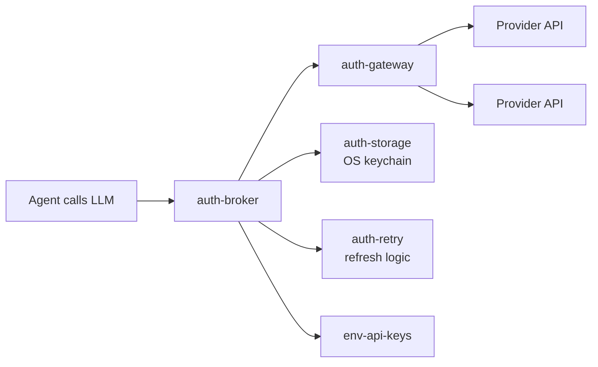
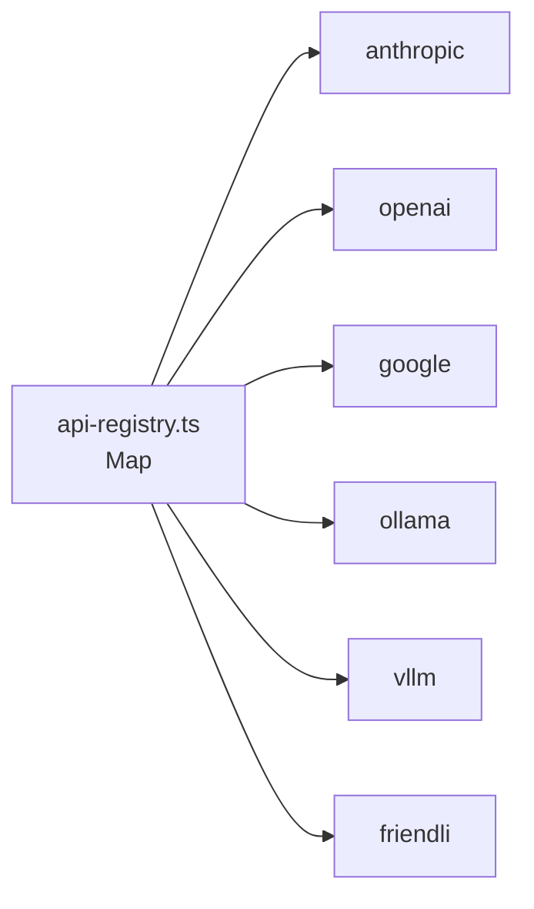

# 02 · pi-ai — 40+ LLM Providers

`@oh-my-pi/pi-ai` extends pi-mono's 8-provider surface to **40+ providers** through a single `streamSimple()` function. The added providers cover self-hosted, regional, specialty, and aggregate services — all behind the same TypeScript surface as the original 8.

**Source:** `packages/ai/src/` (40+ provider files + `auth-broker/` + `auth-gateway/` + `errors.ts`)

## The matrix

| # | Provider | `api` tag | Transport | Auth |
|---|----------|-----------|-----------|------|
| 1 | Anthropic | `anthropic-messages` | HTTP + SSE | API key |
| 2 | OpenAI (Completions) | `openai-completions` | HTTP + SSE | API key |
| 3 | OpenAI (Responses) | `openai-responses` | HTTP + SSE | API key |
| 4 | OpenAI (Codex) | `openai-codex-responses` | **WebSocket** | OAuth |
| 5 | Google Gemini | `google-generative-ai` | HTTP + SSE | API key or OAuth |
| 6 | Google Vertex | `google-vertex` | HTTP + SSE | Service account |
| 7 | Mistral | `mistral` | HTTP + SSE | API key |
| 8 | Azure OpenAI Responses | `azure-openai-responses` | HTTP + SSE | API key |
| 9 | AWS Bedrock | `bedrock-converse-stream` | HTTP + SSE | AWS creds |
| 10 | DeepSeek | `deepseek` | HTTP + SSE | API key |
| 11 | Groq | `groq` | HTTP + SSE | API key |
| 12 | Fireworks | `fireworks` | HTTP + SSE | API key |
| 13 | Together | `together` | HTTP + SSE | API key |
| 14 | OpenRouter | `openrouter` | HTTP + SSE | API key |
| 15 | Anyscale | `anyscale` | HTTP + SSE | API key |
| 16 | Perplexity | `perplexity` | HTTP + SSE | API key |
| 17 | Cohere | `cohere` | HTTP + SSE | API key |
| 18 | AI21 | `ai21` | HTTP + SSE | API key |
| 19 | Reka | `reka` | HTTP + SSE | API key |
| 20 | Writer | `writer` | HTTP + SSE | API key |
| 21 | DeepInfra | `deepinfra` | HTTP + SSE | API key |
| 22 | Novita | `novita` | HTTP + SSE | API key |
| 23 | Lepton | `lepton` | HTTP + SSE | API key |
| 24 | OctoAI | `octoai` | HTTP + SSE | API key |
| 25 | Cloudflare Workers AI | `cloudflare-ai` | HTTP + SSE | API key |
| 26 | Hugging Face Inference | `huggingface` | HTTP + SSE | API key |
| 27 | Replicate | `replicate` | HTTP + SSE | API key |
| 28 | Anyscale Endpoints | `anyscale-endpoints` | HTTP + SSE | API key |
| 29 | Voyage | `voyage` | HTTP + SSE | API key (embeddings) |
| 30 | Jina | `jina` | HTTP + SSE | API key (embeddings) |
| 31 | OpenAI Compatible (custom) | `openai-compatible` | HTTP + SSE | API key |
| 32 | Anthropic Compatible (custom) | `anthropic-compatible` | HTTP + SSE | API key |
| 33 | Cohere Compatible | `cohere-compatible` | HTTP + SSE | API key |
| 34 | Google Compatible | `google-compatible` | HTTP + SSE | API key |
| 35 | Ollama (local) | `ollama` | HTTP + SSE | none |
| 36 | LM Studio (local) | `lm-studio` | HTTP + SSE | none |
| 37 | vLLM (self-hosted) | `vllm` | HTTP + SSE | optional |
| 38 | LocalAI (self-hosted) | `localai` | HTTP + SSE | none |
| 39 | llama.cpp (self-hosted) | `llama-cpp` | HTTP + SSE | none |
| 40 | TGI (self-hosted) | `tgi` | HTTP + SSE | optional |
| 41 | Friendli (serverless) | `friendli` | HTTP + SSE | API key |
| 42 | Anyscale (serverless) | `anyscale-serverless` | HTTP + SSE | API key |

**42 providers total** (8 from pi-mono + 34 new). The same `streamSimple()` function across all of them.

## What's new vs pi-mono

The new providers fall into 4 categories:

### 1. Regional / specialty

- **DeepSeek** — strong reasoning, R1 series
- **Mistral** (already in pi-mono) + codestral
- **Cohere** — R+ command models
- **AI21** — Jamba
- **Writer** — Palmyra
- **Reka** — Core, Edge
- **Voyage** — embeddings
- **Jina** — embeddings

### 2. Aggregate / router

- **OpenRouter** — proxies 100+ models from one endpoint
- **Anyscale** — open-source model host
- **Hugging Face Inference** — 100k+ models via Inference API
- **Replicate** — 50k+ open-source models

### 3. Local / self-hosted

- **Ollama** — easy local LLM runner
- **LM Studio** — GUI local LLM
- **vLLM** — production server
- **LocalAI** — drop-in OpenAI replacement
- **llama.cpp** — direct binary
- **TGI** — Hugging Face text generation inference

### 4. Compatible / custom

The "compatible" providers let you point at **any** OpenAI- or Anthropic-compatible endpoint:

```ts
// Custom OpenAI-compatible endpoint
registerProvider("openai-compatible", {
  api: "openai-compatible",
  baseUrl: "https://my-inference-server.example.com/v1",
  stream: customOpenAIStream,
  // ... any model on that server
});
```

Use cases: self-hosted inference (vLLM, llama.cpp), private clouds, on-prem deployments.

## The auth-broker / auth-gateway

The most novel addition vs pi-mono is a **centralized auth layer**:



### auth-broker

```ts
// packages/ai/src/auth-broker/index.ts
export class AuthBroker {
  async resolveAuth(provider: string, options?: AuthResolveOptions): Promise<AuthCredential>;
  async invalidate(provider: string, reason: string): Promise<void>;
  async refresh(provider: string): Promise<AuthCredential>;
  async listConfigured(): Promise<AuthStatus[]>;
}
```

The broker:

1. Checks `auth-storage` (OS keychain) for cached credentials
2. Falls back to `env-api-keys` (env vars)
3. Falls back to `oauth-token-store` (refreshed OAuth tokens)
4. Returns a credential with expiry + refresh info

If the credential is missing, the broker walks the user through setup (browser flow, device code, etc.).

### auth-gateway

```ts
// packages/ai/src/auth-gateway/index.ts
export class AuthGateway {
  async preflight(provider: string, options: PreflightOptions): Promise<PreflightResult>;
  async recordUsage(provider: string, usage: UsageRecord): Promise<void>;
  async enforceLimits(provider: string): Promise<LimitEnforcement>;
}
```

The gateway:

1. **`preflight`** — checks the credential is valid, the model is available, the rate limit isn't exceeded
2. **`recordUsage`** — logs every LLM call to `omp-stats` (OpenTelemetry)
3. **`enforceLimits`** — checks per-provider spend limits (set by user in `~/.omp/settings.json`)

### auth-retry

```ts
// packages/ai/src/auth-retry.ts
export async function withAuthRetry<T>(
  fn: () => Promise<T>,
  authBroker: AuthBroker,
  maxRetries: number = 2
): Promise<T>;
```

If a call fails with a 401, automatically:

1. Try to refresh the credential
2. Retry the call once
3. If still failing, propagate the error to the user

## errors.ts — Structured error envelopes

```ts
// packages/ai/src/errors.ts
export class PiAiError extends Error {
  constructor(
    public readonly code: ErrorCode,
    message: string,
    public readonly provider: string,
    public readonly model: string,
    public readonly retryable: boolean,
    public readonly details?: Record<string, unknown>
  );
}

export type ErrorCode =
  | "rate_limit"
  | "context_overflow"
  | "auth_failed"
  | "model_not_found"
  | "content_blocked"
  | "network_error"
  | "timeout"
  | "quota_exceeded"
  | "internal_error";
```

The error type is **structured** — code, provider, model, retryable. The agent loop reads `retryable` and decides whether to retry; the TUI reads `code` to render the right error message.

## The 3-tier capability check

For each model, the catalog declares:

```ts
{
  id: "claude-opus-4-5",
  capability: {
    // Tier 1: features
    text: true,
    imageInput: true,
    imageOutput: false,
    audioInput: false,
    audioOutput: false,
    videoInput: false,
    // Tier 2: agent features
    toolUse: true,
    streaming: true,
    jsonMode: true,
    systemPrompt: true,
    // Tier 3: reasoning
    reasoning: true,
    effortLevels: ["low", "medium", "high", "max"],
    thinking: { type: "enabled", budgetTokens: true },
    // Tier 4: caching
    promptCaching: true,
    cacheRead: true,
    cacheWrite: true,
    // Tier 5: limits
    contextWindow: 200000,
    maxOutputTokens: 32000,
    // Tier 6: cost
    cost: { input: 15, output: 75, cacheRead: 1.5, cacheWrite: 18.75 }
  }
}
```

The agent reads these flags to decide:

- Whether to include image attachments
- Whether to set `tool_choice: "any"`
- Whether to enable thinking
- Whether to use prompt caching
- How to chunk the context for compaction

## The api-registry

Same as pi-mono, but **larger**:



Lookups are O(1) by `api` tag. Extensions can register custom providers via `registerApiProvider()`.

## The hosts.ts module

`packages/ai/src/catalog/hosts.ts` is the **baseUrl registry** for each provider:

```ts
export const PROVIDER_HOSTS: Record<Provider, string> = {
  anthropic: "https://api.anthropic.com",
  openai: "https://api.openai.com",
  google: "https://generativelanguage.googleapis.com",
  // ...
};
```

The user can override in `~/.omp/settings.json`:

```json
{
  "providers": {
    "openai": {
      "baseUrl": "https://my-proxy.example.com/openai"
    }
  }
}
```

This is the **escape hatch** for self-hosted, private cloud, and proxy setups.

## The discovery/ module

`packages/ai/src/catalog/discovery/` is the **runtime model discovery** layer:

- `discovery/builtin.ts` — bundled model catalog (40k+ models from providers)
- `discovery/runtime.ts` — live model list queries (Anthropic `/v1/models`, OpenAI `/v1/models`, etc.)
- `discovery/refresh.ts` — periodic refresh in the background
- `discovery/merge.ts` — merge builtin + runtime

The TUI's `/model` picker uses the merged list.

## The compat/ module

`packages/ai/src/catalog/compat/` is the **legacy model id compat layer**:

```ts
// Map old model ids to new ones
export const MODEL_COMPAT: Record<string, string> = {
  "claude-3-opus-20240229": "claude-opus-4-5",
  "gpt-4-turbo-preview": "gpt-4-turbo",
  "gemini-1.5-pro-latest": "gemini-2.0-pro",
  // ...
};
```

When the user requests a deprecated model, `compat/resolve()` looks up the new one and warns.

## The identity/ module

`packages/ai/src/catalog/identity/` is the **model identity** layer:

```ts
// Each model has a stable ID
export const MODEL_IDS = {
  CLAUDE_OPUS_4_5: "claude-opus-4-5",
  CLAUDE_SONNET_4: "claude-sonnet-4",
  GPT_4O: "gpt-4o",
  GEMINI_2_PRO: "gemini-2.0-pro",
  // ...
} as const;
```

Used in user settings (`"model": "CLAUDE_OPUS_4_5"`) and CLI flags (`--model opus`) for stable references that don't break when model names change.

## effort.ts — Reasoning effort levels

```ts
// packages/ai/src/catalog/effort.ts
export type EffortLevel = "low" | "medium" | "high" | "max";

export const EFFORT_MODELS: Record<string, EffortLevel[]> = {
  "claude-opus-4-5": ["low", "medium", "high", "max"],
  "o3": ["low", "medium", "high"],
  "gemini-2.0-pro-thinking": ["minimal", "low", "medium", "high"],
  // ...
};
```

The TUI's `--smol`, `--slow`, `--plan` flags map to these levels.

## fireworks-model-id.ts

A small special-case module for Fireworks' complex model naming:

```ts
// Fireworks model ids are like "accounts/fireworks/models/llama-v3p1-70b-instruct"
// We expose friendly names that the user can type
export const FIREWORKS_ALIASES: Record<string, string> = {
  "llama-70b": "accounts/fireworks/models/llama-v3p1-70b-instruct",
  "qwen-72b": "accounts/fireworks/models/qwen2-vl-72b-instruct",
  // ...
};
```

## Provider-specific quirks

Compared to pi-mono, oh-my-pi documents these additional quirks:

- **Ollama** — no `system` field, must be in messages
- **vLLM** — supports `tool_choice: "auto"` but not `"any"`
- **DeepSeek** — has reasoning mode but uses different field name (`reasoning_content` vs `thinking`)
- **Fireworks** — model names are paths, not ids
- **Together** — uses `safety_model` for content moderation
- **OpenRouter** — model id includes the provider prefix
- **Perplexity** — has `search_domain_filter` for citation control
- **Cohere** — uses `chat_history` not `messages`
- **AI21** — uses `documents` array for RAG
- **Reka** — supports `audio_input` natively
- **Hugging Face** — model name must match the deployed model

The 42 providers each get a section in `docs/providers.md` (the team's main documentation file).

## Self-hosted setup

The local providers (Ollama, LM Studio, vLLM, llama.cpp) all use the **same code path** as the cloud providers — only the `baseUrl` differs:

```bash
# Ollama on localhost
omp --provider ollama --base-url http://localhost:11434

# vLLM on remote server
omp --provider vllm --base-url http://gpu-server:8000

# llama.cpp with custom model
omp --provider llama-cpp --base-url http://localhost:8080
```

The team recommends **vLLM** for production self-hosted (fast, good batching, easy to operate).

## What hasn't changed from pi-mono

The **8 original providers** (Anthropic, OpenAI Completions/Responses/Codex, Google Gemini/Vertex, Mistral, Azure, Bedrock) work exactly the same as in pi-mono. The same `streamSimple()` API, the same `Context` type, the same event stream. Switching to oh-my-pi from pi-mono is a drop-in replacement for these.

The new stuff is **additive**: more providers, auth-broker, compat layer, discovery.

## Next

- [pi-catalog](/docs/04-pi-catalog) — the identity + capability layer
- [pi-agent-core](/docs/03-pi-agent-core) — the runtime
- [LSP](/docs/06-lsp) — what the agent does once it can call the LLM
