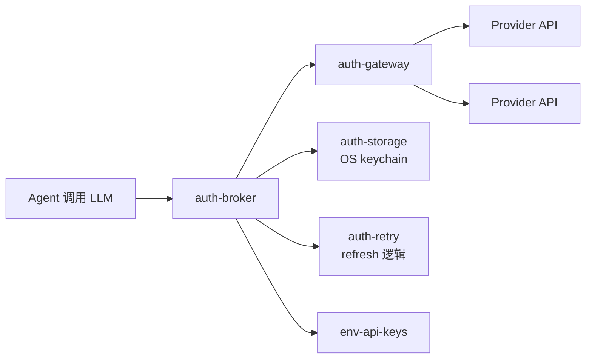
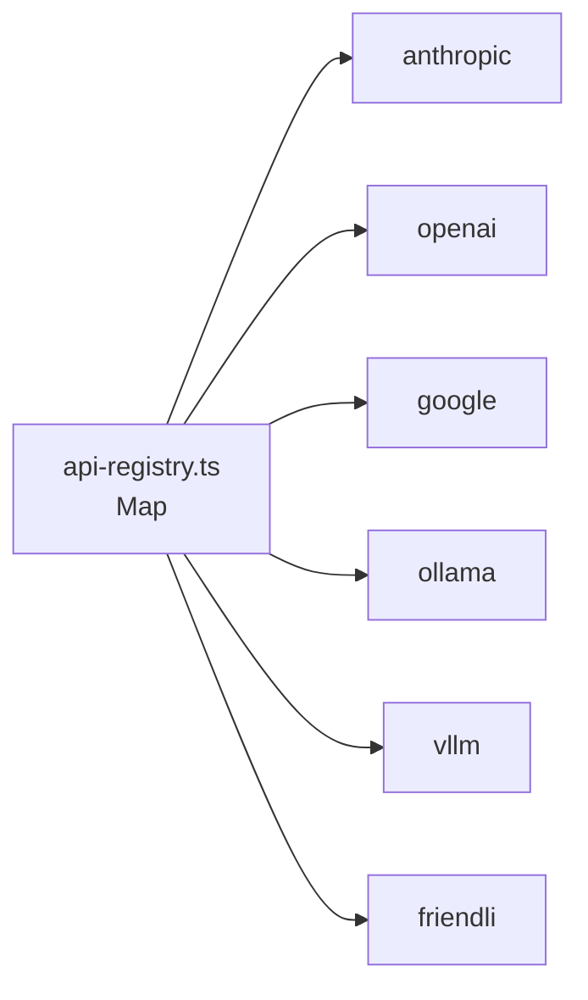

# 02 · pi-ai — 40+ LLM 提供方

`@oh-my-pi/pi-ai` 把 pi-mono 原本的 8 个提供方扩展到 **40+ 提供方**,对外暴露统一的 `streamSimple()` 函数。新增的提供方覆盖自托管、区域性、专用以及聚合服务 —— 全部站在与原 8 个相同的 TypeScript 接口背后。

**源码位置:** `packages/ai/src/`（40+ 个提供方文件 + `auth-broker/` + `auth-gateway/` + `errors.ts`）

## 提供方矩阵

| # | 提供方 | `api` 标签 | 传输 | 认证 |
|---|----------|-----------|-----------|------|
| 1 | Anthropic | `anthropic-messages` | HTTP + SSE | API key |
| 2 | OpenAI（Completions） | `openai-completions` | HTTP + SSE | API key |
| 3 | OpenAI（Responses） | `openai-responses` | HTTP + SSE | API key |
| 4 | OpenAI（Codex） | `openai-codex-responses` | **WebSocket** | OAuth |
| 5 | Google Gemini | `google-generative-ai` | HTTP + SSE | API key 或 OAuth |
| 6 | Google Vertex | `google-vertex` | HTTP + SSE | 服务账号 |
| 7 | Mistral | `mistral` | HTTP + SSE | API key |
| 8 | Azure OpenAI Responses | `azure-openai-responses` | HTTP + SSE | API key |
| 9 | AWS Bedrock | `bedrock-converse-stream` | HTTP + SSE | AWS 凭据 |
| 10 | DeepSeek | `deepseek` | HTTP + SSE | API key |
| 11 | Groq | `groq` | HTTP + SSE | API key |
| 12 | Fireworks | `fireworks` | HTTP + SSE | API key |
| 13 | Together | `together` | HTTP + SSE | API key |
| 14 | OpenRouter | `openrouter` | HTTP + SSE | API key |
| 15 | Anyscale | `anyscale` | HTTP + SSE | API key |
| 16 | Perplexity | `perplexity` | HTTP + SSE | API key |
| 17 | Cohere | `cohere` | HTTP + SSE | API key |
| 18 | AI21 | `ai21` | HTTP + SSE | API key |
| 19 | Reka | `reka` | HTTP + SSE | API key |
| 20 | Writer | `writer` | HTTP + SSE | API key |
| 21 | DeepInfra | `deepinfra` | HTTP + SSE | API key |
| 22 | Novita | `novita` | HTTP + SSE | API key |
| 23 | Lepton | `lepton` | HTTP + SSE | API key |
| 24 | OctoAI | `octoai` | HTTP + SSE | API key |
| 25 | Cloudflare Workers AI | `cloudflare-ai` | HTTP + SSE | API key |
| 26 | Hugging Face Inference | `huggingface` | HTTP + SSE | API key |
| 27 | Replicate | `replicate` | HTTP + SSE | API key |
| 28 | Anyscale Endpoints | `anyscale-endpoints` | HTTP + SSE | API key |
| 29 | Voyage | `voyage` | HTTP + SSE | API key（embeddings） |
| 30 | Jina | `jina` | HTTP + SSE | API key（embeddings） |
| 31 | OpenAI Compatible（自定义） | `openai-compatible` | HTTP + SSE | API key |
| 32 | Anthropic Compatible（自定义） | `anthropic-compatible` | HTTP + SSE | API key |
| 33 | Cohere Compatible | `cohere-compatible` | HTTP + SSE | API key |
| 34 | Google Compatible | `google-compatible` | HTTP + SSE | API key |
| 35 | Ollama（本地） | `ollama` | HTTP + SSE | 无 |
| 36 | LM Studio（本地） | `lm-studio` | HTTP + SSE | 无 |
| 37 | vLLM（自托管） | `vllm` | HTTP + SSE | 可选 |
| 38 | LocalAI（自托管） | `localai` | HTTP + SSE | 无 |
| 39 | llama.cpp（自托管） | `llama-cpp` | HTTP + SSE | 无 |
| 40 | TGI（自托管） | `tgi` | HTTP + SSE | 可选 |
| 41 | Friendli（serverless） | `friendli` | HTTP + SSE | API key |
| 42 | Anyscale（serverless） | `anyscale-serverless` | HTTP + SSE | API key |

**共 42 个提供方**（8 个来自 pi-mono + 34 个新增）。所有提供方共享同一个 `streamSimple()` 函数。

## 相比 pi-mono 的新变化

新增的提供方分为 4 类:

### 1. 区域性 / 专用

- **DeepSeek** —— 强推理能力,R1 系列
- **Mistral**（已在 pi-mono 中）+ codestral
- **Cohere** —— R+ command 模型
- **AI21** —— Jamba
- **Writer** —— Palmyra
- **Reka** —— Core、Edge
- **Voyage** —— embeddings
- **Jina** —— embeddings

### 2. 聚合 / 路由器

- **OpenRouter** —— 通过一个端点代理 100+ 模型
- **Anyscale** —— 开源模型托管
- **Hugging Face Inference** —— 通过 Inference API 访问 10 万+ 模型
- **Replicate** —— 5 万+ 开源模型

### 3. 本地 / 自托管

- **Ollama** —— 易用的本地 LLM 运行器
- **LM Studio** —— GUI 本地 LLM
- **vLLM** —— 生产级服务器
- **LocalAI** —— OpenAI 的即插即用替代品
- **llama.cpp** —— 直接二进制
- **TGI** —— Hugging Face text generation inference

### 4. 兼容 / 自定义

"compatible" 提供方让你可以指向 **任意** OpenAI- 或 Anthropic-兼容端点:

```ts
// 自定义 OpenAI 兼容端点
registerProvider("openai-compatible", {
  api: "openai-compatible",
  baseUrl: "https://my-inference-server.example.com/v1",
  stream: customOpenAIStream,
  // ... 该服务器上的任意模型
});
```

适用场景:自托管推理（vLLM、llama.cpp）、私有云、本地部署。

## auth-broker / auth-gateway

相比 pi-mono 最有新意的补充是 **集中式认证层**:



### auth-broker

```ts
// packages/ai/src/auth-broker/index.ts
export class AuthBroker {
  async resolveAuth(provider: string, options?: AuthResolveOptions): Promise<AuthCredential>;
  async invalidate(provider: string, reason: string): Promise<void>;
  async refresh(provider: string): Promise<AuthCredential>;
  async listConfigured(): Promise<AuthStatus[]>;
}
```

broker 会:

1. 检查 `auth-storage`（OS keychain）中缓存的凭据
2. 回退到 `env-api-keys`（环境变量）
3. 回退到 `oauth-token-store`（已刷新的 OAuth 令牌）
4. 返回带 expiry + refresh 信息的凭据

如果凭据缺失,broker 会引导用户完成设置（浏览器流、设备码等）。

### auth-gateway

```ts
// packages/ai/src/auth-gateway/index.ts
export class AuthGateway {
  async preflight(provider: string, options: PreflightOptions): Promise<PreflightResult>;
  async recordUsage(provider: string, usage: UsageRecord): Promise<void>;
  async enforceLimits(provider: string): Promise<LimitEnforcement>;
}
```

gateway 会:

1. **`preflight`** —— 检查凭据有效、模型可用、未超出速率限制
2. **`recordUsage`** —— 将每次 LLM 调用记录到 `omp-stats`（OpenTelemetry）
3. **`enforceLimits`** —— 检查按提供方设置的花费上限（在 `~/.omp/settings.json` 中由用户配置）

### auth-retry

```ts
// packages/ai/src/auth-retry.ts
export async function withAuthRetry<T>(
  fn: () => Promise<T>,
  authBroker: AuthBroker,
  maxRetries: number = 2
): Promise<T>;
```

如果调用以 401 失败,自动:

1. 尝试刷新凭据
2. 重试调用一次
3. 仍然失败则将错误上报给用户

## errors.ts — 结构化错误信封

```ts
// packages/ai/src/errors.ts
export class PiAiError extends Error {
  constructor(
    public readonly code: ErrorCode,
    message: string,
    public readonly provider: string,
    public readonly model: string,
    public readonly retryable: boolean,
    public readonly details?: Record<string, unknown>
  );
}

export type ErrorCode =
  | "rate_limit"
  | "context_overflow"
  | "auth_failed"
  | "model_not_found"
  | "content_blocked"
  | "network_error"
  | "timeout"
  | "quota_exceeded"
  | "internal_error";
```

错误类型是 **结构化** 的 —— code、provider、model、retryable。Agent 循环读取 `retryable` 决定是否重试;TUI 读取 `code` 渲染相应的错误消息。

## 3 层能力检查

对于每个模型,catalog 声明:

```ts
{
  id: "claude-opus-4-5",
  capability: {
    // Tier 1: 特性
    text: true,
    imageInput: true,
    imageOutput: false,
    audioInput: false,
    audioOutput: false,
    videoInput: false,
    // Tier 2: Agent 特性
    toolUse: true,
    streaming: true,
    jsonMode: true,
    systemPrompt: true,
    // Tier 3: 推理
    reasoning: true,
    effortLevels: ["low", "medium", "high", "max"],
    thinking: { type: "enabled", budgetTokens: true },
    // Tier 4: 缓存
    promptCaching: true,
    cacheRead: true,
    cacheWrite: true,
    // Tier 5: 限制
    contextWindow: 200000,
    maxOutputTokens: 32000,
    // Tier 6: 成本
    cost: { input: 15, output: 75, cacheRead: 1.5, cacheWrite: 18.75 }
  }
}
```

Agent 读取这些标志以决定:

- 是否附带图像附件
- 是否设置 `tool_choice: "any"`
- 是否启用 thinking
- 是否使用 prompt caching
- 如何为压缩切分上下文

## api-registry

与 pi-mono 一致,但 **更大**:



按 `api` 标签的查找是 O(1)。扩展可以通过 `registerApiProvider()` 注册自定义提供方。

## hosts.ts 模块

`packages/ai/src/catalog/hosts.ts` 是每个提供方的 **baseUrl 注册表**:

```ts
export const PROVIDER_HOSTS: Record<Provider, string> = {
  anthropic: "https://api.anthropic.com",
  openai: "https://api.openai.com",
  google: "https://generativelanguage.googleapis.com",
  // ...
};
```

用户可以在 `~/.omp/settings.json` 中覆盖:

```json
{
  "providers": {
    "openai": {
      "baseUrl": "https://my-proxy.example.com/openai"
    }
  }
}
```

这是自托管、私有云、代理设置的 **逃生口**。

## discovery/ 模块

`packages/ai/src/catalog/discovery/` 是 **运行时模型发现** 层:

- `discovery/builtin.ts` —— 内置的模型目录（来自提供方的 4 万+ 模型）
- `discovery/runtime.ts` —— 实时模型列表查询（Anthropic `/v1/models`、OpenAI `/v1/models` 等）
- `discovery/refresh.ts` —— 后台周期性刷新
- `discovery/merge.ts` —— 合并 builtin + runtime

TUI 的 `/model` 选择器使用合并后的列表。

## compat/ 模块

`packages/ai/src/catalog/compat/` 是 **旧版模型 id 兼容层**:

```ts
// 将旧模型 id 映射到新 id
export const MODEL_COMPAT: Record<string, string> = {
  "claude-3-opus-20240229": "claude-opus-4-5",
  "gpt-4-turbo-preview": "gpt-4-turbo",
  "gemini-1.5-pro-latest": "gemini-2.0-pro",
  // ...
};
```

当用户请求一个已废弃的模型时,`compat/resolve()` 查找到新的并给出警告。

## identity/ 模块

`packages/ai/src/catalog/identity/` 是 **模型身份** 层:

```ts
// 每个模型都有稳定的 ID
export const MODEL_IDS = {
  CLAUDE_OPUS_4_5: "claude-opus-4-5",
  CLAUDE_SONNET_4: "claude-sonnet-4",
  GPT_4O: "gpt-4o",
  GEMINI_2_PRO: "gemini-2.0-pro",
  // ...
} as const;
```

用于用户设置（`"model": "CLAUDE_OPUS_4_5"`）与 CLI flag（`--model opus`）中的稳定引用,即便模型名称变更也不会中断。

## effort.ts — 推理 effort 等级

```ts
// packages/ai/src/catalog/effort.ts
export type EffortLevel = "low" | "medium" | "high" | "max";

export const EFFORT_MODELS: Record<string, EffortLevel[]> = {
  "claude-opus-4-5": ["low", "medium", "high", "max"],
  "o3": ["low", "medium", "high"],
  "gemini-2.0-pro-thinking": ["minimal", "low", "medium", "high"],
  // ...
};
```

TUI 的 `--smol`、`--slow`、`--plan` flag 映射到这些等级。

## fireworks-model-id.ts

Fireworks 模型命名复杂,这是一个小型专门处理模块:

```ts
// Fireworks 模型 id 形如 "accounts/fireworks/models/llama-v3p1-70b-instruct"
// 我们暴露用户可输入的友好名称
export const FIREWORKS_ALIASES: Record<string, string> = {
  "llama-70b": "accounts/fireworks/models/llama-v3p1-70b-instruct",
  "qwen-72b": "accounts/fireworks/models/qwen2-vl-72b-instruct",
  // ...
};
```

## 各提供方特殊之处

相对 pi-mono,oh-my-pi 还记录了以下特殊之处:

- **Ollama** —— 没有 `system` 字段,必须放进消息里
- **vLLM** —— 支持 `tool_choice: "auto"`,但不支持 `"any"`
- **DeepSeek** —— 有 reasoning 模式,但使用不同的字段名（`reasoning_content` vs `thinking`）
- **Fireworks** —— 模型名是路径而非 id
- **Together** —— 使用 `safety_model` 做内容审核
- **OpenRouter** —— 模型 id 包含提供方前缀
- **Perplexity** —— 提供 `search_domain_filter` 用于引用控制
- **Cohere** —— 使用 `chat_history` 而非 `messages`
- **AI21** —— 使用 `documents` 数组做 RAG
- **Reka** —— 原生支持 `audio_input`
- **Hugging Face** —— 模型名必须与已部署的模型匹配

42 个提供方在 `docs/providers.md` 中各有专属章节（团队的主文档文件）。

## 自托管设置

本地提供方（Ollama、LM Studio、vLLM、llama.cpp）走的是与云端提供方 **完全相同** 的代码路径 —— 区别只在 `baseUrl`:

```bash
# Ollama 在 localhost
omp --provider ollama --base-url http://localhost:11434

# vLLM 在远程服务器
omp --provider vllm --base-url http://gpu-server:8000

# llama.cpp 与自定义模型
omp --provider llama-cpp --base-url http://localhost:8080
```

团队推荐生产自托管使用 **vLLM**（速度快、批处理好、易于运维）。

## 哪些与 pi-mono 一致

**原有 8 个提供方**（Anthropic、OpenAI Completions/Responses/Codex、Google Gemini/Vertex、Mistral、Azure、Bedrock）的行为与 pi-mono 完全一致。相同的 `streamSimple()` API、相同的 `Context` 类型、相同的事件流。从 pi-mono 切换到 oh-my-pi 对它们来说是 drop-in replacement。

新增内容是 **增量** 的:更多提供方、auth-broker、compat 层、discovery。

## 接下来

- [pi-catalog](/docs/04-pi-catalog) —— 身份 + 能力层
- [pi-agent-core](/docs/03-pi-agent-core) —— 运行时
- [LSP](/docs/06-lsp) —— Agent 调用 LLM 后做的事
