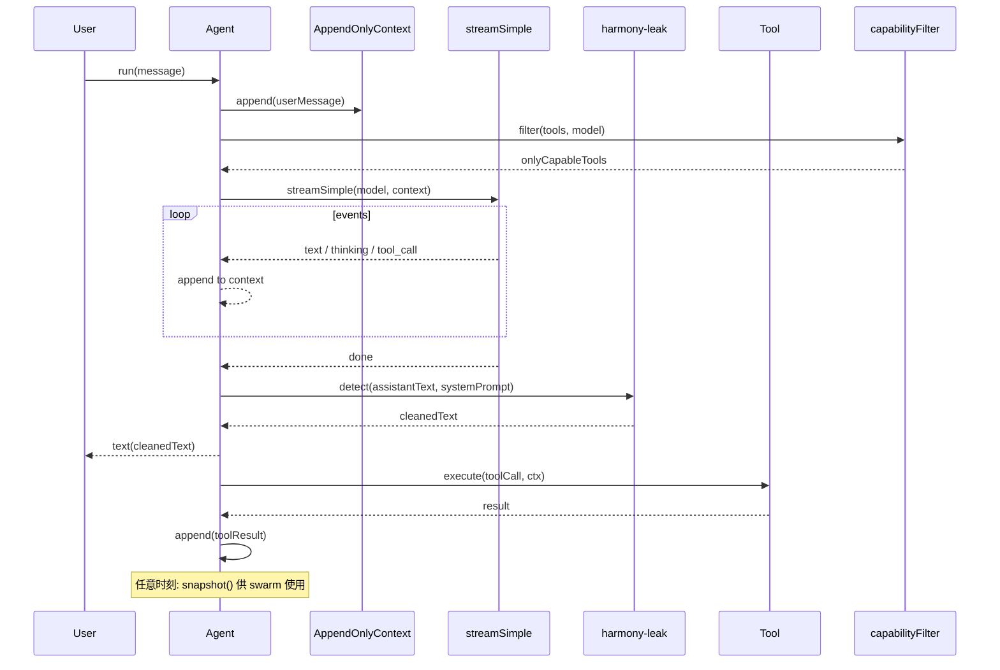

# 03 · pi-agent-core — Agent 运行时

`@oh-my-pi/pi-agent-core` 是 Agent 运行时,在 pi-mono 的基础上扩展了 **仅追加的上下文**、**harmony-leak 检测**、**基于能力的工具选择** 与 **swarm-ready 的会话交接**。它负责 Agent 循环、状态、hook 与压缩。

**源码位置:** `packages/agent/src/`（8 个源文件 + 4 个压缩模块 + 1 个 proxy）

## 11 个文件

```
packages/agent/src/
├── agent.ts                  # 公开的 Agent 类
├── agent-loop.ts             # 循环实现
├── append-only-context.ts    # 仅追加的消息存储
├── harmony-leak.ts           # 检测输出中的 prompt 泄漏
├── proxy.ts                  # 工具分发
├── index.ts                  # 公开导出
├── types.ts                  # 公开类型
└── compaction/
    ├── compaction.ts         # 主压缩逻辑
    ├── append-compaction.ts  # 保留历史的压缩
    ├── strategy.ts           # 压缩策略
    └── ...
```

## 相比 pi-mono 的变化

| 维度 | pi-mono | oh-my-pi |
|--------|---------|----------|
| 上下文变更 | 原地数组变更 | 仅追加的上下文（不可变快照） |
| 工具选择 | 所有工具可用 | **基于能力** —— 仅展示与模型能力标志匹配的工具 |
| 压缩 | 普通 JSONL + 摘要 | **多策略** —— `summary`、`append`、`branch-aware`、`tail-prune` |
| Prompt 泄漏 | 未检测 | `harmony-leak` 检测器,剥离泄漏的系统提示词片段 |
| 会话交接 | 单一会话 | **Swarm-ready** —— 会话可被克隆、合并、替换 |
| 递归 | 通过 `beforeToolCall` 手工实现 | 一等公民的 `subagent` 工具（供 swarm-extension 使用） |

## `Agent` 类

```ts
import { Agent, type AgentState, type AgentTool } from "@oh-my-pi/pi-agent-core";
import { streamSimple } from "@oh-my-pi/pi-ai";

const agent = new Agent({
  initialState: {
    systemPrompt: "You are a helpful coding assistant.",
    model: claudeOpusModel,
    tools: [readTool, hashlineTool, lspsTool, dapsTool, ...],
    thinkingLevel: "high"
  },
  stream: streamSimple,
  toolExecutionMode: "parallel",
  queueMode: "one-at-a-time",
  // oh-my-pi 新增:
  appendOnlyContext: true,         // 使用不可变快照
  capabilityFilter: "strict",      // 仅展示模型能用的工具
  harmonyLeakDetection: "auto",    // 从输出中剥离 prompt 泄漏
  compactionStrategy: "append",    // 使用 append-compaction
  swarmReady: true                 // 允许会话克隆/合并
});
```

`Agent` 类 **与传输无关** —— 消费者（TUI、RPC、collab-web）只看到 `AgentEvent`。

## 仅追加的上下文

相对 pi-mono 最重大的变化。在 pi-mono 中,Agent 的 `messages` 数组是 **原地变更** 的 —— 直接调用 `push` 和 `slice`。在 oh-my-pi 中,上下文是 **仅追加的**:

```ts
// packages/agent/src/append-only-context.ts
export class AppendOnlyContext {
  private readonly segments: ReadonlyArray<ContextSegment>;
  
  append(segment: ContextSegment): AppendOnlyContext;
  withReplacement(index: number, segment: ContextSegment): AppendOnlyContext;
  tail(n: number): AppendOnlyContext;
  toContext(): Context;
}

export type ContextSegment =
  | { type: "system"; content: string }
  | { type: "user"; content: TextContent[] | ImageContent[] }
  | { type: "assistant"; content: AssistantContent[] }
  | { type: "toolResult"; toolCallId: string; content: TextContent[] }
  | { type: "summary"; content: string; replaces: number };
```

`append()` 与 `withReplacement()` 这样的操作返回 **新的** `AppendOnlyContext` —— 旧对象保持不变。这带来三个好处:

1. **可快照化** —— 对话中的任意一点都可以保存为不可变快照（snapcompact 使用）
2. **并发安全** —— 子 Agent 可以持有旧快照的引用,而父 Agent 继续推进
3. **更易调试** —— 任意时刻的上下文就是 `segments.slice(0, i)`,无需变更历史

开销大约是 5%（每条消息多分配一个对象）,与 LLM 调用成本相比可以忽略。

## harmony-leak 检测

LLM 有时会将 **系统提示词的一部分泄漏** 到可见输出中（例如 "I am Claude, an AI assistant..."）。oh-my-pi 检测并剥离这些内容:

```ts
// packages/agent/src/harmony-leak.ts
export function detectHarmonyLeak(
  text: string,
  systemPrompt: string
): { leaked: boolean; leakedPhrases: string[]; cleanedText: string };
```

检测器使用三种策略:

1. **精确匹配** —— 剥离与系统提示词部分完全一致的行
2. **模糊匹配** —— 剥离与系统提示词短语相似度 80%+ 的行（Levenshtein 距离）
3. **模式匹配** —— 剥离匹配 "I am an AI..." 等常见 pattern 的行

清洗后的文本会发送给用户;泄漏的短语 **记录到 OpenTelemetry**（这样团队可以修复系统提示词）。

`harmonyLeakDetection: "auto"` 为每条 assistant 消息启用此功能。`"off"` 则关闭。

## Agent 循环（扩展版）

循环结构与 pi-mono 相同,但有 3 处新增:



`capabilityFilter` 是新增的一步 —— 它将工具列表过滤为当前模型真正能用的工具。没有 vision 的模型看不到 `read-image`;没有 thinking 的模型看不到 deep-refactor 工具;等等。

## capabilityFilter

```ts
// In agent-loop.ts
function capabilityFilter(tools: AgentTool[], model: Model): AgentTool[] {
  return tools.filter(tool => {
    // 工具声明自己所需的能力
    return tool.requiredCapabilities.every(cap => model.capability[cap] === true);
  });
}
```

每个工具声明:

```ts
const readImageTool: AgentTool = {
  name: "read_image",
  inputSchema: ReadImageArgs,
  // ...
  requiredCapabilities: ["imageInput"],
  optionalCapabilities: ["thinking"]
};
```

默认是严格过滤 —— 缺少必要能力的工具 **对 LLM 不可见**。`"warn"` 模式保留工具但给出警告;`"off"` 关闭过滤。

## 4 种压缩策略

`packages/agent/src/compaction/strategy.ts` 导出 4 种策略:

```ts
export type CompactionStrategy = "summary" | "append" | "branch" | "tail-prune";
```

### 1. `summary`（pi-mono 的默认）

```ts
export async function summaryCompaction(
  state: AgentState,
  model: Model,
  config: CompactionConfig
): Promise<CompactionResult>;
```

旧的:保留前 N 条 + 其余的摘要。与 pi-mono 相同。

### 2. `append`（oh-my-pi 的默认）

```ts
export async function appendCompaction(
  state: AgentState,
  model: Model,
  config: CompactionConfig
): Promise<CompactionResult>;
```

**不删除 —— 摘要并追加。** 将最早的 M 条消息替换为摘要,但 **把摘要追加到 segment 列表** 而不是替换。LLM 看到的是:

```
[s1, s2, s3, s4, s5, s6, summary(s1-s3), s4, s5, s6, s7, ...]
```

取舍:上下文略增长（保留摘要）,但 Agent 保留了对话的 **脉络**。适用于 Agent 需要记住自身决策的长任务。

### 3. `branch`（与 pi-mono 的 branch-aware 相同）

```ts
export async function branchCompaction(
  state: AgentState,
  model: Model,
  config: CompactionConfig
): Promise<CompactionResult>;
```

针对多分支对话,保留每个分支的独立摘要。

### 4. `tail-prune`

```ts
export async function tailPruneCompaction(
  state: AgentState,
  model: Model,
  config: CompactionConfig
): Promise<CompactionResult>;
```

丢掉对话的 **中间** 部分,保留开头（锚点）+ 结尾（当前焦点）。适用于 Agent 在支线任务中的超长会话 —— LLM 只需要锚点 + 最近上下文。

### 策略选择

| 使用场景 | 策略 |
|----------|----------|
| 默认（多数用户） | `append` |
| 长时间调试会话 | `tail-prune` |
| 多分支（用户反复回退） | `branch` |
| 严格 token 预算 | `summary` |

可在 `~/.omp/settings.json` 中配置:

```json
{
  "compaction": {
    "strategy": "append",
    "thresholdFraction": 0.8,
    "summaryModel": "claude-haiku-4"
  }
}
```

## 17 事件协议（扩展版）

与 pi-mono 的 17 个事件相同,新增 4 个:

| 事件 | 类型 | 用途 |
|-------|------|---------|
| `compaction_start` | 已有 | 压缩开始 |
| `compaction_end` | 已有 | 压缩完成 |
| `compaction_strategy_changed` | **新增** | 会话中途切换策略 |
| `snapshot_taken` | **新增** | 已保存上下文快照（供 swarm 使用） |
| `snapshot_restored` | **新增** | 已恢复上下文快照（来自 swarm 交接） |
| `capability_filtered` | **新增** | 因能力缺失而隐藏工具 |

新增的 4 个事件让 UI 可以显示 "compression strategy switched to tail-prune" 与 "tool `read_image` hidden — model doesn't support vision"。

## Swarm-ready 会话

`AgentSession` 可以被 **克隆** 用于派生子 Agent（由 `swarm-extension` 使用）:

```ts
// 在 swarm-extension 中
const subAgentSession = parentSession.clone({
  model: cheaperModel,
  tools: [readTool, grepTool, globTool],  // 只读子集
  prompt: "You are a search sub-agent. Find X and report back."
});

const result = await subAgentSession.run(searchQuery);
parentSession.appendToolResult(result);
```

克隆是 **深** 的 —— 它获得自己的仅追加上下文、自己的工具列表、自己的压缩。子 Agent 工作期间父 Agent 的上下文 **保持不变**。子 Agent 返回时,其结果作为单条工具结果追加到父 Agent。

这就是 `swarm-extension` 的 **核心** 模式 —— 参见 [swarm-extension](/docs/16-swarm-extension)。

## proxy.ts（扩展版）

`proxy.ts` 是工具分发的关键节点,与 pi-mono 相同。新增部分:

```ts
export async function dispatchToolCall(
  tools: AgentTool[],
  toolCall: AgentToolCall,
  beforeHook?: BeforeToolCallFn,
  afterHook?: AfterToolCallFn,
  options?: DispatchOptions
): Promise<ToolResultMessage>;

export interface DispatchOptions {
  capabilityFilter?: "strict" | "warn" | "off";
  swappableHook?: (toolCall: AgentToolCall) => AgentTool | null;  // 用于子 Agent
  // ...
}
```

`swappableHook` 让子 Agent 把一个工具替换为"回调父 Agent"的工具 —— 子 Agent 的 `read` 返回父 Agent 的 `read` 结果,但调用会记录在子 Agent 的上下文中以保持透明。

## 哪些没变

- `Agent` 类 API 与 pi-mono **向后兼容**（同样的构造函数、同样的事件、同样的 hook）
- `AgentState` 形态相同
- `AgentTool` 接口相同
- `beforeToolCall` / `afterToolCall` hook 工作方式相同
- `toolExecutionMode` 与 `queueMode` 设置相同

因此 pi-mono Agent 移植到 oh-my-pi 只需修改 import（`@earendil-works/pi-agent-core` → `@oh-my-pi/pi-agent-core`）并添加新的 `appendOnlyContext`、`capabilityFilter`、`compactionStrategy` 设置。

## `compaction.ts` 编排器

```ts
// packages/agent/src/compaction.ts
export async function compact(
  state: AgentState,
  model: Model,
  stream: StreamFn,
  config: CompactionConfig
): Promise<CompactionResult> {
  switch (config.strategy) {
    case "summary": return summaryCompaction(state, model, config);
    case "append": return appendCompaction(state, model, config);
    case "branch": return branchCompaction(state, model, config);
    case "tail-prune": return tailPruneCompaction(state, model, config);
  }
}

export function shouldCompact(state: AgentState, config: CompactionConfig): boolean {
  const tokens = estimateContextTokens(state);
  return tokens > state.model.contextWindow * config.thresholdFraction;
}
```

编排器在运行时选择合适的策略。用户可以在会话中途切换策略（例如从 `summary` 切换到 `tail-prune` 以应对收尾阶段）。

## 调试循环

```ts
// 在 ~/.omp/settings.json 中设置
{
  "agent": {
    "debug": {
      "logEvents": true,           // 记录每个 AgentEvent
      "logContext": true,          // 记录每轮的完整上下文
      "logToolCalls": true,        // 记录每个工具调用
      "snapshotEveryTurn": true    // 每轮保存一份上下文快照
    }
  }
}
```

快照保存到 `.omp/debug/snapshots/<sessionId>/<turnId>.json`。用于回放以及 swarm-extension 调试。

## 接下来

- [pi-coding-agent · CLI](/docs/05-pi-coding-agent) —— 消费者
- [snapcompact](/docs/10-snapcompact) —— 持久化层
- [swarm-extension](/docs/16-swarm-extension) —— 多 Agent 模式
- [32 个内置工具](/docs/09-tools) —— Agent 分发到的工具
