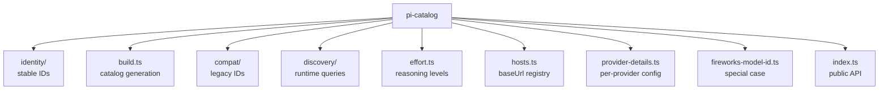

# 04 · pi-catalog — Model Identity & Compatibility

`@oh-my-pi/pi-catalog` is the **centralized model metadata registry**. It owns the model catalog, capability flags, identity (stable IDs vs display names), effort levels, compat layer (legacy model ids), and discovery (live queries to providers).

**Source:** `packages/catalog/src/` (10+ files: build, compat/, discovery/, effort, identity/, hosts, etc.)

## Why a separate package

In pi-mono, model metadata was inside `pi-ai/src/models.generated.ts` (17,159 lines, auto-generated). For oh-my-pi's 40+ providers × thousands of models, this would balloon to 100k+ lines. The team split it out into `pi-catalog` so:

1. The catalog can be **queried** at runtime (not just compiled in)
2. The catalog can be **updated** without rebuilding `pi-ai`
3. The catalog can be **extended** by extensions (custom providers)
4. The catalog can be **versioned** independently

## The 4 sub-modules



## The 6 model fields

Every model in the catalog has 6 fields:

```ts
export interface Model {
  // 1. Identity
  id: string;          // stable, e.g. "claude-opus-4-5"
  name: string;        // display, e.g. "Claude Opus 4.5"
  family: string;      // e.g. "claude-4"
  provider: string;    // e.g. "anthropic"
  api: Api;            // e.g. "anthropic-messages"
  baseUrl?: string;    // override default
  
  // 2. Capability flags
  capability: ModelCapability;
  
  // 3. Limits
  contextWindow: number;
  maxOutputTokens: number;
  
  // 4. Cost
  cost: ModelCost;
  
  // 5. Reasoning
  effortLevels?: EffortLevel[];
  
  // 6. Deprecation
  deprecated?: {
    since: string;            // ISO date
    replacement?: string;     // new model id
    sunset?: string;          // ISO date
  };
}
```

The 6 fields answer:

- **Who am I?** — `id`, `name`, `family`, `provider`, `api`
- **What can I do?** — `capability`
- **How much can I hold?** — `contextWindow`, `maxOutputTokens`
- **How much does it cost?** — `cost`
- **How hard should I think?** — `effortLevels`
- **Am I dying?** — `deprecated`

## The 24 capability flags

```ts
export interface ModelCapability {
  // Tier 1: Modality
  text: boolean;
  imageInput: boolean;
  imageOutput: boolean;
  audioInput: boolean;
  audioOutput: boolean;
  videoInput: boolean;
  videoOutput: boolean;
  
  // Tier 2: Agent features
  toolUse: boolean;
  streaming: boolean;
  jsonMode: boolean;
  systemPrompt: boolean;
  
  // Tier 3: Reasoning
  reasoning: boolean;
  thinking: { type: "enabled" | "adaptive"; budgetTokens: boolean };
  effortLevels: EffortLevel[];
  
  // Tier 4: Caching
  promptCaching: boolean;
  cacheRead: boolean;
  cacheWrite: boolean;
  
  // Tier 5: Search / retrieval
  webSearch: boolean;
  citations: boolean;
  grounding: boolean;
  
  // Tier 6: Limits (data)
  contextWindow: number;
  maxOutputTokens: number;
}
```

The agent reads these flags to:

- Filter tools (no `read_image` if `!imageInput`)
- Decide whether to enable thinking
- Choose the right compaction strategy
- Set the right `tool_choice` value
- Use prompt caching when available

## The identity module

`packages/catalog/src/identity/` defines **stable symbolic IDs** for every model:

```ts
// packages/catalog/src/identity/index.ts
export const MODEL_ID = {
  CLAUDE_OPUS_4_5: "claude-opus-4-5",
  CLAUDE_SONNET_4: "claude-sonnet-4",
  CLAUDE_HAIKU_4: "claude-haiku-4",
  GPT_4O: "gpt-4o",
  GPT_4O_MINI: "gpt-4o-mini",
  O3: "o3",
  O3_MINI: "o3-mini",
  GEMINI_2_PRO: "gemini-2.0-pro",
  GEMINI_2_FLASH: "gemini-2.0-flash",
  MISTRAL_LARGE_2: "mistral-large-2",
  DEEPSEEK_R1: "deepseek-r1",
  GROQ_LLAMA_70B: "groq-llama-70b",
  // ... 100+ aliases
} as const;

export type ModelId = typeof MODEL_ID[keyof typeof MODEL_ID];
```

Users can use either the stable ID or a friendly alias in their settings:

```json
{
  "model": "CLAUDE_OPUS_4_5"        // stable
}
```
```json
{
  "model": "opus"                    // alias
}
```

The alias is resolved at session start via `identity/resolve.ts`. If the alias is ambiguous (e.g. "sonnet" could be 3.5 or 4), the user is prompted.

## The build module

`packages/catalog/src/build.ts` generates the catalog from upstream sources:

```bash
bun run catalog:build
```

The build pulls from:

1. **Anthropic** — `https://api.anthropic.com/v1/models` (live)
2. **OpenAI** — `https://api.openai.com/v1/models` (live)
3. **Google** — `https://generativelanguage.googleapis.com/v1/models` (live)
4. **Static YAML** — `packages/catalog/src/catalog/static/*.yaml` (for self-hosted providers)

The generated catalog is committed to `packages/catalog/src/catalog.generated.ts`. Like pi-mono, **never edit by hand** — the build is idempotent.

```ts
// packages/catalog/src/catalog.generated.ts (excerpt)
export const MODELS: Model[] = [
  {
    id: "claude-opus-4-5",
    name: "Claude Opus 4.5",
    family: "claude-4",
    provider: "anthropic",
    api: "anthropic-messages",
    capability: { ... },
    contextWindow: 200000,
    maxOutputTokens: 32000,
    cost: { input: 15, output: 75, cacheRead: 1.5, cacheWrite: 18.75 },
    effortLevels: ["low", "medium", "high", "max"]
  },
  // ... 5000+ more
];
```

The static YAML files are for providers that don't expose a `/models` endpoint (Ollama, vLLM, custom).

## The compat module

`packages/catalog/src/compat/` handles **legacy model IDs**:

```ts
// packages/catalog/src/compat/index.ts
export const MODEL_COMPAT: Record<string, ModelId> = {
  // Anthropic
  "claude-3-opus-20240229": MODEL_ID.CLAUDE_OPUS_4_5,
  "claude-3-5-sonnet-20240620": MODEL_ID.CLAUDE_SONNET_4,
  "claude-3-haiku-20240307": MODEL_ID.CLAUDE_HAIKU_4,
  
  // OpenAI
  "gpt-4-turbo-preview": "gpt-4-turbo",
  "gpt-4-32k": "gpt-4",
  "gpt-3.5-turbo-16k": "gpt-3.5-turbo",
  
  // Google
  "gemini-1.5-pro-latest": MODEL_ID.GEMINI_2_PRO,
  "gemini-1.5-flash-latest": MODEL_ID.GEMINI_2_FLASH,
  "gemini-pro": MODEL_ID.GEMINI_2_PRO,
  
  // Mistral
  "mistral-large-latest": MODEL_ID.MISTRAL_LARGE_2,
  
  // ... 200+ entries
};

export function resolve(modelId: string): ModelId {
  if (MODEL_COMPAT[modelId]) {
    const newId = MODEL_COMPAT[modelId];
    console.warn(`Model ${modelId} is deprecated. Use ${newId} instead.`);
    return newId;
  }
  return modelId as ModelId;
}
```

When the user sets `"model": "claude-3-opus-20240229"`, the compat layer maps it to `CLAUDE_OPUS_4_5` and warns. The user's settings file is **not** auto-updated — they have to fix it themselves (so they can decide when to upgrade).

## The discovery module

`packages/catalog/src/discovery/` is the **runtime model query** layer:

```ts
// packages/catalog/src/discovery/builtin.ts
export function getBuiltinModels(): Model[];

// packages/catalog/src/discovery/runtime.ts
export async function getRuntimeModels(provider: string, credential: AuthCredential): Promise<Model[]>;

// packages/catalog/src/discovery/refresh.ts
export async function refreshAll(): Promise<void>;

// packages/catalog/src/discovery/merge.ts
export function mergeModels(builtin: Model[], runtime: Model[]): Model[];
```

The flow:

1. Load `MODELS` from `catalog.generated.ts` (built-in)
2. At session start, query each provider's `/v1/models` endpoint
3. Merge: built-in provides cost + capability, runtime provides availability
4. Cache the merged list for 1 hour
5. Background refresh every 6 hours

This is how oh-my-pi knows that "Claude 4.5 Opus is now available" before the catalog is rebuilt.

## The effort module

`packages/catalog/src/effort.ts` maps **reasoning effort levels** to provider-specific fields:

```ts
// packages/catalog/src/effort.ts
export type EffortLevel = "low" | "medium" | "high" | "max";

export interface EffortMapping {
  anthropic: { thinking: { type: "enabled"; budgetTokens: number } };
  openai: { reasoning: { effort: EffortLevel } };
  google: { thinkingConfig: { thinkingBudget: number; includeThoughts: boolean } };
  ollama: { think: boolean };
  // ...
}

export function mapEffort(model: Model, level: EffortLevel): EffortMapping;
```

The CLI flag `--smol` maps to `low`, `--slow` maps to `high`, `--plan` maps to `medium`. The TUI shows a dropdown of valid effort levels per model.

## The hosts module

`packages/catalog/src/hosts.ts` is the **baseUrl registry**:

```ts
export const PROVIDER_HOSTS: Record<ProviderId, string> = {
  anthropic: "https://api.anthropic.com",
  openai: "https://api.openai.com",
  google: "https://generativelanguage.googleapis.com",
  // ... 40+ entries
};

export function getProviderHost(provider: ProviderId): string;
export function setProviderHost(provider: ProviderId, host: string): void;
```

Users override in `~/.omp/settings.json`:

```json
{
  "providers": {
    "openai": {
      "host": "https://my-proxy.example.com/openai"
    }
  }
}
```

The override is persisted to `provider-hosts.json` in the user config dir.

## The provider-details module

`packages/catalog/src/provider-details.ts` is the **per-provider configuration**:

```ts
export interface ProviderDetails {
  id: ProviderId;
  name: string;                    // display name
  homepage: string;
  apiKeyUrl: string;               // where to get a key
  apiKeyEnvVar: string;            // env var name
  authMethods: AuthMethod[];       // apiKey, oauth, serviceAccount
  oauthProviders?: OAuthProvider[];
  defaultModel: ModelId;
  defaultEffort: EffortLevel;
  regions?: string[];              // for Vertex, Bedrock
  notes?: string;
}

export const PROVIDER_DETAILS: Record<ProviderId, ProviderDetails> = {
  anthropic: {
    id: "anthropic",
    name: "Anthropic",
    homepage: "https://anthropic.com",
    apiKeyUrl: "https://console.anthropic.com/settings/keys",
    apiKeyEnvVar: "ANTHROPIC_API_KEY",
    authMethods: ["apiKey"],
    defaultModel: "claude-sonnet-4",
    defaultEffort: "medium"
  },
  // ... 40+ entries
};
```

The TUI's `/provider` wizard uses this to walk the user through setup.

## The fireworks-model-id module

A small special case for Fireworks' model id format:

```ts
// Fireworks uses path-style ids
export const FIREWORKS_ALIASES: Record<string, string> = {
  "llama-70b": "accounts/fireworks/models/llama-v3p1-70b-instruct",
  "qwen-72b": "accounts/fireworks/models/qwen2-vl-72b-instruct",
  "mixtral-8x7b": "accounts/fireworks/models/mixtral-8x7b-instruct",
  // ...
};
```

The user types `llama-70b`, oh-my-pi sends the path-style id to the API.

## Public API

```ts
// packages/catalog/src/index.ts
export * from "./identity/index.js";
export * from "./build.js";
export * from "./compat/index.js";
export * from "./discovery/index.js";
export * from "./effort.js";
export * from "./hosts.js";
export * from "./provider-details.js";
export * from "./fireworks-model-id.js";

// Convenience
export function getModel(id: ModelId): Model;
export function listModels(filter?: { provider?: string; capability?: keyof ModelCapability }): Model[];
export function resolveModel(id: string): Model;
export function pickDefaultModel(): Model;
```

## What's NOT in pi-catalog

The catalog doesn't include:

- **API request/response shapes** — those are in `pi-ai`
- **Tool definitions** — those are in `pi-coding-agent/core/tools/`
- **System prompts** — those are in `pi-coding-agent` and extensions
- **Pricing in fiat** — only token cost; the user multiplies by their per-token price

## Why this matters

The catalog is the **stable contract** between the LLM world and oh-my-pi. When Anthropic renames a model, when OpenAI adds a new capability, when a new provider launches — the catalog is the **only** place that needs to change. The agent, the TUI, the CLI, the web — all consume the catalog and don't need to know about model specifics.

This is why oh-my-pi can ship **42 providers** without the agent code growing proportionally. The agent code only knows about `Model`, `Context`, and `streamSimple()`. Everything else is catalog data.

## Next

- [pi-ai · 40+ Providers](/docs/02-pi-ai) — the consumer of the catalog
- [pi-coding-agent · CLI](/docs/05-pi-coding-agent) — the user-facing surface
- [Multi-Provider](/docs/02-pi-ai) — how the providers plug into pi-ai
