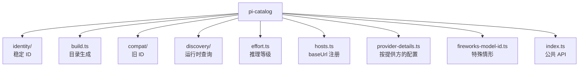

# 04 · pi-catalog 模型身份管理

`@oh-my-pi/pi-catalog` 是**集中式模型元数据注册中心**。它持有模型目录、能力标志、身份（稳定 ID 与展示名）、努力等级、兼容层（旧模型 ID）以及发现机制（对提供方的实时查询）。

**源码：** `packages/catalog/src/`（10+ 文件：build、compat/、discovery/、effort、identity/、hosts 等）

## 为什么要做成独立包

在 pi-mono 中，模型元数据放在 `pi-ai/src/models.generated.ts`（17,159 行，自动生成）。对于 oh-my-pi 的 40+ 提供方 × 数千个模型，这会膨胀到 10 万行以上。团队把它拆出来做成 `pi-catalog`，原因如下：

1. 目录可以在**运行时被查询**（而不仅仅是编译进去）
2. 目录可以在**不重新构建 `pi-ai`** 的情况下更新
3. 目录可以**被扩展**（扩展可以加入自定义提供方）
4. 目录可以**独立版本化**

## 4 个子模块



## 6 个模型字段

目录中每个模型都有 6 个字段：

```ts
export interface Model {
  // 1. 身份
  id: string;          // 稳定 ID，例如 "claude-opus-4-5"
  name: string;        // 展示名，例如 "Claude Opus 4.5"
  family: string;      // 例如 "claude-4"
  provider: string;    // 例如 "anthropic"
  api: Api;            // 例如 "anthropic-messages"
  baseUrl?: string;    // 覆盖默认地址

  // 2. 能力标志
  capability: ModelCapability;

  // 3. 限制
  contextWindow: number;
  maxOutputTokens: number;

  // 4. 成本
  cost: ModelCost;

  // 5. 推理
  effortLevels?: EffortLevel[];

  // 6. 弃用
  deprecated?: {
    since: string;            // ISO 日期
    replacement?: string;     // 新模型 id
    sunset?: string;          // ISO 日期
  };
}
```

这 6 个字段分别回答：

- **我是谁？** — `id`、`name`、`family`、`provider`、`api`
- **我能做什么？** — `capability`
- **我能容纳多少？** — `contextWindow`、`maxOutputTokens`
- **我要花多少钱？** — `cost`
- **我应该多努力思考？** — `effortLevels`
- **我是不是要退役了？** — `deprecated`

## 24 个能力标志

```ts
export interface ModelCapability {
  // 第 1 层：模态
  text: boolean;
  imageInput: boolean;
  imageOutput: boolean;
  audioInput: boolean;
  audioOutput: boolean;
  videoInput: boolean;
  videoOutput: boolean;

  // 第 2 层：Agent 特性
  toolUse: boolean;
  streaming: boolean;
  jsonMode: boolean;
  systemPrompt: boolean;

  // 第 3 层：推理
  reasoning: boolean;
  thinking: { type: "enabled" | "adaptive"; budgetTokens: boolean };
  effortLevels: EffortLevel[];

  // 第 4 层：缓存
  promptCaching: boolean;
  cacheRead: boolean;
  cacheWrite: boolean;

  // 第 5 层：搜索 / 检索
  webSearch: boolean;
  citations: boolean;
  grounding: boolean;

  // 第 6 层：限制（数据）
  contextWindow: number;
  maxOutputTokens: number;
}
```

Agent 读取这些标志来：

- 过滤工具（若 `!imageInput` 则屏蔽 `read_image`）
- 决定是否开启 thinking
- 选择合适的压缩策略
- 设置正确的 `tool_choice` 值
- 在支持时启用 prompt caching

## identity 模块

`packages/catalog/src/identity/` 为每个模型定义**稳定的符号化 ID**：

```ts
// packages/catalog/src/identity/index.ts
export const MODEL_ID = {
  CLAUDE_OPUS_4_5: "claude-opus-4-5",
  CLAUDE_SONNET_4: "claude-sonnet-4",
  CLAUDE_HAIKU_4: "claude-haiku-4",
  GPT_4O: "gpt-4o",
  GPT_4O_MINI: "gpt-4o-mini",
  O3: "o3",
  O3_MINI: "o3-mini",
  GEMINI_2_PRO: "gemini-2.0-pro",
  GEMINI_2_FLASH: "gemini-2.0-flash",
  MISTRAL_LARGE_2: "mistral-large-2",
  DEEPSEEK_R1: "deepseek-r1",
  GROQ_LLAMA_70B: "groq-llama-70b",
  // ... 100+ 别名
} as const;

export type ModelId = typeof MODEL_ID[keyof typeof MODEL_ID];
```

用户可以在设置中既使用稳定 ID 也使用友好别名：

```json
{
  "model": "CLAUDE_OPUS_4_5"        // 稳定 ID
}
```
```json
{
  "model": "opus"                    // 别名
}
```

别名会在会话开始时通过 `identity/resolve.ts` 解析。如果别名有歧义（例如 "sonnet" 既可能是 3.5 也可能是 4），就会向用户询问。

## build 模块

`packages/catalog/src/build.ts` 从上游来源生成目录：

```bash
bun run catalog:build
```

构建会从以下来源拉取：

1. **Anthropic** — `https://api.anthropic.com/v1/models`（实时）
2. **OpenAI** — `https://api.openai.com/v1/models`（实时）
3. **Google** — `https://generativelanguage.googleapis.com/v1/models`（实时）
4. **静态 YAML** — `packages/catalog/src/catalog/static/*.yaml`（用于自托管提供方）

生成的目录会被提交到 `packages/catalog/src/catalog.generated.ts`。和 pi-mono 一样，**永远不要手动编辑** —— 构建是幂等的。

```ts
// packages/catalog/src/catalog.generated.ts (节选)
export const MODELS: Model[] = [
  {
    id: "claude-opus-4-5",
    name: "Claude Opus 4.5",
    family: "claude-4",
    provider: "anthropic",
    api: "anthropic-messages",
    capability: { ... },
    contextWindow: 200000,
    maxOutputTokens: 32000,
    cost: { input: 15, output: 75, cacheRead: 1.5, cacheWrite: 18.75 },
    effortLevels: ["low", "medium", "high", "max"]
  },
  // ... 5000+ 更多
];
```

静态 YAML 文件是给那些没有暴露 `/models` 端点的提供方（Ollama、vLLM、自定义等）使用的。

## compat 模块

`packages/catalog/src/compat/` 处理**旧模型 ID**：

```ts
// packages/catalog/src/compat/index.ts
export const MODEL_COMPAT: Record<string, ModelId> = {
  // Anthropic
  "claude-3-opus-20240229": MODEL_ID.CLAUDE_OPUS_4_5,
  "claude-3-5-sonnet-20240620": MODEL_ID.CLAUDE_SONNET_4,
  "claude-3-haiku-20240307": MODEL_ID.CLAUDE_HAIKU_4,

  // OpenAI
  "gpt-4-turbo-preview": "gpt-4-turbo",
  "gpt-4-32k": "gpt-4",
  "gpt-3.5-turbo-16k": "gpt-3.5-turbo",

  // Google
  "gemini-1.5-pro-latest": MODEL_ID.GEMINI_2_PRO,
  "gemini-1.5-flash-latest": MODEL_ID.GEMINI_2_FLASH,
  "gemini-pro": MODEL_ID.GEMINI_2_PRO,

  // Mistral
  "mistral-large-latest": MODEL_ID.MISTRAL_LARGE_2,

  // ... 200+ 条记录
};

export function resolve(modelId: string): ModelId {
  if (MODEL_COMPAT[modelId]) {
    const newId = MODEL_COMPAT[modelId];
    console.warn(`Model ${modelId} is deprecated. Use ${newId} instead.`);
    return newId;
  }
  return modelId as ModelId;
}
```

当用户设置 `"model": "claude-3-opus-20240229"` 时，compat 层会把它映射到 `CLAUDE_OPUS_4_5` 并发出警告。用户的设置文件**不会**被自动更新 —— 必须由用户自己修复（这样他们能决定何时升级）。

## discovery 模块

`packages/catalog/src/discovery/` 是**运行时模型查询**层：

```ts
// packages/catalog/src/discovery/builtin.ts
export function getBuiltinModels(): Model[];

// packages/catalog/src/discovery/runtime.ts
export async function getRuntimeModels(provider: string, credential: AuthCredential): Promise<Model[]>;

// packages/catalog/src/discovery/refresh.ts
export async function refreshAll(): Promise<void>;

// packages/catalog/src/discovery/merge.ts
export function mergeModels(builtin: Model[], runtime: Model[]): Model[];
```

整体流程：

1. 从 `catalog.generated.ts` 加载 `MODELS`（内建）
2. 在会话开始时，查询每个提供方的 `/v1/models` 端点
3. 合并：内建提供 cost + capability，运行时提供可用性
4. 合并后的列表缓存 1 小时
5. 每 6 小时后台刷新一次

这就是 oh-my-pi 在目录重新构建之前就能知道 "Claude 4.5 Opus 已经可用" 的方式。

## effort 模块

`packages/catalog/src/effort.ts` 把**推理努力等级**映射到各提供方特有的字段：

```ts
// packages/catalog/src/effort.ts
export type EffortLevel = "low" | "medium" | "high" | "max";

export interface EffortMapping {
  anthropic: { thinking: { type: "enabled"; budgetTokens: number } };
  openai: { reasoning: { effort: EffortLevel } };
  google: { thinkingConfig: { thinkingBudget: number; includeThoughts: boolean } };
  ollama: { think: boolean };
  // ...
}

export function mapEffort(model: Model, level: EffortLevel): EffortMapping;
```

CLI 参数 `--smol` 映射到 `low`，`--slow` 映射到 `high`，`--plan` 映射到 `medium`。TUI 会为每个模型展示一个有效努力等级的下拉框。

## hosts 模块

`packages/catalog/src/hosts.ts` 是 **baseUrl 注册表**：

```ts
export const PROVIDER_HOSTS: Record<ProviderId, string> = {
  anthropic: "https://api.anthropic.com",
  openai: "https://api.openai.com",
  google: "https://generativelanguage.googleapis.com",
  // ... 40+ 条记录
};

export function getProviderHost(provider: ProviderId): string;
export function setProviderHost(provider: ProviderId, host: string): void;
```

用户可以在 `~/.omp/settings.json` 中覆盖：

```json
{
  "providers": {
    "openai": {
      "host": "https://my-proxy.example.com/openai"
    }
  }
}
```

覆盖值会被持久化到用户配置目录下的 `provider-hosts.json` 中。

## provider-details 模块

`packages/catalog/src/provider-details.ts` 是**按提供方的配置**：

```ts
export interface ProviderDetails {
  id: ProviderId;
  name: string;                    // 展示名
  homepage: string;
  apiKeyUrl: string;               // 在哪里获取 key
  apiKeyEnvVar: string;            // 环境变量名
  authMethods: AuthMethod[];       // apiKey、oauth、serviceAccount
  oauthProviders?: OAuthProvider[];
  defaultModel: ModelId;
  defaultEffort: EffortLevel;
  regions?: string[];              // 用于 Vertex、Bedrock
  notes?: string;
}

export const PROVIDER_DETAILS: Record<ProviderId, ProviderDetails> = {
  anthropic: {
    id: "anthropic",
    name: "Anthropic",
    homepage: "https://anthropic.com",
    apiKeyUrl: "https://console.anthropic.com/settings/keys",
    apiKeyEnvVar: "ANTHROPIC_API_KEY",
    authMethods: ["apiKey"],
    defaultModel: "claude-sonnet-4",
    defaultEffort: "medium"
  },
  // ... 40+ 条记录
};
```

TUI 中的 `/provider` 向导会用它来一步步引导用户完成设置。

## fireworks-model-id 模块

针对 Fireworks 模型 ID 格式的一个小特例：

```ts
// Fireworks 使用 path 风格 ID
export const FIREWORKS_ALIASES: Record<string, string> = {
  "llama-70b": "accounts/fireworks/models/llama-v3p1-70b-instruct",
  "qwen-72b": "accounts/fireworks/models/qwen2-vl-72b-instruct",
  "mixtral-8x7b": "accounts/fireworks/models/mixtral-8x7b-instruct",
  // ...
};
```

用户输入 `llama-70b`，oh-my-pi 就会把 path 风格的 ID 发送给 API。

## 公共 API

```ts
// packages/catalog/src/index.ts
export * from "./identity/index.js";
export * from "./build.js";
export * from "./compat/index.js";
export * from "./discovery/index.js";
export * from "./effort.js";
export * from "./hosts.js";
export * from "./provider-details.js";
export * from "./fireworks-model-id.js";

// 便捷方法
export function getModel(id: ModelId): Model;
export function listModels(filter?: { provider?: string; capability?: keyof ModelCapability }): Model[];
export function resolveModel(id: string): Model;
export function pickDefaultModel(): Model;
```

## pi-catalog 中不包含什么

目录中不包含：

- **API 请求/响应结构** — 这些在 `pi-ai` 中
- **工具定义** — 这些在 `pi-coding-agent/core/tools/`
- **系统提示词** — 这些在 `pi-coding-agent` 与扩展中
- **法币定价** — 只有 token 成本；用户需要乘以自己的单价

## 为什么这件事重要

目录是 LLM 世界与 oh-my-pi 之间的**稳定契约**。当 Anthropic 给模型改名，当 OpenAI 增加新能力，当新提供方上线 —— 目录是**唯一**需要变更的地方。Agent、TUI、CLI、Web 都消费目录，不需要知道模型的具体细节。

这就是为什么 oh-my-pi 能在 Agent 代码不按比例增长的情况下发布 **42 个提供方**。Agent 代码只关心 `Model`、`Context` 与 `streamSimple()`。其他一切都是目录数据。

## 接下来

- [pi-ai · 40+ 提供方](/docs/02-pi-ai) — 目录的消费者
- [pi-coding-agent · CLI](/docs/05-pi-coding-agent) — 用户侧界面
- [Multi-Provider](/docs/02-pi-ai) — 提供方如何接入 pi-ai
