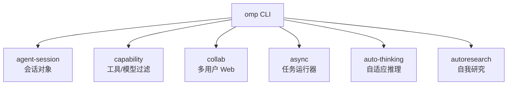
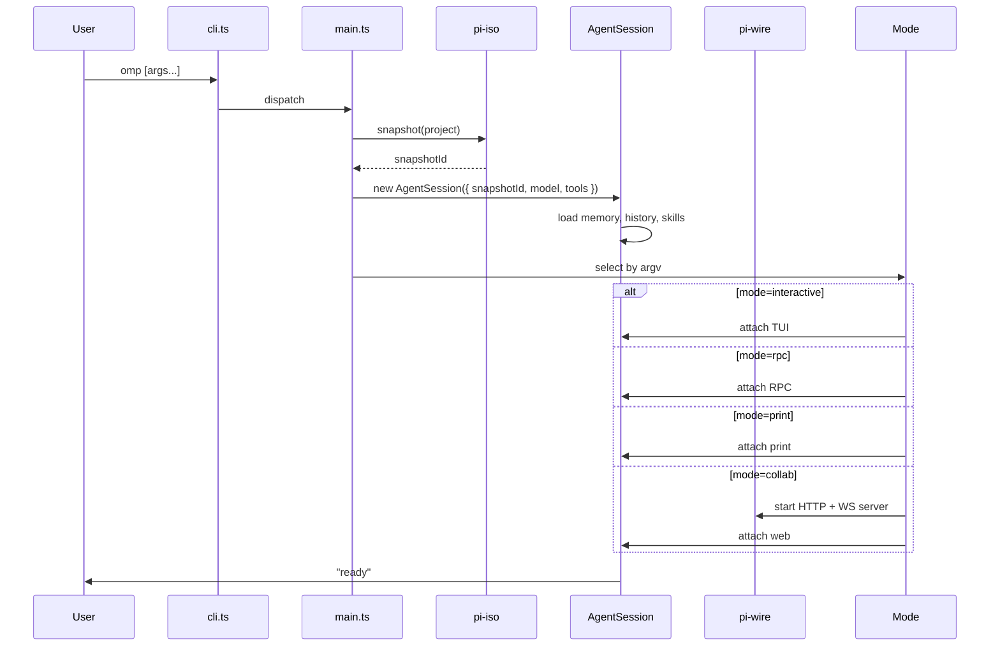

# 05 · pi-coding-agent `omp` 命令行

`@oh-my-pi/pi-coding-agent` 是面向用户的二进制 —— 在 npm、Homebrew 以及安装脚本中都以 `omp` 形式发布。它打包了 Agent 运行时、TUI、32 个内建工具（包括 LSP/DAP/hashline/snapcompact）、4 种模式、扩展系统以及会话管理器。

**源码：** `packages/coding-agent/src/`（80+ 源文件，32 个工具，4 种模式，6 个子系统）

## 6 个子系统



| 子系统 | 作用 |
|-----------|--------------|
| `agent-session/` | 会话对象（模型 + 工具 + 消息 + 状态） |
| `capability/` | 根据能力标志过滤工具/模型 |
| `collab/` | 多用户 Web 协作模式（HTTP + WS 服务） |
| `async/` | 异步执行任务（后台研究等） |
| `auto-thinking/` | 自适应推理 —— 根据任务复杂度开关 thinking |
| `autoresearch/` | 自我研究 —— Agent 读取自己的代码库来寻找上下文 |

## 4 种模式

| 模式 | 触发 | 入站 | 出站 |
|------|---------|---------|----------|
| **Interactive** | TTY + 提示词 | 用户在 TUI 中输入 | TUI 渲染 |
| **RPC** | `--rpc` | 通过 stdio 的 JSON-RPC | 通过 stdout 的 JSON-RPC 事件 |
| **Print** | `--print` | stdin/argv（一条消息） | 纯文本回复 |
| **Collab** | `--collab` | WebSocket（protobuf） | HTTP + WS 服务 |

第 4 种模式是**新加的** —— `--collab` 会启动一个本地 HTTP 服务 + WebSocket，由 `collab-web` 连接。多个用户可以同时附加到同一个会话。

## 启动流程



**快照**在启动时（通过 `pi-iso`）就拍好，这样 Agent 就可以在退出时**被回退**。参见 [snapcompact](/docs/10-snapcompact)。

## 32 个内建工具

按类别组织：

| 类别 | 数量 | 工具 |
|----------|-------|-------|
| **File I/O** | 5 | `read`、`write`、`edit`、`glob`、`grep` |
| **Shell** | 2 | `bash`、`process` |
| **Edit (Rust)** | 3 | `hashline`、`hashline_replace`、`hashline_insert` |
| **Snapshot** | 2 | `snap`、`restore` |
| **LSP** | 14 | `lsp_hover`、`lsp_definition`、`lsp_references`、`lsp_completion`、`lsp_signature`、`lsp_codeAction`、`lsp_rename`、`lsp_format`、`lsp_rangeFormat`、`lsp_prepareRename`、`lsp_documentSymbol`、`lsp_semanticTokens`、`lsp_inlayHint`、`lsp_diagnostic` |
| **DAP** | 28 | `dap_launch`、`dap_attach`、`dap_setBreakpoints`、`dap_continue`、`dap_next`、`dap_stepIn`、`dap_stepOut`、`dap_pause`、`dap_threads`、`dap_stackTrace`、`dap_scopes`、`dap_variables`、`dap_evaluate`、`dap_watch`、`dap_setVariable`、`dap_source`、`dap_exceptionInfo`、`dap_loadedSources`、`dap_disconnect`、`dap_terminate`、`dap_restart`、`dap_configurationDone`、`dap_runInTerminal`、`dap_startDebugging`、`dap_reverseContinue`、`dap_stepBack`、`dap_goto`、`dap_completions` |
| **Search** | 2 | `web_search`、`fetch_url` |
| **Memory** | 3 | `memory_read`、`memory_write`、`memory_list` |
| **Meta** | 3 | `todo_write`、`skill`、`mode_switch` |

这总共是 **62 个工具名**，但其中一些是同一个概念性工具的**子命令**（例如所有 `dap_*` 都属于 `dap` 工具）。团队按 **32 个独立工具** 计数。

与 pi-mono 相比新增的 5 个：

- **`hashline` 家族** — 基于 line:hash 的编辑（Rust 加速）
- **`snap` / `restore`** — 文件系统快照（通过 `pi-iso`）
- **`lsp_*` 家族** — Language Server Protocol（14 个操作）
- **`dap_*` 家族** — Debug Adapter Protocol（28 个操作）
- **`autoresearch`** — 自我研究工具（见下文）

## `autoresearch` 工具

oh-my-pi 独有的新工具。Agent 可以向自己的代码库询问上下文：

```ts
const autoresearchTool: AgentTool = {
  name: "autoresearch",
  description: "Search this agent's own codebase (the omp binary) for context on how to do something. Use this when you don't know how a feature is implemented.",
  inputSchema: Type.Object({
    query: Type.String(),
    maxResults: Type.Optional(Type.Number())
  }),
  async execute(args, ctx) {
    // 1. 嵌入查询
    const queryEmbedding = await ctx.embeddings.embed(args.query);

    // 2. 在 omp 代码库中搜索（已预嵌入）
    const results = await ctx.codebaseIndex.search(queryEmbedding, args.maxResults);

    // 3. 返回相关代码片段
    return {
      content: results.map(r => ({
        type: "text",
        text: `## ${r.file}:${r.startLine}-${r.endLine}\n\n${r.content}`
      }))
    };
  }
};
```

omp 代码库在构建时**已被预嵌入**（通过 `bun run embed-codebase`）。嵌入向量存放在 `dist/codebase-embeddings.bin`。Agent 可以问 "hashline 工具是怎么工作的？" 并得到一段相关代码。

## capability 子系统

`packages/coding-agent/src/capability/` 是**工具/模型过滤器**：

```ts
// packages/coding-agent/src/capability/index.ts
export function filterToolsForModel(tools: AgentTool[], model: Model): AgentTool[];
export function filterModelsForTask(models: Model[], task: Task): Model[];
```

过滤器读取模型的 `capability` 标志，并移除模型无法使用的工具。它还会按任务匹配度（最便宜的能用的、最快的能用的等）对模型排序。

## async 子系统

`packages/coding-agent/src/async/` 是**后台任务运行器**：

```ts
// 在后台运行一个任务，返回句柄
const handle = await agentSession.asyncRun({
  prompt: "Research the best practices for X and write a summary to /tmp/x.md",
  model: cheaperModel,
  tools: [readTool, writeTool, webSearchTool]
});

// 查看状态
const status = await agentSession.asyncStatus(handle);
if (status === "completed") {
  const result = await agentSession.asyncResult(handle);
}
```

异步任务适用于：

- 用户处理主任务时的后台研究
- 周期性清理（例如每 30 分钟清理一次会话存储）
- 对超长对话进行预防性摘要

异步任务运行在**独立**的 Agent 实例上，使用不同的模型（默认：便宜的）和受限的工具集。

## auto-thinking 子系统

`packages/coding-agent/src/auto-thinking/` 是**自适应推理**：

```ts
// 在会话中
{
  autoThinking: {
    enabled: true,
    strategy: "task-aware",     // "always-on" | "task-aware" | "off"
    thresholds: {
      simple: 0,                  // 简单任务：不思考
      medium: 1,                  // 中等任务：低努力
      complex: 3,                 // 复杂任务：高努力
    }
  }
}
```

任务复杂度由模型自身（或单独的 "classifier" 模型）来估计：

- **简单**（"法国的首都是什么？"）→ 不思考
- **中等**（"重构这个函数"）→ 低努力
- **复杂**（"设计一套新的鉴权系统"）→ 高努力

策略可按会话、按任务进行配置。

## 4 个子系统 vs pi-mono

oh-my-pi 有 **6** 个子系统，pi-mono 有 **3** 个（原版的 `core/`、`cli/`、`modes/`）。新增的 3 个：

- **`capability/`** — 按能力过滤工具/模型（新增）
- **`collab/`** — 多用户 Web 协作（新增）
- **`autoresearch/`** — 自我研究工具（新增）
- **`auto-thinking/`** — 自适应推理（新增）
- **`async/`** — 后台任务（新增）

加上原有的 `core/`、`cli/`、`modes/`。

## 扩展加载器（已扩展）

和 pi-mono 的扩展加载器一样，但工作区中多了 **2 个**官方扩展：

- **`swarm-extension`** — 子 Agent 生成
- **`collab-web`** — React 19 协作界面（内建，但作为扩展加载以保持模块化）

```ts
// packages/coding-agent/src/extensions/loader.ts
const EXTENSIONS = [
  swarmExtension,     // 新增
  collabWebExtension, // 新增
  // ... 用户安装的扩展
];
```

## 设置

`packages/coding-agent/src/config/defaults.ts`：

```ts
export const DEFAULTS = {
  provider: "anthropic",
  model: "claude-sonnet-4",
  toolExecutionMode: "parallel",       // 由 pi-mono 的 "sequential" 改变
  queueMode: "one-at-a-time",
  thinkingLevel: "medium",             // 由 "off" 改变
  autoThinking: { enabled: true, strategy: "task-aware" },
  compaction: { strategy: "append", thresholdFraction: 0.8 },
  snapshot: { enabled: true, on: ["session_start", "before_dangerous_tool"] },
  telemetry: { enabled: true, exporter: "otlp", endpoint: "http://localhost:4318" },
  theme: "auto",
  keybindings: {}
};
```

默认值是**有倾向性的** —— 并行工具执行、中等 thinking、追加式压缩、开启快照、开启遥测。

## CLI 参数

团队使用 `commander` 12.x 进行 argv 解析。参数如下：

```bash
omp [options] [prompt]

Options:
  -m, --model <id>           使用的模型（别名或稳定 ID）
  -p, --provider <name>      覆盖提供方
  -h, --host <url>           覆盖提供方 host
  --smol                     努力等级：低
  --slow                     努力等级：高
  --plan                     努力等级：中
  --no-thinking              关闭 thinking
  --no-snapshot              关闭文件系统快照
  --no-telemetry             关闭 OTel 导出
  --rpc                      RPC 模式
  --print                    Print 模式
  --collab [port]            Collab Web 模式（默认端口：31415）
  --resume <sessionId>       恢复一个会话
  --list-models              列出可用模型
  --list-sessions            列出历史会话
  --version                  输出版本号
  --help                     显示帮助
```

TUI 也支持同样的参数作为一次性配置（`omp --smol "refactor this"`）。

## 会话管理器

`packages/coding-agent/src/core/session-manager.ts` 管理会话生命周期：

```ts
export class SessionManager {
  async create(opts: SessionCreateOptions): Promise<Session>;
  async resume(sessionId: string): Promise<Session>;
  async list(filter?: SessionFilter): Promise<SessionInfo[]>;
  async export(sessionId: string, format: "json" | "html" | "md"): Promise<string>;
  async delete(sessionId: string): Promise<void>;
  async branch(sessionId: string, fromTurn: number): Promise<Session>;
  async merge(sessionId1: string, sessionId2: string): Promise<Session>;
}
```

相比 pi-mono 新增的方法：

- **`branch`** — 在指定回合处分裂一个会话（用于 "what if?" 探索）
- **`merge`** — 合并两个会话（用于 swarm 结果）
- **`export`** — 转换为 HTML/Markdown/JSON 以便分享

## snapcompact 集成

会话管理器与 `snapcompact` 相连：

```ts
import { snapcompact } from "@oh-my-pi/snapcompact";

const session = await snapcompact.open({
  snapshotId: isoSnapshot,
  sessionId: uuidv7(),
  model: claudeOpusModel,
  tools: filteredTools
});

// 每回合结束，会话会自动快照
session.on("turn_end", async () => {
  await snapcompact.checkpoint(session);
});
```

参见 [snapcompact](/docs/10-snapcompact) 了解持久化层。

## 随包发布的 26 篇文档

`packages/coding-agent/docs/` 包含：

- `quickstart.md`、`usage.md`、`install.md` — 上手
- `providers.md`、`models.md`、`effort.md` — 提供方配置
- `lsp.md`、`dap.md` — IDE 集成
- `hashline.md` — line:hash 编辑
- `snapcompact.md` — 持久化
- `autoresearch.md` — 自我研究
- `collab.md` — 多用户 Web
- `swarm.md` — 子 Agent
- `keybindings.md`、`themes.md`、`terminal-setup.md` — UI
- `security.md`、`containerization.md` — 沙箱
- `rpc.md`、`wire.md` — 嵌入
- `extensions.md`、`skills.md` — 可扩展性
- `release-notes.md`、`changelog.md`、`migrating.md` — 元信息

## 本包不包含的内容

- **LSP/DAP 协议细节** — 见 [LSP](/docs/06-lsp) 与 [DAP](/docs/07-dap)
- **hashline 算法** — 见 [hashline](/docs/08-hashline)
- **4 个 Rust crate** — 见 [Rust Core](/docs/01-rust-core)
- **TUI** — 见 [pi-tui](/docs/13-pi-tui)
- **Web UI** — 见 [collab-web](/docs/14-collab-web)

## 接下来

- [32 个内建工具](/docs/09-tools) — 32 个工具的详细介绍
- [LSP](/docs/06-lsp) — 14 个 LSP 操作
- [DAP](/docs/07-dap) — 28 个 DAP 操作
- [Deployment](/docs/17-deployment) — 安装 `omp`
