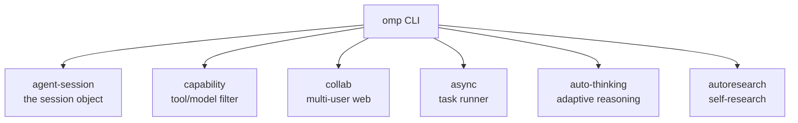
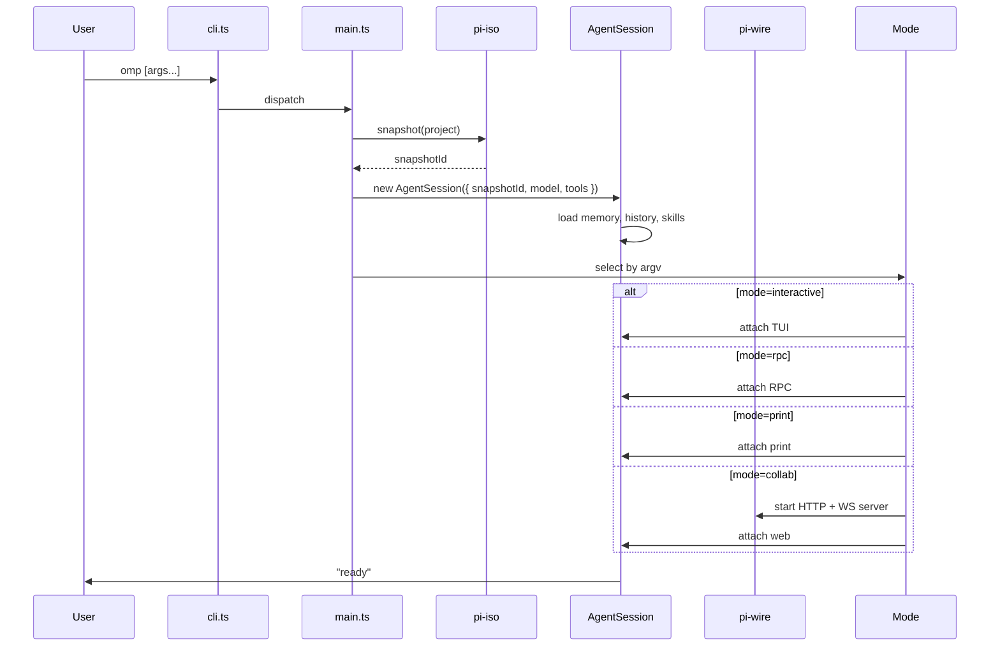

# 05 · pi-coding-agent — The `omp` CLI

`@oh-my-pi/pi-coding-agent` is the user-facing binary — what gets shipped as `omp` on npm, Homebrew, and the install script. It bundles the agent runtime, the TUI, the 32 built-in tools (including LSP/DAP/hashline/snapcompact), the 4 modes, the extensions system, and the session manager.

**Source:** `packages/coding-agent/src/` (80+ source files, 32 tools, 4 modes, 6 sub-systems)

## The 6 sub-systems



| Sub-system | What it does |
|-----------|--------------|
| `agent-session/` | The session object (model + tools + messages + state) |
| `capability/` | Filter tools/models by capability flags |
| `collab/` | Multi-user web collab mode (HTTP + WS server) |
| `async/` | Run tasks asynchronously (background research, etc.) |
| `auto-thinking/` | Adaptive reasoning — turn thinking on/off based on task complexity |
| `autoresearch/` | Self-research — agent reads its own codebase to find context |

## The 4 modes

| Mode | Trigger | Inbound | Outbound |
|------|---------|---------|----------|
| **Interactive** | TTY + prompt | User types in TUI | TUI renders |
| **RPC** | `--rpc` | JSON-RPC over stdio | JSON-RPC events over stdout |
| **Print** | `--print` | Stdin/argv (one message) | Plain text reply |
| **Collab** | `--collab` | WebSocket (protobuf) | HTTP + WS server |

The 4th mode is **new** — `--collab` starts a local HTTP server + WebSocket that `collab-web` connects to. Multiple users can attach to the same session.

## Boot sequence



The **snapshot** is taken at the start (via `pi-iso`) so the agent can be **reversed** on exit. See [snapcompact](/docs/10-snapcompact).

## The 32 built-in tools

Organized by category:

| Category | Count | Tools |
|----------|-------|-------|
| **File I/O** | 5 | `read`, `write`, `edit`, `glob`, `grep` |
| **Shell** | 2 | `bash`, `process` |
| **Edit (Rust)** | 3 | `hashline`, `hashline_replace`, `hashline_insert` |
| **Snapshot** | 2 | `snap`, `restore` |
| **LSP** | 14 | `lsp_hover`, `lsp_definition`, `lsp_references`, `lsp_completion`, `lsp_signature`, `lsp_codeAction`, `lsp_rename`, `lsp_format`, `lsp_rangeFormat`, `lsp_prepareRename`, `lsp_documentSymbol`, `lsp_semanticTokens`, `lsp_inlayHint`, `lsp_diagnostic` |
| **DAP** | 28 | `dap_launch`, `dap_attach`, `dap_setBreakpoints`, `dap_continue`, `dap_next`, `dap_stepIn`, `dap_stepOut`, `dap_pause`, `dap_threads`, `dap_stackTrace`, `dap_scopes`, `dap_variables`, `dap_evaluate`, `dap_watch`, `dap_setVariable`, `dap_source`, `dap_exceptionInfo`, `dap_loadedSources`, `dap_disconnect`, `dap_terminate`, `dap_restart`, `dap_configurationDone`, `dap_runInTerminal`, `dap_startDebugging`, `dap_reverseContinue`, `dap_stepBack`, `dap_goto`, `dap_completions` |
| **Search** | 2 | `web_search`, `fetch_url` |
| **Memory** | 3 | `memory_read`, `memory_write`, `memory_list` |
| **Meta** | 3 | `todo_write`, `skill`, `mode_switch` |

That's **62 tool names**, but some are **subcommands** of a single conceptual tool (e.g. all `dap_*` are part of the `dap` tool). The team counts **32 distinct tools**.

The 5 new vs pi-mono:

- **`hashline` family** — line:hash based editing (Rust-accelerated)
- **`snap` / `restore`** — filesystem snapshots (via `pi-iso`)
- **`lsp_*` family** — Language Server Protocol (14 operations)
- **`dap_*` family** — Debug Adapter Protocol (28 operations)
- **`autoresearch`** — self-research tool (see below)

## The `autoresearch` tool

A new tool unique to oh-my-pi. The agent can ask its own codebase for context:

```ts
const autoresearchTool: AgentTool = {
  name: "autoresearch",
  description: "Search this agent's own codebase (the omp binary) for context on how to do something. Use this when you don't know how a feature is implemented.",
  inputSchema: Type.Object({
    query: Type.String(),
    maxResults: Type.Optional(Type.Number())
  }),
  async execute(args, ctx) {
    // 1. Embed the query
    const queryEmbedding = await ctx.embeddings.embed(args.query);
    
    // 2. Search the omp codebase (pre-embedded)
    const results = await ctx.codebaseIndex.search(queryEmbedding, args.maxResults);
    
    // 3. Return the relevant code chunks
    return {
      content: results.map(r => ({
        type: "text",
        text: `## ${r.file}:${r.startLine}-${r.endLine}\n\n${r.content}`
      }))
    };
  }
};
```

The omp codebase is **pre-embedded** at build time (via `bun run embed-codebase`). The embeddings are stored in `dist/codebase-embeddings.bin`. The agent can ask "how does the `hashline` tool work?" and get a relevant code snippet.

## The capability sub-system

`packages/coding-agent/src/capability/` is the **tool/model filter**:

```ts
// packages/coding-agent/src/capability/index.ts
export function filterToolsForModel(tools: AgentTool[], model: Model): AgentTool[];
export function filterModelsForTask(models: Model[], task: Task): Model[];
```

The filter reads the model's `capability` flags and removes tools the model can't use. It also ranks models by task fit (cheapest capable, fastest capable, etc.).

## The async sub-system

`packages/coding-agent/src/async/` is the **background task runner**:

```ts
// Run a task in the background, return a handle
const handle = await agentSession.asyncRun({
  prompt: "Research the best practices for X and write a summary to /tmp/x.md",
  model: cheaperModel,
  tools: [readTool, writeTool, webSearchTool]
});

// Check status
const status = await agentSession.asyncStatus(handle);
if (status === "completed") {
  const result = await agentSession.asyncResult(handle);
}
```

Async tasks are useful for:

- Background research while the user is working on the main task
- Periodic cleanup (e.g. vacuum the session store every 30 minutes)
- Pre-emptive summarization of long conversations

The async tasks run on a **separate** agent instance with a different model (default: a cheap one) and a restricted tool set.

## The auto-thinking sub-system

`packages/coding-agent/src/auto-thinking/` is the **adaptive reasoning**:

```ts
// In the session
{
  autoThinking: {
    enabled: true,
    strategy: "task-aware",     // "always-on" | "task-aware" | "off"
    thresholds: {
      simple: 0,                  // simple tasks: no thinking
      medium: 1,                  // medium tasks: low effort
      complex: 3,                 // complex tasks: high effort
    }
  }
}
```

The complexity is estimated by the model itself (or a separate "classifier" model):

- **Simple** ("what's the capital of France?") → no thinking
- **Medium** ("refactor this function") → low effort
- **Complex** ("design a new auth system") → high effort

The strategy is configurable per session and per task.

## The 4 sub-systems vs pi-mono

oh-my-pi has **6** sub-systems, pi-mono had **3** (the original `core/`, `cli/`, `modes/`). The 3 new ones:

- **`capability/`** — filter tools/models by capability (NEW)
- **`collab/`** — multi-user web collab (NEW)
- **`autoresearch/`** — self-research tool (NEW)
- **`auto-thinking/`** — adaptive reasoning (NEW)
- **`async/`** — background tasks (NEW)

Plus the original `core/`, `cli/`, `modes/`.

## The extension loader (extended)

Same as pi-mono's extension loader, with **2 new** official extensions in the workspace:

- **`swarm-extension`** — sub-agent spawning
- **`collab-web`** — React 19 collaborative UI (built-in, but loaded as extension for modularity)

```ts
// packages/coding-agent/src/extensions/loader.ts
const EXTENSIONS = [
  swarmExtension,     // NEW
  collabWebExtension, // NEW
  // ... user-installed
];
```

## The settings

`packages/coding-agent/src/config/defaults.ts`:

```ts
export const DEFAULTS = {
  provider: "anthropic",
  model: "claude-sonnet-4",
  toolExecutionMode: "parallel",       // changed from pi-mono's "sequential"
  queueMode: "one-at-a-time",
  thinkingLevel: "medium",             // changed from "off"
  autoThinking: { enabled: true, strategy: "task-aware" },
  compaction: { strategy: "append", thresholdFraction: 0.8 },
  snapshot: { enabled: true, on: ["session_start", "before_dangerous_tool"] },
  telemetry: { enabled: true, exporter: "otlp", endpoint: "http://localhost:4318" },
  theme: "auto",
  keybindings: {}
};
```

The defaults are **opinionated** — parallel tool execution, medium thinking, append compaction, snapshots enabled, telemetry on.

## The CLI flags

The team uses `commander` 12.x for argv parsing. Flags:

```bash
omp [options] [prompt]

Options:
  -m, --model <id>           Model to use (alias or stable id)
  -p, --provider <name>      Provider override
  -h, --host <url>           Provider host override
  --smol                     Effort: low
  --slow                     Effort: high
  --plan                     Effort: medium
  --no-thinking              Disable thinking
  --no-snapshot              Disable filesystem snapshot
  --no-telemetry             Disable OTel export
  --rpc                      RPC mode
  --print                    Print mode
  --collab [port]            Collab web mode (default port: 31415)
  --resume <sessionId>       Resume a session
  --list-models              List available models
  --list-sessions            List past sessions
  --version                  Print version
  --help                     Show help
```

The TUI also supports the same flags as one-shot configuration (`omp --smol "refactor this"`).

## The session manager

`packages/coding-agent/src/core/session-manager.ts` manages session lifecycle:

```ts
export class SessionManager {
  async create(opts: SessionCreateOptions): Promise<Session>;
  async resume(sessionId: string): Promise<Session>;
  async list(filter?: SessionFilter): Promise<SessionInfo[]>;
  async export(sessionId: string, format: "json" | "html" | "md"): Promise<string>;
  async delete(sessionId: string): Promise<void>;
  async branch(sessionId: string, fromTurn: number): Promise<Session>;
  async merge(sessionId1: string, sessionId2: string): Promise<Session>;
}
```

New methods vs pi-mono:

- **`branch`** — split a session at a given turn (used for "what if?" exploration)
- **`merge`** — combine two sessions (used for swarm results)
- **`export`** — convert to HTML/Markdown/JSON for sharing

## The snapcompact integration

The session manager is wired to `snapcompact`:

```ts
import { snapcompact } from "@oh-my-pi/snapcompact";

const session = await snapcompact.open({
  snapshotId: isoSnapshot,
  sessionId: uuidv7(),
  model: claudeOpusModel,
  tools: filteredTools
});

// Every turn, the session is automatically snapshotted
session.on("turn_end", async () => {
  await snapcompact.checkpoint(session);
});
```

See [snapcompact](/docs/10-snapcompact) for the persistence layer.

## The 26 docs pages (shipped)

`packages/coding-agent/docs/` ships:

- `quickstart.md`, `usage.md`, `install.md` — getting started
- `providers.md`, `models.md`, `effort.md` — provider config
- `lsp.md`, `dap.md` — IDE integration
- `hashline.md` — line:hash editing
- `snapcompact.md` — persistence
- `autoresearch.md` — self-research
- `collab.md` — multi-user web
- `swarm.md` — sub-agents
- `keybindings.md`, `themes.md`, `terminal-setup.md` — UI
- `security.md`, `containerization.md` — sandboxing
- `rpc.md`, `wire.md` — embedding
- `extensions.md`, `skills.md` — extensibility
- `release-notes.md`, `changelog.md`, `migrating.md` — meta

## What's NOT in this package

- **LSP/DAP protocol details** — those are in [LSP](/docs/06-lsp) and [DAP](/docs/07-dap)
- **hashline algorithm** — in [hashline](/docs/08-hashline)
- **The 4 Rust crates** — in [Rust Core](/docs/01-rust-core)
- **The TUI** — in [pi-tui](/docs/13-pi-tui)
- **The web UI** — in [collab-web](/docs/14-collab-web)

## Next

- [32 Built-in Tools](/docs/09-tools) — the 32 tools in detail
- [LSP](/docs/06-lsp) — the 14 LSP operations
- [DAP](/docs/07-dap) — the 28 DAP operations
- [Deployment](/docs/17-deployment) — installing `omp`
