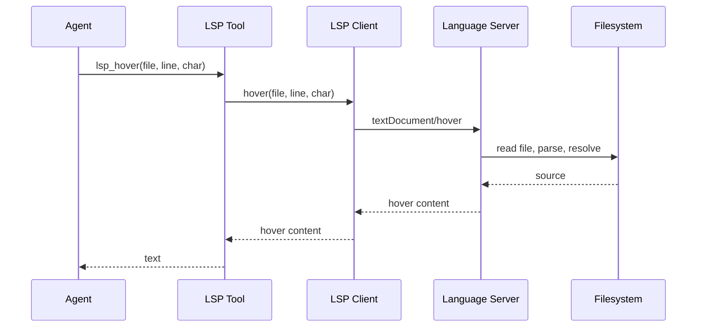
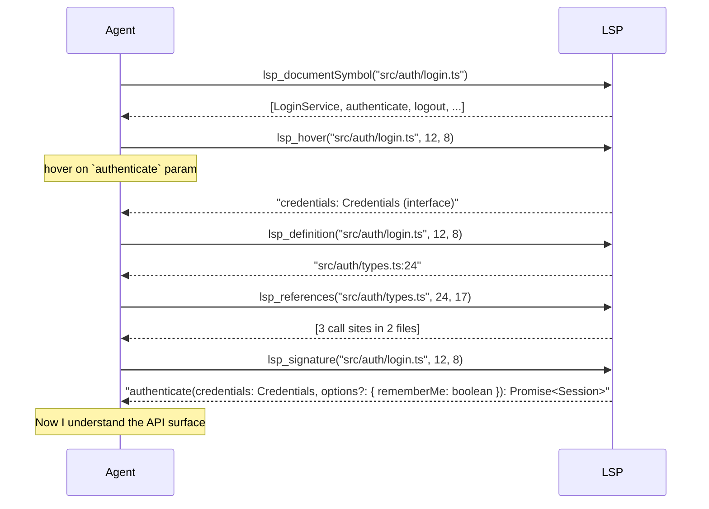
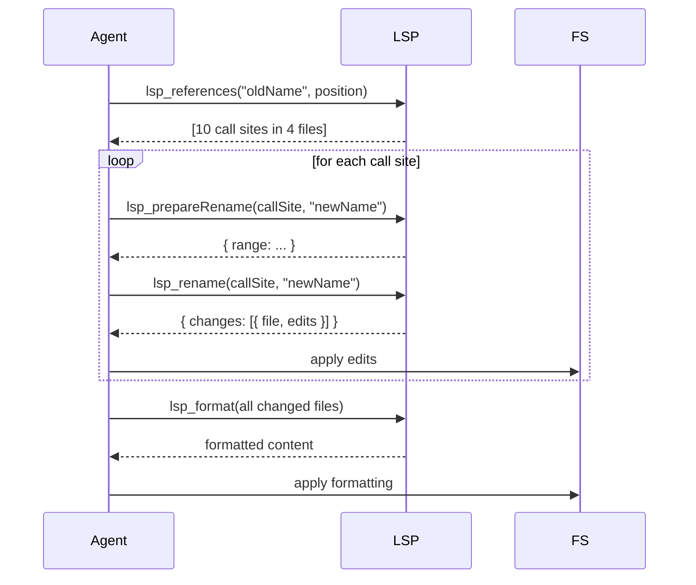
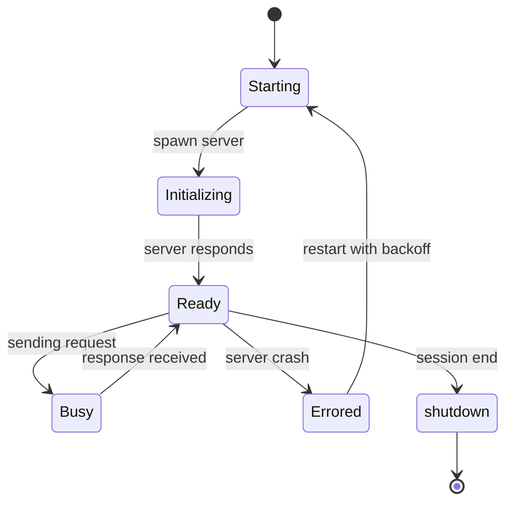

# 06 · LSP — Language Server Protocol · 14 Operations

oh-my-pi is the first agent to ship **first-class Language Server Protocol (LSP) integration**. 14 operations, fully type-safe, exposed as 14 tools. The agent can use the same LSP that powers your editor to understand code at a deep level — type info, references, definitions, symbols, formatting, renaming, code actions, and more.

**Source:** `packages/coding-agent/src/core/tools/lsp/` (14 tools, 1 LSP client, 1 server registry)

## What is LSP

The **Language Server Protocol** is the standard that lets editors (VS Code, Neovim, Emacs, Helix) talk to language-specific backends ("language servers") for IDE features. A language server for TypeScript understands types; one for Rust understands lifetimes; one for Python understands PEP 484.

By using LSP, oh-my-pi gets **the same level of code understanding as your editor** — without reimplementing language-specific parsers, type systems, and formatters.



## The 14 operations

| # | Op | LSP method | What it does |
|---|-----|------------|--------------|
| 1 | `lsp_hover` | `textDocument/hover` | Show type + docs at a position |
| 2 | `lsp_definition` | `textDocument/definition` | Jump to symbol definition |
| 3 | `lsp_references` | `textDocument/references` | Find all uses of a symbol |
| 4 | `lsp_completion` | `textDocument/completion` | Auto-complete at a position |
| 5 | `lsp_signature` | `textDocument/signatureHelp` | Show function signature |
| 6 | `lsp_codeAction` | `textDocument/codeAction` | Quick fixes / refactors |
| 7 | `lsp_rename` | `textDocument/rename` | Rename a symbol across files |
| 8 | `lsp_format` | `textDocument/formatting` | Format whole file |
| 9 | `lsp_rangeFormat` | `textDocument/rangeFormatting` | Format a range |
| 10 | `lsp_prepareRename` | `textDocument/prepareRename` | Check if rename is valid |
| 11 | `lsp_documentSymbol` | `textDocument/documentSymbol` | List all symbols in a file |
| 12 | `lsp_semanticTokens` | `textDocument/semanticTokens` | Syntax highlighting tokens |
| 13 | `lsp_inlayHint` | `textDocument/inlayHint` | Inline type hints |
| 14 | `lsp_diagnostic` | `textDocument/diagnostic` | Pull diagnostics (errors/warnings) |

The agent can call **any** of these 14 as if they were ordinary tools.

## The LSP client

`packages/coding-agent/src/core/tools/lsp/client.ts` is a **pooled** LSP client:

```ts
export class LspClientPool {
  // One client per language, lazily spawned
  async getClient(language: string): Promise<LspClient>;
  
  // Send a request to the right client
  async request<TReq, TRes>(language: string, method: string, params: TReq): Promise<TRes>;
  
  // Hot-reload when a new file is opened
  async didOpen(file: string): Promise<void>;
  
  // Notify on file change
  async didChange(file: string, content: string): Promise<void>;
}

export interface LspClient {
  readonly language: string;
  readonly serverPath: string;
  readonly state: "starting" | "ready" | "error";
  send<TReq, TRes>(method: string, params: TReq): Promise<TRes>;
  notify(method: string, params: unknown): Promise<void>;
  shutdown(): Promise<void>;
}
```

The pool:

1. **Lazy** — spawns a language server only on first request for that language
2. **Pooled** — reuses the same client for all requests to the same language
3. **Stateful** — sends `didOpen` automatically when a file is first requested
4. **Resilient** — restarts the server if it crashes (with backoff)

## Server registry

`packages/coding-agent/src/core/tools/lsp/servers.ts` declares the bundled servers:

```ts
export const LSP_SERVERS: Record<string, LspServerSpec> = {
  typescript: {
    command: "typescript-language-server",
    args: ["--stdio"],
    installHint: "npm install -g typescript-language-server typescript",
    filetypes: [".ts", ".tsx", ".js", ".jsx", ".mjs", ".cjs"],
    rootPatterns: ["tsconfig.json", "package.json"]
  },
  python: {
    command: "pyright-langserver",
    args: ["--stdio"],
    installHint: "pip install pyright",
    filetypes: [".py", ".pyi"],
    rootPatterns: ["pyproject.toml", "setup.py", "requirements.txt"]
  },
  rust: {
    command: "rust-analyzer",
    args: [],
    installHint: "rustup component add rust-analyzer",
    filetypes: [".rs"],
    rootPatterns: ["Cargo.toml"]
  },
  go: {
    command: "gopls",
    args: [],
    installHint: "go install golang.org/x/tools/gopls@latest",
    filetypes: [".go"],
    rootPatterns: ["go.mod"]
  },
  // ... 30+ more
};
```

The pool checks the `command` is on `PATH` and prompts the user with `installHint` if not. The 30+ bundled languages:

| Category | Languages |
|----------|-----------|
| **Web** | TypeScript, JavaScript, HTML, CSS, SCSS, Vue, Svelte |
| **Systems** | C, C++, Rust, Go, Zig |
| **JVM** | Java, Kotlin, Scala, Groovy |
| **Scripting** | Python, Ruby, Perl, PHP, Lua, Bash |
| **Mobile** | Swift, Dart |
| **Functional** | Haskell, OCaml, Elixir, Erlang, Clojure, F# |
| **Data** | JSON, YAML, TOML, XML |
| **Other** | Markdown, SQL, GraphQL, HCL, Dockerfile |

## The 14 tool definitions

Each tool is a thin wrapper around `LspClientPool.request()`. Example:

```ts
// packages/coding-agent/src/core/tools/lsp/hover.ts
import { Type, type Static } from "typebox";

const HoverArgs = Type.Object({
  file: Type.String({ description: "File path (absolute or relative to project root)" }),
  line: Type.Number({ description: "0-indexed line" }),
  character: Type.Number({ description: "0-indexed character" })
});

type HoverArgs = Static<typeof HoverArgs>;

const hoverTool: AgentTool<typeof HoverArgs> = {
  name: "lsp_hover",
  description: "Show the type and documentation for a symbol at a position. Returns Markdown content.",
  inputSchema: HoverArgs,
  requiredCapabilities: [],
  async execute(args, ctx) {
    const language = detectLanguage(args.file);
    if (!language) {
      return { content: [{ type: "text", text: `No LSP server for ${args.file}` }], isError: true };
    }
    
    const result = await ctx.lsp.request(language, "textDocument/hover", {
      textDocument: { uri: pathToUri(args.file) },
      position: { line: args.line, character: args.character }
    });
    
    if (!result) {
      return { content: [{ type: "text", text: "No hover information available" }] };
    }
    
    return {
      content: [{ type: "text", text: result.contents.value || result.contents }],
      details: { range: result.range }
    };
  }
};
```

All 14 tools follow this pattern. The `execute` function is **3-10 lines** — the heavy lifting is in the LSP server.

## How the agent uses LSP

The agent can chain LSP operations to understand code:



The agent uses this to:

- **Read** the API surface before refactoring
- **Find** all call sites of a function before renaming
- **Apply** code actions (e.g. "extract method")
- **Format** the changed code

## LSP-based refactoring workflow

The agent can do a **safe multi-file refactor** using LSP:



The LSP gives the agent **edit ranges and text edits** — the agent just applies them. No regex, no string match. The result is **safe**: if the symbol is referenced in a comment or string, the rename skips it.

## The lifecycle



A client is kept alive for the duration of the session. On session end, `shutdown()` is called (graceful: send `shutdown` request, then `exit` notification, then SIGTERM, then SIGKILL).

## Why LSP and not direct AST

LSP gives the agent **more** than a parser can:

- **Type info** — LSP knows the *type* of every expression (parsers only know the syntax)
- **Cross-file references** — LSP tracks which files reference which symbols
- **Quick fixes** — LSP can suggest refactorings (e.g. "extract method")
- **Format** — LSP knows the project's formatter config
- **Diagnostics** — LSP runs the same linter as your editor

A direct AST (via tree-sitter) only knows **what the code looks like**, not **what it means**. For refactoring, LSP is essential.

## The trade-off

LSP requires:

- A language server to be installed (the user must have it on PATH)
- ~200ms startup time per language (some are slow)
- Memory (~50-200MB per language server)

For projects that don't have an LSP server (e.g. proprietary DSLs), the agent falls back to **AST-based operations** via `pi-ast` (the Rust core). The two complement each other: LSP for standard languages, AST for everything else.

## Configuration

`~/.omp/settings.json`:

```json
{
  "lsp": {
    "enabled": true,
    "autoInstall": true,             // Prompt to install missing servers
    "maxConcurrent": 5,              // Max simultaneous servers
    "timeout": 30000,                // 30s per request
    "disabledLanguages": ["php"],    // Skip these
    "customServers": {
      "my-dsl": {
        "command": "my-dsl-server",
        "args": ["--stdio"],
        "filetypes": [".mydsl"]
      }
    }
  }
}
```

The `customServers` field lets users add their own language servers.

## Performance

LSP responses are typically 5-50ms. The agent can batch multiple LSP requests in parallel (e.g. `lsp_documentSymbol` for 10 files at once) and the pool serializes them per-server.

The lazy-spawn design means **the first request for a language takes ~200ms** (server startup); subsequent requests are ~10ms. The pool keeps the server alive for the session.

## What's NOT supported

- **Multi-root workspaces** — the pool currently supports one project root
- **LSP progress notifications** — sent to logs, not surfaced in the TUI
- **LSP work-done progress** — not implemented yet
- **LSP semantic tokens modifiers** — only the base 14 operations

These are tracked as future work.

## Next

- [DAP](/docs/07-dap) — the debug adapter protocol
- [hashline](/docs/08-hashline) — line:hash editing
- [32 Built-in Tools](/docs/09-tools) — all 32 tools
- [pi-ast](/docs/01-rust-core) — the AST fallback
