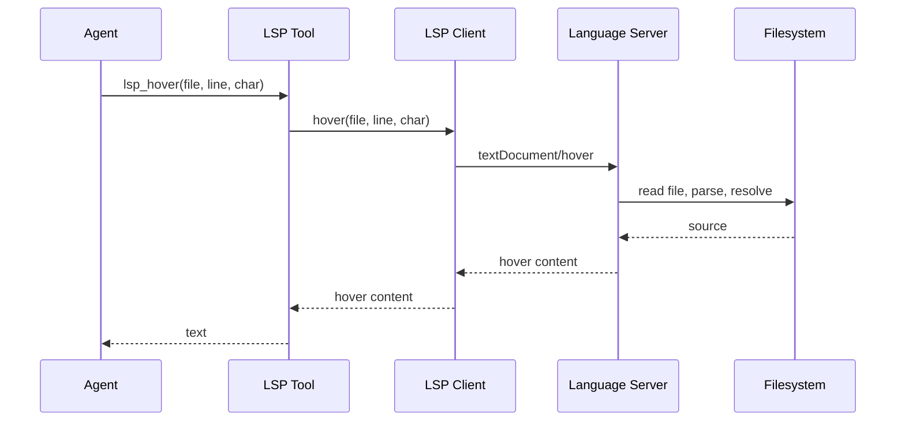
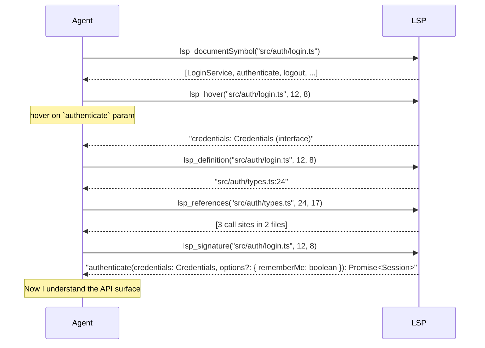
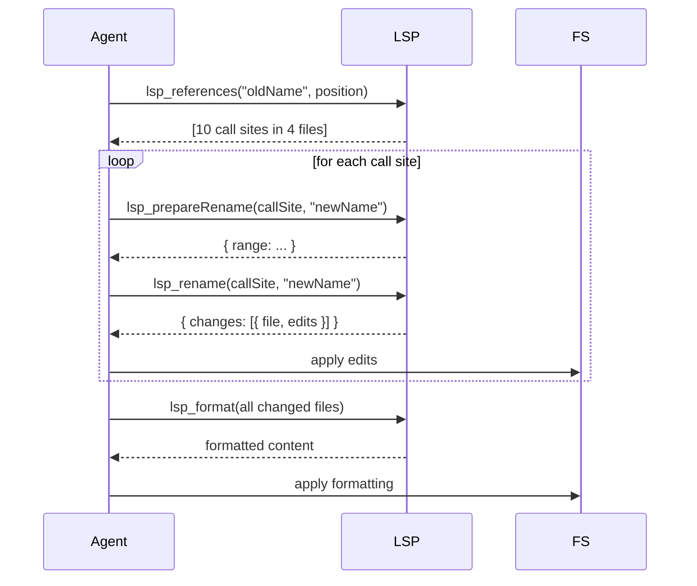
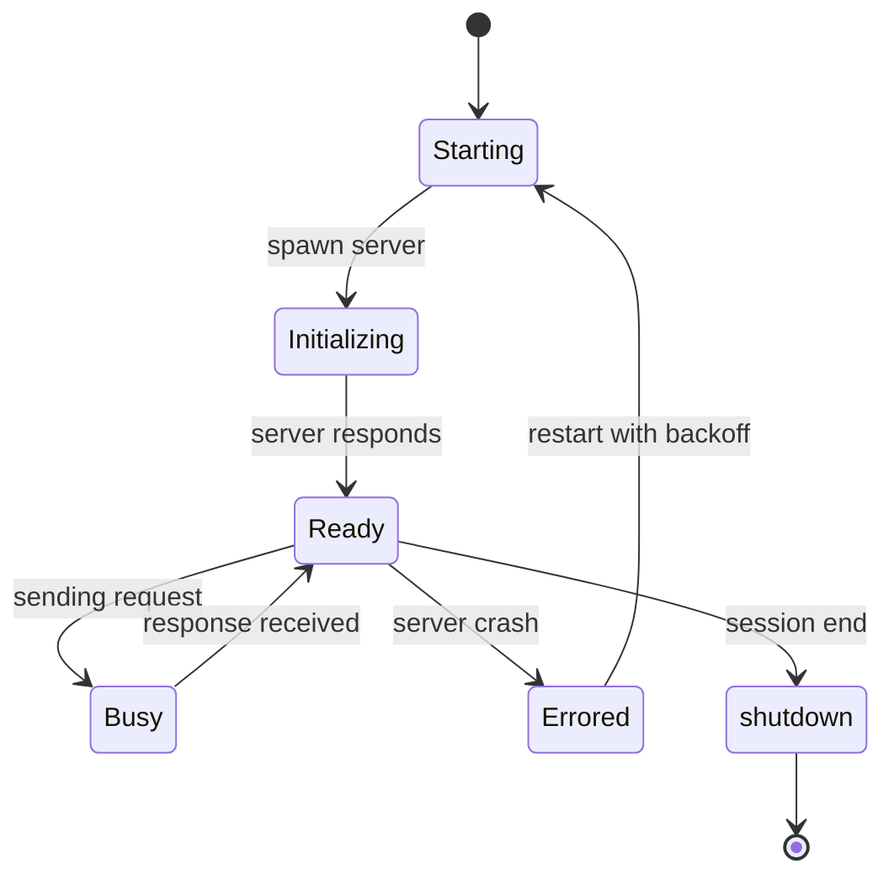

# 06 · LSP 语言服务器协议 14 个操作

oh-my-pi 是首个发布**一级 LSP（Language Server Protocol）集成**的 Agent。14 个操作，全部类型安全，作为 14 个工具暴露。Agent 可以使用与你编辑器相同的 LSP 来深度理解代码 —— 类型信息、引用、定义、符号、格式化、重命名、代码动作等等。

**源码：** `packages/coding-agent/src/core/tools/lsp/`（14 个工具，1 个 LSP 客户端，1 个服务端注册表）

## 什么是 LSP

**Language Server Protocol** 是让编辑器（VS Code、Neovim、Emacs、Helix）与语言特定后端（"language servers"）通信以获得 IDE 能力的一套标准。TypeScript 的 language server 理解类型；Rust 的理解生命周期；Python 的理解 PEP 484。

通过使用 LSP，oh-my-pi 获得了**与你的编辑器同等水平的代码理解** —— 而无需重新实现各语言的解析器、类型系统与格式化器。



## 14 个操作

| # | Op | LSP method | 作用 |
|---|-----|------------|--------------|
| 1 | `lsp_hover` | `textDocument/hover` | 在某位置展示类型 + 文档 |
| 2 | `lsp_definition` | `textDocument/definition` | 跳转到符号定义 |
| 3 | `lsp_references` | `textDocument/references` | 找出符号的所有使用 |
| 4 | `lsp_completion` | `textDocument/completion` | 在某位置自动补全 |
| 5 | `lsp_signature` | `textDocument/signatureHelp` | 展示函数签名 |
| 6 | `lsp_codeAction` | `textDocument/codeAction` | 快速修复 / 重构 |
| 7 | `lsp_rename` | `textDocument/rename` | 跨文件重命名符号 |
| 8 | `lsp_format` | `textDocument/formatting` | 格式化整个文件 |
| 9 | `lsp_rangeFormat` | `textDocument/rangeFormatting` | 格式化一段范围 |
| 10 | `lsp_prepareRename` | `textDocument/prepareRename` | 检查重命名是否合法 |
| 11 | `lsp_documentSymbol` | `textDocument/documentSymbol` | 列出文件中的所有符号 |
| 12 | `lsp_semanticTokens` | `textDocument/semanticTokens` | 语法高亮 token |
| 13 | `lsp_inlayHint` | `textDocument/inlayHint` | 内联类型提示 |
| 14 | `lsp_diagnostic` | `textDocument/diagnostic` | 拉取诊断（错误/警告） |

Agent 可以像调用普通工具一样调用这 **14** 个中的**任意一个**。

## LSP 客户端

`packages/coding-agent/src/core/tools/lsp/client.ts` 是一个**池化**的 LSP 客户端：

```ts
export class LspClientPool {
  // 每种语言一个客户端，按需惰性生成
  async getClient(language: string): Promise<LspClient>;

  // 向对应的客户端发送请求
  async request<TReq, TRes>(language: string, method: string, params: TReq): Promise<TRes>;

  // 新文件打开时热加载
  async didOpen(file: string): Promise<void>;

  // 文件变更时通知
  async didChange(file: string, content: string): Promise<void>;
}

export interface LspClient {
  readonly language: string;
  readonly serverPath: string;
  readonly state: "starting" | "ready" | "error";
  send<TReq, TRes>(method: string, params: TReq): Promise<TRes>;
  notify(method: string, params: unknown): Promise<void>;
  shutdown(): Promise<void>;
}
```

该连接池具有以下特点：

1. **惰性** —— 只在该语言的第一次请求时才生成 language server
2. **池化** —— 对同一语言的所有请求复用同一客户端
3. **有状态** —— 当文件首次被请求时自动发送 `didOpen`
4. **有韧性** —— server 崩溃时按退避策略重启

## server 注册表

`packages/coding-agent/src/core/tools/lsp/servers.ts` 声明了内置的 server：

```ts
export const LSP_SERVERS: Record<string, LspServerSpec> = {
  typescript: {
    command: "typescript-language-server",
    args: ["--stdio"],
    installHint: "npm install -g typescript-language-server typescript",
    filetypes: [".ts", ".tsx", ".js", ".jsx", ".mjs", ".cjs"],
    rootPatterns: ["tsconfig.json", "package.json"]
  },
  python: {
    command: "pyright-langserver",
    args: ["--stdio"],
    installHint: "pip install pyright",
    filetypes: [".py", ".pyi"],
    rootPatterns: ["pyproject.toml", "setup.py", "requirements.txt"]
  },
  rust: {
    command: "rust-analyzer",
    args: [],
    installHint: "rustup component add rust-analyzer",
    filetypes: [".rs"],
    rootPatterns: ["Cargo.toml"]
  },
  go: {
    command: "gopls",
    args: [],
    installHint: "go install golang.org/x/tools/gopls@latest",
    filetypes: [".go"],
    rootPatterns: ["go.mod"]
  },
  // ... 30+ 还可以
};
```

连接池会检查 `command` 是否在 `PATH` 中，若不在则用 `installHint` 提示用户。30+ 内置语言如下：

| 类别 | 语言 |
|----------|-----------|
| **Web** | TypeScript、JavaScript、HTML、CSS、SCSS、Vue、Svelte |
| **Systems** | C、C++、Rust、Go、Zig |
| **JVM** | Java、Kotlin、Scala、Groovy |
| **Scripting** | Python、Ruby、Perl、PHP、Lua、Bash |
| **Mobile** | Swift、Dart |
| **Functional** | Haskell、OCaml、Elixir、Erlang、Clojure、F# |
| **Data** | JSON、YAML、TOML、XML |
| **Other** | Markdown、SQL、GraphQL、HCL、Dockerfile |

## 14 个工具定义

每个工具都是 `LspClientPool.request()` 的薄包装。示例：

```ts
// packages/coding-agent/src/core/tools/lsp/hover.ts
import { Type, type Static } from "typebox";

const HoverArgs = Type.Object({
  file: Type.String({ description: "File path (absolute or relative to project root)" }),
  line: Type.Number({ description: "0-indexed line" }),
  character: Type.Number({ description: "0-indexed character" })
});

type HoverArgs = Static<typeof HoverArgs>;

const hoverTool: AgentTool<typeof HoverArgs> = {
  name: "lsp_hover",
  description: "Show the type and documentation for a symbol at a position. Returns Markdown content.",
  inputSchema: HoverArgs,
  requiredCapabilities: [],
  async execute(args, ctx) {
    const language = detectLanguage(args.file);
    if (!language) {
      return { content: [{ type: "text", text: `No LSP server for ${args.file}` }], isError: true };
    }

    const result = await ctx.lsp.request(language, "textDocument/hover", {
      textDocument: { uri: pathToUri(args.file) },
      position: { line: args.line, character: args.character }
    });

    if (!result) {
      return { content: [{ type: "text", text: "No hover information available" }] };
    }

    return {
      content: [{ type: "text", text: result.contents.value || result.contents }],
      details: { range: result.range }
    };
  }
};
```

所有 14 个工具都遵循同样的模式。`execute` 函数只有 **3-10 行** —— 重活都在 LSP server 里。

## Agent 如何使用 LSP

Agent 可以串联 LSP 操作来理解代码：



Agent 用它来：

- **阅读**重构前的 API 表面
- **查找**函数的所有调用点再改名
- **应用**代码动作（例如 "extract method"）
- **格式化**改过的代码

## 基于 LSP 的重构工作流

Agent 可以用 LSP 进行**安全的多文件重构**：



LSP 把**编辑范围与文本编辑项**告诉 Agent —— Agent 只需要应用它们。没有正则，没有字符串匹配。结果是**安全的**：如果符号出现在注释或字符串中，重命名会自动跳过。

## 生命周期



客户端在整个会话期间保持存活。会话结束时调用 `shutdown()`（优雅：发送 `shutdown` 请求，再发 `exit` 通知，再 SIGTERM，最后 SIGKILL）。

## 为什么是 LSP 而不是直接 AST

LSP 给 Agent 的能力**远超**普通解析器：

- **类型信息** — LSP 知道每个表达式的*类型*（解析器只知道语法）
- **跨文件引用** — LSP 跟踪哪些文件引用了哪些符号
- **快速修复** — LSP 可以建议重构（例如 "extract method"）
- **格式化** — LSP 知道项目的格式化器配置
- **诊断** — LSP 运行与编辑器相同的 linter

直接的 AST（通过 tree-sitter）只关心**代码长什么样**，而不关心**代码是什么意思**。要做重构，LSP 是必需的。

## 取舍

LSP 要求：

- 必须安装 language server（用户机器上要有，并且在 PATH 中）
- 每种语言约 200ms 的启动时间（有些较慢）
- 内存（每种语言 server 约 50-200MB）

对于没有 LSP server 的项目（例如自研 DSL），Agent 会回退到通过 `pi-ast`（Rust 核心）进行 **基于 AST 的操作**。二者互为补充：LSP 负责标准语言，AST 负责其他所有。

## 配置

`~/.omp/settings.json`：

```json
{
  "lsp": {
    "enabled": true,
    "autoInstall": true,             // 提示安装缺失的 server
    "maxConcurrent": 5,              // 最大并发 server 数
    "timeout": 30000,                // 每次请求 30s
    "disabledLanguages": ["php"],    // 跳过这些
    "customServers": {
      "my-dsl": {
        "command": "my-dsl-server",
        "args": ["--stdio"],
        "filetypes": [".mydsl"]
      }
    }
  }
}
```

`customServers` 字段允许用户添加自己的 language server。

## 性能

LSP 响应通常在 5-50ms。Agent 可以并行批量发起多个 LSP 请求（例如同时为 10 个文件调用 `lsp_documentSymbol`），连接池会对每个 server 的请求串行化。

惰性生成的设计意味着**某语言的第一次请求需要约 200ms**（server 启动）；后续请求约 10ms。连接池在整个会话期间保持 server 存活。

## 暂不支持

- **多根工作区** — 当前的连接池只支持一个项目根
- **LSP 进度通知** — 会写入日志，但不会显示在 TUI 中
- **LSP work-done progress** — 尚未实现
- **LSP semantic tokens 修饰符** — 只支持基础 14 个操作

这些都登记在后续工作中。

## 接下来

- [DAP](/docs/07-dap) — 调试适配器协议
- [hashline](/docs/08-hashline) — line:hash 编辑
- [32 个内建工具](/docs/09-tools) — 所有 32 个工具
- [pi-ast](/docs/01-rust-core) — AST 回退方案
