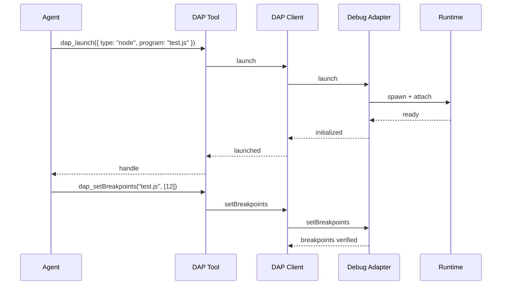
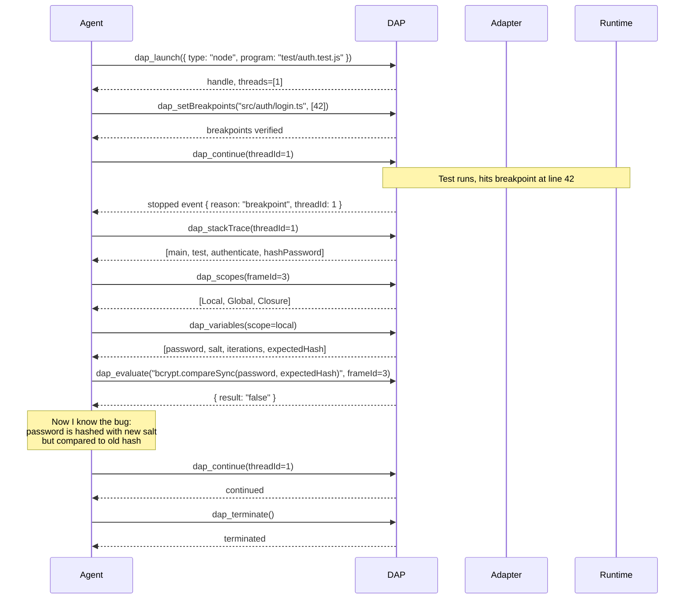

# 07 · DAP — Debug Adapter Protocol · 28 Operations

oh-my-pi ships **first-class Debug Adapter Protocol (DAP) integration**. 28 operations exposed as 28 tools, letting the agent **debug code** — set breakpoints, step through execution, inspect variables, evaluate expressions, and more. The same protocol your editor uses to debug, now available to the agent.

**Source:** `packages/coding-agent/src/core/tools/dap/` (28 tools, 1 DAP client, 1 adapter registry)

## What is DAP

The **Debug Adapter Protocol** is the standard that lets editors (VS Code, Neovim, Emacs) talk to debug-specific backends ("debug adapters") for a language or runtime. A debug adapter for Node.js knows how to set breakpoints in V8; one for Python knows how to set breakpoints in CPython.

By using DAP, oh-my-pi gets **real debugging** — not print statements, not logging, but actual interactive debugging with state inspection, step control, and breakpoint management.



## The 28 operations

| # | Op | DAP method | What it does |
|---|-----|------------|--------------|
| 1 | `dap_launch` | `launch` | Start a new debug session |
| 2 | `dap_attach` | `attach` | Attach to a running process |
| 3 | `dap_configurationDone` | `configurationDone` | All initial config sent |
| 4 | `dap_setBreakpoints` | `setBreakpoints` | Set breakpoints in a source |
| 5 | `dap_setExceptionBreakpoints` | `setExceptionBreakpoints` | Break on exceptions |
| 6 | `dap_continue` | `continue` | Resume execution |
| 7 | `dap_next` | `next` | Step over |
| 8 | `dap_stepIn` | `stepIn` | Step into |
| 9 | `dap_stepOut` | `stepOut` | Step out |
| 10 | `dap_pause` | `pause` | Pause a running thread |
| 11 | `dap_threads` | `threads` | List threads |
| 12 | `dap_stackTrace` | `stackTrace` | Get call stack for a thread |
| 13 | `dap_scopes` | `scopes` | Get scopes for a frame |
| 14 | `dap_variables` | `variables` | Get variables in a scope |
| 15 | `dap_setVariable` | `setVariable` | Set a variable's value |
| 16 | `dap_evaluate` | `evaluate` | Evaluate an expression |
| 17 | `dap_watch` | `watch` | Set a watch expression |
| 18 | `dap_source` | `source` | Get source for a frame |
| 19 | `dap_exceptionInfo` | `exceptionInfo` | Get exception details |
| 20 | `dap_loadedSources` | `loadedSources` | List loaded sources |
| 21 | `dap_completions` | `completions` | REPL completions |
| 22 | `dap_runInTerminal` | `runInTerminal` | Run a command in the integrated terminal |
| 23 | `dap_startDebugging` | `startDebugging` | Start a child debug session |
| 24 | `dap_disconnect` | `disconnect` | End a debug session |
| 25 | `dap_terminate` | `terminate` | Kill the debuggee |
| 26 | `dap_restart` | `restart` | Restart the debug session |
| 27 | `dap_goto` | `goto` | Jump to a different location |
| 28 | `dap_reverseContinue` | `reverseContinue` | Resume in reverse (time travel) |

Some operations are **passive** (e.g. `dap_threads` queries state) and some are **active** (e.g. `dap_continue` changes state).

## The DAP client

`packages/coding-agent/src/core/tools/dap/client.ts` is the **DAP client**:

```ts
export class DapClient {
  // Lifecycle
  static async launch(opts: LaunchOptions): Promise<DapClient>;
  static async attach(opts: AttachOptions): Promise<DapClient>;
  async disconnect(terminateDebuggee?: boolean): Promise<void>;
  
  // State queries
  async threads(): Promise<Thread[]>;
  async stackTrace(threadId: number): Promise<StackFrame[]>;
  async scopes(frameId: number): Promise<Scope[]>;
  async variables(variablesReference: number): Promise<Variable[]>;
  async evaluate(expression: string, frameId?: number): Promise<EvaluateResult>;
  async source(sourceReference: number): Promise<Source>;
  
  // State changes
  async setBreakpoints(file: string, lines: number[]): Promise<Breakpoint[]>;
  async continue(threadId: number): Promise<void>;
  async next(threadId: number): Promise<void>;
  async stepIn(threadId: number): Promise<void>;
  async stepOut(threadId: number): Promise<void>;
  async pause(threadId: number): Promise<void>;
  
  // Events (async)
  on(event: "stopped", cb: (event: StoppedEvent) => void): void;
  on(event: "continued", cb: (event: ContinuedEvent) => void): void;
  on(event: "output", cb: (event: OutputEvent) => void): void;
  on(event: "terminated", cb: () => void): void;
}
```

The client is **stateful** — it maintains the current debug state (threads, frames, scopes, variables) and exposes it through methods and events.

## The adapter registry

`packages/coding-agent/src/core/tools/dap/adapters.ts`:

```ts
export const DAP_ADAPTERS: Record<string, DapAdapterSpec> = {
  node: {
    type: "executable",
    command: "node",
    args: ["--inspect-brk=0", "${program}"],  // ${program} substituted at launch
    installHint: "Node.js ≥ 18 with --inspect-brk support",
    supportsAttach: true,
    supportsLaunch: true
  },
  python: {
    type: "executable",
    command: "python",
    args: ["-m", "debugpy", "--listen", "0", "${program}"],
    installHint: "pip install debugpy",
    supportsAttach: true,
    supportsLaunch: true
  },
  go: {
    type: "server",
    command: "dlv",
    args: ["dap", "--check-go-version=false"],
    installHint: "go install github.com/go-delve/delve/dap@latest",
    supportsAttach: true,
    supportsLaunch: true
  },
  // ... 15+ more
};
```

Bundled adapters:

| Language | Adapter | Install |
|----------|---------|---------|
| Node.js | `node --inspect` | bundled |
| Python | `debugpy` | `pip install debugpy` |
| Go | `dlv dap` | `go install github.com/go-delve/delve/dap@latest` |
| Rust | `lldb-vscode` (via CodeLLDB) | `code-lldb` extension |
| Java | `vscode-java-debug` | `redhat.vscode-java-debug` |
| C/C++ | `lldb-vscode` | `code-lldb` extension |
| PHP | `php-debug` | `composer global require` |
| Ruby | `rdbg` | `gem install debug.gem` |
| Dart | `dart --debug` | bundled with Dart SDK |
| Lua | `local-lua-debugger` | `luarocks install` |
| Elixir | `mix debug` | bundled with Elixir 1.13+ |
| C# | `netcoredbg` | dotnet tool install |
| Swift | `lldb-vscode` | `code-lldb` extension |
| Kotlin | `vscode-kotlin-debug` | `kotlin-debug-adapter` |

## A typical debugging session

The agent can debug a failing test end-to-end:



The agent has **the same debugging power as a human** — set breakpoints, step, inspect, evaluate, fix, repeat.

## The 28 tool definitions

Each tool is a thin wrapper. Example:

```ts
// packages/coding-agent/src/core/tools/dap/evaluate.ts
import { Type, type Static } from "typebox";

const EvaluateArgs = Type.Object({
  expression: Type.String({ description: "Expression to evaluate in the frame's context" }),
  frameId: Type.Optional(Type.Number({ description: "Stack frame; default = top frame" })),
  context: Type.Optional(Type.Union([
    Type.Literal("watch"),
    Type.Literal("repl"),
    Type.Literal("hover"),
    Type.Literal("clipboard")
  ]))
});

type EvaluateArgs = Static<typeof EvaluateArgs>;

const evaluateTool: AgentTool<typeof EvaluateArgs> = {
  name: "dap_evaluate",
  description: "Evaluate an expression in the context of a stack frame. Returns the result and its type.",
  inputSchema: EvaluateArgs,
  requiredCapabilities: [],
  async execute(args, ctx) {
    const session = ctx.dap.activeSession();
    if (!session) return { content: [{ type: "text", text: "No active debug session" }], isError: true };
    
    const result = await session.evaluate(args.expression, {
      frameId: args.frameId,
      context: args.context ?? "repl"
    });
    
    return {
      content: [{ type: "text", text: `${result.result}  // ${result.type}` }],
      details: { variablesReference: result.variablesReference, presentationHint: result.presentationHint }
    };
  }
};
```

## Conditional breakpoints

`dap_setBreakpoints` supports conditions:

```ts
{
  file: "src/api/users.ts",
  breakpoints: [
    { line: 42 },
    { line: 87, condition: "request.user.id === 'admin'", hitCondition: ">5", logMessage: "Admin hit: ${request.url}" }
  ]
}
```

The `condition` is a JS-like expression evaluated in the frame's context. `hitCondition` is a count (e.g. `>5` = break after 5 hits). `logMessage` is a logpoint — doesn't break, just logs.

## Watch expressions

```ts
{
  expressions: [
    { name: "userCount", expression: "users.length" },
    { name: "lastError", expression: "errors[errors.length - 1]" }
  ]
}
```

The agent can set watches that are **automatically evaluated** on every stop. The results are shown in the TUI's watch panel.

## REPL completions

`dap_completions` provides REPL-style completions for the `evaluate` tool:

```ts
{
  expression: "users.",
  frameId: 3,
  column: 6
}

// Returns: ["push", "pop", "map", "filter", "find", "length", "forEach", ...]
```

The agent uses this to discover available methods on a value before calling them.

## The `runInTerminal` integration

`dap_runInTerminal` is a special operation — it tells the agent to run a command in the **integrated terminal** (not the debug console):

```ts
{
  kind: "integrated",
  args: ["npm", "install", "lodash"]
}
```

The agent uses this to install dependencies mid-debug-session without leaving the debug context.

## `startDebugging` — child debug sessions

`dap_startDebugging` spawns a **child debug session** from a parent. Used for:

- Multi-process debugging (e.g. a Node server + a worker)
- Client/server debugging (e.g. a Go server + a Go client)
- Test debugging (a test runner spawns a debug session per test)

```ts
{
  request: "launch",
  configuration: { type: "node", program: "worker.js" }
}
```

The child is a separate `DapClient` with its own thread ID space. The parent can interact with both.

## Configuration

`~/.omp/settings.json`:

```json
{
  "dap": {
    "enabled": true,
    "autoInstall": true,
    "maxConcurrent": 3,
    "timeout": 30000,
    "defaultAdapter": "node",
    "launchConfigs": [
      {
        "name": "Run current test",
        "type": "node",
        "program": "${file}",
        "args": ["--test"]
      }
    ]
  }
}
```

The `launchConfigs` array is similar to `.vscode/launch.json` — the user can define reusable launch configurations.

## The TUI integration

The TUI has a **dedicated debug panel** that shows:

- Threads (with the current one highlighted)
- Call stack (with the current frame highlighted)
- Variables (with the current scope expanded)
- Watch expressions
- Breakpoints
- Console output
- Source preview (the current line in the frame)

The agent can read the debug panel state via the `dap_*` tools; the user can see what the agent sees.

## Performance

- **Launch** — 200-500ms (depends on adapter)
- **setBreakpoints** — 50-200ms (needs to compile/instrument)
- **continue / next / stepIn** — 5-50ms (network round-trip)
- **evaluate** — 10-100ms (depends on expression complexity)
- **stackTrace / scopes / variables** — 5-20ms

The DAP client keeps the adapter alive for the session, so the per-request cost is just the protocol round-trip.

## What DAP can't do

- **Time travel debugging** — only `reverseContinue` is supported, not full time travel
- **Memory inspection** — DAP doesn't have a standard way to inspect memory
- **Multi-language mixed stacks** — a Python frame calling a Rust frame is hard to model
- **Conditional watch** — the `evaluate` tool runs once per stop, not on every event

These are inherent limitations of DAP, not oh-my-pi.

## Integration with `hashline`

The agent can use DAP and `hashline` together:

1. **Debug** to find a bug (set breakpoints, step, inspect)
2. **Identify** the line to fix
3. **Use `hashline_replace`** to make the edit (with safety check)
4. **Continue** the debug session to verify the fix

This is the **core debugging workflow** for the agent.

## Next

- [LSP](/docs/06-lsp) — the read-side code understanding
- [hashline](/docs/08-hashline) — the write-side edit primitive
- [32 Built-in Tools](/docs/09-tools) — the full tool list
- [pi-coding-agent · CLI](/docs/05-pi-coding-agent) — the consumer
