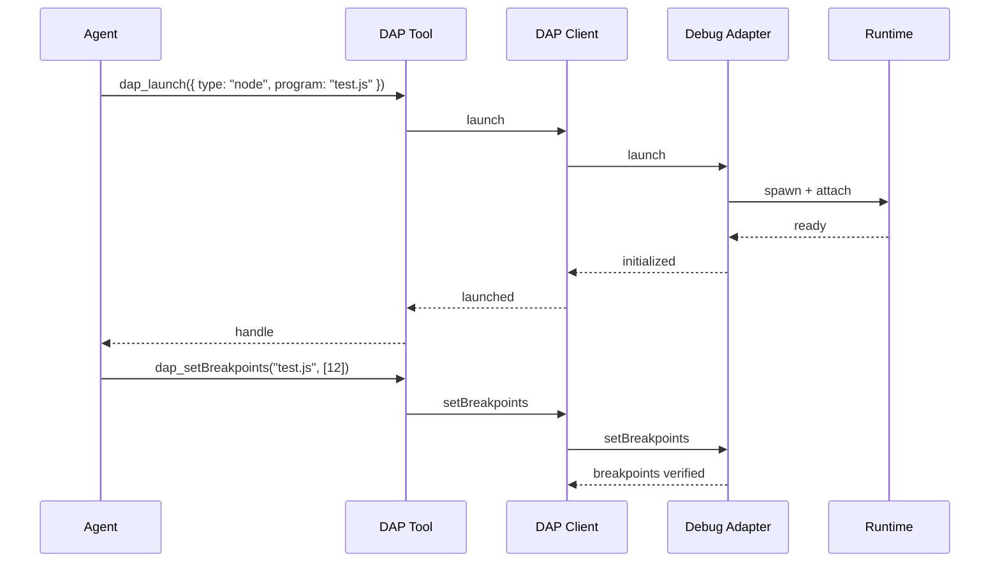
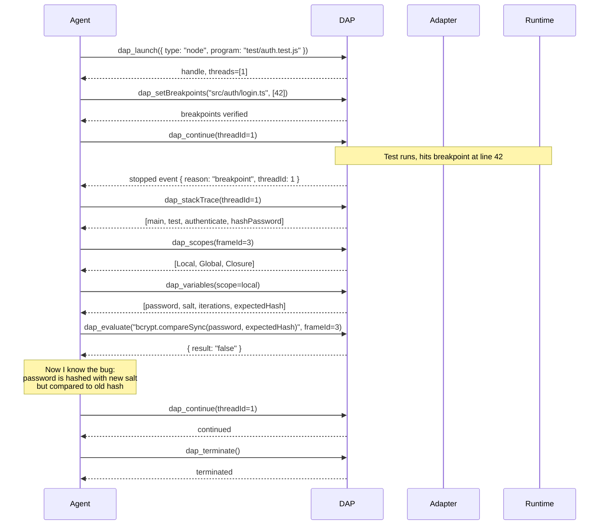

# 07 · DAP 调试适配器协议 28 个操作

oh-my-pi 发布**一级 DAP（Debug Adapter Protocol）集成**。28 个操作作为 28 个工具暴露，让 Agent 能够**调试代码** —— 设置断点、单步执行、查看变量、求值表达式等等。和你的编辑器使用的同一套调试协议，现在 Agent 也能用。

**源码：** `packages/coding-agent/src/core/tools/dap/`（28 个工具，1 个 DAP 客户端，1 个 adapter 注册表）

## 什么是 DAP

**Debug Adapter Protocol** 是让编辑器（VS Code、Neovim、Emacs）与调试专用后端（"debug adapters"）通信的标准。一个 Node.js 的 debug adapter 知道如何在 V8 中设置断点；一个 Python 的 debug adapter 知道如何在 CPython 中设置断点。

通过使用 DAP，oh-my-pi 获得了**真正的调试能力** —— 不是 print，不是 log，而是真实的交互式调试，可以查看状态、控制单步、管理断点。



## 28 个操作

| # | Op | DAP method | 作用 |
|---|-----|------------|--------------|
| 1 | `dap_launch` | `launch` | 启动一个新的调试会话 |
| 2 | `dap_attach` | `attach` | 附加到一个已运行的进程 |
| 3 | `dap_configurationDone` | `configurationDone` | 所有初始配置已发送 |
| 4 | `dap_setBreakpoints` | `setBreakpoints` | 在源码中设置断点 |
| 5 | `dap_setExceptionBreakpoints` | `setExceptionBreakpoints` | 在异常时中断 |
| 6 | `dap_continue` | `continue` | 恢复执行 |
| 7 | `dap_next` | `next` | 单步跳过 |
| 8 | `dap_stepIn` | `stepIn` | 单步进入 |
| 9 | `dap_stepOut` | `stepOut` | 单步跳出 |
| 10 | `dap_pause` | `pause` | 暂停运行中的线程 |
| 11 | `dap_threads` | `threads` | 列出线程 |
| 12 | `dap_stackTrace` | `stackTrace` | 获取某线程的调用栈 |
| 13 | `dap_scopes` | `scopes` | 获取栈帧的作用域 |
| 14 | `dap_variables` | `variables` | 获取作用域中的变量 |
| 15 | `dap_setVariable` | `setVariable` | 设置变量的值 |
| 16 | `dap_evaluate` | `evaluate` | 求值一个表达式 |
| 17 | `dap_watch` | `watch` | 设置 watch 表达式 |
| 18 | `dap_source` | `source` | 获取栈帧对应的源码 |
| 19 | `dap_exceptionInfo` | `exceptionInfo` | 获取异常详情 |
| 20 | `dap_loadedSources` | `loadedSources` | 列出已加载的源码 |
| 21 | `dap_completions` | `completions` | REPL 自动补全 |
| 22 | `dap_runInTerminal` | `runInTerminal` | 在集成终端中运行命令 |
| 23 | `dap_startDebugging` | `startDebugging` | 启动子调试会话 |
| 24 | `dap_disconnect` | `disconnect` | 结束调试会话 |
| 25 | `dap_terminate` | `terminate` | 杀掉被调试进程 |
| 26 | `dap_restart` | `restart` | 重启调试会话 |
| 27 | `dap_goto` | `goto` | 跳转到其他位置 |
| 28 | `dap_reverseContinue` | `reverseContinue` | 反向恢复执行（时间旅行） |

部分操作是**被动**的（例如 `dap_threads` 查询状态），部分是**主动**的（例如 `dap_continue` 改变状态）。

## DAP 客户端

`packages/coding-agent/src/core/tools/dap/client.ts` 是 **DAP 客户端**：

```ts
export class DapClient {
  // 生命周期
  static async launch(opts: LaunchOptions): Promise<DapClient>;
  static async attach(opts: AttachOptions): Promise<DapClient>;
  async disconnect(terminateDebuggee?: boolean): Promise<void>;

  // 状态查询
  async threads(): Promise<Thread[]>;
  async stackTrace(threadId: number): Promise<StackFrame[]>;
  async scopes(frameId: number): Promise<Scope[]>;
  async variables(variablesReference: number): Promise<Variable[]>;
  async evaluate(expression: string, frameId?: number): Promise<EvaluateResult>;
  async source(sourceReference: number): Promise<Source>;

  // 状态变更
  async setBreakpoints(file: string, lines: number[]): Promise<Breakpoint[]>;
  async continue(threadId: number): Promise<void>;
  async next(threadId: number): Promise<void>;
  async stepIn(threadId: number): Promise<void>;
  async stepOut(threadId: number): Promise<void>;
  async pause(threadId: number): Promise<void>;

  // 事件（异步）
  on(event: "stopped", cb: (event: StoppedEvent) => void): void;
  on(event: "continued", cb: (event: ContinuedEvent) => void): void;
  on(event: "output", cb: (event: OutputEvent) => void): void;
  on(event: "terminated", cb: () => void): void;
}
```

客户端是**有状态的** —— 它维护当前的调试状态（threads、frames、scopes、variables），并通过方法和事件暴露给外部。

## adapter 注册表

`packages/coding-agent/src/core/tools/dap/adapters.ts`：

```ts
export const DAP_ADAPTERS: Record<string, DapAdapterSpec> = {
  node: {
    type: "executable",
    command: "node",
    args: ["--inspect-brk=0", "${program}"],  // ${program} 在 launch 时替换
    installHint: "Node.js ≥ 18 with --inspect-brk support",
    supportsAttach: true,
    supportsLaunch: true
  },
  python: {
    type: "executable",
    command: "python",
    args: ["-m", "debugpy", "--listen", "0", "${program}"],
    installHint: "pip install debugpy",
    supportsAttach: true,
    supportsLaunch: true
  },
  go: {
    type: "server",
    command: "dlv",
    args: ["dap", "--check-go-version=false"],
    installHint: "go install github.com/go-delve/delve/dap@latest",
    supportsAttach: true,
    supportsLaunch: true
  },
  // ... 15+ 还可以
};
```

内置 adapter：

| 语言 | Adapter | 安装方式 |
|----------|---------|---------|
| Node.js | `node --inspect` | 内建 |
| Python | `debugpy` | `pip install debugpy` |
| Go | `dlv dap` | `go install github.com/go-delve/delve/dap@latest` |
| Rust | `lldb-vscode`（通过 CodeLLDB） | `code-lldb` 扩展 |
| Java | `vscode-java-debug` | `redhat.vscode-java-debug` |
| C/C++ | `lldb-vscode` | `code-lldb` 扩展 |
| PHP | `php-debug` | `composer global require` |
| Ruby | `rdbg` | `gem install debug.gem` |
| Dart | `dart --debug` | 随 Dart SDK 内建 |
| Lua | `local-lua-debugger` | `luarocks install` |
| Elixir | `mix debug` | 随 Elixir 1.13+ 内建 |
| C# | `netcoredbg` | dotnet tool install |
| Swift | `lldb-vscode` | `code-lldb` 扩展 |
| Kotlin | `vscode-kotlin-debug` | `kotlin-debug-adapter` |

## 一个典型的调试会话

Agent 可以端到端地调试一个失败的测试：



Agent 拥有**与人类相同的调试能力** —— 设置断点、单步、查看、求值、修复、循环。

## 28 个工具定义

每个工具都是一层薄包装。示例：

```ts
// packages/coding-agent/src/core/tools/dap/evaluate.ts
import { Type, type Static } from "typebox";

const EvaluateArgs = Type.Object({
  expression: Type.String({ description: "Expression to evaluate in the frame's context" }),
  frameId: Type.Optional(Type.Number({ description: "Stack frame; default = top frame" })),
  context: Type.Optional(Type.Union([
    Type.Literal("watch"),
    Type.Literal("repl"),
    Type.Literal("hover"),
    Type.Literal("clipboard")
  ]))
});

type EvaluateArgs = Static<typeof EvaluateArgs>;

const evaluateTool: AgentTool<typeof EvaluateArgs> = {
  name: "dap_evaluate",
  description: "Evaluate an expression in the context of a stack frame. Returns the result and its type.",
  inputSchema: EvaluateArgs,
  requiredCapabilities: [],
  async execute(args, ctx) {
    const session = ctx.dap.activeSession();
    if (!session) return { content: [{ type: "text", text: "No active debug session" }], isError: true };

    const result = await session.evaluate(args.expression, {
      frameId: args.frameId,
      context: args.context ?? "repl"
    });

    return {
      content: [{ type: "text", text: `${result.result}  // ${result.type}` }],
      details: { variablesReference: result.variablesReference, presentationHint: result.presentationHint }
    };
  }
};
```

## 条件断点

`dap_setBreakpoints` 支持条件：

```ts
{
  file: "src/api/users.ts",
  breakpoints: [
    { line: 42 },
    { line: 87, condition: "request.user.id === 'admin'", hitCondition: ">5", logMessage: "Admin hit: ${request.url}" }
  ]
}
```

`condition` 是在栈帧上下文中求值的 JS 风格表达式。`hitCondition` 是命中次数（例如 `>5` 表示命中 5 次之后才中断）。`logMessage` 是 logpoint —— 不中断，只打印日志。

## Watch 表达式

```ts
{
  expressions: [
    { name: "userCount", expression: "users.length" },
    { name: "lastError", expression: "errors[errors.length - 1]" }
  ]
}
```

Agent 可以设置在每次中断时**自动求值**的 watch。求值结果会显示在 TUI 的 watch 面板中。

## REPL 自动补全

`dap_completions` 为 `evaluate` 工具提供 REPL 风格的自动补全：

```ts
{
  expression: "users.",
  frameId: 3,
  column: 6
}

// 返回：["push", "pop", "map", "filter", "find", "length", "forEach", ...]
```

Agent 用它在调用方法前发现某个值上可用的方法。

## `runInTerminal` 集成

`dap_runInTerminal` 是个特殊操作 —— 它告诉 Agent 在**集成终端**（不是调试控制台）里运行命令：

```ts
{
  kind: "integrated",
  args: ["npm", "install", "lodash"]
}
```

Agent 用它在不离开调试上下文的情况下安装依赖。

## `startDebugging` — 子调试会话

`dap_startDebugging` 由父会话生成**子调试会话**。用于：

- 多进程调试（例如一个 Node 服务 + 一个 worker）
- 客户端/服务端调试（例如一个 Go server + 一个 Go client）
- 调试测试（测试运行器为每个测试生成一个调试会话）

```ts
{
  request: "launch",
  configuration: { type: "node", program: "worker.js" }
}
```

子会话是一个独立的 `DapClient`，拥有自己的线程 ID 空间。父会话可以与两者交互。

## 配置

`~/.omp/settings.json`：

```json
{
  "dap": {
    "enabled": true,
    "autoInstall": true,
    "maxConcurrent": 3,
    "timeout": 30000,
    "defaultAdapter": "node",
    "launchConfigs": [
      {
        "name": "Run current test",
        "type": "node",
        "program": "${file}",
        "args": ["--test"]
      }
    ]
  }
}
```

`launchConfigs` 数组类似于 `.vscode/launch.json` —— 用户可以定义可复用的 launch 配置。

## TUI 集成

TUI 有一个**专门的调试面板**，会显示：

- 线程（高亮当前线程）
- 调用栈（高亮当前栈帧）
- 变量（展开当前作用域）
- Watch 表达式
- 断点
- 控制台输出
- 源码预览（栈帧中的当前行）

Agent 可以通过 `dap_*` 工具读取调试面板的状态；用户也能看到 Agent 看到的内容。

## 性能

- **Launch** — 200-500ms（取决于 adapter）
- **setBreakpoints** — 50-200ms（需要编译/插桩）
- **continue / next / stepIn** — 5-50ms（网络往返）
- **evaluate** — 10-100ms（取决于表达式复杂度）
- **stackTrace / scopes / variables** — 5-20ms

DAP 客户端在整个会话期间保持 adapter 存活，所以单次请求的代价只是协议往返。

## DAP 做不到的事

- **时间旅行调试** — 只支持 `reverseContinue`，完整的时间旅行还做不到
- **内存检查** — DAP 没有标准方式来检查内存
- **多语言混合栈** — 一个 Python 栈帧调用一个 Rust 栈帧很难建模
- **条件 watch** — `evaluate` 工具在每次中断时跑一次，不是每个事件都跑

这些是 DAP 本身的限制，而非 oh-my-pi。

## 与 `hashline` 的集成

Agent 可以把 DAP 和 `hashline` 一起用：

1. **调试**以发现 bug（设断点、单步、查看）
2. **定位**到需要修复的那一行
3. **使用 `hashline_replace`** 来做编辑（带安全校验）
4. **继续**调试会话以验证修复

这就是 Agent 的**核心调试工作流**。

## 接下来

- [LSP](/docs/06-lsp) — 读侧的代码理解
- [hashline](/docs/08-hashline) — 写侧的编辑原语
- [32 个内建工具](/docs/09-tools) — 完整工具列表
- [pi-coding-agent · CLI](/docs/05-pi-coding-agent) — 消费者
