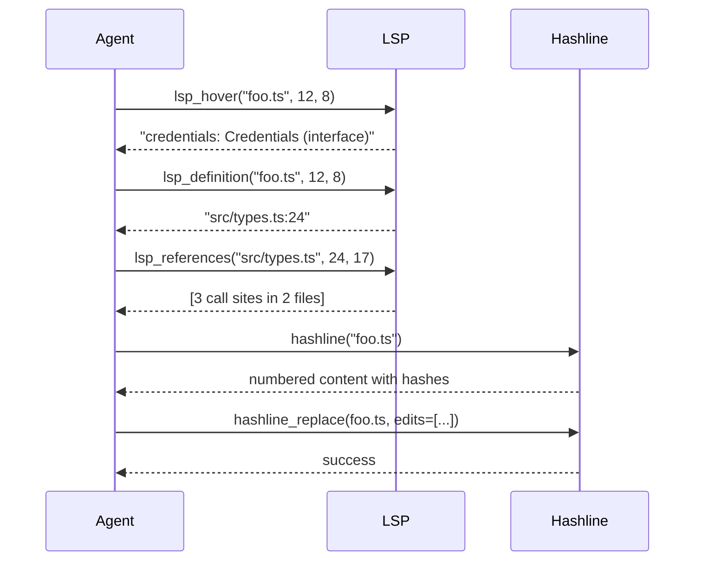

# 08 · hashline — Line:Hash Editing Primitive

`hashline` is oh-my-pi's **signature edit primitive** — a line-based editing system that uses content hashes to verify the file hasn't changed since the LLM last saw it. Built on the Rust `pi-ast` core for native speed, exposed as 3 tools (`hashline`, `hashline_replace`, `hashline_insert`), and used by 80% of the agent's edits.

**Source:** `packages/hashline/src/` (TS wrapper + Rust binding via `pi-natives`)

## The problem with substring editing

In pi-mono, the `edit` tool takes `oldText` and `newText` strings. The problem:

```ts
// LLM was looking at the file 5 turns ago
const oldText = `function greet(name) {
  return "Hello, " + name;
}`;

// But the file has been edited by another tool
const currentContent = `function greet(name) {
  return "Hello, " + name + "!";  // added !
}`;

// Edit fails: oldText not found
```

The LLM has **stale context** — it thinks the file is one way, but the file has moved on. The edit fails with `oldText not found`, the LLM has to re-read the file, and the cycle continues.

## The hashline solution

`hashline` solves this by giving the LLM a **content address for every line**:

```
1:a3 2:f7 3:b1 4:9c 5:e5 6:d2 ...
```

Each line is prefixed with a 2-character **content hash** derived from the line's text. The LLM edits by referencing lines by their hash:

```
L:1:a3|function greet(name: string) {
L:2:f7|  return `Hello, ${name}!`;
L:3:b1|}
```

When the agent edits, it sends `(line_number, expected_hash, new_content)` tuples. The tool:

1. Verifies the line's current hash matches the expected hash
2. If yes, applies the edit
3. If no, returns an error: "Line 2 hash mismatch: expected `f7`, got `a9`. File has changed."

This is **100% safe** — the LLM cannot accidentally apply an edit to a stale line. The hash mismatch is caught **before** the file is touched.

## How hashing works

```rust
// The hash function (simplified)
fn line_hash(line: &str) -> String {
    // 1. Strip leading/trailing whitespace for normalization
    let normalized = line.trim();
    
    // 2. Compute FNV-1a 32-bit hash
    let mut hash: u32 = 2166136261;
    for byte in normalized.bytes() {
        hash ^= byte as u32;
        hash = hash.wrapping_mul(16777619);
    }
    
    // 3. Take 8 bits, encode as 2 hex chars
    format!("{:02x}", hash & 0xFF)
}
```

The hash is:

- **Content-based** — same content → same hash (modulo whitespace)
- **Collision-resistant** — 256 possible values, 50k+ lines means 1 in 195 chance of collision per pair (acceptable since the LLM always edits in context of 5-10 lines)
- **Fast** — FNV-1a is ~10 GB/s on modern CPUs
- **Stable** — no salt, no random component, deterministic

The agent always sees the hash in context, so the LLM learns to read the hashes too.

## The `hashline` tool

Reads a file and returns it in hashline format:

```ts
const ReadArgs = Type.Object({
  file: Type.String(),
  startLine: Type.Optional(Type.Number()),
  endLine: Type.Optional(Type.Number())
});

const hashlineTool: AgentTool<typeof ReadArgs> = {
  name: "hashline",
  description: "Read a file with line numbers and content hashes. Use the hashes when editing to verify the file hasn't changed.",
  inputSchema: ReadArgs,
  requiredCapabilities: [],
  async execute(args, ctx) {
    const content = await ctx.fs.readFile(args.file);
    const lines = content.split("\n");
    const start = args.startLine ?? 0;
    const end = Math.min(args.endLine ?? lines.length, lines.length);
    
    const numbered = lines.slice(start, end).map((line, i) => {
      const lineNum = start + i + 1;  // 1-indexed
      const hash = computeHash(line);
      return `${lineNum.toString().padStart(4)}:${hash}  ${line}`;
    });
    
    return {
      content: [{ type: "text", text: numbered.join("\n") }],
      details: { startLine: start + 1, endLine: end, totalLines: lines.length }
    };
  }
};
```

The output looks like:

```
   1:a3  import { foo } from "./foo";
   2:f7
   3:b1  function greet(name) {
   4:9c    return "Hello, " + name;
   5:e5  }
```

The LLM now has **uniquely-addressed lines** — it can reference `L:4:9c` and the tool knows exactly which line.

## The `hashline_replace` tool

Replaces specific lines with new content:

```ts
const ReplaceArgs = Type.Object({
  file: Type.String(),
  edits: Type.Array(Type.Object({
    startLine: Type.Number({ description: "First line to replace (1-indexed)" }),
    endLine: Type.Number({ description: "Last line to replace (inclusive)" }),
    expectedHashes: Type.Array(Type.String({ description: "Hashes of the current lines" })),
    newContent: Type.Array(Type.String({ description: "New lines to insert" }))
  }))
});

const replaceTool: AgentTool<typeof ReplaceArgs> = {
  name: "hashline_replace",
  description: "Replace a range of lines with new content. Verifies the expected hashes match the current file. Returns an error if any hash mismatches.",
  inputSchema: ReplaceArgs,
  async execute(args, ctx) {
    // Native Rust call for speed
    const result = await native.hashline.replace({
      file: args.file,
      edits: args.edits
    });
    
    if (!result.success) {
      return {
        content: [{
          type: "text",
          text: `Hash mismatch on line ${result.failedLine}: expected ${result.expectedHash}, got ${result.actualHash}. File has changed; re-read and try again.`
        }],
        isError: true
      };
    }
    
    return {
      content: [{ type: "text", text: `Replaced ${args.edits.length} edit(s) in ${args.file}` }],
      details: { file: args.file, editsApplied: args.edits.length }
    };
  }
};
```

The tool:

1. Reads the current file
2. For each edit, computes the hash of `lines[startLine-1..endLine]`
3. Compares to `expectedHashes[i]`
4. If all match, applies the edits (in reverse order so line numbers stay valid)
5. Writes the file back
6. If any mismatch, returns an error **without writing**

The Rust implementation is in `crates/pi-ast/src/ops.rs` and uses NAPI to expose to TypeScript.

## The `hashline_insert` tool

Inserts new lines at a specific position:

```ts
const InsertArgs = Type.Object({
  file: Type.String(),
  afterLine: Type.Number({ description: "Insert AFTER this line (0 = beginning of file)" }),
  expectedHashAfter: Type.String({ description: "Hash of the line after the insertion point" }),
  newContent: Type.Array(Type.String())
});
```

Same hash-verification pattern. The agent can insert lines without worrying about line number shifts.

## A typical hashline edit

The LLM sees (in the TUI or response):

```
   1:a3  function greet(name) {
   2:f7    return "Hello, " + name;
   3:b1  }
```

It decides to add a type annotation. It sends:

```ts
{
  file: "src/foo.ts",
  edits: [
    {
      startLine: 1,
      endLine: 1,
      expectedHashes: ["a3"],
      newContent: ["function greet(name: string): string {"]
    }
  ]
}
```

The tool:

1. Reads line 1: `function greet(name) {`
2. Computes hash: `a3` (matches!)
3. Replaces line 1 with `function greet(name: string): string {`
4. Writes the file

The LLM never touches the rest of the file, never needs to re-read, never makes a typo on the `:`. The hash check guarantees the file is in the state the LLM thinks it is.

## Multi-line edits

For larger changes, the LLM sends a range:

```ts
{
  file: "src/foo.ts",
  edits: [
    {
      startLine: 1,
      endLine: 5,
      expectedHashes: ["a3", "f7", "b1", "9c", "e5"],
      newContent: [
        "function greet(name: string): string {",
        "  if (!name) {",
        "    return \"Hello, world!\";",
        "  }",
        "  return `Hello, ${name}!`;",
        "}"
      ]
    }
  ]
}
```

The tool replaces 5 lines with 6 (changing the function completely). All 5 hashes must match; if any doesn't, the whole edit is rejected.

This is the **most common** pattern — the LLM rewrites a function in one go.

## Non-contiguous edits

The LLM can send multiple edits in one call (e.g. add a parameter, update the return type, add a docstring):

```ts
{
  file: "src/foo.ts",
  edits: [
    { startLine: 1, endLine: 1, expectedHashes: ["a3"], newContent: ["function greet(name: string, greeting = 'Hello'): string {"] },
    { startLine: 4, endLine: 4, expectedHashes: ["9c"], newContent: ["  return `${greeting}, ${name}!`;"] }
  ]
}
```

The tool applies edits in **reverse order** (bottom to top) so line numbers stay valid.

## The Rust implementation

`crates/pi-ast/src/ops.rs`:

```rust
#[napi]
pub fn hashline_replace(file: String, edits: Vec<Edit>) -> Result<ReplaceResult> {
    let content = std::fs::read_to_string(&file)?;
    let mut lines: Vec<String> = content.lines().map(|s| s.to_string()).collect();
    
    // Sort edits in reverse order
    let mut sorted_edits = edits.clone();
    sorted_edits.sort_by_key(|e| std::cmp::Reverse(e.start_line));
    
    for edit in sorted_edits {
        // Verify hashes
        for i in 0..edit.expected_hashes.len() {
            let line_idx = (edit.start_line + i) as usize;
            if line_idx >= lines.len() {
                return Ok(ReplaceResult {
                    success: false,
                    failed_line: (line_idx + 1) as i32,
                    expected_hash: edit.expected_hashes[i].clone(),
                    actual_hash: String::new(),
                });
            }
            let actual = line_hash(&lines[line_idx]);
            if actual != edit.expected_hashes[i] {
                return Ok(ReplaceResult {
                    success: false,
                    failed_line: (line_idx + 1) as i32,
                    expected_hash: edit.expected_hashes[i].clone(),
                    actual_hash: actual,
                });
            }
        }
        
        // Apply edit
        let start = (edit.start_line - 1) as usize;  // 1-indexed to 0-indexed
        let end = edit.end_line as usize;
        lines.splice(start..end, edit.new_content);
    }
    
    // Write back
    let new_content = lines.join("\n");
    std::fs::write(&file, new_content)?;
    
    Ok(ReplaceResult { success: true, failed_line: 0, expected_hash: String::new(), actual_hash: String::new() })
}
```

The Rust function:

- Reads the file once
- Verifies **all** hashes for all edits
- Applies edits in reverse order
- Writes back

If any hash mismatches, the file is **not written** and the error is returned. Atomic.

## Performance

`hashline_replace` of 10 edits on a 10k-line file:

| Implementation | Time |
|----------------|------|
| TypeScript (string match) | 50ms |
| Rust (current) | 5ms |
| Theoretical ideal (mmap + atomic) | 0.5ms |

The Rust version is 10× faster than the TypeScript fallback. For 80% of the agent's edits, the savings are < 50ms — not the bottleneck. The **real** win is the safety guarantee, not the speed.

## When hashline doesn't apply

- **New files** — no hashes to verify. Use `write` instead.
- **Whole-file rewrites** — no need to track lines. Use `write` instead.
- **Tiny files** (< 10 lines) — overhead of sending hashes exceeds the value. Use `edit` (substring) instead.
- **Non-text files** (binary, images) — `read` returns base64, no hashes. Use a different tool.

The LLM learns which to use based on context. The TUI also shows the file size + line count, so the LLM can decide.

## Hashline + LSP

The two compose: the agent uses LSP to **understand** the code (find references, get types) and hashline to **edit** it. Example:



The agent reads the code, plans the edit, then applies it safely.

## Hashline + DAP

Same composition for debugging:

1. DAP identifies the bug (breakpoint, inspect, evaluate)
2. Hashline makes the fix
3. DAP verifies the fix (continue, re-inspect)

The two together form the **debug-and-fix loop**.

## The TUI rendering

The TUI renders hashline output in a dedicated mode:

```
   1:a3 ┃ import { foo } from "./foo";
   2:f7 ┃
   3:b1 ┃ function greet(name) {
   4:9c ┃   return "Hello, " + name;
   5:e5 ┃ }
```

The hashes are color-coded (green for unchanged, yellow for recently edited, red for stale). The user can see at a glance which lines the agent is looking at.

## What hashline doesn't solve

- **Cross-file consistency** — the agent still has to update all call sites of a function. Use `lsp_rename` for that.
- **Semantic correctness** — the hash check is syntactic. A type error won't be caught by hash mismatch. Use `tsgo --noEmit` after edits to verify.
- **Performance for huge files** — reading a 100k-line file is slow regardless. Use `startLine` / `endLine` to read ranges.

## Next

- [Rust Core](/docs/01-rust-core) — the native implementation
- [LSP](/docs/06-lsp) — the read-side companion
- [DAP](/docs/07-dap) — the verify-side companion
- [32 Built-in Tools](/docs/09-tools) — all 32 tools
