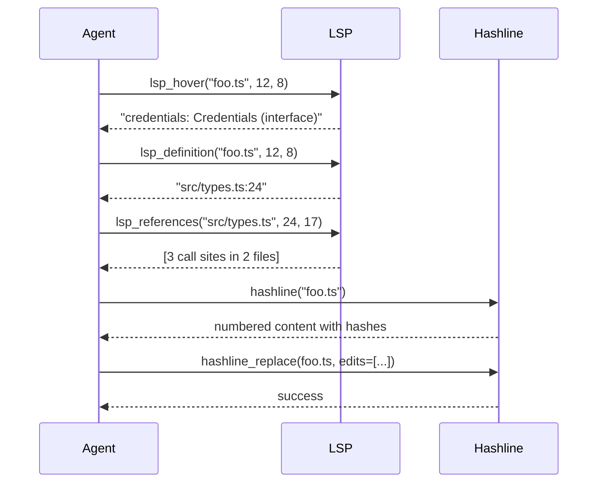

# 08 · hashline 行级哈希编辑

`hashline` 是 oh-my-pi 的**标志性编辑原语** —— 一种基于行的编辑系统，使用内容哈希来验证文件自 LLM 上次看到之后没有发生变化。它构建在 Rust `pi-ast` 核心之上以获得原生速度，暴露为 3 个工具（`hashline`、`hashline_replace`、`hashline_insert`），并被 Agent 80% 的编辑所使用。

**源码：** `packages/hashline/src/`（TS 包装 + 通过 `pi-natives` 的 Rust 绑定）

## 子串编辑的问题

在 pi-mono 中，`edit` 工具接收 `oldText` 和 `newText` 字符串。问题在于：

```ts
// LLM 在 5 个回合前看过这个文件
const oldText = `function greet(name) {
  return "Hello, " + name;
}`;

// 但文件已经被另一个工具改过了
const currentContent = `function greet(name) {
  return "Hello, " + name + "!";  // 加上 !
}`;

// 编辑失败：找不到 oldText
```

LLM 拥有**过时的上下文** —— 它以为文件是某个样子，但文件已经变化。编辑会因为 `oldText not found` 失败，LLM 不得不重新读取文件，然后循环往复。

## hashline 的解决方案

`hashline` 通过给每行一个**内容地址**来解决这个问题：

```
1:a3 2:f7 3:b1 4:9c 5:e5 6:d2 ...
```

每行前面都有一个由该行文本派生的 2 字符**内容哈希**。LLM 通过哈希来引用行，从而完成编辑：

```
L:1:a3|function greet(name: string) {
L:2:f7|  return `Hello, ${name}!`;
L:3:b1|}
```

当 Agent 编辑时，会发送 `(line_number, expected_hash, new_content)` 元组。工具会：

1. 校验该行当前的哈希与期望哈希一致
2. 如果一致，应用编辑
3. 如果不一致，返回错误："Line 2 hash mismatch: expected `f7`, got `a9`. File has changed."

这是**100% 安全**的 —— LLM 不会把编辑误应用到已经过时的行上。哈希不匹配会在**触碰文件之前**就被捕获。

## 哈希的工作原理

```rust
// 哈希函数（简化版）
fn line_hash(line: &str) -> String {
    // 1. 去掉首尾空白以做归一化
    let normalized = line.trim();

    // 2. 计算 FNV-1a 32 位哈希
    let mut hash: u32 = 2166136261;
    for byte in normalized.bytes() {
        hash ^= byte as u32;
        hash = hash.wrapping_mul(16777619);
    }

    // 3. 取 8 位，编码为 2 个十六进制字符
    format!("{:02x}", hash & 0xFF)
}
```

该哈希的特点：

- **基于内容** — 同样的内容得到同样的哈希（忽略空白）
- **抗冲突** — 256 个可能的值，5 万行以上时每对行冲突概率约为 1/195（可接受，因为 LLM 总是在 5-10 行上下文中编辑）
- **快速** — FNV-1a 在现代 CPU 上约 10 GB/s
- **稳定** — 无盐、无随机成分、确定性

Agent 总能在上下文中看到哈希，所以 LLM 也会学着读哈希。

## `hashline` 工具

以 hashline 格式读取文件并返回：

```ts
const ReadArgs = Type.Object({
  file: Type.String(),
  startLine: Type.Optional(Type.Number()),
  endLine: Type.Optional(Type.Number())
});

const hashlineTool: AgentTool<typeof ReadArgs> = {
  name: "hashline",
  description: "Read a file with line numbers and content hashes. Use the hashes when editing to verify the file hasn't changed.",
  inputSchema: ReadArgs,
  requiredCapabilities: [],
  async execute(args, ctx) {
    const content = await ctx.fs.readFile(args.file);
    const lines = content.split("\n");
    const start = args.startLine ?? 0;
    const end = Math.min(args.endLine ?? lines.length, lines.length);

    const numbered = lines.slice(start, end).map((line, i) => {
      const lineNum = start + i + 1;  // 1 索引
      const hash = computeHash(line);
      return `${lineNum.toString().padStart(4)}:${hash}  ${line}`;
    });

    return {
      content: [{ type: "text", text: numbered.join("\n") }],
      details: { startLine: start + 1, endLine: end, totalLines: lines.length }
    };
  }
};
```

输出形如：

```
   1:a3  import { foo } from "./foo";
   2:f7
   3:b1  function greet(name) {
   4:9c    return "Hello, " + name;
   5:e5  }
```

LLM 现在拥有了**唯一寻址的行** —— 它可以引用 `L:4:9c`，工具就准确地知道是哪一行。

## `hashline_replace` 工具

把指定行替换为新内容：

```ts
const ReplaceArgs = Type.Object({
  file: Type.String(),
  edits: Type.Array(Type.Object({
    startLine: Type.Number({ description: "First line to replace (1-indexed)" }),
    endLine: Type.Number({ description: "Last line to replace (inclusive)" }),
    expectedHashes: Type.Array(Type.String({ description: "Hashes of the current lines" })),
    newContent: Type.Array(Type.String({ description: "New lines to insert" }))
  }))
});

const replaceTool: AgentTool<typeof ReplaceArgs> = {
  name: "hashline_replace",
  description: "Replace a range of lines with new content. Verifies the expected hashes match the current file. Returns an error if any hash mismatches.",
  inputSchema: ReplaceArgs,
  async execute(args, ctx) {
    // 为了速度走原生 Rust
    const result = await native.hashline.replace({
      file: args.file,
      edits: args.edits
    });

    if (!result.success) {
      return {
        content: [{
          type: "text",
          text: `Hash mismatch on line ${result.failedLine}: expected ${result.expectedHash}, got ${result.actualHash}. File has changed; re-read and try again.`
        }],
        isError: true
      };
    }

    return {
      content: [{ type: "text", text: `Replaced ${args.edits.length} edit(s) in ${args.file}` }],
      details: { file: args.file, editsApplied: args.edits.length }
    };
  }
};
```

该工具的过程是：

1. 读取当前文件
2. 对每个 edit，计算 `lines[startLine-1..endLine]` 的哈希
3. 与 `expectedHashes[i]` 比较
4. 全部匹配则应用编辑（按倒序应用以保持行号有效）
5. 写回文件
6. 任意一个不匹配则**不写入**并返回错误

Rust 实现位于 `crates/pi-ast/src/ops.rs`，通过 NAPI 暴露给 TypeScript。

## `hashline_insert` 工具

在指定位置之后插入新行：

```ts
const InsertArgs = Type.Object({
  file: Type.String(),
  afterLine: Type.Number({ description: "Insert AFTER this line (0 = beginning of file)" }),
  expectedHashAfter: Type.String({ description: "Hash of the line after the insertion point" }),
  newContent: Type.Array(Type.String())
});
```

同样是哈希校验模式。Agent 可以在不担心行号漂移的情况下插入行。

## 一个典型的 hashline 编辑

LLM 看到的（TUI 中或响应里）：

```
   1:a3  function greet(name) {
   2:f7    return "Hello, " + name;
   3:b1  }
```

它决定加一个类型注解。它发送：

```ts
{
  file: "src/foo.ts",
  edits: [
    {
      startLine: 1,
      endLine: 1,
      expectedHashes: ["a3"],
      newContent: ["function greet(name: string): string {"]
    }
  ]
}
```

工具：

1. 读取第 1 行：`function greet(name) {`
2. 计算哈希：`a3`（匹配！）
3. 把第 1 行替换为 `function greet(name: string): string {`
4. 写回文件

LLM 不会触碰文件的其余部分，不需要重新读取，也不会在 `:` 上打错字。哈希检查保证了文件正处在 LLM 所认为的状态。

## 多行编辑

对于较大改动，LLM 发送一个范围：

```ts
{
  file: "src/foo.ts",
  edits: [
    {
      startLine: 1,
      endLine: 5,
      expectedHashes: ["a3", "f7", "b1", "9c", "e5"],
      newContent: [
        "function greet(name: string): string {",
        "  if (!name) {",
        "    return \"Hello, world!\";",
        "  }",
        "  return `Hello, ${name}!`;",
        "}"
      ]
    }
  ]
}
```

工具把 5 行替换为 6 行（彻底重写函数）。5 个哈希必须全部匹配；任何一个不匹配则整个 edit 会被拒绝。

这是**最常见**的模式 —— LLM 一次性重写一个函数。

## 非连续编辑

LLM 可以在一次调用中发送多个 edit（例如：加一个参数、更新返回类型、加 docstring）：

```ts
{
  file: "src/foo.ts",
  edits: [
    { startLine: 1, endLine: 1, expectedHashes: ["a3"], newContent: ["function greet(name: string, greeting = 'Hello'): string {"] },
    { startLine: 4, endLine: 4, expectedHashes: ["9c"], newContent: ["  return `${greeting}, ${name}!`;"] }
  ]
}
```

工具按**倒序**应用 edit（自下而上），以保持行号有效。

## Rust 实现

`crates/pi-ast/src/ops.rs`：

```rust
#[napi]
pub fn hashline_replace(file: String, edits: Vec<Edit>) -> Result<ReplaceResult> {
    let content = std::fs::read_to_string(&file)?;
    let mut lines: Vec<String> = content.lines().map(|s| s.to_string()).collect();

    // 把 edit 按倒序排序
    let mut sorted_edits = edits.clone();
    sorted_edits.sort_by_key(|e| std::cmp::Reverse(e.start_line));

    for edit in sorted_edits {
        // 校验哈希
        for i in 0..edit.expected_hashes.len() {
            let line_idx = (edit.start_line + i) as usize;
            if line_idx >= lines.len() {
                return Ok(ReplaceResult {
                    success: false,
                    failed_line: (line_idx + 1) as i32,
                    expected_hash: edit.expected_hashes[i].clone(),
                    actual_hash: String::new(),
                });
            }
            let actual = line_hash(&lines[line_idx]);
            if actual != edit.expected_hashes[i] {
                return Ok(ReplaceResult {
                    success: false,
                    failed_line: (line_idx + 1) as i32,
                    expected_hash: edit.expected_hashes[i].clone(),
                    actual_hash: actual,
                });
            }
        }

        // 应用 edit
        let start = (edit.start_line - 1) as usize;  // 1 索引转 0 索引
        let end = edit.end_line as usize;
        lines.splice(start..end, edit.new_content);
    }

    // 写回
    let new_content = lines.join("\n");
    std::fs::write(&file, new_content)?;

    Ok(ReplaceResult { success: true, failed_line: 0, expected_hash: String::new(), actual_hash: String::new() })
}
```

Rust 函数：

- 一次读取文件
- 校验**所有** edit 的全部哈希
- 按倒序应用 edit
- 写回

任意一个哈希不匹配，文件都**不会写入**并返回错误。原子操作。

## 性能

`hashline_replace` 在 1 万行的文件上做 10 个 edit：

| 实现 | 耗时 |
|----------------|------|
| TypeScript（字符串匹配） | 50ms |
| Rust（当前） | 5ms |
| 理论最优（mmap + 原子） | 0.5ms |

Rust 版本比 TypeScript 回退快 10 倍。对 Agent 80% 的编辑而言，节省的时间 < 50ms —— 不是瓶颈。**真正**的收益是安全性保证，而不是速度。

## hashline 不适用的场景

- **新建文件** — 没有哈希可校验。请用 `write`。
- **整体重写** — 无需追踪行号。请用 `write`。
- **小文件**（< 10 行） — 发送哈希的开销大于价值。请用 `edit`（子串）。
- **非文本文件**（二进制、图片） — `read` 返回 base64，没有哈希。请用其他工具。

LLM 根据上下文学着选择用哪个。TUI 也会展示文件大小 + 行数，方便 LLM 决策。

## hashline + LSP

两者可组合：Agent 用 LSP 来**理解**代码（查找引用、获取类型），用 hashline 来**编辑**。示例：



Agent 先读代码、规划 edit，然后安全地应用。

## hashline + DAP

调试时也按同样方式组合：

1. DAP 定位 bug（断点、查看、求值）
2. hashline 应用修复
3. DAP 验证修复（继续、再次查看）

两者合在一起构成**调试-修复循环**。

## TUI 渲染

TUI 在专门模式下渲染 hashline 输出：

```
   1:a3 ┃ import { foo } from "./foo";
   2:f7 ┃
   3:b1 ┃ function greet(name) {
   4:9c ┃   return "Hello, " + name;
   5:e5 ┃ }
```

哈希有颜色编码（绿色 = 未变，黄色 = 刚编辑，红色 = 已过期）。用户一眼就能看出 Agent 正在看哪些行。

## hashline 解决不了的问题

- **跨文件一致性** — Agent 仍需更新函数的所有调用点。请用 `lsp_rename`。
- **语义正确性** — 哈希检查是语法层面的。类型错误不会因哈希不匹配被发现。编辑后请用 `tsgo --noEmit` 验证。
- **超大文件的性能** — 读 10 万行的文件无论如何都慢。请用 `startLine` / `endLine` 分段读取。

## 接下来

- [Rust Core](/docs/01-rust-core) — 原生实现
- [LSP](/docs/06-lsp) — 读侧伴侣
- [DAP](/docs/07-dap) — 验证侧伴侣
- [32 个内建工具](/docs/09-tools) — 所有 32 个工具
