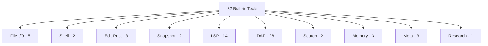

# 09 · 32 Built-in Tools

oh-my-pi ships **32 built-in tools** organized by purpose. The agent sees them as ordinary tool calls; the runtime dispatches to the right implementation (TypeScript, Rust NAPI, LSP server, DAP adapter, etc.). This page is the canonical reference for what each tool does and when to use it.

**Source:** `packages/coding-agent/src/core/tools/` (10 categories, 32 tool definitions)

## The 10 categories



## File I/O (5)

| Tool | Purpose | Native? |
|------|---------|---------|
| `read` | Read a file with line numbers | ✗ |
| `write` | Create/overwrite a file | ✗ |
| `edit` | Substring find-and-replace | ✗ |
| `glob` | Find files matching a pattern | ✗ |
| `grep` | Search file contents (regex) | ✗ |

Standard file operations, all in TypeScript. See the 5 file I/O entries in the table above for the tool list — the interface is the same as pi-mono.

The `read` tool returns content in **standard** format (not hashline). For hashline format, use the [`hashline` tool](/docs/08-hashline).

## Shell (2)

| Tool | Purpose | Native? |
|------|---------|---------|
| `bash` | Run a shell command | ✓ `pi-shell` |
| `process` | Manage a backgrounded process | ✓ `pi-shell` |

Both delegated to the **Rust `pi-shell` crate** for safety (process group kill, output streaming, command minimizer). See [Rust Core](/docs/01-rust-core) for the implementation.

## Edit (Rust) (3)

| Tool | Purpose | Native? |
|------|---------|---------|
| `hashline` | Read a file with line:hash format | ✓ `pi-ast` |
| `hashline_replace` | Replace lines (hash-verified) | ✓ `pi-ast` |
| `hashline_insert` | Insert lines (hash-verified) | ✓ `pi-ast` |

The signature edit primitive. See [hashline](/docs/08-hashline).

## Snapshot (2)

| Tool | Purpose | Native? |
|------|---------|---------|
| `snap` | Snapshot the project filesystem | ✓ `pi-iso` |
| `restore` | Restore a snapshot | ✓ `pi-iso` |

Cheap copy-on-write snapshots via the Rust `pi-iso` crate. See [Rust Core](/docs/01-rust-core) + [snapcompact](/docs/10-snapcompact).

## LSP (14)

| Tool | LSP Method |
|------|------------|
| `lsp_hover` | `textDocument/hover` |
| `lsp_definition` | `textDocument/definition` |
| `lsp_references` | `textDocument/references` |
| `lsp_completion` | `textDocument/completion` |
| `lsp_signature` | `textDocument/signatureHelp` |
| `lsp_codeAction` | `textDocument/codeAction` |
| `lsp_rename` | `textDocument/rename` |
| `lsp_format` | `textDocument/formatting` |
| `lsp_rangeFormat` | `textDocument/rangeFormatting` |
| `lsp_prepareRename` | `textDocument/prepareRename` |
| `lsp_documentSymbol` | `textDocument/documentSymbol` |
| `lsp_semanticTokens` | `textDocument/semanticTokens` |
| `lsp_inlayHint` | `textDocument/inlayHint` |
| `lsp_diagnostic` | `textDocument/diagnostic` |

See [LSP](/docs/06-lsp).

## DAP (28)

| Tool | DAP Method |
|------|------------|
| `dap_launch` | `launch` |
| `dap_attach` | `attach` |
| `dap_configurationDone` | `configurationDone` |
| `dap_setBreakpoints` | `setBreakpoints` |
| `dap_setExceptionBreakpoints` | `setExceptionBreakpoints` |
| `dap_continue` | `continue` |
| `dap_next` | `next` |
| `dap_stepIn` | `stepIn` |
| `dap_stepOut` | `stepOut` |
| `dap_pause` | `pause` |
| `dap_threads` | `threads` |
| `dap_stackTrace` | `stackTrace` |
| `dap_scopes` | `scopes` |
| `dap_variables` | `variables` |
| `dap_setVariable` | `setVariable` |
| `dap_evaluate` | `evaluate` |
| `dap_watch` | `watch` |
| `dap_source` | `source` |
| `dap_exceptionInfo` | `exceptionInfo` |
| `dap_loadedSources` | `loadedSources` |
| `dap_completions` | `completions` |
| `dap_runInTerminal` | `runInTerminal` |
| `dap_startDebugging` | `startDebugging` |
| `dap_disconnect` | `disconnect` |
| `dap_terminate` | `terminate` |
| `dap_restart` | `restart` |
| `dap_goto` | `goto` |
| `dap_reverseContinue` | `reverseContinue` |

See [DAP](/docs/07-dap).

## Search (2)

| Tool | Purpose | Native? |
|------|---------|---------|
| `web_search` | Search the web | ✗ |
| `fetch_url` | Fetch a URL and convert to Markdown | ✗ |

Standard external lookups. Providers: Tavily, Brave, or custom (via `HttpDispatcher`).

## Memory (3)

| Tool | Purpose | Native? |
|------|---------|---------|
| `memory_read` | Read a memory entry | ✗ |
| `memory_write` | Write a memory entry | ✗ |
| `memory_list` | List memory entries | ✗ |

Backed by [`pi-mnemopi`](/docs/11-pi-mnemopi) — the long-term memory system with semantic search.

## Meta (3)

| Tool | Purpose | Native? |
|------|---------|---------|
| `todo_write` | Manage the internal task list | ✗ |
| `skill` | Activate/deactivate a skill | ✗ |
| `mode_switch` | Switch between modes | ✗ |

Standard meta tools, same as pi-mono.

## Research (1)

| Tool | Purpose | Native? |
|------|---------|---------|
| `autoresearch` | Search the agent's own codebase for context | ✗ |

A new tool unique to oh-my-pi. The agent can ask "how does the `hashline` tool work?" and get a relevant code snippet from the pre-embedded omp codebase.

## The tool contract

Same as pi-mono — TypeBox schema + execute function:

```ts
import { Type, type Static } from "typebox";
import type { AgentTool } from "@oh-my-pi/pi-agent-core";

const MyArgs = Type.Object({
  input: Type.String()
});

type MyArgs = Static<typeof MyArgs>;

const myTool: AgentTool<typeof MyArgs> = {
  name: "my_tool",
  description: "An example tool",
  inputSchema: MyArgs,
  requiredCapabilities: [],  // oh-my-pi addition
  optionalCapabilities: ["thinking"],
  async execute(args, ctx) {
    return { content: [{ type: "text", text: `Got: ${args.input}` }] };
  }
};
```

The `requiredCapabilities` and `optionalCapabilities` fields are new in oh-my-pi. The `capabilityFilter` in the agent loop uses them to hide tools the current model can't use.

## The `ToolContext`

Same as pi-mono, with 4 new fields:

```ts
type ToolContext = {
  // Original pi-mono fields
  fs: FileSystem;
  process: ProcessRunner;
  fetch: HttpDispatcher;
  signal: AbortSignal;
  state: AgentState;
  config: Config;
  log: Logger;
  
  // oh-my-pi additions
  lsp: LspClientPool;          // LSP tool dispatcher
  dap: DapClient;              // DAP tool dispatcher
  hashline: HashlineNative;    // Native hashline operations
  iso: IsoNative;              // Native pi-iso operations
};
```

The 4 new fields are bound to the **native** implementations when available, with JS fallbacks.

## Tool filtering

The capability-based filter:

```ts
function filterToolsForModel(tools: AgentTool[], model: Model): AgentTool[] {
  return tools.filter(tool => {
    return tool.requiredCapabilities.every(cap => model.capability[cap] === true);
  });
}
```

For a model without `imageInput`, the `read_image` tool is hidden. For a model without `thinking`, the deep-refactor tools are hidden. The LLM never sees tools it can't use.

## Tool output format

Same as pi-mono:

```ts
{
  content: (TextContent | ImageContent)[],
  details?: unknown,
  isError?: boolean,
  terminate?: boolean
}
```

The `terminate: true` field is a hint to stop the agent after the current tool batch (only if all tools in the batch set it).

## Tool concurrency

The agent can run tools in **parallel** (default for read-only tools):

```ts
// The LLM sends multiple tool calls in one assistant message
[
  { name: "lsp_hover", args: { file, line, char } },
  { name: "lsp_definition", args: { file, line, char } },
  { name: "lsp_references", args: { file, line, char } }
]

// The agent loop executes them concurrently
// tool_execution_end events fire in completion order
```

For side-effecting tools (write, bash, hashline_replace), the default is **sequential**.

## Cancellation

`ctx.signal.aborted()` is checked between tool operations. The agent can be aborted by:

- User hitting Ctrl-C
- Stop button in the TUI
- Timeout (configurable per-tool)
- Sub-agent completion (for `swarm-extension`)

## Tool telemetry

Every tool call is recorded via `omp-stats` (OpenTelemetry):

```ts
{
  toolName: "bash",
  duration: 1234,  // ms
  success: true,
  input: { command: "npm test", timeout: 30000 },
  output: { exitCode: 0, stdout: "...", stderr: "" }
}
```

This is exported via OTLP to Datadog/Honeycomb/Tempo for monitoring.

## Writing a new tool

Three steps:

1. Create `packages/coding-agent/src/core/tools/my-tool/index.ts`:

```ts
import { Type, type Static } from "typebox";
import type { AgentTool } from "@oh-my-pi/pi-agent-core";

const MyArgs = Type.Object({ input: Type.String() });
type MyArgs = Static<typeof MyArgs>;

const myTool: AgentTool<typeof MyArgs> = {
  name: "my_tool",
  description: "An example tool",
  inputSchema: MyArgs,
  requiredCapabilities: [],
  async execute(args, ctx) {
    return { content: [{ type: "text", text: `Got: ${args.input}` }] };
  }
};

export default myTool;
```

2. Register in `packages/coding-agent/src/core/tools/index.ts`:

```ts
import myTool from "./my-tool/index.js";

export const BUILTIN_TOOLS: AgentTool[] = [
  // ... existing 32
  myTool
];
```

3. Add to the system prompt (in `harness/system-prompt.ts`) if the tool needs usage guidance.

No change to the agent loop is needed.

## Tool discovery

The TUI's `/tools` command shows:

- All available tools
- Required capabilities
- Current call count (per session)
- Average duration
- Success rate

Useful for debugging "why is the agent slow?" or "why is the X tool not being called?".

## What hasn't changed from pi-mono

The 5 file I/O tools, 2 shell tools, 2 search tools, 3 memory tools, 3 meta tools are **the same as pi-mono** — same interface, same behavior. The agent code is drop-in compatible.

The 14 LSP tools, 28 DAP tools, 3 hashline tools, 2 snapshot tools, 1 autoresearch tool are **new in oh-my-pi**.

Total: 32 unique tools (62 tool names, but DAP and LSP have many subcommands that share infrastructure).

## Next

- [LSP](/docs/06-lsp) — the 14 LSP operations
- [DAP](/docs/07-dap) — the 28 DAP operations
- [hashline](/docs/08-hashline) — the 3 hashline tools
- [snapcompact](/docs/10-snapcompact) — the 2 snapshot tools
- [pi-mnemopi](/docs/11-pi-mnemopi) — the 3 memory tools
- See [this file's tools reference](/docs/09-tools#the-10-categories) for the full list