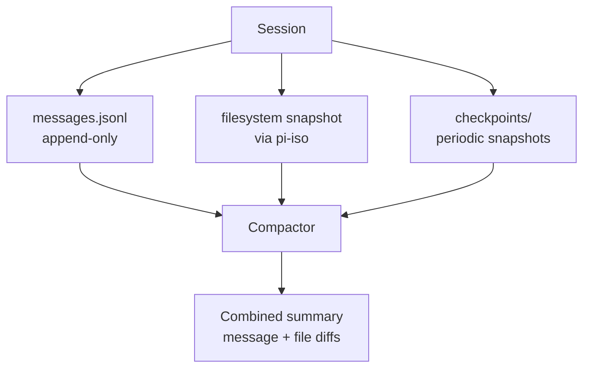
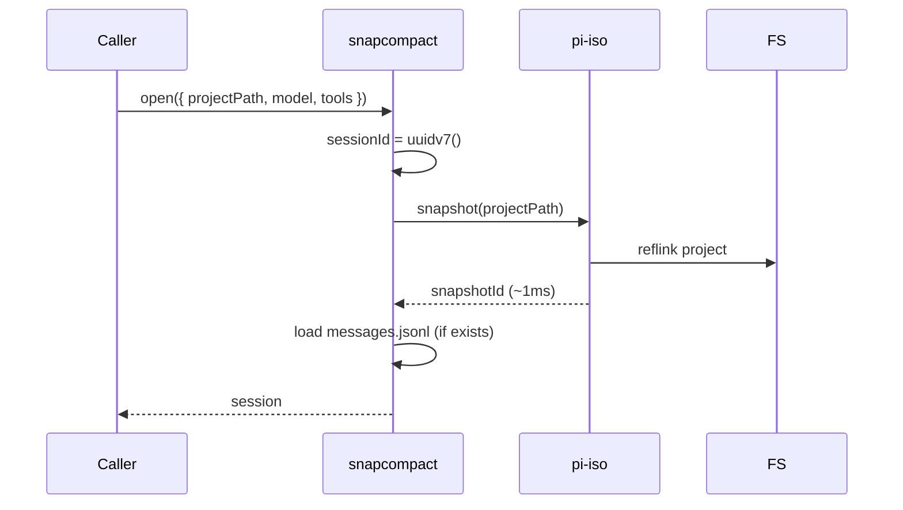
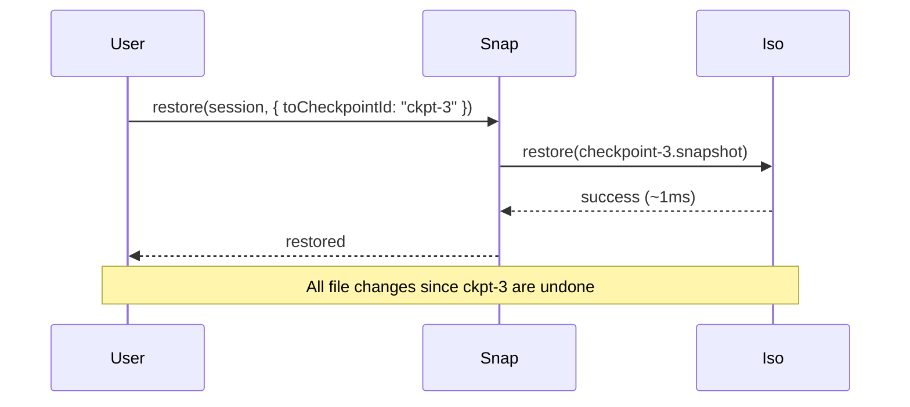
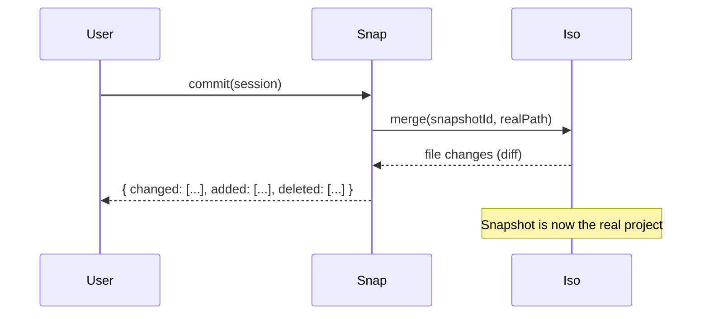

# 10 · snapcompact — Snapshot + Compact

`@oh-my-pi/snapcompact` is oh-my-pi's **hybrid persistence** layer. It combines two strategies:

1. **JSONL** for messages (same as pi-mono) — append-only, forward-compatible
2. **Filesystem snapshots** (via `pi-iso`) — cheap copy-on-write clones

The compaction algorithm combines both: prune old messages AND roll back filesystem changes. The result is **fully reversible** agent sessions.

**Source:** `packages/snapcompact/src/` (~10 files: snapshot.ts, compact.ts, restore.ts, store.ts, etc.)

## The problem with JSONL only

In pi-mono, the session is purely JSONL. The agent's **filesystem** changes are not tracked. If the agent does:

```bash
git rm important-file.txt
```

The change is applied to the **real** project. To undo it, the user has to:

1. Realize what happened
2. Find the file in git history (if it was committed)
3. Restore it manually
4. Hope nothing else broke

This is fragile. The agent should be **reversible by default**.

## The snapcompact solution

`@oh-my-pi/snapcompact` adds **filesystem snapshots** alongside the JSONL:



The lifecycle:

1. **Session start** — take a snapshot of the project (via `pi-iso`)
2. **Per turn** — record the agent's tool calls (to JSONL)
3. **Per N turns** (or on dangerous operations) — take a checkpoint snapshot
4. **Session end** — user chooses: commit (merge snapshot to real project) or restore (discard snapshot)
5. **Compaction** — prune old messages AND show file diffs

## The data model

```ts
// packages/snapcompact/src/types.ts
export interface SnapSession {
  id: SessionId;                  // UUIDv7
  createdAt: Date;
  updatedAt: Date;
  
  // Snapshot
  snapshotId: IsoSnapshotId;      // from pi-iso
  snapshotPath: string;            // path to the snapshot
  
  // Messages
  messages: AgentMessage[];        // in-memory; persisted to JSONL
  
  // Checkpoints
  checkpoints: Checkpoint[];
  
  // Metadata
  model: ModelId;
  tools: string[];
  config: SessionConfig;
  
  // Tags
  tags: string[];                  // e.g. ["work", "bug-fix-123"]
}

export interface Checkpoint {
  id: CheckpointId;
  turn: number;                    // turn index
  snapshotId: IsoSnapshotId;       // point-in-time snapshot
  createdAt: Date;
  reason: "periodic" | "dangerous_tool" | "manual";
}
```

A session has **one main snapshot** (at start) and **N checkpoints** (at intervals).

## The `open()` method

```ts
// packages/snapcompact/src/index.ts
export async function open(opts: OpenOptions): Promise<SnapSession>;

export interface OpenOptions {
  projectPath: string;            // project to snapshot
  sessionId?: SessionId;          // resume existing; default = new
  model: Model;
  tools: AgentTool[];
  snapshotOnOpen?: boolean;        // default true
  checkpointEvery?: number;        // turns; default 5
  checkpointOnDangerous?: boolean; // default true
}
```

The flow:



If `sessionId` is provided, the existing JSONL is loaded. If `projectPath` is provided, a new snapshot is taken (or the existing one is reused if the path matches).

## The `checkpoint()` method

```ts
export async function checkpoint(session: SnapSession, reason: CheckpointReason): Promise<Checkpoint>;
```

Called periodically or before dangerous operations:

```ts
// In the agent loop
if (session.turn % session.config.checkpointEvery === 0) {
  await snapcompact.checkpoint(session, "periodic");
}

if (isDangerousTool(toolCall)) {
  await snapcompact.checkpoint(session, "dangerous_tool");
}
```

The checkpoint takes a **new** `pi-iso` snapshot of the current state. The cost is ~1ms (BTRFS/APFS reflink) or ~10ms (overlayfs). Cheap enough to do every 5 turns.

## The `restore()` method

```ts
export async function restore(session: SnapSession, options?: RestoreOptions): Promise<RestoreResult>;

export interface RestoreOptions {
  toCheckpointId?: CheckpointId;  // restore to specific checkpoint
  // If omitted, restores to the original snapshot (start of session)
}
```

Restores the **filesystem** to the chosen checkpoint (or session start):



The JSONL is **not** restored — the user can still read what the agent did. Only the filesystem is rolled back.

## The `commit()` method

```ts
export async function commit(session: SnapSession): Promise<CommitResult>;
```

Merges the snapshot back into the real project:



The agent's changes are applied to the real project. The snapshot is **deleted** (or moved to `.omp/snapshots/archive/`).

## The `diff()` method

```ts
export async function diff(session: SnapSession, options?: DiffOptions): Promise<FileDiff>;

export interface DiffOptions {
  fromCheckpointId?: CheckpointId;
  toCheckpointId?: CheckpointId;
  // Default: from session start to now
}
```

Shows the file changes between two points in time:

```ts
{
  added: ["src/new-file.ts"],
  modified: ["src/index.ts", "package.json"],
  deleted: ["src/old-file.ts"],
  unchanged: 47
}
```

The user can see what the agent did before deciding to commit or restore.

## Compaction: messages + files

The compaction algorithm combines **message compaction** (from `pi-agent-core`) with **file diff summarization**:

```ts
// packages/snapcompact/src/compact.ts
export async function compact(
  session: SnapSession,
  model: Model,
  config: CompactionConfig
): Promise<CompactResult> {
  // 1. Compact the messages (4 strategies: summary, append, branch, tail-prune)
  const messageResult = await messageCompact(session, model, config);
  
  // 2. Compute the file diff between checkpoints
  const fileDiffs = computeFileDiffs(session.checkpoints);
  
  // 3. Summarize the file changes
  const fileSummary = await summarizeFileDiffs(fileDiffs, model);
  
  return {
    messageResult,
    fileSummary,
    newSnapshot: messageResult.requiresSnapshot ? await iso.snapshot(session.snapshotPath) : null
  };
}
```

The compaction produces a single summary message that includes:

```
## Conversation Summary
[message summary from pi-agent-core]

## Files Modified
- src/index.ts: changed 5 lines (added type annotation)
- package.json: changed 1 line (added dep)
- 2 new files created

## Decisions
- Chose Express over Fastify for HTTP
- Used BTRFS reflink for snapshot
```

The LLM can resume with full context — both what was said and what was done.

## The `store` — on-disk format

```
.omp/
├── sessions/
│   └── <projectId>/
│       └── <sessionId>/
│           ├── session.json          # metadata
│           ├── messages.jsonl        # append-only
│           ├── checkpoints/          # pi-iso snapshots
│           │   ├── ckpt-1.snap
│           │   ├── ckpt-2.snap
│           │   └── ...
│           └── debug/                # debug snapshots (if enabled)
│               ├── turn-1.json
│               └── turn-2.json
└── snapshots/
    └── archive/                      # committed snapshots
        └── <sessionId>/
```

The `messages.jsonl` is the same format as pi-mono. The `checkpoints/` are `pi-iso` snapshots — opaque to snapcompact, just file system state.

## The "dangerous tool" trigger

`@oh-my-pi/snapcompact` knows which tools are "dangerous" and auto-checkpoints before them:

```ts
const DANGEROUS_TOOLS = new Set([
  "bash",                    // shell
  "write",                   // overwrites file
  "hashline_replace",        // edits file
  "hashline_insert",         // edits file
  "process",                 // background process
  "dap_terminate",           // kills debuggee
]);
```

The agent loop checks:

```ts
if (DANGEROUS_TOOLS.has(toolCall.name)) {
  await snapcompact.checkpoint(session, "dangerous_tool");
}
```

The user can override in `~/.omp/settings.json`:

```json
{
  "snapcompact": {
    "dangerousTools": ["bash", "write", "hashline_replace"],
    "checkpointOnDangerous": true,
    "checkpointEvery": 5
  }
}
```

## The compaction triggers

Compaction is triggered by:

1. **Token threshold** — `state.tokens > model.contextWindow * 0.8`
2. **Manual** — `/compact` slash command
3. **Session end** — automatic before commit
4. **Provider error** — if the LLM returns a context-overflow error

```ts
// In the agent loop
if (snapcompact.shouldCompact(session, model)) {
  await snapcompact.compact(session, model, config);
}
```

## The `resume()` method

```ts
export async function resume(sessionId: SessionId, projectPath: string): Promise<SnapSession>;
```

Resumes a previous session:

1. Loads `session.json` + `messages.jsonl`
2. Verifies the snapshot path is still valid (or takes a new one)
3. Returns the session object

If the project has changed since the original snapshot, snapcompact warns:

```
⚠️ Project has changed since session start.
- 15 new files (not in snapshot)
- 3 deleted files
- 47 modified files

Resume anyway? (y/n)
```

The user can choose to take a new snapshot (and lose the ability to restore) or cancel.

## Why this is better than pi-mono

| Aspect | pi-mono | oh-my-pi (snapcompact) |
|--------|---------|------------------------|
| Messages | JSONL | JSONL (same) |
| Filesystem | Not tracked | Tracked via `pi-iso` snapshots |
| Compaction | Messages only | Messages + file diffs |
| Restore | Not possible | Restore to any checkpoint |
| Commit | Implicit (changes already applied) | Explicit (changes held in snapshot) |
| Reversibility | Manual | Automatic (1ms) |
| Cost | 0 | ~1MB per checkpoint (BTRFS) |

The cost is minimal (BTRFS reflinks are free in disk space until written) and the safety guarantee is **massive** — the agent can run `rm -rf` and the user can undo in 1ms.

## What snapcompact doesn't do

- **Network snapshots** — the project's network state (e.g. running services) is not tracked
- **External state** — database changes, API calls, etc. are not tracked
- **Cross-host sessions** — a session lives on one host; no replication
- **Encryption** — the JSONL is plain text; if you need encryption, use filesystem-level encryption (LUKS, FileVault, BitLocker)

## Configuration

```json
{
  "snapcompact": {
    "snapshotOnOpen": true,
    "checkpointEvery": 5,
    "checkpointOnDangerous": true,
    "maxCheckpoints": 20,           // keep at most 20 checkpoints per session
    "compactionStrategy": "append",
    "compactionThreshold": 0.8,
    "summaryModel": "claude-haiku-4"
  }
}
```

The `maxCheckpoints` setting prunes old checkpoints to keep disk usage bounded.

## Next

- [pi-coding-agent · CLI](/docs/05-pi-coding-agent) — the consumer
- [Rust Core](/docs/01-rust-core) — the `pi-iso` snapshots
- [pi-mnemopi](/docs/11-pi-mnemopi) — the memory system
- [pi-wire](/docs/12-pi-wire) — the wire protocol for cross-process sessions
