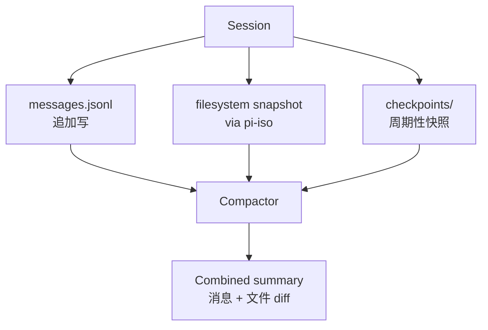
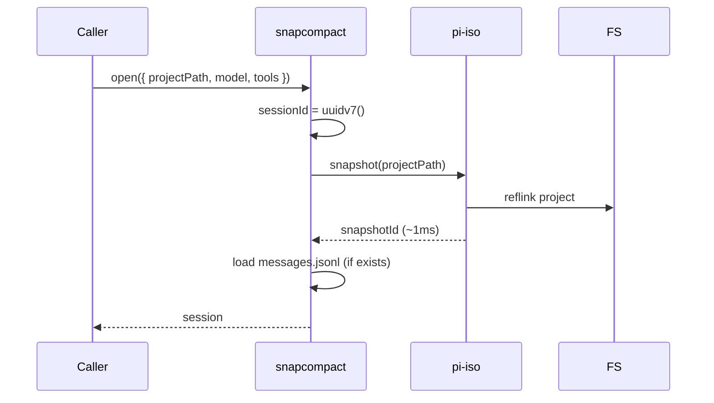
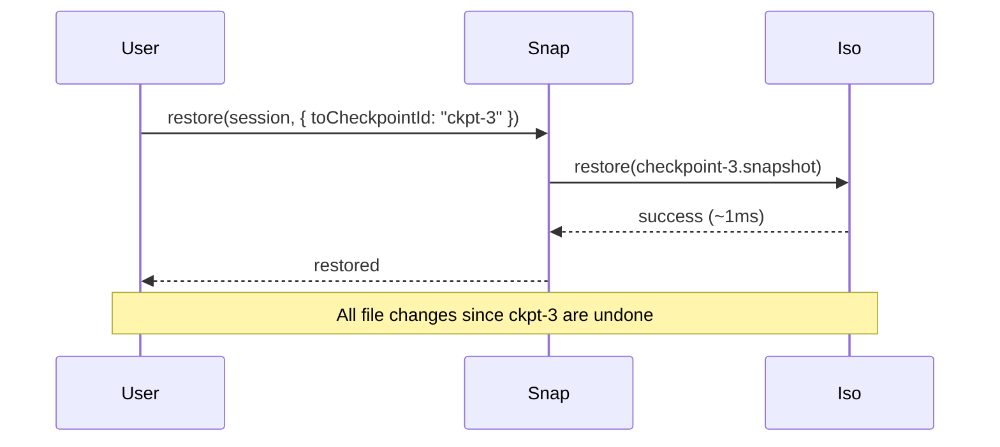
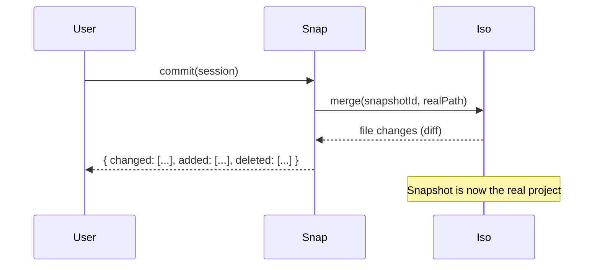

# 10 · snapcompact 快照+压缩

`@oh-my-pi/snapcompact` 是 oh-my-pi 的**混合持久化**层。它结合了两种策略：

1. **JSONL** 存消息（与 pi-mono 一样）—— 追加写、向前兼容
2. **文件系统快照**（通过 `pi-iso`）—— 廉价的 copy-on-write 克隆

压缩算法把两者结合：既剪掉旧消息、又回滚文件系统变更。最终得到**完全可逆**的 Agent 会话。

**源码：** `packages/snapcompact/src/`（约 10 个文件：snapshot.ts、compact.ts、restore.ts、store.ts 等）

## 仅用 JSONL 的问题

在 pi-mono 中，会话纯粹是 JSONL。Agent 对**文件系统**的变更不会被跟踪。如果 Agent 执行：

```bash
git rm important-file.txt
```

这个变更会作用到**真实**的项目上。要撤销它，用户必须：

1. 意识到发生了什么
2. 在 git 历史中找到这个文件（如果之前提交过）
3. 手动恢复
4. 祈祷没把别的东西搞坏

这很脆弱。Agent 应该**默认就可逆**。

## snapcompact 的解决方案

`@oh-my-pi/snapcompact` 在 JSONL 之外增加了**文件系统快照**：



生命周期：

1. **会话开始** —— 对项目拍一个快照（通过 `pi-iso`）
2. **每回合** —— 把 Agent 的工具调用记录到 JSONL
3. **每 N 回合**（或在危险操作前）—— 拍一个 checkpoint 快照
4. **会话结束** —— 用户选择：commit（把快照合回真实项目）或 restore（丢弃快照）
5. **压缩** —— 剪掉旧消息并展示文件 diff

## 数据模型

```ts
// packages/snapcompact/src/types.ts
export interface SnapSession {
  id: SessionId;                  // UUIDv7
  createdAt: Date;
  updatedAt: Date;

  // 快照
  snapshotId: IsoSnapshotId;      // 来自 pi-iso
  snapshotPath: string;            // 快照所在路径

  // 消息
  messages: AgentMessage[];        // 内存中；持久化到 JSONL

  // 检查点
  checkpoints: Checkpoint[];

  // 元数据
  model: ModelId;
  tools: string[];
  config: SessionConfig;

  // 标签
  tags: string[];                  // 例如 ["work", "bug-fix-123"]
}

export interface Checkpoint {
  id: CheckpointId;
  turn: number;                    // 回合序号
  snapshotId: IsoSnapshotId;       // 某时间点的快照
  createdAt: Date;
  reason: "periodic" | "dangerous_tool" | "manual";
}
```

一个会话有**一个主快照**（在开始时）和 **N 个 checkpoint**（在间隔处）。

## `open()` 方法

```ts
// packages/snapcompact/src/index.ts
export async function open(opts: OpenOptions): Promise<SnapSession>;

export interface OpenOptions {
  projectPath: string;            // 要快照的项目
  sessionId?: SessionId;          // 恢复已有；默认新建
  model: Model;
  tools: AgentTool[];
  snapshotOnOpen?: boolean;        // 默认 true
  checkpointEvery?: number;        // 回合数；默认 5
  checkpointOnDangerous?: boolean; // 默认 true
}
```

流程如下：



如果提供了 `sessionId`，会加载已有 JSONL。如果提供了 `projectPath`，会拍一个新快照（如果路径匹配则复用已有快照）。

## `checkpoint()` 方法

```ts
export async function checkpoint(session: SnapSession, reason: CheckpointReason): Promise<Checkpoint>;
```

周期性调用或在危险操作前调用：

```ts
// 在 Agent 循环中
if (session.turn % session.config.checkpointEvery === 0) {
  await snapcompact.checkpoint(session, "periodic");
}

if (isDangerousTool(toolCall)) {
  await snapcompact.checkpoint(session, "dangerous_tool");
}
```

checkpoint 会对当前状态拍一个**新的** `pi-iso` 快照。代价约 1ms（BTRFS/APFS reflink）或约 10ms（overlayfs）。足够廉价，可以每 5 回合拍一次。

## `restore()` 方法

```ts
export async function restore(session: SnapSession, options?: RestoreOptions): Promise<RestoreResult>;

export interface RestoreOptions {
  toCheckpointId?: CheckpointId;  // 恢复到指定 checkpoint
  // 省略时恢复到原始快照（会话开始时）
}
```

将**文件系统**恢复到所选 checkpoint（或会话开始时）：



JSONL **不会**被恢复 —— 用户仍能阅读 Agent 做了什么。只有文件系统被回滚。

## `commit()` 方法

```ts
export async function commit(session: SnapSession): Promise<CommitResult>;
```

把快照合回真实项目：



Agent 的变更会被应用到真实项目。快照会被**删除**（或被移到 `.omp/snapshots/archive/`）。

## `diff()` 方法

```ts
export async function diff(session: SnapSession, options?: DiffOptions): Promise<FileDiff>;

export interface DiffOptions {
  fromCheckpointId?: CheckpointId;
  toCheckpointId?: CheckpointId;
  // 默认：从会话开始到当前
}
```

展示两个时间点之间的文件变化：

```ts
{
  added: ["src/new-file.ts"],
  modified: ["src/index.ts", "package.json"],
  deleted: ["src/old-file.ts"],
  unchanged: 47
}
```

用户在决定 commit 还是 restore 之前能看清 Agent 做了什么。

## 压缩：消息 + 文件

压缩算法把**消息压缩**（来自 `pi-agent-core`）和**文件 diff 摘要**组合在一起：

```ts
// packages/snapcompact/src/compact.ts
export async function compact(
  session: SnapSession,
  model: Model,
  config: CompactionConfig
): Promise<CompactResult> {
  // 1. 压缩消息（4 种策略：summary、append、branch、tail-prune）
  const messageResult = await messageCompact(session, model, config);

  // 2. 计算 checkpoint 之间的文件 diff
  const fileDiffs = computeFileDiffs(session.checkpoints);

  // 3. 摘要文件变更
  const fileSummary = await summarizeFileDiffs(fileDiffs, model);

  return {
    messageResult,
    fileSummary,
    newSnapshot: messageResult.requiresSnapshot ? await iso.snapshot(session.snapshotPath) : null
  };
}
```

压缩产生一条包含以下内容的总结消息：

```
## Conversation Summary
|[message summary from pi-agent-core]

## Files Modified
|- src/index.ts: changed 5 lines (added type annotation)
|- package.json: changed 1 line (added dep)
|- 2 new files created

## Decisions
|- Chose Express over Fastify for HTTP
|- Used BTRFS reflink for snapshot
```

LLM 可以带着完整上下文继续 —— 既包含说了什么，也包含做了什么。

## `store` — 磁盘上的格式

```
.omp/
├── sessions/
│   └── <projectId>/
│       └── <sessionId>/
│           ├── session.json          # 元数据
│           ├── messages.jsonl        # 追加写
│           ├── checkpoints/          # pi-iso 快照
│           │   ├── ckpt-1.snap
│           │   ├── ckpt-2.snap
│           │   └── ...
│           └── debug/                # 调试快照（如果开启）
│               ├── turn-1.json
│               └── turn-2.json
└── snapshots/
    └── archive/                      # 已 commit 的快照
        └── <sessionId>/
```

`messages.jsonl` 与 pi-mono 是同一格式。`checkpoints/` 是 `pi-iso` 快照 —— 对 snapcompact 是不透明的，只是文件系统状态。

## "危险工具" 触发条件

`@oh-my-pi/snapcompact` 知道哪些工具是 "危险的"，会在执行前自动 checkpoint：

```ts
const DANGEROUS_TOOLS = new Set([
  "bash",                    // shell
  "write",                   // 覆盖文件
  "hashline_replace",        // 编辑文件
  "hashline_insert",         // 编辑文件
  "process",                 // 后台进程
  "dap_terminate",           // 杀掉被调试进程
]);
```

Agent 循环会检查：

```ts
if (DANGEROUS_TOOLS.has(toolCall.name)) {
  await snapcompact.checkpoint(session, "dangerous_tool");
}
```

用户可以在 `~/.omp/settings.json` 中覆盖：

```json
{
  "snapcompact": {
    "dangerousTools": ["bash", "write", "hashline_replace"],
    "checkpointOnDangerous": true,
    "checkpointEvery": 5
  }
}
```

## 压缩触发条件

压缩会在以下情况触发：

1. **token 阈值** — `state.tokens > model.contextWindow * 0.8`
2. **手动** — `/compact` 斜杠命令
3. **会话结束** — commit 之前自动
4. **提供方错误** — 如果 LLM 返回上下文溢出错误

```ts
// 在 Agent 循环中
if (snapcompact.shouldCompact(session, model)) {
  await snapcompact.compact(session, model, config);
}
```

## `resume()` 方法

```ts
export async function resume(sessionId: SessionId, projectPath: string): Promise<SnapSession>;
```

恢复一个先前的会话：

1. 加载 `session.json` + `messages.jsonl`
2. 校验快照路径仍有效（或重新拍一个）
3. 返回会话对象

如果项目自原始快照之后发生了变化，snapcompact 会发出警告：

```
⚠️ Project has changed since session start.
|- 15 new files (not in snapshot)
|- 3 deleted files
|- 47 modified files

Resume anyway? (y/n)
```

用户可以选择重新拍快照（但失去回退能力）或取消。

## 为什么这比 pi-mono 更好

| 维度 | pi-mono | oh-my-pi (snapcompact) |
|--------|---------|------------------------|
| 消息 | JSONL | JSONL（相同） |
| 文件系统 | 不跟踪 | 通过 `pi-iso` 快照跟踪 |
| 压缩 | 仅消息 | 消息 + 文件 diff |
| 恢复 | 不可能 | 可恢复到任意 checkpoint |
| Commit | 隐式（变更已应用） | 显式（变更被保存在快照中） |
| 可逆性 | 手动 | 自动（1ms） |
| 代价 | 0 | 每个 checkpoint 约 1MB（BTRFS） |

代价极小（BTRFS reflink 在写入前不占磁盘空间），安全保证却是**巨大的** —— Agent 可以跑 `rm -rf`，用户可以在 1ms 内撤销。

## snapcompact 不做的事

- **网络快照** — 项目的网络状态（例如运行中的服务）不会被跟踪
- **外部状态** — 数据库变更、API 调用等不会被跟踪
- **跨主机会话** — 会话只存在于一台主机；不做复制
- **加密** — JSONL 是明文；如需加密请使用文件系统级加密（LUKS、FileVault、BitLocker）

## 配置

```json
{
  "snapcompact": {
    "snapshotOnOpen": true,
    "checkpointEvery": 5,
    "checkpointOnDangerous": true,
    "maxCheckpoints": 20,           // 每个会话最多保留 20 个 checkpoint
    "compactionStrategy": "append",
    "compactionThreshold": 0.8,
    "summaryModel": "claude-haiku-4"
  }
}
```

`maxCheckpoints` 设置会裁剪旧 checkpoint 以限制磁盘占用。

## 接下来

- [pi-coding-agent · CLI](/docs/05-pi-coding-agent) — 消费者
- [Rust Core](/docs/01-rust-core) — `pi-iso` 快照
- [pi-mnemopi](/docs/11-pi-mnemopi) — memory 系统
- [pi-wire](/docs/12-pi-wire) — 跨进程会话的 wire 协议
