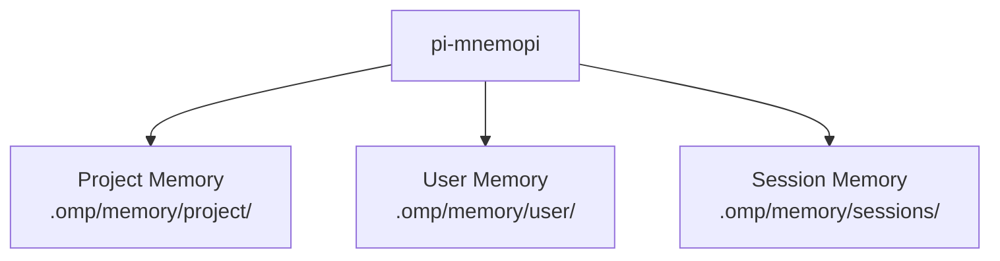
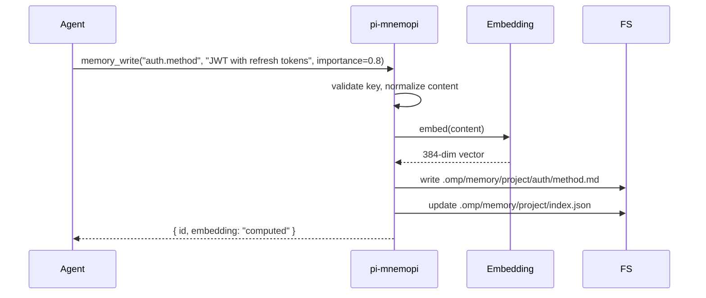
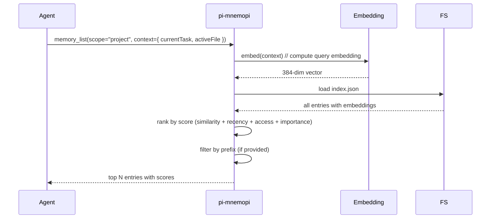

# 11 · pi-mnemopi — Memory System

`@oh-my-pi/pi-mnemopi` is oh-my-pi's **long-term memory system**. Beyond the per-session JSONL, the agent can store persistent knowledge that survives across sessions: project facts, user preferences, code patterns, debugging insights, and more. Backed by embeddings for semantic search.

**Source:** `packages/mnemopi/src/` (10+ files: store.ts, embed.ts, search.ts, decay.ts, etc.)

## What's in memory

Three categories of memory:

1. **Project memory** — facts about the project (architecture, conventions, quirks)
2. **User memory** — facts about the user (preferences, habits, style)
3. **Session memory** — learnings from past sessions (what worked, what didn't)



Each category is a separate file tree with its own scope and lifetime.

## The `MemoryEntry` type

```ts
// packages/mnemopi/src/types.ts
export interface MemoryEntry {
  id: MemoryId;                  // UUIDv7
  scope: "project" | "user" | "session";
  projectId?: string;            // required for "project" and "session"
  key: string;                   // dot-notation, e.g. "auth.method"
  content: string;               // markdown body
  
  // Metadata
  tags: string[];
  importance: number;            // 0-1, affects decay
  confidence: number;            // 0-1, affects retrieval weight
  
  // Embedding
  embedding?: number[];          // 384-dim float vector (optional)
  
  // Lifecycle
  createdAt: Date;
  updatedAt: Date;
  lastAccessedAt: Date;
  accessCount: number;
  
  // Source
  source: "agent" | "user" | "system" | "inferred";
  sourceSessionId?: SessionId;   // for "inferred" or "agent"
  
  // Decay
  decayRate: number;             // 0-1, higher = decays faster
  expiresAt?: Date;              // optional TTL
}
```

The fields form three groups:

- **Identity** — `id`, `scope`, `projectId`, `key`, `content`
- **Lifecycle** — `createdAt`, `updatedAt`, `lastAccessedAt`, `accessCount`, `decayRate`, `expiresAt`
- **Quality** — `importance`, `confidence`, `source`

## The file layout

```
.omp/memory/
├── user/
│   ├── preferences/
│   │   ├── formatting.md
│   │   ├── language.md
│   │   └── tools.md
│   ├── style/
│   │   ├── commit-messages.md
│   │   └── code-review.md
│   └── index.json              # embedding index
├── project/
│   ├── architecture/
│   │   ├── backend.md
│   │   ├── frontend.md
│   │   └── data-model.md
│   ├── conventions/
│   │   ├── naming.md
│   │   ├── testing.md
│   │   └── git.md
│   ├── quirks/
│   │   ├── known-bugs.md
│   │   └── workarounds.md
│   └── index.json
└── sessions/
    ├── <sessionId>/
    │   ├── learnings.md
    │   └── index.json
    └── ...
```

Each `.md` file is a memory entry. Each `index.json` is the embedding index (for fast semantic search).

## The 3 memory tools

| Tool | Args | Behavior |
|------|------|----------|
| `memory_read` | `key: string` | Returns the markdown content |
| `memory_write` | `key: string, content: string, importance?: number, tags?: string[]` | Writes (or overwrites) the entry, computes embedding |
| `memory_list` | `scope?: string, prefix?: string` | Lists entries, with optional prefix filter |

The `memory_list` tool also returns a **score** for each entry, ranked by relevance to the current context (via embedding similarity).

## Semantic search

When the agent calls `memory_list`, the results are **ranked by semantic similarity** to the current context:

```ts
// packages/mnemopi/src/search.ts
export async function list(
  scope: MemoryScope,
  prefix?: string,
  context?: SearchContext,
  limit: number = 20
): Promise<MemoryEntry[]>;

export interface SearchContext {
  currentTask?: string;          // current user prompt
  recentMessages?: AgentMessage[]; // last N turns
  activeFile?: string;            // current file being edited
}

export interface ScoredMemory extends MemoryEntry {
  score: number;                 // 0-1
  matchedTerms: string[];        // for explanation
}
```

The search uses:

1. **Embedding similarity** — cosine similarity between the context embedding and each entry's embedding
2. **Recency** — newer entries score higher
3. **Access count** — frequently-accessed entries score higher
4. **Importance** — explicitly marked important entries score higher

The final score is a weighted sum:

```
score = 0.6 * embedding_similarity
      + 0.2 * recency_factor
      + 0.1 * access_factor
      + 0.1 * importance
```

## Embedding model

`pi-mnemopi` uses a local embedding model by default:

- **`@huggingface/transformers`** — runs a small embedding model in-process
- Default model: **`Xenova/all-MiniLM-L6-v2`** (384-dim, 22M params, ~30MB download)
- Fallback: provider API (OpenAI `text-embedding-3-small` or equivalent)

The local model is preferred for:

- Privacy (no data leaves the host)
- Speed (no network round-trip)
- Cost (no per-token charge)

The provider API is preferred for:

- Quality (OpenAI embeddings are state-of-the-art)
- Multilingual support (local model is English-biased)

User can configure in `~/.omp/settings.json`:

```json
{
  "mnemopi": {
    "embedding": {
      "provider": "local",     // "local" | "openai" | "cohere" | "voyage"
      "model": "Xenova/all-MiniLM-L6-v2",
      "dimensions": 384,
      "cacheSize": 1000        // LRU cache for recent embeddings
    }
  }
}
```

## The write path

When the agent writes to memory:



The write is:

1. **Idempotent** — writing the same key overwrites (no duplicates)
2. **Atomic** — the file is written first, then the index (or rolled back)
3. **Embedding-eager** — the embedding is computed before the file is written
4. **Logged** — every write is logged to OpenTelemetry

## The read path

When the agent calls `memory_list`:



The read is:

1. **Contextual** — the ranking depends on what the agent is doing
2. **Fast** — typically < 5ms for 1000 entries
3. **Explainable** — the `matchedTerms` field shows why each entry scored

## Decay

Memory entries have a **decay rate**. Unused entries fade over time:

```ts
// packages/mnemopi/src/decay.ts
export function applyDecay(entry: MemoryEntry, now: Date = new Date()): MemoryEntry {
  const ageDays = (now.getTime() - entry.lastAccessedAt.getTime()) / (1000 * 60 * 60 * 24);
  const decayFactor = Math.exp(-entry.decayRate * ageDays);
  
  return {
    ...entry,
    importance: entry.importance * decayFactor,
    // Entries with importance < 0.1 are candidates for archival
  };
}
```

Default decay rates:

| Scope | Default decay rate | Meaning |
|-------|-------------------|---------|
| `user` | 0.005 | ~0.5% per day, half-life ~140 days |
| `project` | 0.01 | ~1% per day, half-life ~70 days |
| `session` | 0.05 | ~5% per day, half-life ~14 days |

The agent can set custom decay rates on write. The decay is applied lazily (on read), not eagerly (no background process).

## The `inferred` source

Some memory entries are **inferred** by the system, not written by the user or agent:

- "User prefers semicolons" — inferred from past edits
- "Project uses Prettier with single quotes" — inferred from `.prettierrc`
- "Test suite takes 30s" — inferred from observed timings

The system runs an **inference pass** at session end:

```ts
// In the session lifecycle
async function inferMemory(session: SnapSession) {
  const recentMessages = await loadMessages(session.id, { last: 50 });
  const inferencePrompt = `
    Based on the recent conversation, what facts about the project
    or user would be useful in future sessions? Output as JSON:
    [{ key, content, importance, tags }]
  `;
  const inferred = await llmCall(inferencePrompt, recentMessages);
  for (const entry of inferred) {
    await memoryWrite({
      ...entry,
      source: "inferred",
      sourceSessionId: session.id
    });
  }
}
```

The user can disable inference in `~/.omp/settings.json`:

```json
{
  "mnemopi": {
    "inferOnSessionEnd": false
  }
}
```

## The knowledge graph

`pi-mnemopi` also maintains a **knowledge graph** linking related memory entries:

```ts
// packages/mnemopi/src/graph.ts
export interface MemoryGraph {
  nodes: MemoryEntry[];
  edges: MemoryEdge[];
}

export interface MemoryEdge {
  from: MemoryId;
  to: MemoryId;
  type: "related" | "contradicts" | "supersedes" | "derives";
  weight: number;
}
```

Example:

- `auth.method = "JWT"` (related to) → `auth.refresh = "yes"`
- `auth.method = "OAuth"` (supersedes) → `auth.method = "JWT"` (old)

The graph is built by the inference pass and updated on every write. The agent can query:

```ts
const graph = await mem.getGraph();
const related = graph.edges.filter(e => e.from === entryId);
```

Useful for "what else do I know about X?".

## The session-scoped memory

Session memory is special — it lives only for the session duration:

```
.omp/memory/sessions/<sessionId>/
├── learnings.md
├── decisions.md
└── blockers.md
```

The agent uses session memory to track in-progress work:

- **`learnings.md`** — "TIL: this project uses Bun, not Node"
- **`decisions.md`** — "Chose to use BTRFS for snapshots because..."
- **`blockers.md`** — "Can't proceed until user provides API key"

At session end, the user can promote session memory to project memory (or discard it).

## The `commit` and `restore` integration

`snapcompact` is aware of `pi-mnemopi`. When the session is committed or restored:

- **Commit** — session memory is preserved (next session can read it)
- **Restore** — session memory is rolled back too (if it was created after the checkpoint)

This keeps memory consistent with the filesystem state.

## Configuration

```json
{
  "mnemopi": {
    "enabled": true,
    "embedding": {
      "provider": "local",
      "model": "Xenova/all-MiniLM-L6-v2",
      "dimensions": 384
    },
    "decay": {
      "user": 0.005,
      "project": 0.01,
      "session": 0.05
    },
    "inferOnSessionEnd": true,
    "inferenceModel": "claude-haiku-4",
    "maxEntries": 10000,           // per scope
    "maxContentLength": 10000      // per entry
  }
}
```

The `maxEntries` setting prunes low-importance entries when the limit is hit.

## What's NOT in pi-mnemopi

- **Cross-project memory** — entries are scoped to a project; no global knowledge
- **Collaborative memory** — entries are per-user; no team sharing
- **Encryption** — the markdown files are plain text; use filesystem encryption
- **Versioning** — entries don't have history (the JSONL does, but memory is current state only)

## Next

- [snapcompact](/docs/10-snapcompact) — the persistence layer
- [pi-coding-agent · CLI](/docs/05-pi-coding-agent) — the consumer
- [pi-wire](/docs/12-pi-wire) — the wire protocol for cross-process memory
- [omp-stats](/docs/15-omp-stats) — telemetry
