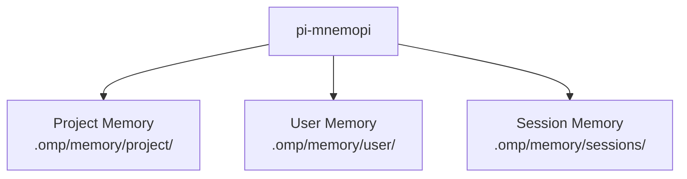
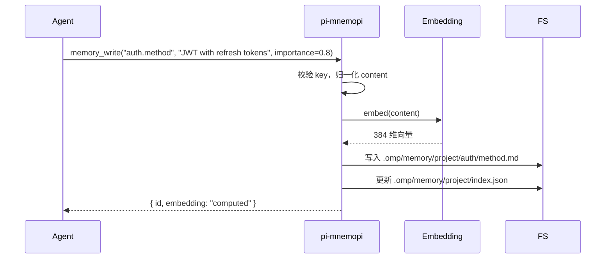
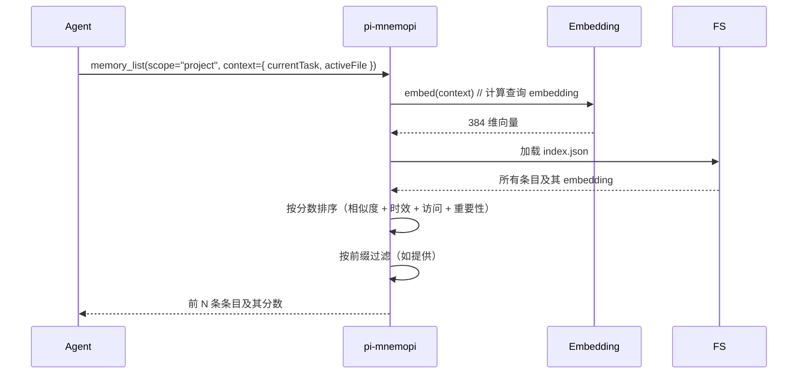

# 11 · pi-mnemopi 长期记忆系统

`@oh-my-pi/pi-mnemopi` 是 oh-my-pi 的 **长期记忆系统**。除了按会话存储的 JSONL 之外，Agent 还可以存储跨会话存活的持久知识：项目事实、用户偏好、代码模式、调试洞察等。由 embedding 支持的语义搜索驱动。

**源码：** `packages/mnemopi/src/`（10+ 个文件：store.ts、embed.ts、search.ts、decay.ts 等）

## 记忆中有什么

三类记忆：

1. **项目记忆** — 关于项目的事实（架构、约定、怪癖）
2. **用户记忆** — 关于用户的事实（偏好、习惯、风格）
3. **会话记忆** — 来自过往会话的学习（什么有效、什么无效）



每个类别都是一个独立的文件树，拥有自己的作用域与生命周期。

## `MemoryEntry` 类型

```ts
// packages/mnemopi/src/types.ts
export interface MemoryEntry {
  id: MemoryId;                  // UUIDv7
  scope: "project" | "user" | "session";
  projectId?: string;            // "project" 和 "session" 必填
  key: string;                   // 点号表示法，例如 "auth.method"
  content: string;               // markdown 正文

  // 元数据
  tags: string[];
  importance: number;            // 0-1，影响衰减
  confidence: number;            // 0-1，影响检索权重

  // Embedding
  embedding?: number[];          // 384 维浮点向量（可选）

  // 生命周期
  createdAt: Date;
  updatedAt: Date;
  lastAccessedAt: Date;
  accessCount: number;

  // 来源
  source: "agent" | "user" | "system" | "inferred";
  sourceSessionId?: SessionId;   // 用于 "inferred" 或 "agent"

  // 衰减
  decayRate: number;             // 0-1，越高衰减越快
  expiresAt?: Date;              // 可选 TTL
}
```

这些字段分为三组：

- **身份** — `id`、`scope`、`projectId`、`key`、`content`
- **生命周期** — `createdAt`、`updatedAt`、`lastAccessedAt`、`accessCount`、`decayRate`、`expiresAt`
- **质量** — `importance`、`confidence`、`source`

## 文件布局

```
.omp/memory/
├── user/
│   ├── preferences/
│   │   ├── formatting.md
│   │   ├── language.md
│   │   └── tools.md
│   ├── style/
│   │   ├── commit-messages.md
│   │   └── code-review.md
│   └── index.json              # embedding 索引
├── project/
│   ├── architecture/
│   │   ├── backend.md
│   │   ├── frontend.md
│   │   └── data-model.md
│   ├── conventions/
│   │   ├── naming.md
│   │   ├── testing.md
│   │   └── git.md
│   ├── quirks/
│   │   ├── known-bugs.md
│   │   └── workarounds.md
│   └── index.json
└── sessions/
    ├── <sessionId>/
    │   ├── learnings.md
    │   └── index.json
    └── ...
```

每个 `.md` 文件都是一条记忆条目。每个 `index.json` 是 embedding 索引（用于快速语义搜索）。

## 3 个记忆工具

| 工具 | 参数 | 行为 |
|------|------|----------|
| `memory_read` | `key: string` | 返回 markdown 内容 |
| `memory_write` | `key: string, content: string, importance?: number, tags?: string[]` | 写入（或覆盖）条目，计算 embedding |
| `memory_list` | `scope?: string, prefix?: string` | 列出条目，可选前缀过滤 |

`memory_list` 工具还会为每条记录返回一个 **分数**，按与当前上下文的相关性排序（通过 embedding 相似度）。

## 语义搜索

当 Agent 调用 `memory_list` 时，结果按与当前上下文的 **语义相似度** 排序：

```ts
// packages/mnemopi/src/search.ts
export async function list(
  scope: MemoryScope,
  prefix?: string,
  context?: SearchContext,
  limit: number = 20
): Promise<MemoryEntry[]>;

export interface SearchContext {
  currentTask?: string;          // 当前用户提示
  recentMessages?: AgentMessage[]; // 最近的 N 轮
  activeFile?: string;            // 当前正在编辑的文件
}

export interface ScoredMemory extends MemoryEntry {
  score: number;                 // 0-1
  matchedTerms: string[];        // 用于解释
}
```

搜索使用：

1. **Embedding 相似度** — 上下文 embedding 与每条条目 embedding 之间的余弦相似度
2. **时效性** — 越新的条目分数越高
3. **访问次数** — 被频繁访问的条目分数越高
4. **重要性** — 被显式标记为重要的条目分数越高

最终分数是一个加权求和：

```
score = 0.6 * embedding_similarity
      + 0.2 * recency_factor
      + 0.1 * access_factor
      + 0.1 * importance
```

## Embedding 模型

`pi-mnemopi` 默认使用本地 embedding 模型：

- **`@huggingface/transformers`** — 在进程内运行一个小型 embedding 模型
- 默认模型：**`Xenova/all-MiniLM-L6-v2`**（384 维，22M 参数，约 30MB 下载）
- 回退方案：提供方 API（OpenAI `text-embedding-3-small` 或同等）

本地模型的优先场景：

- 隐私（数据不离开本机）
- 速度（无网络往返）
- 成本（无按 token 计费）

提供方 API 的优先场景：

- 质量（OpenAI 的 embedding 是业界最先进水平）
- 多语言支持（本地模型偏向英语）

用户可在 `~/.omp/settings.json` 中配置：

```json
{
  "mnemopi": {
    "embedding": {
      "provider": "local",     // "local" | "openai" | "cohere" | "voyage"
      "model": "Xenova/all-MiniLM-L6-v2",
      "dimensions": 384,
      "cacheSize": 1000        // 最近 embedding 的 LRU 缓存
    }
  }
}
```

## 写入路径

当 Agent 写入记忆时：



写入行为具有以下特性：

1. **幂等** — 对同一个 key 写入会覆盖（无重复）
2. **原子** — 先写文件，再更索引（或回滚）
3. **Embedding 优先** — 在文件写入之前就计算好 embedding
4. **可追溯** — 每次写入都会记录到 OpenTelemetry

## 读取路径

当 Agent 调用 `memory_list` 时：



读取行为具有以下特性：

1. **上下文感知** — 排序结果取决于 Agent 当前在做什么
2. **快速** — 1000 条记录通常 < 5ms
3. **可解释** — `matchedTerms` 字段显示每条条目得分的依据

## 衰减

记忆条目有一个 **衰减率**。未被使用的条目会随时间淡出：

```ts
// packages/mnemopi/src/decay.ts
export function applyDecay(entry: MemoryEntry, now: Date = new Date()): MemoryEntry {
  const ageDays = (now.getTime() - entry.lastAccessedAt.getTime()) / (1000 * 60 * 60 * 24);
  const decayFactor = Math.exp(-entry.decayRate * ageDays);

  return {
    ...entry,
    importance: entry.importance * decayFactor,
    // importance < 0.1 的条目是归档候选
  };
}
```

默认衰减率：

| 作用域 | 默认衰减率 | 含义 |
|-------|-------------------|---------|
| `user` | 0.005 | 每天约 0.5%，半衰期约 140 天 |
| `project` | 0.01 | 每天约 1%，半衰期约 70 天 |
| `session` | 0.05 | 每天约 5%，半衰期约 14 天 |

Agent 可以在写入时设定自定义衰减率。衰减是 **惰性** 应用的（在读取时），而非 **主动** 应用（无后台进程）。

## `inferred` 来源

一些记忆条目是系统 **推断** 出来的，而非由用户或 Agent 写入：

- "用户偏好分号" — 从过去的编辑中推断
- "项目使用 Prettier 单引号" — 从 `.prettierrc` 推断
- "测试套件耗时 30s" — 从观察到的计时推断

系统在会话结束时会运行一次 **推断流程**：

```ts
// 在会话生命周期中
async function inferMemory(session: SnapSession) {
  const recentMessages = await loadMessages(session.id, { last: 50 });
  const inferencePrompt = `
    Based on the recent conversation, what facts about the project
    or user would be useful in future sessions? Output as JSON:
    [{ key, content, importance, tags }]
  `;
  const inferred = await llmCall(inferencePrompt, recentMessages);
  for (const entry of inferred) {
    await memoryWrite({
      ...entry,
      source: "inferred",
      sourceSessionId: session.id
    });
  }
}
```

用户可以在 `~/.omp/settings.json` 中关闭推断：

```json
{
  "mnemopi": {
    "inferOnSessionEnd": false
  }
}
```

## 知识图谱

`pi-mnemopi` 还维护一个 **知识图谱**，把相关的记忆条目关联起来：

```ts
// packages/mnemopi/src/graph.ts
export interface MemoryGraph {
  nodes: MemoryEntry[];
  edges: MemoryEdge[];
}

export interface MemoryEdge {
  from: MemoryId;
  to: MemoryId;
  type: "related" | "contradicts" | "supersedes" | "derives";
  weight: number;
}
```

示例：

- `auth.method = "JWT"` (related to) → `auth.refresh = "yes"`
- `auth.method = "OAuth"` (supersedes) → `auth.method = "JWT"` (旧)

知识图谱由推断流程构建，并在每次写入时更新。Agent 可以查询：

```ts
const graph = await mem.getGraph();
const related = graph.edges.filter(e => e.from === entryId);
```

用于回答"我还知道关于 X 的什么"这类问题。

## 会话作用域的记忆

会话记忆比较特殊 —— 它只在会话期间存活：

```
.omp/memory/sessions/<sessionId>/
├── learnings.md
├── decisions.md
└── blockers.md
```

Agent 使用会话记忆来跟踪进行中的工作：

- **`learnings.md`** — "TIL：本项目用 Bun 而非 Node"
- **`decisions.md`** — "选择用 BTRFS 做快照是因为……"
- **`blockers.md`** — "在用户提供 API key 之前无法继续"

在会话结束时，用户可以将会话记忆提升为项目记忆（或直接丢弃）。

## 与 `commit` / `restore` 的集成

`snapcompact` 了解 `pi-mnemopi`。当会话被提交或恢复时：

- **Commit** — 会话记忆被保留（下个会话可以读取）
- **Restore** — 会话记忆也被回滚（如果是在 checkpoint 之后创建的）

这保证了记忆与文件系统状态的一致性。

## 配置

```json
{
  "mnemopi": {
    "enabled": true,
    "embedding": {
      "provider": "local",
      "model": "Xenova/all-MiniLM-L6-v2",
      "dimensions": 384
    },
    "decay": {
      "user": 0.005,
      "project": 0.01,
      "session": 0.05
    },
    "inferOnSessionEnd": true,
    "inferenceModel": "claude-haiku-4",
    "maxEntries": 10000,           // 每个作用域
    "maxContentLength": 10000      // 每条条目
  }
}
```

`maxEntries` 设置会在触达上限时剪除低重要性条目。

## pi-mnemopi 中不包含的内容

- **跨项目记忆** — 条目作用域在单个项目内，没有全局知识
- **协作式记忆** — 条目按用户隔离，没有团队共享
- **加密** — markdown 文件是明文；请使用文件系统加密
- **版本控制** — 条目没有历史（JSONL 有，但记忆只有当前状态）

## 下一篇

- [snapcompact](/docs/10-snapcompact) — 持久化层
- [pi-coding-agent · CLI](/docs/05-pi-coding-agent) — 使用方
- [pi-wire](/docs/12-pi-wire) — 跨进程记忆的线协议
- [omp-stats](/docs/15-omp-stats) — 遥测
