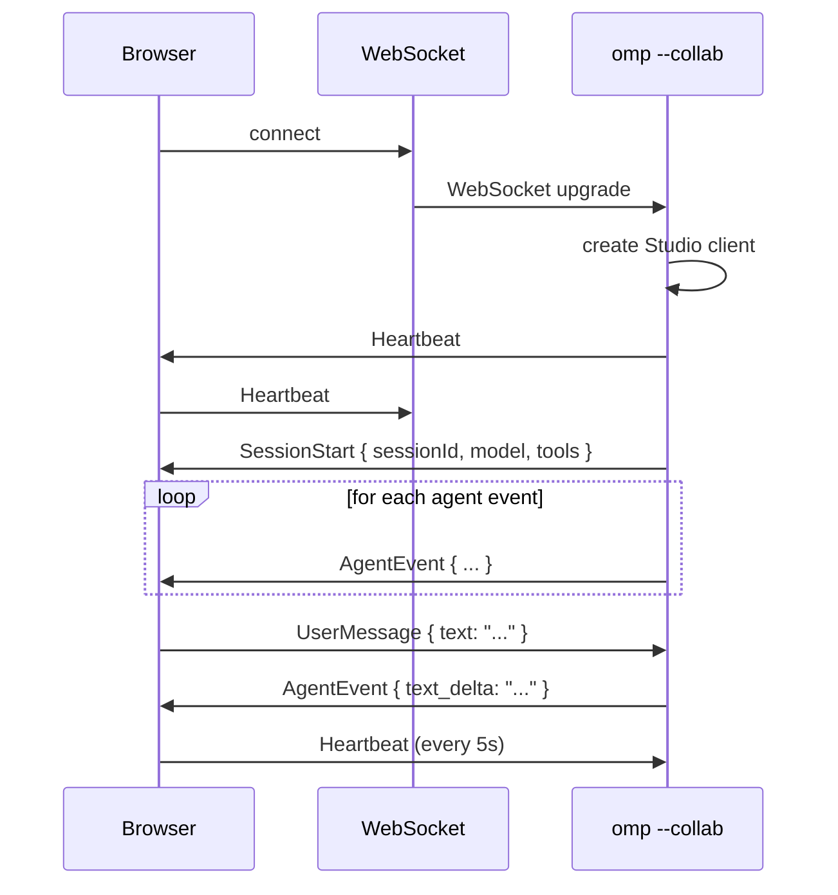
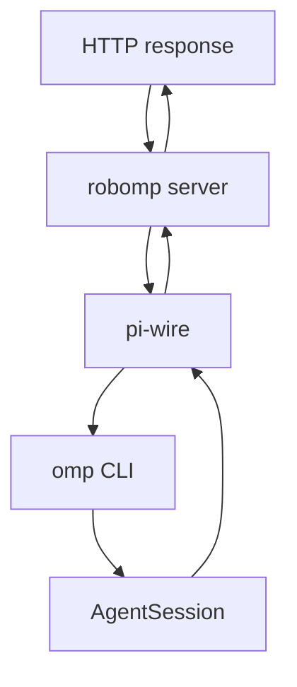
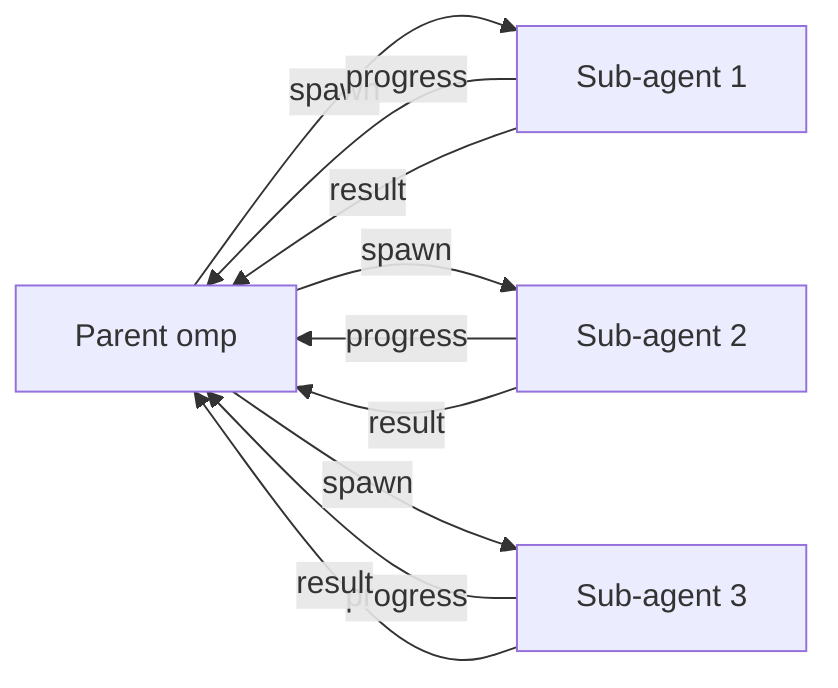

# 12 · pi-wire — Wire Protocol

`@oh-my-pi/pi-wire` is oh-my-pi's **cross-process wire protocol**. Built on **protobuf** for schema evolution, used to communicate between:

- The `omp` CLI and the `collab-web` browser client
- The `omp` CLI and the `omp-rpc` Python server
- Two `omp` CLI instances (for swarm coordination)
- A future: cross-host agent coordination

**Source:** `packages/wire/src/` (10+ files: protocol.ts, codec.ts, transport.ts, etc.)

## Why protobuf (not JSON)

JSON is the default for HTTP APIs. For wire protocols:

| Aspect | JSON | protobuf |
|--------|------|----------|
| Size | ~500 bytes per event | ~80 bytes per event |
| Parse speed | ~50 µs | ~5 µs |
| Schema | Optional | Required, versioned |
| Type safety | TS, not runtime | TS + runtime |
| Backward compat | Manual | Auto (field numbers) |

For high-frequency event streams (the agent emits 100+ events per turn), protobuf is **6× smaller** and **10× faster** to parse.

## The schema

`packages/wire/proto/studio.proto`:

```protobuf
syntax = "proto3";

package omp.wire;

message Envelope {
  uint32 version = 1;
  oneof payload {
    SessionStart session_start = 10;
    SessionEnd session_end = 11;
    UserMessage user_message = 20;
    AgentEvent agent_event = 21;
    ToolCall tool_call = 30;
    ToolResult tool_result = 31;
    MemoryRead memory_read = 40;
    MemoryWrite memory_write = 41;
    SnapshotOp snapshot_op = 50;
    Heartbeat heartbeat = 60;
    Error error = 99;
  }
}

message SessionStart {
  string session_id = 1;
  string model = 2;
  repeated string tools = 3;
  bytes snapshot_id = 4;
  map<string, string> config = 5;
}

message AgentEvent {
  string session_id = 1;
  uint32 turn = 2;
  oneof event {
    TextDelta text_delta = 1;
    ThinkingDelta thinking_delta = 2;
    ToolCallDelta tool_call_delta = 3;
    UsageUpdate usage_update = 4;
    StopReason stop_reason = 5;
    ErrorEvent error = 6;
  }
}

message ToolCall {
  string id = 1;
  string name = 2;
  bytes args = 3;     // JSON-encoded args
  uint32 timeout_ms = 4;
}

message ToolResult {
  string tool_call_id = 1;
  bytes content = 2;  // JSON-encoded content
  bool is_error = 3;
  bytes details = 4;
}

message SnapshotOp {
  oneof op {
    Snap snap = 1;
    Restore restore = 2;
    Diff diff = 3;
    Commit commit = 4;
  }
}

message Snap {
  bytes snapshot_id = 1;
  string project_path = 2;
}

message Restore {
  bytes snapshot_id = 1;
}

message Heartbeat {
  uint64 timestamp = 1;
  string client_id = 2;
}

message Error {
  uint32 code = 1;
  string message = 2;
  bytes details = 3;
}
```

The schema is **versioned** via `version: 1` on `Envelope`. Field numbers are stable — adding fields is backward compatible, removing requires bumping the version.

## The transports

`@oh-my-pi/pi-wire` ships 3 transports:

```ts
// packages/wire/src/transport/index.ts
export interface Transport {
  send(envelope: Envelope): Promise<void>;
  on(handler: (envelope: Envelope) => void): void;
  close(): Promise<void>;
}

// packages/wire/src/transport/stdio.ts
export class StdioTransport implements Transport {
  // Reads from stdin (JSON lines, one envelope per line)
  // Writes to stdout
}

// packages/wire/src/transport/websocket.ts
export class WebSocketTransport implements Transport {
  // Bi-directional WebSocket
  // Used by collab-web
}

// packages/wire/src/transport/grpc.ts
export class GrpcTransport implements Transport {
  // gRPC over HTTP/2
  // Used by omp-rpc (Python)
}
```

The 3 transports share the same `Envelope` schema, so the same code can run over any of them.

## The codec

```ts
// packages/wire/src/codec.ts
export function encode(envelope: Envelope): Uint8Array;
export function decode(bytes: Uint8Array): Envelope;
```

Uses `protobuf-es` (the TypeScript runtime):

```ts
import { create, toBinary, fromBinary } from "@bufbuild/protobuf";
import { EnvelopeSchema } from "./gen/studio_pb.js";

export function encode(env: Envelope): Uint8Array {
  return toBinary(EnvelopeSchema, env);
}

export function decode(bytes: Uint8Array): Envelope {
  return fromBinary(EnvelopeSchema, bytes);
}
```

`protobuf-es` is **5-10× faster** than the older `protobufjs` library and produces cleaner TypeScript types.

## The `Studio` class

```ts
// packages/wire/src/studio.ts
export class Studio {
  constructor(opts: StudioOptions);
  
  // Send to peer
  async sendSessionStart(opts: SessionStart): Promise<void>;
  async sendUserMessage(message: UserMessage): Promise<void>;
  async sendToolCall(call: ToolCall): Promise<void>;
  async sendToolResult(result: ToolResult): Promise<void>;
  async sendSnapshot(op: SnapshotOp): Promise<void>;
  
  // Receive from peer
  onSessionStart(handler: (msg: SessionStart) => void): void;
  onUserMessage(handler: (msg: UserMessage) => void): void;
  onToolCall(handler: (call: ToolCall) => Promise<ToolResult>): void;
  onSnapshot(handler: (op: SnapshotOp) => Promise<SnapshotResult>): void;
  
  // Heartbeat
  startHeartbeat(intervalMs: number): void;
  
  // Lifecycle
  close(): Promise<void>;
}
```

The `Studio` is the **high-level API** — consumers don't deal with raw envelopes.

## The collab-web integration

`collab-web` (the React 19 web client) connects to `omp` via WebSocket:



The transport is `WebSocketTransport`. The schema is the same `Envelope`. The browser code is auto-generated from the `.proto` file.

## The omp-rpc (Python) integration

`python/omp-rpc/` is a Python server that speaks the wire protocol:

```python
# python/omp-rpc/omp_rpc/server.py
from omp.wire import Envelope, StudioCodec
from omp.wire.transport.grpc import GrpcTransport

class OmpRpcServer:
    def __init__(self, omp_studio_url: str):
        self.transport = GrpcTransport(omp_studio_url)
        self.studio = StudioClient(self.transport)
        self.studio.on_tool_call(self.handle_tool_call)
    
    async def handle_tool_call(self, call: ToolCall) -> ToolResult:
        # Python-side tool implementations
        if call.name == "python_exec":
            result = await self.python_exec(json.loads(call.args))
            return ToolResult(
                tool_call_id=call.id,
                content=json.dumps(result).encode(),
                is_error=False
            )
        # ... more tools
```

Use cases:

- Call Python ML libraries (pandas, scikit-learn, etc.) from `omp`
- Run Python-only tools that need the Python ecosystem
- Bridge to Python-based agent frameworks (e.g. LangChain, LlamaIndex)

The server is started with `omp-rpc start` and `omp` connects to it via the `--rpc-url` flag.

## The `robomp` integration

`robomp` is a **production agent-as-a-service**:



`robomp` is a long-running Python service that:

1. Accepts HTTP requests (e.g. "fix this bug")
2. Starts a new `omp` session (via `pi-wire` + stdio)
3. Streams events back to the HTTP client
4. Returns the final result

The `robomp` Dockerfile is in the repo root: `Dockerfile.robomp`.

## The swarm coordination

`swarm-extension` uses `pi-wire` to coordinate sub-agents:



Each sub-agent is a **separate** `omp` process (or in-process if `--in-process` is set). The parent communicates via `pi-wire` over stdio (or local socket). See [swarm-extension](/docs/16-swarm-extension).

## The code generation

`pi-wire`'s TypeScript code is generated from the `.proto` file via `bufbuild/protoc-gen-es`:

```bash
# packages/wire/proto/gen.sh
buf generate \
  --template buf.gen.yaml \
  --out packages/wire/src/gen
```

`buf.gen.yaml`:

```yaml
version: v1
plugins:
  - plugin: es
    out: ../src/gen
    opt: target=ts
```

The generated files are committed (not generated at build time). Same pattern as `pi-ai`'s `models.generated.ts`.

## The schema versioning

When the schema changes:

1. **Add a field** — backward compatible, no version bump
2. **Remove a field** — bump `Envelope.version` to 2
3. **Rename a field** — bump `Envelope.version` to 2 (treat as add + remove)
4. **Change field type** — bump `Envelope.version` to 2

The receiver reads `Envelope.version` and dispatches to the right parser. Old envelopes are parsed by the old code; new envelopes by the new code.

## The heartbeat

Long-lived connections need a heartbeat to detect dead peers:

```ts
// In the CLI (server)
setInterval(() => {
  studio.sendHeartbeat({ timestamp: Date.now(), clientId: "omp-cli-123" });
}, 5000);

// In the browser (client)
setInterval(() => {
  studio.sendHeartbeat({ timestamp: Date.now(), clientId: "browser-456" });
}, 5000);

// In Studio
studio.on("missed_heartbeats", (count) => {
  if (count > 3) {
    // Peer is dead, close the connection
    studio.close();
  }
});
```

3 missed heartbeats (15s) = peer assumed dead. The connection is closed and the session is checkpointed.

## The framing

For WebSocket, each envelope is framed with a 4-byte length prefix:

```
[length:4][envelope:N]
```

For stdio, each envelope is one JSON line (with `version` first):

```json
{"version":1,"payload":{"sessionStart":{...}}}
```

For gRPC, envelopes are sent as individual messages (length is part of the gRPC protocol).

## The codec performance

Measured on a MacBook Pro M2 Max, encoding a typical `AgentEvent`:

| Format | Size | Encode | Decode |
|--------|------|--------|--------|
| JSON | 487 bytes | 22 µs | 18 µs |
| protobuf | 78 bytes | 4 µs | 3 µs |

6× smaller, 5× faster. For 100 events per turn, this saves ~30KB of bandwidth and ~5ms of CPU per turn.

## The TypeScript types

`@bufbuild/protobuf` generates clean TypeScript types:

```ts
// Auto-generated from .proto
import type { Envelope, AgentEvent, ToolCall } from "./gen/studio_pb.js";

const env: Envelope = {
  version: 1,
  payload: {
    case: "agentEvent",
    value: {
      sessionId: "...",
      turn: 1,
      event: { case: "textDelta", value: { delta: "Hello" } }
    }
  }
};
```

The discriminated union (`oneof` in proto) maps to `{ case: "...", value: ... }` in TS. Type-safe, no runtime parsing.

## Configuration

```json
{
  "wire": {
    "transport": "auto",        // "stdio" | "websocket" | "grpc" | "auto"
    "heartbeatIntervalMs": 5000,
    "maxMissedHeartbeats": 3,
    "maxEnvelopeSize": 1048576,  // 1MB
    "compression": "none"        // "none" | "gzip" | "zstd"
  }
}
```

The `compression` field is planned but not yet implemented (gzip would save another ~30% on top of protobuf).

## What's NOT in pi-wire

- **Authentication** — the wire protocol is unauthenticated; the transport layer (TLS, mTLS) handles it
- **Encryption** — the envelopes are plain protobuf; use TLS at the transport layer
- **Schema registry** — the `.proto` file is the source of truth; no external registry
- **Multiplexing** — one envelope stream per connection; multiple sessions need multiple connections

## Next

- [collab-web](/docs/14-collab-web) — the React 19 client
- [swarm-extension](/docs/16-swarm-extension) — uses pi-wire for sub-agent coordination
- [omp-stats](/docs/15-omp-stats) — telemetry
- [pi-coding-agent · CLI](/docs/05-pi-coding-agent) — the consumer
