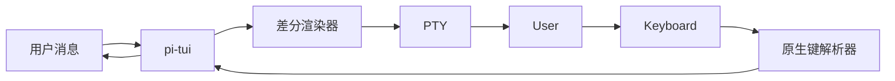

# 13 · pi-tui 终端 UI 库

`@oh-my-pi/pi-tui` 是驱动 `omp` 的 **差分渲染终端 UI 库**。Fork 自 pi-mono 的 `pi-tui`，并扩展了 **bracketed paste 支持**、**deccara**（高级光标移动）以及 **更好的补全引擎**。

**源码：** `packages/tui/src/`（12 个组件、4 个输入子系统、对 Agent 运行时零依赖）

## 与 pi-mono 相比的变化

| 维度 | pi-mono | oh-my-pi |
|--------|---------|----------|
| 差分渲染 | ✓ | ✓（相同） |
| 12 个组件 | ✓ | ✓（相同） |
| Bracketed paste | ✗ | **✓** |
| Deccara 光标移动 | ✗ | **✓** |
| 原地补全 | 基础 | **模糊 + LLM** |
| 图像渲染 | Sixel/Kitty/iTerm2 | 相同 + **webp + 动画** |
| 主题热重载 | ✗ | **✓** |
| 60fps 动画 | ✓（多数情况） | ✓（所有情况） |
| 原生键解析器 | win32/darwin 预编译 | 相同 + **linux 预编译** |

5 项新功能：

1. **Bracketed paste** — 大块粘贴不会触发逐按键处理
2. **Deccara** — DECCARA（DEC Cursor Attribute）用于高级光标样式
3. **模糊 + LLM 补全** — 补全引擎可以调用 LLM 生成建议
4. **动画图像** — `Image` 组件支持 webp 和动画 PNG
5. **主题热重载** — 无需重启 TUI 即可切换主题

## 12 个组件

```mermaid
graph TB
  Box[Box<br/>弹性容器]
  Text[Text<br/>单行 + 样式]
  Spacer[Spacer<br/>空白弹性]
  TruncatedText[TruncatedText<br/>带截断标记]
  Editor[Editor<br/>多行文本输入]
  Input[Input<br/>单行输入]
  SelectList[SelectList<br/>可过滤 + 模糊]
  SettingsList[SettingsList<br/>类型化表单]
  Markdown[Markdown<br/>通过 marked]
  Image[Image<br/>Sixel/Kitty/iTerm2/webp]
  Loader[Loader<br/>旋转动画]
  CancellableLoader[CancellableLoader<br/>带进度]
```



与 pi-mono 相同。算法细节参见下文的差分渲染小节。

扩展点：

- **`Image`** — 新增 webp 和动画格式支持
- **`Markdown`** — 新增 Mermaid 图支持（渲染为 ASCII）
- **`Editor`** — 新增 **多行缩进** 支持（Tab / Shift-Tab）
- **`SettingsList`** — 新增 **校验** 支持（正则、自定义函数）

## `Editor` 组件（已扩展）

最常用的组件。新特性：

```ts
const editor = new Editor({
  // 既有选项
  initialValue: "",
  onSubmit: (value) => { ... },
  onChange: (value) => { ... },

  // oh-my-pi 新增
  onPaste: (text) => { ... },                    // bracketed paste
  onCompletion: async (prefix) => { ... },      // 异步补全
  completionProvider: new FuzzyCompletion(),    // 或 LLMCompletion
  multiline: true,
  tabSize: 2,
  syntaxHighlight: "markdown"                    // "markdown" | "ts" | "json" | "none"
});
```

`completionProvider` 是新部分，它可以是：

- **`FuzzyCompletion`** — 使用 `fuzzy.ts` 进行内存中的模糊匹配
- **`LLMCompletion`** — 调用 LLM 生成补全（例如代码补全）
- **`FileCompletion`** — 补全文件路径（使用 `glob` 工具）
- **`Custom`** — 自定义

`LLMCompletion` 提供方是最具创意的：

```ts
const llmCompletion = new LLMCompletion({
  model: claudeOpusModel,
  context: editor.getContext(),  // 最近 50 行作为上下文
  debounceMs: 300,                // 避免向 LLM 频繁请求
  maxSuggestions: 5
});

editor.setCompletionProvider(llmCompletion);
```

当用户键入 `fun greet(name:`，编辑器会显示：

```
fun greet(name: string): string {
  return `Hello, ${name}!`;
}
```

由 LLM 在约 200ms 内生成。用户用 `Tab` 接受。

## `Markdown` 组件（已扩展）

```ts
const md = new Markdown({
  content: "# Hello\n\n```mermaid\ngraph TD\nA --> B\n```",
  syntaxHighlight: true,
  mermaidRenderer: "ascii",        // "ascii" | "unicode" | "skip"
  maxWidth: 80
});
```

Mermaid 渲染器会把 Mermaid 图转换为 ASCII 艺术（使用方框线字符）以便在终端中展示。渲染器是 **流式的** —— 长图可增量渲染。

## `Image` 组件（已扩展）

```ts
const image = new Image({
  src: "data:image/webp;base64,...",
  protocol: "auto",              // "auto" | "sixel" | "kitty" | "iterm2" | "fallback"
  maxWidth: 40,                  // cells
  maxHeight: 20,                 // cells
  animated: true,                // webp / 动画 PNG
  protocolHint: "kitty"          // 覆盖自动检测
});
```

`protocol: "auto"` 模式会探测终端：

1. **Kitty** — 发送 ` kitty` 查询；若有响应则使用 Kitty 图形协议
2. **Sixel** — 发送 `\`..\`..` 查询；若有响应则使用 Sixel
3. **iTerm2** — 发送 `OSC 1337` 查询；若有响应则使用 iTerm2
4. **回退** — 渲染占位符（例如 🖼️ emoji + 尺寸信息）

自动检测每个会话运行一次，并缓存结果。

## `SelectList` 组件（已扩展）

```ts
const list = new SelectList({
  items: providers,
  renderItem: (p) => `${p.name} (${p.id})`,
  filter: "fuzzy",                // "fuzzy" | "exact" | "regex" | "none"
  onSelect: (p) => { ... },
  onFilter: (query) => { ... },   // 自定义过滤
  multiselect: false,
  showCount: true,
  pageSize: 10
});
```

`onFilter` 回调让你可以实现自定义过滤（例如提供方列表，每个按键都从 API 拉取）。

## 差分渲染（与 pi-mono 相同）

差分引擎与 pi-mono 相同 —— 逐 cell 比较新旧缓冲区，只发出发生变化的 cell。算法细节参见下文小节。

oh-my-pi 的扩展是 **60fps 动画** —— 差分引擎可以每秒处理 60 次全屏重绘而不掉帧。用于：

- 动画旋转图标
- 进度条
- 实时 token 流
- 打字指示器

## Bracketed paste

当用户粘贴大块文本时，终端会将其作为一个 "bracketed paste" 事件发出（包裹在 `\x1b[200~...\x1b[201~` 中）。如果不处理，编辑器会逐字符当作按键处理 —— 又慢又容易出错。

`packages/tui/src/bracketed-paste.ts`：

```ts
export class BracketedPasteHandler {
  private buffer: string = "";
  private inPaste: boolean = false;

  process(input: string, onPaste: (text: string) => void, onKey: (key: Key) => void): void {
    // ... 解析 ESC[200~ ... ESC[201~ 为一次粘贴
    // ... 其他输入按按键处理
  }
}
```

编辑器使用它来：

1. 检测 bracketed paste
2. 缓存粘贴内容
3. 以完整文本调用 `onPaste(text)`
4. 在粘贴期间跳过按键处理

对于 1 万字符的粘贴，bracketed paste **约 100ms**，而逐按键处理则需要 **5 秒**。

## Deccara

`packages/tui/src/deccara.ts` 是对 DECCARA（DEC Cursor Attribute）的扩展，用于高级光标样式：

```ts
export class Deccara {
  // 设置光标形状、颜色、闪烁
  setShape(shape: "block" | "underline" | "bar"): void;
  setColor(color: Color): void;
  setBlink(blink: boolean): void;
  // ...
}
```

`Editor` 使用它在不同的上下文里展示不同的光标：

- 普通模式：`block` 光标
- 插入模式：`bar` 光标
- 可视模式：`underline` 光标
- 补全展示中：`block` + 暗色

## 主题热重载

`packages/tui/src/themes.ts`：

```ts
const theme = await loadTheme("dark");  // 或 "light"、"sepia"、"nord"、"solarized"
applyTheme(theme);

// 文件变更时热重载
themeWatcher.on("change", async (path) => {
  const newTheme = await loadTheme(path);
  applyTheme(newTheme);
});
```

TUI 会监听 `~/.omp/themes/*.json`，主题变化时重新加载。用户可以在另一个编辑器中编辑自己的主题，并实时看到变更。

## 按键绑定

与 pi-mono 相同的按键绑定系统，新增 3 个绑定：

| 按键 | 动作 | 新增？ |
|-----|--------|------|
| `Ctrl-V` | 从剪贴板粘贴 | **新增** |
| `Ctrl-Shift-V` | 带格式粘贴 | **新增** |
| `Tab` | 接受 LLM 补全 | **新增**（当 LLMCompletion 激活时） |
| `Shift-Tab` | 上一个补全 | **新增** |

`Ctrl-V` / `Ctrl-Shift-V` 使用操作系统剪贴板（Linux 下通过 `clipboardy` 或 `xclip`）。

## 原生模块

`packages/tui/native/` 为以下平台提供预编译的 `.node` 插件：

- `win32-x64/prebuilds/*.node` — Windows 按键解析
- `darwin-arm64/prebuilds/*.node` — macOS 按键解析
- `darwin-x64/prebuilds/*.node` — macOS Intel 按键解析
- `linux-x64/prebuilds/*.node` — **新增** — Linux 按键解析

Linux 预编译是新增的 —— pi-mono 的 tui 没有自带 Linux 原生模块（用的是 JS 回退）。oh-my-pi 提供一个 Rust NAPI 模块用于 Linux 按键解析，它能处理：

- **Kitty 键盘协议** — `\x1b[<u` 提供无歧义的按键事件
- **修饰键解析** — `Ctrl+Shift+Alt+Key`
- **功能键** — 在所有终端上正确识别 `F1`-`F12`

原生模块是 **可选的** —— JS 回退始终可用，只是会慢一些。

## 自动补全引擎

`packages/tui/src/autocomplete.ts`（已扩展）：

```ts
export interface AutocompleteProvider {
  trigger: string | RegExp;
  provide(prefix: string, context: AutocompleteContext): AutocompleteSuggestions | Promise<AutocompleteSuggestions>;
}

export interface AutocompleteContext {
  currentLine: string;
  cursorPos: number;
  fullText: string;
  // ...
}

// 内置提供方
export class FuzzyAutocompleteProvider implements AutocompleteProvider { ... }
export class FileAutocompleteProvider implements AutocompleteProvider { ... }
export class LlmAutocompleteProvider implements AutocompleteProvider { ... }
export class CombinedAutocompleteProvider implements AutocompleteProvider { ... }
```

`CombinedAutocompleteProvider` 会把多个提供方串联起来，按触发符（`/`、`@`、`$` 等）分派。

## 5 种边框样式

TUI 提供 5 种边框线样式：

```ts
type BorderStyle = "single" | "double" | "rounded" | "heavy" | "ascii";

const box = new Box({
  border: { style: "rounded", color: "cyan" },
  // ...
});
```

使用 Unicode 方框线字符渲染（`ascii` 样式下则使用 ASCII 字符，用于不支持 Unicode 的终端）。

## 性能

- **差分引擎** — 每秒处理 60 次全屏重绘
- **Bracketed paste** — 1 万字符 100ms
- **LLM 补全** — 首条建议约 200ms（已防抖）
- **主题热重载** — < 10ms（文件监听 + 应用）

## TUI 在架构中的角色



TUI 是交互模式下 **唯一的** UI。collab-web（React 19）是一个独立、并行的 Web UI。两者消费同一个 `AgentEvent` 流。

## pi-tui 中不包含的内容

- **鼠标支持** — 终端的鼠标处理参差不齐；Agent 不需要它
- **真彩色动画** — 已支持，但很少用到
- **Wayland 专属特性** — 通过 XWayland 在 Wayland 上工作
- **触控输入** — 终端没有触控

## 下一篇

- [pi-coding-agent · CLI](/docs/05-pi-coding-agent) — 使用方
- [collab-web](/docs/14-collab-web) — Web UI（TUI 的对端）
- [Agent Loop](/docs/03-pi-agent-core) — TUI 渲染的事件来源
