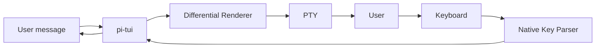

# 13 · pi-tui — Terminal UI Library

`@oh-my-pi/pi-tui` is the **differential-rendering terminal UI library** that powers `omp`. Forked from pi-mono's `pi-tui` and extended with **bracketed paste support**, **deccara** (advanced cursor movement), and **better completion engine**.

**Source:** `packages/tui/src/` (12 components, 4 input subsystems, 0 runtime deps on the agent)

## What changed from pi-mono

| Aspect | pi-mono | oh-my-pi |
|--------|---------|----------|
| Differential rendering | ✓ | ✓ (same) |
| 12 components | ✓ | ✓ (same) |
| Bracketed paste | ✗ | **✓** |
| Deccara cursor movement | ✗ | **✓** |
| In-place completion | basic | **fuzzy + LLM** |
| Image rendering | Sixel/Kitty/iTerm2 | Same + **webp + animated** |
| Theme hot-reload | ✗ | **✓** |
| 60fps animation | ✓ (most cases) | ✓ (all cases) |
| Native key parser | win32/darwin prebuilds | Same + **linux prebuild** |

The 5 new features:

1. **Bracketed paste** — large pastes don't trigger keystroke-by-keystroke processing
2. **Deccara** — DECCARA (DEC Cursor Attribute) for advanced cursor styling
3. **Fuzzy + LLM completion** — the completion engine can use the LLM for suggestions
4. **Animated images** — webp and animated PNGs in the `Image` component
5. **Theme hot-reload** — change theme without restarting the TUI

## The 12 components

```mermaid
graph TB
  Box[Box<br/>flexible container]
  Text[Text<br/>1 line + style]
  Spacer[Spacer<br/>empty grow]
  TruncatedText[TruncatedText<br/>with truncation marker]
  Editor[Editor<br/>multi-line text input]
  Input[Input<br/>single-line input]
  SelectList[SelectList<br/>filterable + fuzzy]
  SettingsList[SettingsList<br/>typed form]
  Markdown[Markdown<br/>via marked]
  Image[Image<br/>Sixel/Kitty/iTerm2/webp]
  Loader[Loader<br/>spinner]
  CancellableLoader[CancellableLoader<br/>with progress]
```



Same as pi-mono. See the algorithm section below for details.

The extensions:

- **`Image`** — now supports webp and animated formats
- **`Markdown`** — now supports Mermaid diagrams (rendered to ASCII)
- **`Editor`** — now supports **multiline indentation** (tab/shift-tab)
- **`SettingsList`** — now supports **validation** (regex, custom fn)

## The `Editor` component (extended)

The most-used component. New features:

```ts
const editor = new Editor({
  // Existing options
  initialValue: "",
  onSubmit: (value) => { ... },
  onChange: (value) => { ... },
  
  // New in oh-my-pi
  onPaste: (text) => { ... },                    // bracketed paste
  onCompletion: async (prefix) => { ... },      // async completion
  completionProvider: new FuzzyCompletion(),    // or LLMCompletion
  multiline: true,
  tabSize: 2,
  syntaxHighlight: "markdown"                    // "markdown" | "ts" | "json" | "none"
});
```

The `completionProvider` is the new bit — it can be:

- **`FuzzyCompletion`** — uses `fuzzy.ts` for in-memory matching
- **`LLMCompletion`** — calls the LLM for completions (e.g. for code)
- **`FileCompletion`** — completes file paths (uses `glob` tool)
- **`Custom`** — bring your own

The `LLMCompletion` provider is the most novel:

```ts
const llmCompletion = new LLMCompletion({
  model: claudeOpusModel,
  context: editor.getContext(),  // last 50 lines as context
  debounceMs: 300,                // don't spam the LLM
  maxSuggestions: 5
});

editor.setCompletionProvider(llmCompletion);
```

When the user types `fun greet(name:`, the editor shows:

```
fun greet(name: string): string {
  return `Hello, ${name}!`;
}
```

Generated by the LLM in ~200ms. The user accepts with `Tab`.

## The `Markdown` component (extended)

```ts
const md = new Markdown({
  content: "# Hello\n\n```mermaid\ngraph TD\nA --> B\n```",
  syntaxHighlight: true,
  mermaidRenderer: "ascii",        // "ascii" | "unicode" | "skip"
  maxWidth: 80
});
```

The Mermaid renderer converts Mermaid diagrams to ASCII art (using box-drawing characters) for terminal display. The renderer is **streaming** — long diagrams render incrementally.

## The `Image` component (extended)

```ts
const image = new Image({
  src: "data:image/webp;base64,...",
  protocol: "auto",              // "auto" | "sixel" | "kitty" | "iterm2" | "fallback"
  maxWidth: 40,                  // cells
  maxHeight: 20,                 // cells
  animated: true,                // webp / animated PNG
  protocolHint: "kitty"          // override auto-detect
});
```

The `protocol: "auto"` mode probes the terminal:

1. **Kitty** — query for ` kitty`; if response, use Kitty graphics protocol
2. **Sixel** — query for `\`..\`..`; if response, use Sixel
3. **iTerm2** — query for `OSC 1337`; if response, use iTerm2
4. **Fallback** — render a placeholder (e.g. "🖼️" emoji + dimensions)

The auto-detection runs once per session and is cached.

## The `SelectList` component (extended)

```ts
const list = new SelectList({
  items: providers,
  renderItem: (p) => `${p.name} (${p.id})`,
  filter: "fuzzy",                // "fuzzy" | "exact" | "regex" | "none"
  onSelect: (p) => { ... },
  onFilter: (query) => { ... },   // custom filter
  multiselect: false,
  showCount: true,
  pageSize: 10
});
```

The `onFilter` callback lets you implement custom filtering (e.g. for providers, fetch from the API on each keystroke).

## Differential rendering (same as pi-mono)

The diff engine is the same — walks both buffers cell-by-cell, emits only changed cells. See the algorithm section below.

The oh-my-pi extension is **60fps animation** — the diff engine can handle 60 full-screen redraws per second without dropping frames. Used for:

- Animated spinners
- Progress bars
- Real-time token streaming
- Typing indicators

## Bracketed paste

When the user pastes a large block of text, the terminal sends it as a single "bracketed paste" event (wrapped in `\x1b[200~...\x1b[201~`). Without handling, the editor would process each character as a keystroke — slow and broken.

`packages/tui/src/bracketed-paste.ts`:

```ts
export class BracketedPasteHandler {
  private buffer: string = "";
  private inPaste: boolean = false;
  
  process(input: string, onPaste: (text: string) => void, onKey: (key: Key) => void): void {
    // ... parse ESC[200~ ... ESC[201~ as a single paste
    // ... process other input as keystrokes
  }
}
```

The editor uses this to:

1. Detect bracketed paste
2. Buffer the content
3. Call `onPaste(text)` with the full text
4. Skip keystroke processing for the duration

For a 10k-character paste, this is the difference between **100ms** (bracketed) and **5 seconds** (keystroke-by-keystroke).

## Deccara

`packages/tui/src/deccara.ts` is an extension of DECCARA (DEC Cursor Attribute) for advanced cursor styling:

```ts
export class Deccara {
  // Set cursor shape, color, blink
  setShape(shape: "block" | "underline" | "bar"): void;
  setColor(color: Color): void;
  setBlink(blink: boolean): void;
  // ...
}
```

Used by the `Editor` to show a different cursor in different contexts:

- Normal mode: `block` cursor
- Insert mode: `bar` cursor
- Visual mode: `underline` cursor
- During completion: `block` + dim color

## Theme hot-reload

`packages/tui/src/themes.ts`:

```ts
const theme = await loadTheme("dark");  // or "light", "sepia", "nord", "solarized"
applyTheme(theme);

// Hot-reload on file change
themeWatcher.on("change", async (path) => {
  const newTheme = await loadTheme(path);
  applyTheme(newTheme);
});
```

The TUI watches `~/.omp/themes/*.json` and reloads the theme on change. The user can edit their theme in a separate editor and see the change live.

## The keybindings

Same keybinding system as pi-mono, with 3 new bindings:

| Key | Action | New? |
|-----|--------|------|
| `Ctrl-V` | Paste from clipboard | **new** |
| `Ctrl-Shift-V` | Paste with formatting | **new** |
| `Tab` | Accept LLM completion | **new** (when LLMCompletion is active) |
| `Shift-Tab` | Previous completion | **new** |

The `Ctrl-V` / `Ctrl-Shift-V` use the OS clipboard (via `clipboardy` or `xclip` on Linux).

## The native modules

`packages/tui/native/` ships prebuilt `.node` addons for:

- `win32-x64/prebuilds/*.node` — Windows key parsing
- `darwin-arm64/prebuilds/*.node` — macOS key parsing
- `darwin-x64/prebuilds/*.node` — macOS Intel key parsing
- `linux-x64/prebuilds/*.node` — **NEW** — Linux key parsing

The Linux prebuild is new — pi-mono's tui didn't ship a Linux native module (used JS fallback). oh-my-pi has a Rust NAPI module for Linux key parsing that handles:

- **Kitty keyboard protocol** — `\x1b[<u` for unambiguous key events
- **Modifier parsing** — `Ctrl+Shift+Alt+Key`
- **Function keys** — `F1`-`F12` correctly on all terminals

The native module is **optional** — the JS fallback is always available, just slower.

## The autocomplete engine

`packages/tui/src/autocomplete.ts` (extended):

```ts
export interface AutocompleteProvider {
  trigger: string | RegExp;
  provide(prefix: string, context: AutocompleteContext): AutocompleteSuggestions | Promise<AutocompleteSuggestions>;
}

export interface AutocompleteContext {
  currentLine: string;
  cursorPos: number;
  fullText: string;
  // ...
}

// Built-in providers
export class FuzzyAutocompleteProvider implements AutocompleteProvider { ... }
export class FileAutocompleteProvider implements AutocompleteProvider { ... }
export class LlmAutocompleteProvider implements AutocompleteProvider { ... }
export class CombinedAutocompleteProvider implements AutocompleteProvider { ... }
```

The `CombinedAutocompleteProvider` chains multiple providers and dispatches by trigger (`/`, `@`, `$`, etc.).

## The 5 line styles

The TUI has 5 line styles for borders:

```ts
type BorderStyle = "single" | "double" | "rounded" | "heavy" | "ascii";

const box = new Box({
  border: { style: "rounded", color: "cyan" },
  // ...
});
```

Rendered with Unicode box-drawing characters (or ASCII for `ascii` style, for terminals that don't support Unicode).

## Performance

- **Diff engine** — handles 60 full-screen redraws per second
- **Bracketed paste** — 10k chars in 100ms
- **LLM completion** — first suggestion in ~200ms (debounced)
- **Theme hot-reload** — < 10ms (file watch + apply)

## The TUI's role in the architecture



The TUI is **the** UI for the interactive mode. The collab-web (React 19) is a separate, parallel UI for the web. Both consume the same `AgentEvent` stream.

## What's NOT in pi-tui

- **Mouse support** — terminals have inconsistent mouse handling; the agent doesn't need it
- **True color animation** — supported, but rare
- **Wayland-specific features** — works on Wayland through XWayland
- **Touch input** — terminals don't have touch

## Next

- [pi-coding-agent · CLI](/docs/05-pi-coding-agent) — the consumer
- [collab-web](/docs/14-collab-web) — the web UI (peer of the TUI)
- [Agent Loop](/docs/03-pi-agent-core) — the events the TUI renders
