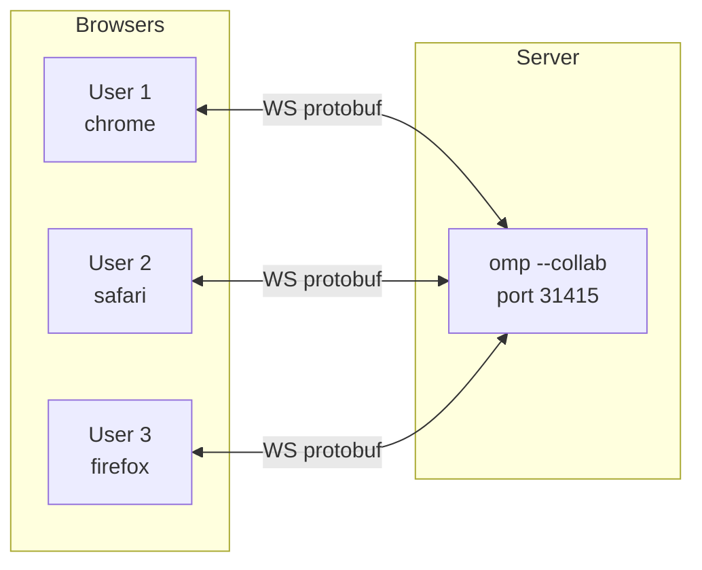
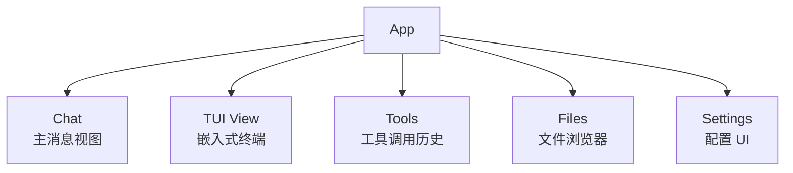
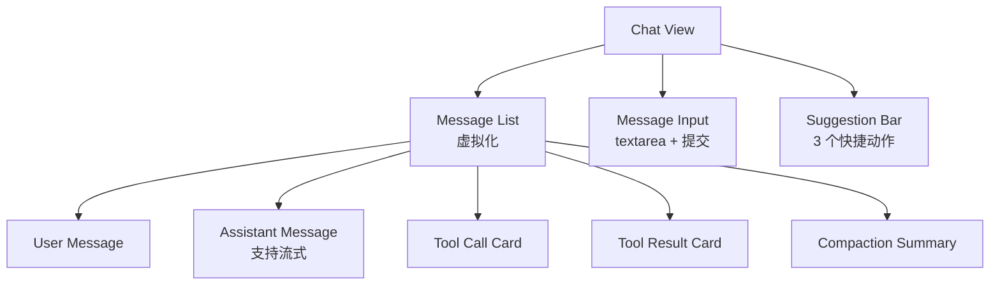
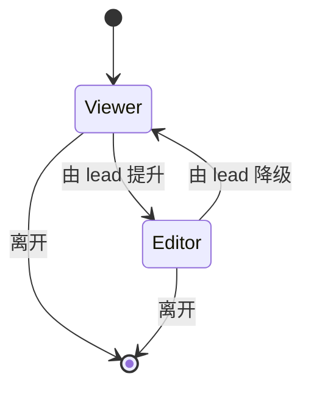
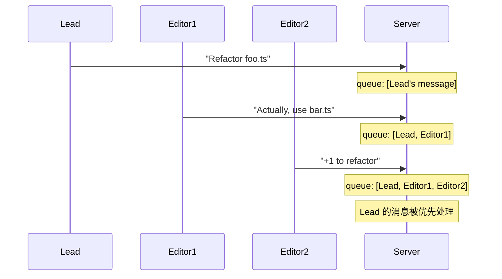
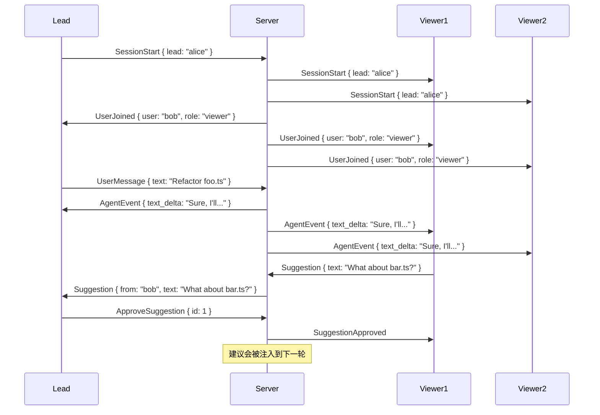

# 14 · collab-web 协作式 Web UI

`@oh-my-pi/collab-web` 是 oh-my-pi 的 **React 19 协作式 Web UI**。它是 TUI 的对端，而非一个独立产品。多个用户可以附加到同一个 `omp --collab` 会话并看到同样的消息，主导用户（lead）的输入被视为权威。

**源码：** `packages/collab-web/src/`（40+ 个文件：app、components、lib、tool-render 等）

## collab-web 是什么



- **多用户** — 多个用户看到同一个会话
- **实时** — 事件通过 WebSocket 流式推送
- **协作式** — 一名用户是"lead"（其输入为权威）
- **只读** — 非 lead 用户可以观看 + 建议，但不能控制

Web 是 TUI 的 **对端** —— 两者可以同时激活。lead 用户可以在 TUI 里，其他用户在浏览器里。

## 技术栈

| 层 | 技术 | 版本 |
|------|------|---------|
| Framework | React | 19.2.x |
| Build | Vite | 6.x |
| CSS | Tailwind CSS | 4.3.0 |
| 状态 | Zustand | 5.x |
| 终端 | xterm | 5.5.x |
| 线协议格式 | protobuf | via @bufbuild/protobuf |
| 持久化 | IndexedDB | via `idb` 8.x |
| 图标 | lucide-react | 0.4xx |
| 路由 | TanStack Router | 1.x |

## 5 个视图



| 视图 | 用途 | 默认？ |
|------|---------|----------|
| **Chat** | 主消息流 | ✓ |
| **TUI View** | 嵌入式 `xterm`，展示与 CLI 相同的 TUI | ✗（可切换） |
| **Tools** | 所有工具调用列表，可展开查看输入/输出 | ✗（侧边栏） |
| **Files** | 项目树视图，点击在查看器中打开 | ✗（侧边栏） |
| **Settings** | 提供方、模型、主题、按键绑定等 | ✗（模态框） |

## Chat 视图



Chat 视图是 **虚拟化** 的 —— 只渲染可见的消息。当会话中有 1000+ 条消息时，这能保证 UI 流畅。

### 流式输出

助手的文本实时流入（与 TUI 一样）：

```tsx
function AssistantMessage({ message }: { message: AssistantMessage }) {
  return (
    <div className="message assistant">
      <Markdown content={message.text} />  {/* 流式文本 */}
      {message.isStreaming && <span className="cursor">▌</span>}
    </div>
  );
}
```

光标是一个闪烁的方块（使用 CSS 动画），流式停止时消失。

### 工具调用卡片

每个工具调用是一张 **可折叠的卡片**：

```tsx
function ToolCallCard({ call, result }: { call: ToolCall; result?: ToolResult }) {
  const [expanded, setExpanded] = useState(false);

  return (
    <div className="tool-card">
      <button onClick={() => setExpanded(!expanded)}>
        {expanded ? '▼' : '▶'} {call.name}({summarizeArgs(call.args)})
      </button>
      {expanded && (
        <pre>{JSON.stringify(call.args, null, 2)}</pre>
        {result && <pre>{result.content}</pre>}
      )}
    </div>
  );
}
```

卡片显示：

- **工具名称** + 缩写后的参数
- **耗时**（结果到达时）
- **成功/失败** 图标
- **展开** 以查看完整输入/输出

### 32 个工具渲染器

`packages/collab-web/src/tool-render/` 为每个工具（或工具族）提供一个 **自定义渲染器**：

```tsx
// tool-render/hashline.tsx
export function HashlineRenderer({ call, result }: ToolRenderProps) {
  // 将 hashline 输出渲染为带行号的代码块
  return (
    <CodeBlock
      content={result?.content ?? ''}
      language="typescript"
      showLineNumbers
    />
  );
}

// tool-render/lsp_hover.tsx
export function LspHoverRenderer({ call, result }: ToolRenderProps) {
  // 将 hover 渲染为文档卡片
  return (
    <DocCard
      type={extractType(result)}
      docs={result?.content}
    />
  );
}
```

32 个渲染器各自针对工具类型做了特化，但共享通用原语（CodeBlock、DocCard、DiffViewer 等）。

## TUI 视图

一个可切换的嵌入式终端，展示 CLI 用户看到的同一份 TUI：

```tsx
import { Terminal } from '@xterm/xterm';

function TuiView({ sessionId }: { sessionId: string }) {
  const terminal = useTerminal({
    sessionId,
    transport: 'websocket'
  });

  return (
    <div className="tui-view">
      <Terminal {...terminal} />
    </div>
  );
}
```

`Terminal` 是 **双向的** —— 用户输入会发送到服务端，服务端渲染的内容会展示出来。lead 用户可以在 TUI 和 Chat 之间无缝切换。

## Files 视图

项目的树视图，点击查看：

```tsx
function FilesView({ projectId }: { projectId: string }) {
  const { tree } = useProjectTree(projectId);

  return (
    <Tree
      data={tree}
      renderNode={(node) => (
        <FileNode
          file={node}
          onClick={() => openFile(node.path)}
        />
      )}
    />
  );
}
```

点击文件会在查看器中打开（默认只读；用户需要到 Chat 中才能编辑）。支持：

- **语法高亮**（Monaco 编辑器的只读模式）
- **差异视图**（会话变更前/后对比）
- **搜索**（项目内全文）

## Tools 视图

会话中所有工具调用的列表，带过滤：

```tsx
function ToolsView({ sessionId }: { sessionId: string }) {
  const { toolCalls } = useToolCalls(sessionId);
  const [filter, setFilter] = useState<'all' | 'success' | 'error'>('all');

  return (
    <div>
      <Filter value={filter} onChange={setFilter} />
      <ToolList
        calls={toolCalls.filter(byFilter(filter))}
        renderItem={ToolListItem}
      />
    </div>
  );
}
```

用于回答"Agent 究竟做了哪些操作"，展示每次工具调用及其耗时、成功情况和详情。

## Settings 视图

用于编辑会话 / Agent 配置的模态框：

```tsx
function SettingsView() {
  return (
    <Modal>
      <Tabs>
        <Tab name="Provider">
          <ProviderSettings />
        </Tab>
        <Tab name="Model">
          <ModelSettings />
        </Tab>
        <Tab name="Theme">
          <ThemeSettings />
        </Tab>
        <Tab name="Keybindings">
          <KeybindingSettings />
        </Tab>
        <Tab name="Compaction">
          <CompactionSettings />
        </Tab>
        <Tab name="Snapshots">
          <SnapshotSettings />
        </Tab>
      </Tabs>
    </Modal>
  );
}
```

每个标签页是相应配置区的表单。变更会立即生效，并保存到用户的 `~/.omp/settings.json`。

## 角色系统



每个用户都有一个 **角色**：

- **Lead** — 其输入为权威（每个会话只有一名 lead）
- **Editor** — 可以发送用户消息，但 lead 的输入为权威
- **Viewer** — 可以观看和提议，但不能发送用户消息

Lead 可以提升 / 降级其他用户。当 lead 离开时，一名 editor 会被自动提升（如果没有 editor 则会话暂停）。

## 持久化

collab-web 使用 **IndexedDB**（通过 `idb`）进行客户端持久化：

- **会话元数据** — 名称、lead 用户、角色等
- **最近消息** — 用于快速重新加入
- **草稿用户消息** — 在重新加载时恢复未发送的输入
- **主题偏好** — 最近选择的主题

实际的会话数据存放在服务端（`omp --collab`）；浏览器只缓存元数据。

## Lead 的输入优先级



服务端 **优先处理 lead 的消息**。Editor 的消息按顺序在 lead 之后处理，但 lead 可以在任意时刻打断。

## protobuf schema（浏览器侧）

浏览器使用与服务端相同的 `.proto` 文件：

```ts
// packages/collab-web/src/lib/wire.ts
import { create, toBinary, fromBinary } from "@bufbuild/protobuf";
import { EnvelopeSchema, type Envelope } from "./gen/studio_pb.js";

const env: Envelope = {
  version: 1,
  payload: { case: "userMessage", value: { text: "Hello" } }
};

const bytes = toBinary(EnvelopeSchema, env);
ws.send(bytes);
```

由与 `pi-wire` 相同的 `.proto` 自动生成。浏览器与服务端共用同一份 schema。

## WebSocket 传输层

`packages/collab-web/src/lib/transport.ts`：

```ts
export class WebSocketTransport {
  private ws: WebSocket;
  private handlers: Set<(env: Envelope) => void> = new Set();

  constructor(url: string) {
    this.ws = new WebSocket(url);
    this.ws.binaryType = "arraybuffer";
    this.ws.onmessage = (event) => {
      const env = fromBinary(EnvelopeSchema, new Uint8Array(event.data));
      this.handlers.forEach(h => h(env));
    };
  }

  send(env: Envelope) {
    this.ws.send(toBinary(EnvelopeSchema, env));
  }

  on(handler: (env: Envelope) => void) {
    this.handlers.add(handler);
  }
}
```

传输层是 **二进制**（protobuf over WebSocket），而非文本。速度更快，使用的带宽也更少。

## 协作协议



Lead 看到的建议以行内横幅展示。他们可以 **批准**（注入到下一轮）或 **驳回**（永久消失）。

## 主题系统

与 TUI 相同 —— 主题是位于 `~/.omp/themes/*.json` 的 JSON 文件：

```json
{
  "name": "dark",
  "colors": {
    "background": "#0d1117",
    "foreground": "#c9d1d9",
    "primary": "#58a6ff",
    "success": "#3fb950",
    "warning": "#d29922",
    "error": "#f85149"
  },
  "fonts": {
    "ui": "Inter",
    "code": "JetBrains Mono"
  }
}
```

collab-web 通过 Server-Sent Events 监听主题文件，并在变更时热重载。与 TUI 使用相同主题，保证一致性。

## 移动端体验

collab-web 对 **移动端友好**：

- 触控友好的按钮尺寸
- 视图间可滑动切换
- TUI 视图中可双指缩放
- 支持 iOS / Android 浏览器（Safari、Chrome）

TUI 视图会被 **缩放** 以适配屏幕 —— 用户可以双指缩放以阅读小字。

## 构建

```bash
cd packages/collab-web
bun run build
# → dist/（静态 SPA）
```

输出是一个静态 SPA。`omp --collab` 服务端会在与 WebSocket 相同的端口（默认 31415）提供它。

## collab-web 不是什么

- **独立产品** — 它需要 `omp --collab` 在运行
- **Slack 的替代品** — 关注的是 Agent，而非聊天
- **VS Code 的替代品** — 编辑仍需使用你自己的编辑器（由 Agent 编辑文件）
- **云服务** — 本地运行，数据不离开本机

## 下一篇

- [pi-wire](/docs/12-pi-wire) — 协议
- [pi-tui](/docs/13-pi-tui) — TUI 对端
- [pi-coding-agent · CLI](/docs/05-pi-coding-agent) — `--collab` 模式
- [omp-stats](/docs/15-omp-stats) — 遥测
