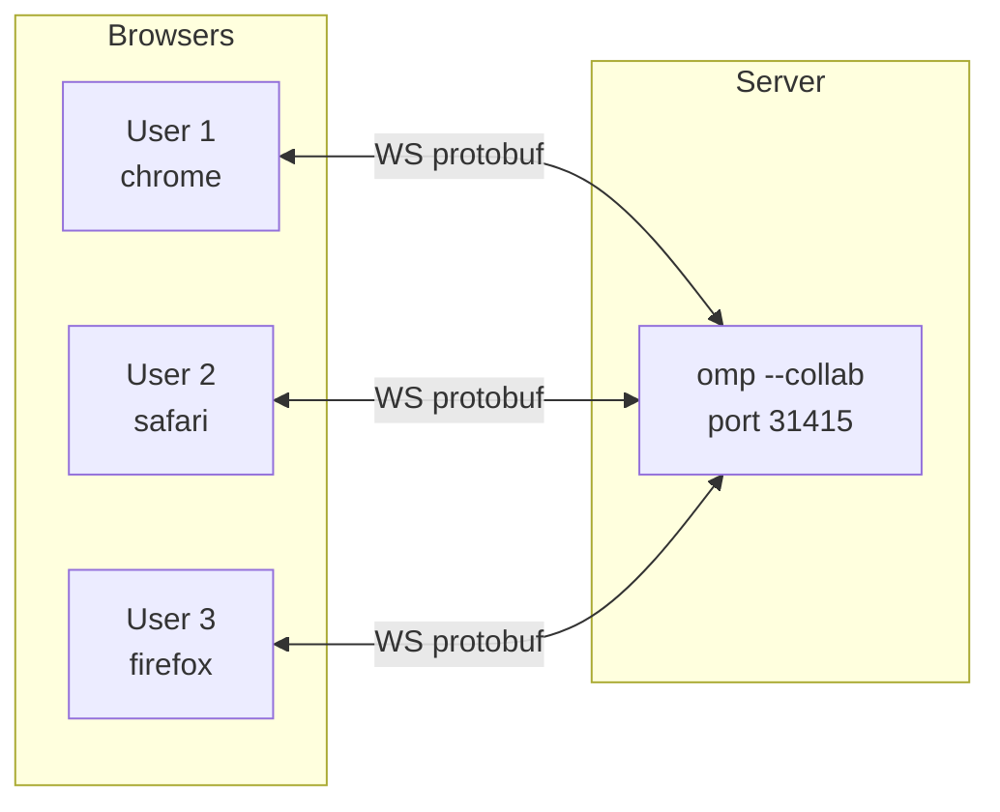
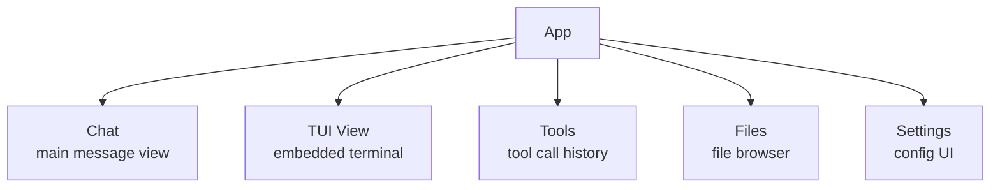
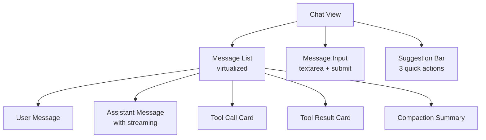
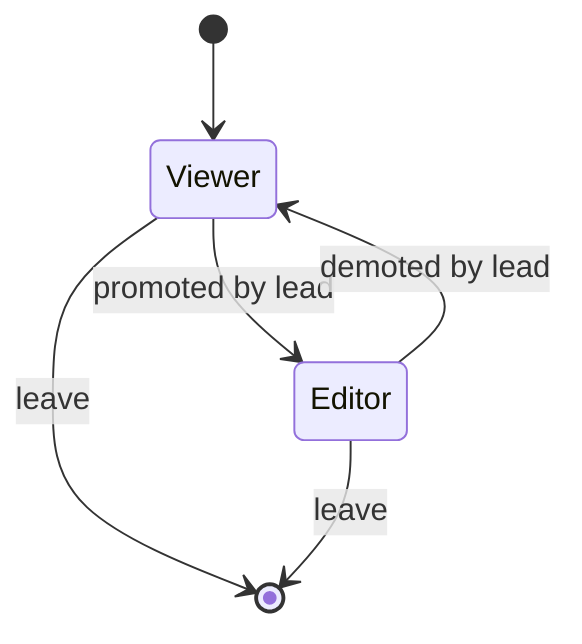
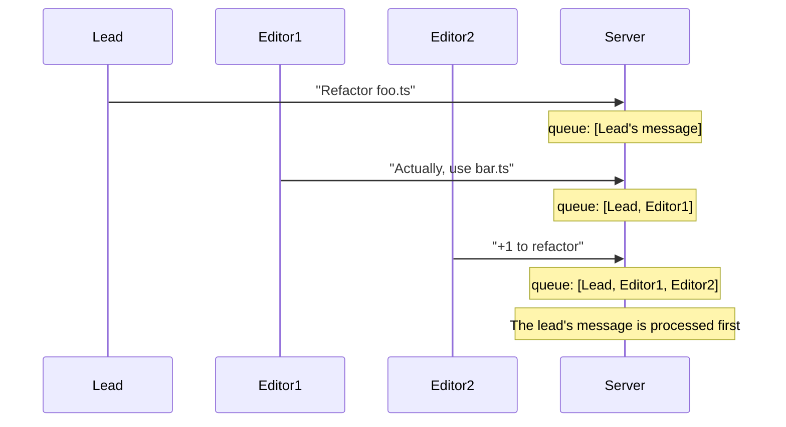
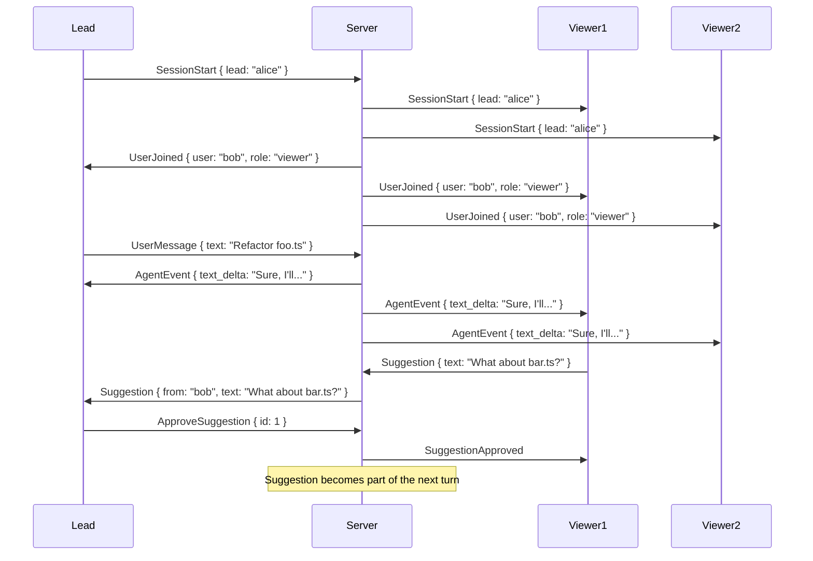

# 14 · collab-web — Collaborative Web UI

`@oh-my-pi/collab-web` is oh-my-pi's **React 19 collaborative web UI**. A peer of the TUI, not a separate product. Multiple users can attach to the same `omp --collab` session and see the same messages, with the lead user's input being canonical.

**Source:** `packages/collab-web/src/` (40+ files: app, components, lib, tool-render, etc.)

## What is collab-web



- **Multi-user** — multiple users see the same session
- **Real-time** — events stream over WebSocket
- **Collaborative** — one user is the "lead" (their input is canonical)
- **Watch-only** — non-lead users can watch + suggest, not control

The web is a **peer** of the TUI — both can be active simultaneously. The lead user can be in the TUI; other users in the browser.

## Tech stack

| Layer | Tech | Version |
|------|------|---------|
| Framework | React | 19.2.x |
| Build | Vite | 6.x |
| CSS | Tailwind CSS | 4.3.0 |
| State | Zustand | 5.x |
| Terminal | xterm | 5.5.x |
| Wire format | protobuf | via @bufbuild/protobuf |
| Persistence | IndexedDB | via `idb` 8.x |
| Icons | lucide-react | 0.4xx |
| Routing | TanStack Router | 1.x |

## The 5 views



| View | Purpose | Default? |
|------|---------|----------|
| **Chat** | The main message stream | ✓ |
| **TUI View** | Embedded `xterm` showing the same TUI as the CLI | ✗ (toggle) |
| **Tools** | List of all tool calls, expandable to show input/output | ✗ (sidebar) |
| **Files** | Tree view of the project, click to open in a viewer | ✗ (sidebar) |
| **Settings** | Provider, model, theme, keybindings, etc. | ✗ (modal) |

## The Chat view



The chat view is **virtualized** — only the visible messages are rendered. With 1000+ messages in a session, this keeps the UI smooth.

### Streaming

The assistant's text streams in real time (just like the TUI):

```tsx
function AssistantMessage({ message }: { message: AssistantMessage }) {
  return (
    <div className="message assistant">
      <Markdown content={message.text} />  {/* Streaming text */}
      {message.isStreaming && <span className="cursor">▌</span>}
    </div>
  );
}
```

The cursor is a blinking block (using CSS animation) that disappears when streaming stops.

### Tool call cards

Each tool call is a **collapsible card**:

```tsx
function ToolCallCard({ call, result }: { call: ToolCall; result?: ToolResult }) {
  const [expanded, setExpanded] = useState(false);
  
  return (
    <div className="tool-card">
      <button onClick={() => setExpanded(!expanded)}>
        {expanded ? '▼' : '▶'} {call.name}({summarizeArgs(call.args)})
      </button>
      {expanded && (
        <pre>{JSON.stringify(call.args, null, 2)}</pre>
        {result && <pre>{result.content}</pre>}
      )}
    </div>
  );
}
```

The card shows:

- **Tool name** + abbreviated args
- **Duration** (when result arrives)
- **Success/failure** icon
- **Expand** to see full input/output

### The 32 tool renderers

`packages/collab-web/src/tool-render/` has **one custom renderer per tool** (or tool family):

```tsx
// tool-render/hashline.tsx
export function HashlineRenderer({ call, result }: ToolRenderProps) {
  // Render the hashline output as a code block with line numbers
  return (
    <CodeBlock
      content={result?.content ?? ''}
      language="typescript"
      showLineNumbers
    />
  );
}

// tool-render/lsp_hover.tsx
export function LspHoverRenderer({ call, result }: ToolRenderProps) {
  // Render hover as a doc card
  return (
    <DocCard
      type={extractType(result)}
      docs={result?.content}
    />
  );
}
```

The 32 renderers are specialized for their tool type, but share common primitives (CodeBlock, DocCard, DiffViewer, etc.).

## The TUI view

A toggleable embedded terminal that shows the same TUI the CLI user sees:

```tsx
import { Terminal } from '@xterm/xterm';

function TuiView({ sessionId }: { sessionId: string }) {
  const terminal = useTerminal({
    sessionId,
    transport: 'websocket'
  });
  
  return (
    <div className="tui-view">
      <Terminal {...terminal} />
    </div>
  );
}
```

The `Terminal` is **bidirectional** — what the user types is sent to the server, what the server renders is displayed. The lead user can switch between TUI and Chat seamlessly.

## The Files view

A tree view of the project, with click-to-view:

```tsx
function FilesView({ projectId }: { projectId: string }) {
  const { tree } = useProjectTree(projectId);
  
  return (
    <Tree
      data={tree}
      renderNode={(node) => (
        <FileNode
          file={node}
          onClick={() => openFile(node.path)}
        />
      )}
    />
  );
}
```

Clicking a file opens a viewer (read-only by default; the user has to go to the chat to edit). Supports:

- **Syntax highlighting** (Monaco editor in read-only mode)
- **Diff view** (before/after a session change)
- **Search** (full-text within the project)

## The Tools view

A list of all tool calls in the session, with filters:

```tsx
function ToolsView({ sessionId }: { sessionId: string }) {
  const { toolCalls } = useToolCalls(sessionId);
  const [filter, setFilter] = useState<'all' | 'success' | 'error'>('all');
  
  return (
    <div>
      <Filter value={filter} onChange={setFilter} />
      <ToolList
        calls={toolCalls.filter(byFilter(filter))}
        renderItem={ToolListItem}
      />
    </div>
  );
}
```

Useful for "what did the agent actually do?" — shows every tool call with timing, success, and details.

## The Settings view

A modal for editing the session/agent config:

```tsx
function SettingsView() {
  return (
    <Modal>
      <Tabs>
        <Tab name="Provider">
          <ProviderSettings />
        </Tab>
        <Tab name="Model">
          <ModelSettings />
        </Tab>
        <Tab name="Theme">
          <ThemeSettings />
        </Tab>
        <Tab name="Keybindings">
          <KeybindingSettings />
        </Tab>
        <Tab name="Compaction">
          <CompactionSettings />
        </Tab>
        <Tab name="Snapshots">
          <SnapshotSettings />
        </Tab>
      </Tabs>
    </Modal>
  );
}
```

Each tab is a form for the corresponding config section. Changes are applied immediately and saved to the user's `~/.omp/settings.json`.

## The role system



Each user has a **role**:

- **Lead** — their input is canonical (one lead per session)
- **Editor** — can send user messages, but the lead's input is canonical
- **Viewer** — can watch and suggest, but cannot send user messages

The lead can promote/demote other users. On lead departure, an editor is auto-promoted (or the session is paused if no editors).

## The persistence

The collab-web uses **IndexedDB** (via `idb`) for client-side persistence:

- **Session metadata** — name, lead user, role, etc.
- **Recent messages** — for quick re-join
- **Draft user messages** — restore unsent input on reload
- **Theme preference** — last selected theme

The actual session data lives on the server (`omp --collab`); the browser only caches metadata.

## The lead's input priority



The server **prioritizes the lead's messages**. Editor messages are processed in order after the lead's, but the lead can interject at any time.

## The protobuf schema (browser side)

The browser uses the same `.proto` file as the server:

```ts
// packages/collab-web/src/lib/wire.ts
import { create, toBinary, fromBinary } from "@bufbuild/protobuf";
import { EnvelopeSchema, type Envelope } from "./gen/studio_pb.js";

const env: Envelope = {
  version: 1,
  payload: { case: "userMessage", value: { text: "Hello" } }
};

const bytes = toBinary(EnvelopeSchema, env);
ws.send(bytes);
```

Auto-generated from the same `.proto` as `pi-wire`. The browser and server share the schema.

## The WebSocket transport

`packages/collab-web/src/lib/transport.ts`:

```ts
export class WebSocketTransport {
  private ws: WebSocket;
  private handlers: Set<(env: Envelope) => void> = new Set();
  
  constructor(url: string) {
    this.ws = new WebSocket(url);
    this.ws.binaryType = "arraybuffer";
    this.ws.onmessage = (event) => {
      const env = fromBinary(EnvelopeSchema, new Uint8Array(event.data));
      this.handlers.forEach(h => h(env));
    };
  }
  
  send(env: Envelope) {
    this.ws.send(toBinary(EnvelopeSchema, env));
  }
  
  on(handler: (env: Envelope) => void) {
    this.handlers.add(handler);
  }
}
```

The transport is **binary** (protobuf over WebSocket), not text. This is faster and uses less bandwidth.

## The collaboration protocol



The lead sees suggestions as inline banners. They can **approve** (injected into the next turn) or **dismiss** (gone forever).

## The theme system

Same as the TUI — themes are JSON files at `~/.omp/themes/*.json`:

```json
{
  "name": "dark",
  "colors": {
    "background": "#0d1117",
    "foreground": "#c9d1d9",
    "primary": "#58a6ff",
    "success": "#3fb950",
    "warning": "#d29922",
    "error": "#f85149"
  },
  "fonts": {
    "ui": "Inter",
    "code": "JetBrains Mono"
  }
}
```

The collab-web watches the theme files (via Server-Sent Events) and hot-reloads on change. Same theme as the TUI for consistency.

## The mobile experience

The collab-web is **mobile-friendly**:

- Touch-friendly button sizes
- Swipe to navigate between views
- Pinch-to-zoom in the TUI view
- iOS / Android browser support (Safari, Chrome)

The TUI view is **scaled** to fit the screen — the user can pinch-to-zoom to read small text.

## The build

```bash
cd packages/collab-web
bun run build
# → dist/ (static SPA)
```

The output is a static SPA. The `omp --collab` server serves it on the same port as the WebSocket (31415 by default).

## What collab-web is NOT

- **A standalone product** — it requires `omp --collab` to be running
- **A Slack replacement** — the focus is on the agent, not chat
- **A VS Code replacement** — for editing, you still use your editor (the agent edits files)
- **A cloud service** — runs locally, no data leaves the host

## Next

- [pi-wire](/docs/12-pi-wire) — the protocol
- [pi-tui](/docs/13-pi-tui) — the TUI peer
- [pi-coding-agent · CLI](/docs/05-pi-coding-agent) — the `--collab` mode
- [omp-stats](/docs/15-omp-stats) — telemetry
