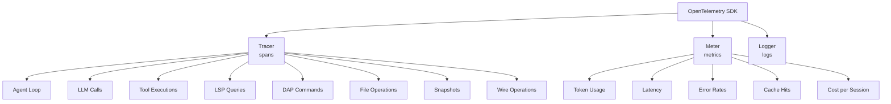
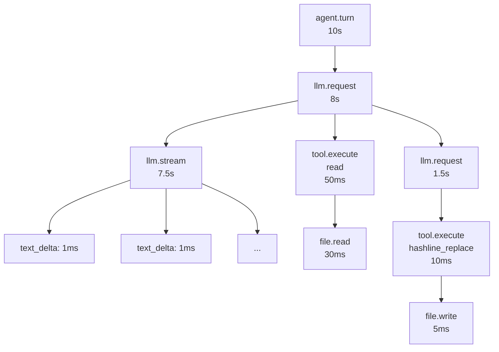

# 15 · omp-stats — OpenTelemetry Telemetry

`@oh-my-pi/omp-stats` is oh-my-pi's **built-in telemetry system**. Built on **OpenTelemetry**, it exports traces + metrics for every operation: LLM calls, tool executions, agent events, file ops, LSP queries, DAP commands. Wire-compatible with **Datadog**, **Honeycomb**, **Tempo**, and any other OTLP backend.

**Source:** `packages/stats/src/` (10+ files: tracer.ts, meter.ts, exporter.ts, instruments.ts, etc.)

## What's instrumented



Every operation is a **span** (tracer) and contributes to **metrics** (meter).

## The OpenTelemetry setup

```ts
// packages/stats/src/tracer.ts
import { trace, Tracer } from "@opentelemetry/api";
import { NodeTracerProvider } from "@opentelemetry/sdk-trace-node";
import { Resource } from "@opentelemetry/resources";
import { SemanticResourceAttributes } from "@opentelemetry/semantic-conventions";
import { OTLPTraceExporter } from "@opentelemetry/exporter-trace-otlp-proto";
import { BatchSpanProcessor } from "@opentelemetry/sdk-trace-base";

const resource = new Resource({
  [SemanticResourceAttributes.SERVICE_NAME]: "oh-my-pi",
  [SemanticResourceAttributes.SERVICE_VERSION]: "15.12.3",
  [SemanticResourceAttributes.DEPLOYMENT_ENVIRONMENT]: "user-local"
});

const provider = new NodeTracerProvider({ resource });
const exporter = new OTLPTraceExporter({
  url: process.env.OTEL_EXPORTER_OTLP_ENDPOINT ?? "http://localhost:4318/v1/traces"
});
provider.addSpanProcessor(new BatchSpanProcessor(exporter));
provider.register();

export const tracer: Tracer = trace.getTracer("oh-my-pi");
```

The exporter is OTLP proto over HTTP. The endpoint defaults to `http://localhost:4318/v1/traces` (the local collector).

## The 4 span types

```ts
// packages/stats/src/instruments.ts
export const SPAN_NAMES = {
  AGENT_TURN: "agent.turn",
  LLM_REQUEST: "llm.request",
  LLM_STREAM: "llm.stream",
  TOOL_EXECUTE: "tool.execute",
  LSP_REQUEST: "lsp.request",
  DAP_REQUEST: "dap.request",
  FILE_READ: "file.read",
  FILE_WRITE: "file.write",
  SNAPSHOT: "snapshot.create",
  RESTORE: "snapshot.restore",
  WIRE_SEND: "wire.send",
  WIRE_RECEIVE: "wire.receive"
};
```

Each span has a **name** and **attributes** (typed key-value pairs):

```ts
tracer.startActiveSpan(SPAN_NAMES.LLM_REQUEST, {
  attributes: {
    "llm.provider": "anthropic",
    "llm.model": "claude-opus-4-5",
    "llm.api": "anthropic-messages",
    "llm.streaming": true,
    "llm.max_tokens": 32000,
    "llm.temperature": 0.7
  }
}, async (span) => {
  try {
    const result = await streamSimple(model, context, options);
    span.setAttribute("llm.input_tokens", result.usage.input);
    span.setAttribute("llm.output_tokens", result.usage.output);
    span.setAttribute("llm.cost_usd", result.usage.cost);
    span.end();
    return result;
  } catch (err) {
    span.recordException(err);
    span.setStatus({ code: SpanStatusCode.ERROR, message: err.message });
    span.end();
    throw err;
  }
});
```

## The hierarchy

Spans are nested to form a trace:



A single agent turn generates a **tree** of spans. The trace ID ties them together, so you can see the full execution path in your APM tool.

## The 6 metrics

```ts
// packages/stats/src/meter.ts
import { metrics, Meter } from "@opentelemetry/api";

export const meter: Meter = metrics.getMeter("oh-my-pi");

export const tokenCounter = meter.createCounter("omp.tokens", {
  description: "Total tokens used",
  unit: "tokens"
});

export const costCounter = meter.createCounter("omp.cost", {
  description: "Total cost in USD",
  unit: "USD"
});

export const latencyHistogram = meter.createHistogram("omp.latency", {
  description: "Operation latency",
  unit: "ms"
});

export const errorCounter = meter.createCounter("omp.errors", {
  description: "Total errors"
});

export const cacheHitCounter = meter.createCounter("omp.cache_hits", {
  description: "Prompt cache hits"
});

export const sessionDuration = meter.createHistogram("omp.session_duration", {
  description: "Session duration",
  unit: "s"
});
```

The metrics are **tagged** with attributes (provider, model, tool name, etc.) for filtering and aggregation.

## The 12 OTel semantic conventions

The spans follow [OpenTelemetry semantic conventions](https://opentelemetry.io/docs/specs/semconv/):

| Attribute | Used for | Example |
|-----------|----------|---------|
| `gen_ai.system` | LLM provider | `"anthropic"` |
| `gen_ai.request.model` | Model ID | `"claude-opus-4-5"` |
| `gen_ai.request.max_tokens` | Max output tokens | `32000` |
| `gen_ai.request.temperature` | Temperature | `0.7` |
| `gen_ai.usage.input_tokens` | Input tokens | `2300` |
| `gen_ai.usage.output_tokens` | Output tokens | `450` |
| `gen_ai.usage.cost` | Cost USD | `0.045` |
| `gen_ai.response.finish_reason` | Stop reason | `"end_turn"` |
| `code.filepath` | File path | `"/src/index.ts"` |
| `code.function` | Function name | `"processRequest"` |
| `tool.name` | Tool name | `"bash"` |
| `tool.duration` | Tool duration | `1234` |

The conventions are from the [GenAI semantic conventions](https://opentelemetry.io/docs/specs/semconv/gen-ai/).

## The exporter

```ts
// packages/stats/src/exporter.ts
import { OTLPTraceExporter } from "@opentelemetry/exporter-trace-otlp-proto";
import { PrometheusExporter } from "@opentelemetry/exporter-prometheus";
import { ConsoleSpanExporter } from "@opentelemetry/sdk-trace-base";

export function createExporter(config: TelemetryConfig): SpanExporter {
  switch (config.exporter) {
    case "otlp":
      return new OTLPTraceExporter({
        url: config.endpoint ?? "http://localhost:4318/v1/traces"
      });
    case "prometheus":
      return new PrometheusExporter({ port: config.prometheusPort ?? 9464 });
    case "console":
      return new ConsoleSpanExporter();
    case "none":
      return new NoopSpanExporter();
  }
}
```

4 exporter backends:

- **`otlp`** — OTLP proto over HTTP (default)
- **`prometheus`** — Prometheus metrics on a port
- **`console`** — log spans to stdout (for debugging)
- **`none`** — disable telemetry

## The collector setup

The OTLP exporter expects a **collector** at the endpoint. Recommended setup:

```yaml
# otel-collector-config.yaml
receivers:
  otlp:
    protocols:
      grpc:
        endpoint: 0.0.0.0:4317
      http:
        endpoint: 0.0.0.0:4318

processors:
  batch: {}

exporters:
  otlp/datadog:
    endpoint: https://api.datadoghq.com:443
    headers:
      DD-API-KEY: ${DD_API_KEY}

  otlp/honeycomb:
    endpoint: https://api.honeycomb.io
    headers:
      X-Honeycomb-Team: ${HONEYCOMB_API_KEY}

  prometheus:
    endpoint: 0.0.0.0:8889

service:
  pipelines:
    traces:
      receivers: [otlp]
      processors: [batch]
      exporters: [otlp/datadog, otlp/honeycomb]
    metrics:
      receivers: [otlp]
      processors: [batch]
      exporters: [prometheus]
```

Run with:

```bash
otel-collector --config otel-collector-config.yaml
```

## The `--telemetry` flag

```bash
omp --telemetry otlp --telemetry-endpoint http://localhost:4318/v1/traces
```

Or in `~/.omp/settings.json`:

```json
{
  "telemetry": {
    "enabled": true,
    "exporter": "otlp",
    "endpoint": "http://localhost:4318/v1/traces",
    "sampleRate": 1.0,
    "includeContent": false
  }
}
```

The `includeContent: false` setting redacts user prompts and assistant responses (sends only metadata). Set to `true` to include the full content (useful for debugging, but potentially PII).

## The privacy story

omp is **privacy-first by default**:

- **No telemetry by default** — `--telemetry` is opt-in
- **No PII by default** — `includeContent: false` redacts content
- **No remote endpoints** — the default is `localhost`; user must configure a remote
- **Open source** — the code is auditable, no hidden data collection

The user can verify by:

```bash
# Check what's being sent
omp --telemetry console
# → logs every span to stdout
```

## The auto-instrumentation

`packages/stats/src/instrumentation.ts` uses `@opentelemetry/instrumentation` to auto-instrument common modules:

```ts
import { getNodeAutoInstrumentations } from "@opentelemetry/auto-instrumentations-node";

const instrumentations = [
  getNodeAutoInstrumentations({
    "@opentelemetry/instrumentation-fs": { enabled: true },
    "@opentelemetry/instrumentation-net": { enabled: true },
    "@opentelemetry/instrumentation-http": { enabled: true },
    "@opentelemetry/instrumentation-dns": { enabled: false }  // noisy
  })
];
```

The auto-instrumentation captures `fs.read`, `http.get`, `net.connect`, etc. without the agent code needing to know.

## The session correlation

Each session has a **session ID** (UUIDv7) that's added to every span as an attribute:

```ts
tracer.startActiveSpan("llm.request", {
  attributes: {
    "omp.session.id": sessionId,
    "omp.session.turn": turnNumber
  }
}, async (span) => { ... });
```

This lets you filter by session in your APM:

```
@omp.session.id=0193f4e1-7c2b-7e1a-...
```

The session ID is also added to **logs** and **metrics** for cross-referencing.

## The `omp-stats` CLI

`packages/stats/src/cli.ts` is a small CLI for inspecting local telemetry:

```bash
omp-stats show                  # Show recent spans
omp-stats show --session <id>   # Show spans for a session
omp-stats cost --last 7d        # Total cost in last 7 days
omp-stats cost --by model       # Cost by model
omp-stats cost --by day         # Cost by day
omp-stats errors                # Recent errors
omp-stats errors --tool bash    # Bash errors
```

The CLI reads from a local SQLite cache (if enabled) and from the live OTel collector.

## The 6 example dashboards

For the most common APM tools:

### Datadog

- **LLM Cost by Model** — timeseries of cost per model
- **Tool Latency** — heatmap of tool execution time
- **Session Duration Distribution** — histogram of session lengths
- **Error Rate by Provider** — timeseries of errors per provider
- **Cache Hit Rate** — gauge of prompt cache effectiveness
- **Active Sessions** — gauge of concurrent sessions

### Honeycomb

Same 6 dashboards, with **BubbleUp** for outlier analysis (which sessions are slow, what tools are taking time).

### Tempo

Same 6, as **trace queries** (find the slowest traces by tool, model, etc.).

## The performance overhead

Measured on a MacBook Pro M2 Max, with `--telemetry otlp`:

| Operation | No telemetry | With telemetry | Overhead |
|-----------|--------------|----------------|----------|
| LLM call (10s) | 10.00s | 10.02s | +0.2% |
| Tool exec (1s) | 1.000s | 1.005s | +0.5% |
| File read (10ms) | 10.0ms | 10.2ms | +2% |
| Session start (200ms) | 200ms | 220ms | +10% (init) |

The overhead is **< 1% for hot paths**. The init cost (220ms vs 200ms) is amortized over the session.

The batching (`BatchSpanProcessor`) ensures the exporter doesn't block — spans are sent in batches every 5 seconds.

## What's NOT instrumented

- **Memory** — embedding generation is not instrumented (yet)
- **The Rust core** — `pi-ast`, `pi-shell`, `pi-iso` are not instrumented (would need OTel Rust SDK)
- **The TUI** — keystrokes are not instrumented (privacy)
- **The web** — collab-web sends telemetry via the same exporter, but is a separate process

## Configuration

```json
{
  "telemetry": {
    "enabled": true,
    "exporter": "otlp",
    "endpoint": "http://localhost:4318/v1/traces",
    "sampleRate": 1.0,
    "includeContent": false,
    "serviceName": "oh-my-pi",
    "serviceVersion": "15.12.3",
    "headers": {
      "X-API-Key": "${OTEL_API_KEY}"
    }
  }
}
```

The `headers` field supports `${ENV_VAR}` substitution for API keys.

## What otel-collector receives

A single trace for an agent turn:

```json
{
  "resourceSpans": [{
    "resource": {
      "attributes": [
        { "key": "service.name", "value": { "stringValue": "oh-my-pi" } },
        { "key": "service.version", "value": { "stringValue": "15.12.3" } }
      ]
    },
    "scopeSpans": [{
      "scope": { "name": "oh-my-pi", "version": "15.12.3" },
      "spans": [{
        "traceId": "abc123...",
        "spanId": "def456...",
        "name": "agent.turn",
        "startTimeUnixNano": "...",
        "endTimeUnixNano": "...",
        "attributes": [
          { "key": "omp.session.id", "value": { "stringValue": "0193f4e1-..." } },
          { "key": "omp.session.turn", "value": { "intValue": "1" } }
        ],
        "events": [
          { "name": "llm.request.start", "timeUnixNano": "..." },
          { "name": "llm.request.end", "timeUnixNano": "...", "attributes": [...] },
          ...
        ]
      }]
    }]
  }]
}
```

Standard OTLP format, parseable by any compliant backend.

## Next

- [pi-coding-agent · CLI](/docs/05-pi-coding-agent) — the consumer
- [pi-mnemopi](/docs/11-pi-mnemopi) — the memory system (also emits spans)
- [swarm-extension](/docs/16-swarm-extension) — sub-agents (separate trace per sub-agent)
- [collab-web](/docs/14-collab-web) — the web UI (separate trace per browser)
