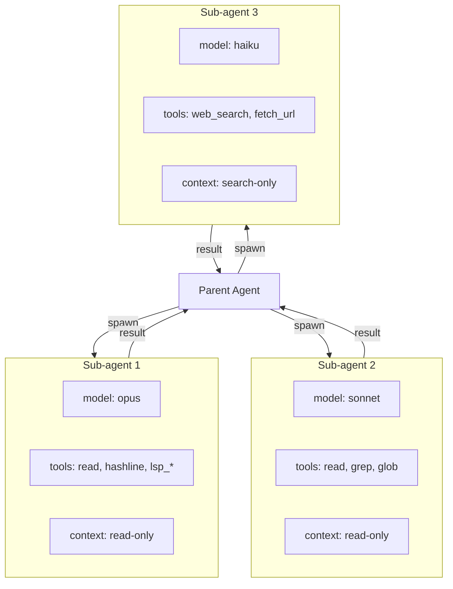
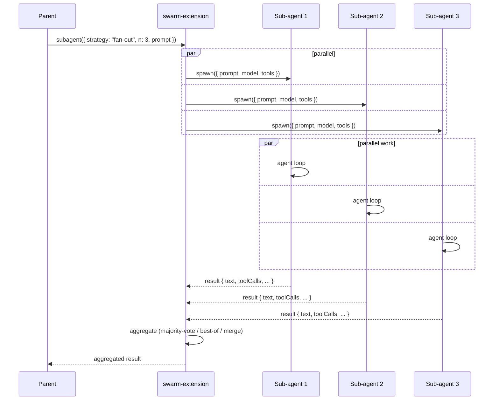
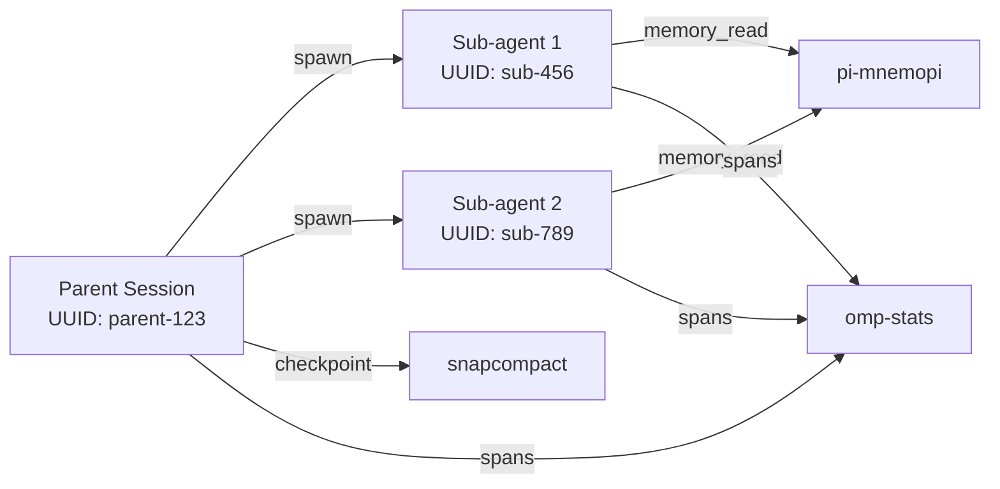

# 16 · swarm-extension — Sub-agents

`@oh-my-pi/swarm-extension` is oh-my-pi's **multi-agent orchestration** layer. Spawn sub-agents for parallel work, coordinate them, and merge their results back into the parent session. The 4 swarming strategies let you pick the right parallelism model for the task.

**Source:** `packages/swarm-extension/src/` (extension.ts, swarm/, cli.ts)

## The problem with single-agent loops

Some tasks are inherently parallel:

- "Search for all uses of `User` in the codebase and group by file"
- "Run all the unit tests in parallel and report failures"
- "Generate 5 variations of this design and pick the best"
- "Compare 3 different LLM providers' responses to the same prompt"

A single agent has to do these **sequentially** — it's bound by the LLM's response time, the tool's latency, and the agent's serial reasoning. For these tasks, a single agent is 5-10× slower than necessary.

The `swarm-extension` solves this by **spawning sub-agents** that work in parallel.

## The 4 strategies

```ts
// packages/swarm-extension/src/swarm/strategies.ts
export type SwarmStrategy =
  | "fan-out"       // N sub-agents, each does the same task, results merged
  | "map"           // N sub-agents, each handles one item from a list
  | "chain"         // N sub-agents, each refines the previous's output
  | "debate"        // N sub-agents, each argues a position, then they debate
```

### 1. `fan-out`

```ts
const result = await swarm.fanOut({
  prompt: "Review the security of this file",
  n: 3,                                          // 3 sub-agents
  model: claudeOpusModel,                        // same model for each
  tools: [readTool, grepTool, lspDefinition],
  aggregationStrategy: "majority-vote"           // or "best-of" or "merge"
});
```

The 3 sub-agents work in parallel on the same task. The results are aggregated:

- **`majority-vote`** — most common answer wins
- **`best-of`** — a judge model picks the best
- **`merge`** — a model merges all 3 into one

Use case: code review, security audit, any task where multiple perspectives are valuable.

### 2. `map`

```ts
const result = await swarm.map({
  items: ["src/auth.ts", "src/user.ts", "src/order.ts", "src/payment.ts"],
  task: "Find the security issues in this file",
  model: claudeSonnetModel,                      // can be cheaper per file
  tools: [readTool, grepTool, lspDefinition],
  maxConcurrent: 4
});
```

Each sub-agent handles one item from the list. Use case: file-by-file analysis, per-test debugging, batch refactoring.

### 3. `chain`

```ts
const result = await swarm.chain({
  stages: [
    { model: haikuModel, task: "Generate 5 design options" },
    { model: sonnetModel, task: "Critique each option, pick top 2" },
    { model: opusModel, task: "Refine the top 2 into 1 final design" }
  ],
  initialInput: userBrief
});
```

Each sub-agent refines the previous's output. Use case: multi-stage reasoning, design iteration, content improvement.

### 4. `debate`

```ts
const result = await swarm.debate({
  topic: "Should we use SQL or NoSQL for the user data store?",
  positions: ["SQL (PostgreSQL)", "NoSQL (MongoDB)"],
  rounds: 3,
  judge: opusModel
});
```

N sub-agents argue different positions, then debate. A judge picks the winner. Use case: architecture decisions, trade-off analysis, "should we X?" questions.

## The 4 sub-agents



Each sub-agent is a **full AgentSession** with:

- Its own model (can be different from the parent)
- Its own tool list (can be a subset of the parent's)
- Its own context (initialized from the parent, but diverges)
- Its own compaction strategy
- Its own session ID (in the same `omp` process)

The sub-agent is **isolated** from the parent — it can't read the parent's context beyond the initial prompt. Its results are returned to the parent as a single tool result.

## The `subagent` tool

The `swarm-extension` registers a **`subagent`** tool:

```ts
const subagentTool: AgentTool = {
  name: "subagent",
  description: "Spawn a sub-agent for a focused task. Use this for parallel work, multi-perspective review, or batch processing.",
  inputSchema: Type.Object({
    strategy: Type.Union([
      Type.Literal("fan-out"),
      Type.Literal("map"),
      Type.Literal("chain"),
      Type.Literal("debate")
    ]),
    prompt: Type.String(),
    n: Type.Optional(Type.Number()),
    model: Type.Optional(Type.String()),
    tools: Type.Optional(Type.Array(Type.String())),
    items: Type.Optional(Type.Array(Type.String())),
    aggregation: Type.Optional(Type.Union([
      Type.Literal("majority-vote"),
      Type.Literal("best-of"),
      Type.Literal("merge")
    ])),
    timeout: Type.Optional(Type.Number())
  }),
  async execute(args, ctx) {
    const result = await ctx.swarm.run({
      strategy: args.strategy,
      prompt: args.prompt,
      n: args.n,
      model: args.model,
      tools: args.tools,
      items: args.items,
      aggregation: args.aggregation,
      timeout: args.timeout
    });
    return {
      content: [{ type: "text", text: formatResult(result) }],
      details: result
    };
  }
};
```

The parent agent uses this tool like any other. The swarm-extension handles spawning, coordination, and result aggregation.

## The lifecycle



The parent is **blocked** while the sub-agents work (the `subagent` tool is synchronous). The sub-agents work in parallel via `Promise.all` (or worker threads for CPU-bound work).

## The aggregation strategies

### `majority-vote`

```ts
async function majorityVote(results: SwarmResult[]): Promise<SwarmResult> {
  // Pick the most common final answer
  const counts = new Map<string, number>();
  for (const r of results) {
    const key = normalize(r.text);
    counts.set(key, (counts.get(key) ?? 0) + 1);
  }
  const winner = [...counts.entries()].sort((a, b) => b[1] - a[1])[0];
  return results.find(r => normalize(r.text) === winner[0])!;
}
```

The "normalize" function strips whitespace, ignores punctuation, and lowercases — so `"yes."` and `"Yes"` are the same vote.

### `best-of`

```ts
async function bestOf(results: SwarmResult[], judge: Model): Promise<SwarmResult> {
  const prompt = `
    Pick the best of these N responses:
    ${results.map((r, i) => `## Response ${i + 1}\n${r.text}`).join("\n\n")}
    
    Output the index of the best response, with a brief reason.
  `;
  
  const stream = await streamSimple(judge, {
    messages: [{ role: "user", content: prompt }]
  });
  
  let text = "";
  for await (const e of stream) if (e.type === "text") text += e.delta;
  
  const match = text.match(/(\d+)/);
  const idx = match ? parseInt(match[1]) - 1 : 0;
  return results[idx];
}
```

A judge model picks the best of N. The judge is usually a **more capable** model than the workers.

### `merge`

```ts
async function merge(results: SwarmResult[], merger: Model): Promise<SwarmResult> {
  const prompt = `
    Merge these N responses into one comprehensive response:
    ${results.map((r, i) => `## Response ${i + 1}\n${r.text}`).join("\n\n")}
    
    Preserve the unique insights from each. Output the merged response.
  `;
  
  // ... similar to bestOf
}
```

A model merges all N into one. Use case: when each response has unique insights (not a vote situation).

## The tool isolation

By default, sub-agents have a **read-only** tool list:

```ts
const SUBAGENT_DEFAULT_TOOLS = [
  "read", "glob", "grep",
  "lsp_hover", "lsp_definition", "lsp_references", "lsp_documentSymbol",
  "dap_evaluate", "dap_variables",
  "memory_read", "memory_list",
  "web_search", "fetch_url",
  "hashline"  // read-only line info
];
```

No `write`, `edit`, `bash`, `process`, `hashline_replace`, `hashline_insert`, `snap`, `restore`. The sub-agent can **observe** but not **modify**.

If the parent wants the sub-agent to be able to write, it has to **explicitly opt in**:

```ts
await swarm.run({
  strategy: "fan-out",
  prompt: "Fix the TypeScript errors in this file",
  tools: ["read", "hashline", "hashline_replace"],  // include the write tool
  allowWrites: true
});
```

The `allowWrites: true` flag is logged to OpenTelemetry as a warning.

## The context initialization

When a sub-agent is spawned, its context is initialized from the parent's:

```ts
async function initSubagentContext(parent: AgentSession, prompt: string): Promise<Context> {
  // 1. Take the parent's system prompt
  // 2. Take the parent's last N turns (default 5)
  // 3. Add the sub-agent's specific prompt
  // 4. Initialize the sub-agent's tool list
  // 5. Set the sub-agent's model
  
  return {
    systemPrompt: parent.state.systemPrompt,
    messages: [
      ...parent.state.messages.slice(-5),  // last 5 turns
      { role: "user", content: prompt }
    ],
    tools: filteredTools,
    model: subagentModel
  };
}
```

The sub-agent sees the parent's recent context, then diverges. The sub-agent's changes don't propagate back to the parent (except via the final tool result).

## The result format

The sub-agent's result is returned to the parent as a single tool result:

```ts
{
  content: [{
    type: "text",
    text: `Sub-agent (fan-out, n=3, model=opus) completed in 12.3s:\n\n${aggregatedResult}`
  }],
  details: {
    strategy: "fan-out",
    n: 3,
    model: "claude-opus-4-5",
    duration_ms: 12300,
    subagent_results: [
      { id: "sub-1", text: "...", toolCalls: 5, duration_ms: 11000 },
      { id: "sub-2", text: "...", toolCalls: 7, duration_ms: 12500 },
      { id: "sub-3", text: "...", toolCalls: 4, duration_ms: 11800 }
    ],
    aggregation: "majority-vote"
  }
}
```

The parent sees the aggregated result and the per-sub-agent stats.

## The timeout

Each sub-agent has a **timeout** (default 5 minutes). If it doesn't complete in time, it's cancelled and an error is returned:

```ts
async function withTimeout<T>(promise: Promise<T>, ms: number): Promise<T> {
  return Promise.race([
    promise,
    new Promise<T>((_, reject) => setTimeout(() => reject(new Error("Sub-agent timeout")), ms))
  ]);
}
```

The cancellation is **graceful** — the sub-agent's current operation is allowed to finish (or abort if it respects the signal), then the sub-agent is closed.

## The recursion

Sub-agents can **spawn their own sub-agents** (up to a depth limit):

```ts
{
  maxSubagentDepth: 3  // default
}
```

The depth is tracked per-sub-agent. When a sub-agent spawns a sub-sub-agent, the depth is incremented. At depth 3, the sub-sub-agent cannot spawn further sub-agents.

This prevents infinite recursion while allowing hierarchical task decomposition.

## The cost control

Sub-agents use **separate model + token budgets**:

```ts
{
  swarmBudget: {
    perSubagent: { maxCost: 1.00 },  // $1 per sub-agent
    perSwarm: { maxCost: 5.00 },     // $5 per swarm call
    perSession: { maxCost: 20.00 }   // $20 per session
  }
}
```

If a budget is exceeded, the sub-agent is paused and the parent is notified. The user can override per-swarm-call:

```ts
await swarm.run({
  strategy: "fan-out",
  prompt: "...",
  budget: { maxCost: 0.50 }  // override the default
});
```

The cost is tracked via the same `omp-stats` metrics.

## The integration with the parent's session



Sub-agents share the parent's:

- **snapcompact snapshots** — the parent checkpoints before the swarm call
- **pi-mnemopi memory** — sub-agents can read the parent's memory
- **omp-stats** — all sub-agents emit traces to the same collector

But each sub-agent has its **own**:

- **Conversation history** (in-memory, not persisted)
- **Compaction state** (independent)
- **Model** (can be different)
- **Tool list** (can be a subset)

## Configuration

```json
{
  "swarm": {
    "enabled": true,
    "maxConcurrent": 4,            // Max simultaneous sub-agents
    "maxDepth": 3,                 // Recursion limit
    "defaultTimeout": 300000,      // 5 minutes
    "defaultTools": [...],         // Default sub-agent tool list
    "budget": {
      "perSubagent": { "maxCost": 1.00 },
      "perSwarm": { "maxCost": 5.00 },
      "perSession": { "maxCost": 20.00 }
    }
  }
}
```

## Use case examples

### 1. Multi-perspective code review

```ts
await swarm.fanOut({
  prompt: "Review this PR for security issues",
  file: "src/auth/login.ts",
  n: 3,
  models: ["claude-opus-4-5", "gpt-4o", "gemini-2.0-pro"],
  aggregation: "merge"
});
```

3 different models review the same code, results are merged.

### 2. Parallel test debugging

```ts
const failures = await runTests();
await swarm.map({
  items: failures.map(f => f.testName),
  task: (test) => `Debug why test "${test}" is failing`,
  model: "claude-sonnet-4",
  maxConcurrent: 4
});
```

Each failing test is debugged by a separate sub-agent.

### 3. Multi-stage design

```ts
await swarm.chain({
  stages: [
    { model: "claude-haiku-4", task: "Brainstorm 10 features" },
    { model: "claude-sonnet-4", task: "Pick top 3, justify" },
    { model: "claude-opus-4-5", task: "Write a detailed spec for the top 3" }
  ]
});
```

Cheap model first, expensive model last — cost-optimized.

### 4. Architecture debate

```ts
await swarm.debate({
  topic: "PostgreSQL or MongoDB for user data?",
  positions: ["PostgreSQL", "MongoDB"],
  rounds: 3,
  judge: "claude-opus-4-5"
});
```

Two sub-agents argue, then a judge decides.

## What's NOT in swarm-extension

- **Cross-host sub-agents** — all sub-agents run in the same `omp` process
- **Persistent sub-agents** — sub-agents are ephemeral (created for the call, destroyed after)
- **Communication between sub-agents** — sub-agents can only talk to the parent, not to each other
- **Dynamic sub-agent creation** — sub-agents are created at swarm-call time, not lazily

## Next

- [pi-coding-agent · CLI](/docs/05-pi-coding-agent) — the consumer
- [pi-wire](/docs/12-pi-wire) — could enable cross-host sub-agents in the future
- [32 Built-in Tools](/docs/09-tools) — the tools the sub-agents use
- [Deployment](/docs/17-deployment) — installing `omp`
